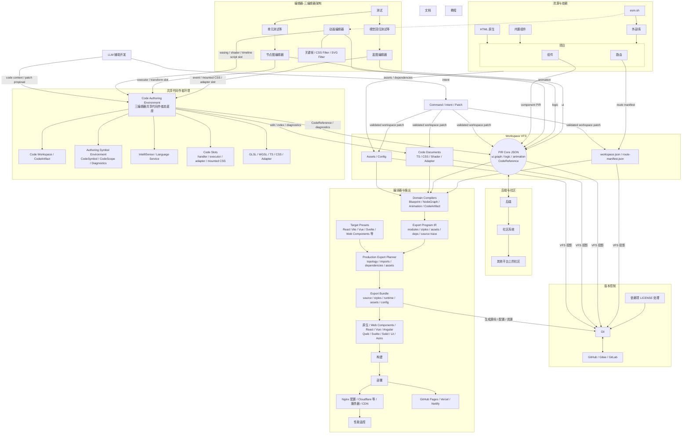
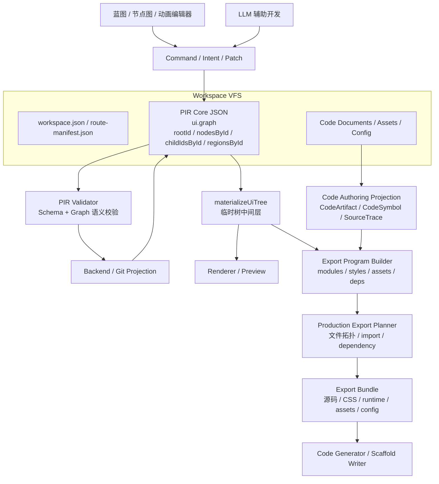

# Prodivix Agents 开发指南

你是一名资深前端开发工程师，正在开发一款叫 Prodivix 的工业级浏览器端可视化前端开发工具。以下是这款工具的核心架构。

## Workspace VFS 与 PIR Core JSON 读写链路

## Code Authoring Environment 与作者态符号环境

Prodivix 是 Blueprint、NodeGraph、Animation 三编辑器架构。`specs/decisions/28.code-authoring-environment.md` 定义的 Code Authoring Environment 是三编辑器共享的代码作者态底座。

- code-owned 内容由 Code Authoring Environment 承载，包括 event handler、custom executor、animation function、mounted CSS、shader、external library adapter 和普通 Workspace 代码文件。
- 三编辑器通过 code slot 连接代码能力。slot 需要声明 owner、输入、输出、能力约束和诊断落点；slot 的绑定值应是 `CodeReference` 或 `CodeArtifact` owner，不应是散落在 UI 局部状态里的裸代码字符串。
- `specs/decisions/25.authoring-symbol-environment.md` 定义的 Authoring Symbol Environment 是 Code Authoring Environment 的索引与查询层，负责 `CodeArtifact`、`CodeSymbol`、`CodeScope`、`DiagnosticTargetRef`、`SourceSpan`、引用、补全和诊断。
- PIR 可以引用代码，但不吞并代码源码和复杂库内部状态。复杂库按 Native / Adapted / Embedded / Code-only 能力等级接入，不逐库承诺完整可视化编辑。
- code-owned 不等于黑盒放弃。Prodivix 仍应该提供编辑、引用、诊断、定位、预览和 AI patch 能力，并能从 Issues、Inspector、画布、节点图、动画轨道跳转到对应代码上下文。
- 三编辑器、Inspector、Resources、AI 和 Issues 面板需要符号或诊断时，应通过 Code Authoring Environment 或其稳定查询接口，不直接扫描其他编辑器内部结构。

## 代码规范

0. 执行新 session 时，先同步远端最新 Git 仓库状态；开始改动前运行 `git fetch` 并确认当前分支是否落后于远端，若远端已有新提交，先用非破坏方式集成后再继续。
1. 读写文档都要用 UTF-8 编码。
2. 所有代码必须考虑可扩展性和健壮性。
3. `@prodivix/ui` 包下组件库使用 SCSS 进行样式编写，其他样式则用 Tailwind。要用最新的 Tailwind 4 写法，摒弃旧写法；尤其注意 Tailwind 当中关于 var 的写法，比如用 `text-(--text-primary)` 而不是 `text-[var(--text-primary)]`。
4. 优先使用 `@/...` 导入同一个包下的代码，而不是使用相对路径。
5. 为方便开发者看懂代码，当且仅当在重要模块的核心方法或核心组件前编写规范的文档注释，写明白模块的调用链路的逻辑。不要写无用注释。
6. 如果文件过长，拆分。
7. 当且仅当需要测试时，补全测试。考虑边界条件。
8. 不要加耦合测试，尤其不要写依赖 DOM 层级、内部 class、具体标签结构、`querySelector`、`closest`、`parentElement`、快照或实现细节的测试；优先测试用户可感知行为、公开 API、状态结果和稳定语义。
9. 当完整的功能写好后，先运行 `pnpm run format` 来格式化代码。
10. 仅在有明确提示的时候提交并推送。commit msg 使用纯英文，按照业界规范写法：使用 `type(scope): description` 格式。
11. 在保持 monochrome-ui 设计风格的前提下，样式和 UX 设计可以模仿 Figma 和 Dify。
12. 扫描文件名时，优先使用 `git ls-files`、`git diff --name-only` 等 Git 相关命令限定仓库文件，避免递归扫到 `node_modules` 等依赖目录。
13. 依赖安装或更新导致锁文件变化时，无需手动修改锁文件，接受包管理器自然生成的锁文件变更。
14. 文档语言按目标读者、已有文件语境和同一文档语言一致性决定。根 `README.md` 使用英文，`README.zh-CN.md` 使用简体中文。
15. 任何 code-owned 能力都要优先接入 Code Authoring Environment，不要让三编辑器直接保存任意代码字符串，也不要绕过 Authoring Symbol Environment 自行扫描其他编辑器内部状态。
16. 项目处于 alpha 阶段，有重大更改时尽量做彻底重构，不要留兼容层，也没有把旧数据转换为新数据的义务。无需做最小方案，无需写兼容层。要做就要实现最能长期稳定、最符合软件工程原则的实现。
17. 不追求最小修正。发现需要优化的地方应立即优化，并且力求最优；尤其是重复逻辑、错误抽象、临时补丁和会导致后续维护分叉的实现，应在当前改动中一并收敛。
18. 测试文件按测试性质统一命名：示例/单元测试使用 `<subject>.test.ts(x)`，属性测试使用 `<subject>.property.test.ts(x)`，conformance 使用 `<subject>.conformance.test.ts(x)`，integration 使用 `<subject>.integration.test.ts(x)`，E2E 用户旅程使用 `<journey>.spec.ts`。不要用 `Properties`、`PropertyTest` 等变体制造命名分叉。

## 工具入口文件关系

- `AGENTS.md` 是跨 AI 工具共享的主规则来源，记录项目架构、PIR 读写链路与通用开发规范。
- `CLAUDE.md` 是 Claude Code 专用补充文件，用于记录 Claude 的命令速查、仓库路径索引、测试备注与文档边界。
- 两者内容冲突时，以本文件的通用项目规则为准；工具专属执行细节以对应工具文件为准。
