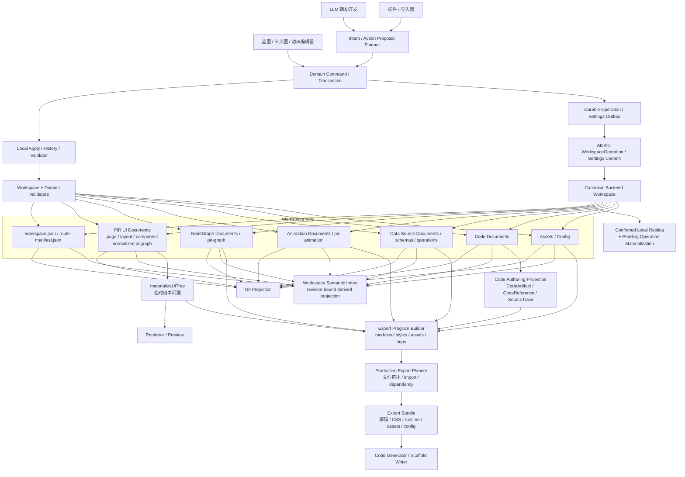

# Prodivix Agents 开发指南

你是一名资深前端开发工程师，正在开发一款叫 Prodivix 的工业级浏览器端可视化前端开发工具。以下是这款工具的核心架构。

## 当前全局阶段

- 当前产品位置：`G1 Passed / G2 Foundation`（G0、G1 `ProductGateStatus=Passed`，G2 `ProductGateStatus=In Progress`）。
- `specs/roadmap/global-phases.md` 是 Global Phase 的唯一来源，`specs/roadmap/g0-closure-evidence.md` 保存 G0 的可重复验证边界。
- G1 已形成 revision-bound TypeScript/JavaScript/CSS/SCSS/GLSL/WGSL Language Capability、独立 WebGL2/WebGPU Shader Compile Capability、跨编辑器 CodeSlot、external adapter 与 orphan lifecycle、跨领域 code refactor、PIR-current ↔ canonical React/JSX + standalone CSS controlled round-trip、DTCG Token/Resolver、Asset Semantic Provider、完整 Blueprint/Component/Collection 产品表面、唯一 durable 生产写入链，以及独立 React/Vite install/typecheck/test/build/browser-smoke Gate。G2 已建立 transport-neutral ExecutionProvider/ExecutionJob、instance-owned Execution Session coordinator、provider-neutral Executable Project Snapshot、共享 Browser Project Runtime Host、相互独立的 Preview/Test Provider、NodeGraph/Animation same-context provider，以及 Remote codec/client/provider projection、Remote Preview/Build Bundle/Test Report result、授权 artifact resolver、有界 HTTP envelope/content transport、Backend user-auth gateway/durable execution grant、Control Plane Core、PostgreSQL adapter/integration Gate、独立 HTTP service、Worker Agent、rootless Podman sandbox/GitHub Isolation Gate、D2 durable event/log、content-addressed artifact blob、总预算与 retention、短期 capability Remote Preview Host，以及同一 Golden neutral snapshot 的 Browser Preview/Test 与 Remote Preview/Test/Build contract matrix/GitHub Gate；真实 Golden snapshot 的 rootless Preview/Test/Build、internal install network + hostname/443 allowlist proxy、install/runtime 断网硬切、transport-neutral sanitized `network.request` 与 Execution Center Network 视图也已进入该 Gate，Blueprint Run Mode 已可显式选择 Browser/Remote provider。DataSourceDocument/DataOperationReference current contract、`data-source` typed Workspace document、Data Semantic Contribution、PIR/Collection durable binding 与显式 lifecycle mapping、Data invocation/mock-live adapter registry/lifecycle execute kernel、typed trigger/input mapping 与 deterministic dispatch coordinator、PIR-current v1.6 query activation/input 和 mutation event durable authoring、Inspector/Semantic/Workspace Transaction/`data-input-transform` CodeSlot、exact document JSON Schema preflight、deterministic retry/pagination、SHA-256 partitioned bounded cache policy kernel、owner/version fenced optimistic CRUD executor、独立 HTTP adapter、session-scoped deterministic mock fixture/stateful CRUD namespace、content-addressed Executable Snapshot v6 Data/Auth fixture provisioning/Remote codec、Browser/Remote provider runtime asset projection，以及 React/Vite generated document/route/input-change query activation、semantic typed input、Blueprint mock mutation CRUD/query revalidation和 public client live HTTP/schema/retry/pagination/cache/optimistic runtime 已建立；Executable Snapshot 现在显式投影 mock/live runtime manifest，Browser iframe 的 sanitized Network trace 通过 exact-origin/message-source bridge 关联 active Job，Remote finite Preview 的 server/edge Data trace 通过 exact active-job、generation-fenced、bounded Session observation 进入同一产品视图。Browser fetch composition、transport-neutral environment snapshot/permission/material ports、短期 resolution lease、zone/execution-class/isolation/field permission matrix、Backend production Environment/Secret store、principal/session partition、durable grant/audit、execution-bound Remote live gateway、mutation replay fence 与 capability-origin CSP 也已落地。React/Vite Data runtime target manifest 现在默认 `static-client`；server/edge Data 只有显式 execution parent gateway target 才能通过 compile Gate，并将 `network`/`environment-binding` 要求传播到 snapshot、Remote provider 与 request，Browser/ZIP export fail closed；Workspace Test 使用强制 `mock-only` target，live manifest 不能降级穿透。Remote mutation 现已支持显式 `invocation-key` policy、HTTP adapter idempotency header、attempt-invariant opaque key 与 v3 next-attempt ledger；无 contract 仍固定 attempt 1。Remote 当前 durable 输出已通过 runtime-core guard、Worker 出站与 Control Plane 入站双 Gate 覆盖 request/snapshot/cache/log/diagnostic/trace/artifact/test-report/crash Secret canary，命中只保留安全 `EXE-5004` 与固定终态原因。Structured Console 现在统一投影 state/log/diagnostic/artifact/trace/application observation，通过 exact frame Session fence、条数/字节预算和 generated/bridge/core/copy 多层 credential redaction 进入 Execution Center；manual recovery 等待旧 Job terminal 后创建新 request，保留旧事件且不自动重放 mutation。Remote Preview Terminal 已通过独立 strict wire、Backend owner gateway、短期 token rotation、Control Plane ephemeral broker、worker mailbox/lease fence、rootless inner PTY、cursor reconnect、跨 chunk canary 与 Execution Center 产品路径落地；Browser 显式 unsupported。Runtime FS strict diff artifact、PTY-close capture handshake、授权 resolver、Execution Center Files、revision/lifecycle-fenced whole-file CodeArtifact add/modify/delete，以及 exact upload-receipt-fenced Asset import/replace VFS 原子采纳已落地。Auth/Server Runtime 已由 ADR 46 建立 transport-neutral contract、canonical code profile、session-bound exact-revision Backend gateway、Remote current-principal/owner-guard first vertical、React/Vite guard/loader bridge、`server-function` capability propagation与 Browser/ZIP fail-close，并完成 deterministic Auth Test、typed Route action、invocation-key replay/conflict、navigation/iframe/HTTP cancel 与 loader revalidation；Remote live mutation 已为唯一 `core.server.execution-state.put` adapter 完成 exact-origin/intent、credential canary 与 PostgreSQL atomic replay 安全 Gate。Isolated production 已新增 Snapshot v6 production plan、128-module/64-depth/4 MiB bounded canonical TS/JS import graph、deterministic `.mjs` projection、per-module/aggregate SourceTrace、独立 Remote provider、rootless networkless Worker 与可信结果二次校验，并以 Backend 短期 attestation、Control Plane atomic authority row、worker-attempt lease 与 one-shot runner principal/permission projection 完成 authenticated 与 `workspace.owner` permission read/guard；Secret、其他 permission 与任意项目源码 mutation 继续 fail closed。Binary Asset 已由 ADR 47 建立 `@prodivix/assets` owner、reference-only Workspace current contract、Workspace-scoped PostgreSQL 与 local IndexedDB blob、授权 Web materialization、Compiler/Executable/Remote exact-byte 与 Golden contract matrix first vertical；PNG/baseline JPEG/ClamAV isolated delivery 与 required multi-engine/replica failover/fresh-update first vertical 已完成，GitHub-only real-daemon Gate 已配置、首次远端证据待确认；local-only Resources/Run/Test/Export、duplicate/delete lifecycle 与 bounded multipart local-to-cloud atomic import 已完成；Browser JPEG upload/durable commit/reload/sanitize/capability-origin decode 产品 Gate、Workspace-locked PostgreSQL retention/reference sweep、deterministic Git/LFS 与 runtime filesystem Asset import/replace 已完成；第二 malware vendor、完整 raster re-encode/更多格式、public-CDN 和跨 target product image closure 继续 fail closed。继续聚焦 Binary Asset 后续 Gate、Auth/Server Secret/其他 permission 与 isolated project-source mutation Gate、完整 Remote reconnect/artifact/quota/worker-loss recovery、KMS/key rotation、SourceTrace 调试旅程与第二 framework target。
- Auth/Server A7/A8 最新状态：Living Golden target matrix 已显式固定 Browser/static fail-close、deterministic Test 双 owner adapter 执行、审计内置 Remote live owner/HMAC gateway projection、isolated code-export 真实 production 执行，以及 Secret HMAC 在 Browser/Test/isolated 的显式拒绝；Route 作者面已完成 canonical candidate/binding/issue projection、可逆 bind/unbind、Remote/isolated owner-guard 原子 preset、Blueprint Inspector/Code jump、Issues 与 wire reload -> compile Golden Gate。`/config/auth.json` strict reference-only provider/permission contract、可逆 Workspace authoring、Resources Auth & Server Runtime 产品入口、Issues、Remote/isolated compile Gate 与 Golden reload first vertical 已完成。Remote live `core.server.hmac-sha256` 现通过 reference-only field -> SecretRef profile、callback-bound kernel、exact execution/principal/session/environment/function/invocation grant、30 秒 IssueGrant/UseSecret/Revoke 与 `environment-binding` propagation 使用 Backend Environment store；material 不进入 bridge/snapshot/trace/output。Remote Preview Session observation 与 isolated production durable Job event 共用 strict metadata-only `server.function` contract；Worker 只在 canonical artifact upload 后发 trace，Remote provider 强校验 artifact/trace，Execution Center 只对唯一 root CodeArtifact 进行 exact Workspace snapshot SourceTrace navigation。第三方 provider、其他 permission、Remote Test/后续 producer debugger、dedicated isolated Worker Secret resolution、KMS/key rotation、项目源码 mutation和完整跨表面 leak closure 继续建设。
- Auth/Server invocation devtools 最新状态：`@prodivix/server-runtime` 已提供 strict metadata-only `server.function` trace contract；Remote Preview coordinator 只向 exact active generation/Session/Job 发布 completion observation，terminal finite Job 不复活。Execution Center Server 表面只显示 function/export、attempt、result kind/安全错误码和 duration，并保留 CodeArtifact SourceTrace；input/output、principal、session、cookie、token、Secret、source 与未知字段不进入 projection。Browser 当前显式无 producer。
- Binary Asset B4 local/cloud 最新状态：独立 IndexedDB database 按 Workspace/digest 保存 exact bytes，复用 transport-neutral uploader/reader、32 MiB budget、幂等 existing/conflict 与 read-time digest/length/media verification；Resources bytes-first upload/preview/download、Run/Test/Export materialization、duplicate-before-reference 与 project-delete-after-author-state cleanup 已实现。local-to-cloud sync 已通过 4 MiB reference-only manifest、256 unique blob、32 MiB 单对象与 128 MiB 总 bytes 的 strict multipart，在同一 PostgreSQL transaction 中提交 Project/Workspace/blob/documents；missing/unreferenced/duplicate/drift 在写入前 fail closed，旧 JSON-only Asset import 保留 `AST-2004`。
- Binary Asset B6 最新状态：PostgreSQL nullable orphan clock、upload retry refresh、Snapshot/Atomic Commit reference reconcile、durable dereference full grace、Workspace-row-lock + bounded `SKIP LOCKED` sweep、aggregate-only maintenance log 与真实 PostgreSQL isolation/concurrency Gate 已实现；deterministic Git binary/LFS manifest/pointer/object projection、managed attributes/stale-path lifecycle，以及 local/Backend exact upload-receipt-fenced runtime filesystem Asset import/replace 单事务采纳也已实现，runtime Asset delete 继续 fail closed。
- Binary Asset B5/B7 最新状态：deterministic PNG 与 baseline JPEG sanitizer、各自 versioned structural + ClamAV required scanner chain/quarantine、transport-neutral ordered replica failover、policy-version cache re-scan、有界 INSTREAM/timeout/response hard cut、multi-engine bounded PING/VERSIONCOMMANDS readiness、signature database freshness/converged cohort、atomic policy generation refresh、old-session revocation/in-flight signing fence、bounded derived cache、Backend exact transform/media owner gateway、独立 capability Asset Delivery Host 与 Web Resources isolated preview/attachment first vertical 已实现；Browser JPEG 产品旅程已由独立 Playwright Gate 覆盖 upload、durable reference、reload exact-byte materialization、sanitize request 与 capability-origin decode，并进入 GitHub Smoke；GitHub rootless real-daemon 首次通过证据、第二 malware vendor、完整 raster re-encode/更多格式、public-CDN delivery与跨 target product image closure 继续 fail closed。
- Auth/Server A9/A10 最新状态（覆盖上方 A7/A8 中 isolated Secret 尚未实现的历史描述）：isolated
  `prodivix.code-export` read/server function 已完成 exact execution/snapshot/function/invocation/worker-attempt
  claim、lease-fenced Control Plane broker、Backend exact-revision environment grant、X25519 临时 Worker recipient、
  HKDF + AES-256-GCM sealed envelope、PostgreSQL ciphertext-only one-shot replay、rootless mode 0600 material file、
  install/runtime nonce-bound two-phase handoff、前后 residual-process hard cut、install 后 reserved `.prodivix`
  transport directory 删除重建与 exact-path hard cut、effect 前 delete、`useSecret` callback、
  result/diff/artifact/trace canary hard cut 与 Living Golden target cell；过期 lease 被更高 worker attempt reclaim 时，
  Control Plane 允许 exact active `running` recovery，Backend 以单行 current-attempt CAS 原子清除旧 ciphertext/recipient，
  旧 attempt completion/replay、同 attempt key drift 与 function/invocation drift均 fail closed。
  Browser/static、deterministic Test、Remote live code-export、其他 adapter/permission、mutation 仍 fail closed；
  跨 replica artifact/quota closure 与完整跨表面 leak closure继续建设。
- Auth/Server A11 最新状态（覆盖上方 KMS/key rotation 尚未实现的历史描述）：Backend Environment Secret 已完成
  per-record data-key envelope、versioned static KMS key-ring、active-key-only 新写入、旧 key 保留读与 retirement fence；
  1-256 bounded `FOR UPDATE ... SKIP LOCKED` maintenance 在单事务内只 rewrap data key，legacy direct-cipher row
  一次性迁移为 envelope，并只写 aggregate audit。并发 rotation、ciphertext byte-preservation、old-key-only denial
  与 active-key-only resolve 已通过本地及 GitHub 真实 PostgreSQL Gate；managed-cloud KMS adapter 与完整跨表面 leak Gate 继续建设。
- Auth/Server A12 最新状态（覆盖上方“其他 permission 全部关闭”的历史描述）：isolated production 新增
  Secret-free `workspace.read` permission first vertical。`@prodivix/server-runtime` 统一拥有 Compiler/Worker shared
  policy，只允许 `read + server + prodivix.code-export` 且无 environment；Backend 在 exact owner preflight 后只投影
  sorted `workspace.owner` + `workspace.read` 短期 authority，runner 仍要求 profile 的 exact read grant，owner grant不替代
  read grant。Resources 可声明 reference-only permission，Blueprint 以单个可逆 Workspace Transaction 创建/绑定
  isolated read guard；Living Golden 已固定 Browser/static blocked、deterministic Test supported、Remote live blocked、
  isolated production supported，并实际执行 read authority。独立 networkless/Secret-free read probe 已通过 GitHub
  rootless Gate 并上传远端证据；`workspace.write`、其他 permission、read + Secret、collaborator role resolution与源码 mutation继续 fail closed。
- Canonical Workspace VFS 是作者态唯一真相。PIR、NodeGraph、Animation、Data Source、Code、Design Token、Design Token Resolver、Assets、Config 与 RouteManifest 是 Workspace 内由各领域 owner 管理的文档或清单；PIR 不是整个项目的单一巨型 JSON。

```mermaid
flowchart TD
    %% 核心作者态文件系统
    subgraph VFS [Workspace VFS]
        direction TB

        WorkspaceCore[workspace.json / route-manifest.json]
        PIR((PIR UI Documents<br>page / layout / component<br>normalized ui.graph)):::core
        NodeGraphDocs[NodeGraph Documents<br>pir-graph]
        AnimationDocs[Animation Documents<br>pir-animation]
        DataSourceDocs[Data Source Documents<br>schemas / operations / policies]
        CodeDocuments[Code Documents<br>TS / CSS / Shader / Adapter]
        VFSAssets[Assets / Config]
    end

    %% ----------------- 顶部：编辑器层 -----------------
    subgraph Editors [编辑器-三编辑器架构]
        direction TB

        %% 测试模块
        TestBox[测试]
        VisualTest[视觉回归测试等]
        UnitTest[单元测试等]

        TestBox --> VisualTest & UnitTest

        %% 具体编辑器
        Blueprint[蓝图编辑器]:::editor
        NodeGraph[节点图编辑器]:::editor
        AnimEditor[动画编辑器]:::editor

        %% 代码相关能力通过共享代码作者环境进入三编辑器

        %% 测试与编辑器的连接
        VisualTest -.-> Blueprint
        UnitTest -.-> NodeGraph

        %% 动画细节
        AnimDetail[关键帧 / CSS Filter / SVG Filter]
        AnimEditor --- AnimDetail
    end

    %% ----------------- 中部：共享代码作者环境 -----------------
    subgraph Authoring [共享代码作者环境]
        direction TB

        CodeEnv[Code Authoring Environment<br>三编辑器共享代码作者态底座]:::editor
        CodeWorkspace[Code Workspace / CodeArtifact]
        IntelliSense[IntelliSense / Language Service]
        CodeSlots[Code Slots<br>handler / executor / adapter / mounted CSS]
        CodeAssets[GLSL / WGSL / TS / CSS / Adapter]

        CodeEnv --> CodeWorkspace & IntelliSense & CodeSlots & CodeAssets
    end

    SemanticIndex[Workspace Semantic Index<br>WorkspaceSymbol / Scope / Reference / Resolution]

    Blueprint -->|"event / mounted CSS / adapter slot"| CodeEnv
    NodeGraph -->|"executor / transform slot"| CodeEnv
    AnimEditor -->|"easing / shader / timeline script slot"| CodeEnv
    Blueprint & NodeGraph & AnimEditor -->|"domain contribution / query"| SemanticIndex
    CodeEnv <-->|"Code Semantic Provider / query"| SemanticIndex
    CodeEnv -->|"edit / diagnostics"| CodeDocuments
    CodeEnv -->|"CodeReference / diagnostics"| PIR & NodeGraphDocs & AnimationDocs
    WorkspaceCore & PIR & NodeGraphDocs & AnimationDocs & DataSourceDocs & CodeDocuments & VFSAssets --> SemanticIndex

    %% 编辑器到 VFS 内核心 JSON 的连接
    Blueprint -->|"ui"| PIR
    NodeGraph -->|"node graph document"| NodeGraphDocs
    AnimEditor -->|"animation document"| AnimationDocs

    %% ----------------- 左侧：资源与项目 -----------------
    subgraph Assets [资源与依赖]
        ESM[esm.sh]
        ExtLib[外部库]
        BuiltIn[内置组件]
        HTML[HTML 原生]

        ESM --> ExtLib
        ExtLib & BuiltIn & HTML --> ProjectScope

        subgraph ProjectScope [项目]
            Router[路由]
            Component[组件]
        end
    end

    Router -->|"route manifest"| WorkspaceCore
    Component -->|"component PIR"| PIR
    Assets -->|"assets / dependencies"| VFSAssets
    ESM -.-> AnimEditor

    %% ----------------- 核心功能扩展 -----------------
    LLM[LLM 辅助开发]
    Planner[Intent / Action Proposal Planner]
    CommandLayer[Domain Command / Transaction]
    DurableChange[Durable Operation / Settings Outbox]
    AtomicCommit[Atomic WorkspaceOperation / Settings Commit]

    LLM -->|"code context / patch proposal"| CodeEnv
    LLM -->|"intent / proposal"| Planner
    Planner --> CommandLayer
    Blueprint & NodeGraph & AnimEditor --> CommandLayer
    CommandLayer -->|"validated local apply + History"| WorkspaceCore & PIR & NodeGraphDocs & AnimationDocs & DataSourceDocs & CodeDocuments & VFSAssets
    CommandLayer --> DurableChange --> AtomicCommit

    %% ----------------- 右侧：后端与 Git -----------------
    subgraph BackendSys [后端与社区]
        Backend[后端] --> Community[社区系统]
        Community --> OtherPlatform[其他平台上的社区]
    end

    AtomicCommit --> Backend
    WorkspaceCore & PIR & NodeGraphDocs & AnimationDocs & DataSourceDocs & CodeDocuments & VFSAssets <--> Backend

    subgraph VersionControl [版本控制]
        Git[Git]:::infra
        GitPlat[GitHub / Gitee / GitLab]
        License[依赖项 LICENSE 处理]

        Git <--> GitPlat
        License --> Git
    end

    WorkspaceCore & PIR & NodeGraphDocs & AnimationDocs & DataSourceDocs & CodeDocuments & VFSAssets -->|"VFS 投影"| Git

    %% ----------------- 底部：编译与部署 -----------------
    subgraph Compilation [编译器与输出]
        DomainCompilers[Domain Compilers<br>Blueprint / NodeGraph / Animation / CodeArtifact]:::output
        ExportProgram[Export Program IR<br>modules / styles / assets / deps / source trace]
        ExportPlanner[Production Export Planner<br>topology / imports / dependencies / assets]:::output
        ExportBundle[Export Bundle<br>source / styles / runtime / assets / config]
        TargetPresets[Target Presets<br>React Vite / Vue / Svelte / Web Components 等]

        %% 框架列表
        Frameworks[原生 / Web Components / React / Vue / Angular<br>Qwik / Svelte / Solid / Lit / Astro]

        Build[构建]
        Deploy[部署]:::infra

        %% 部署目标
        Targets[Nginx 配置 / Cloudflare 等 / 服务器 / CDN]
        Hosting[GitHub Pages / Vercel / Netlify]
        Perf[性能监控]

        DomainCompilers --> ExportProgram --> ExportPlanner --> ExportBundle
        TargetPresets --> ExportPlanner
        ExportBundle --> Frameworks
        Frameworks --> Build --> Deploy
        Deploy --> Targets & Hosting
        Targets --> Perf
    end

    %% 连接 VFS 内文档到编译器
    WorkspaceCore & PIR & NodeGraphDocs & AnimationDocs & DataSourceDocs & CodeDocuments & VFSAssets --> DomainCompilers
    ExportBundle -->|生成源码 / 配置 / 资源| Git

    %% ----------------- 右下角：文档 -----------------
    Docs[文档]
    Tutorials[教程]
```

## Workspace VFS 读写链路

Intent 保持为本地或 AI planner 输入；planner 将其转换为可逆 Command 或原子 Transaction。Patch 是 Command 内部可逆、可校验的操作。所有生产作者态远端写入先形成 `WorkspaceOperation`，将 exact request 持久化到 Durable Outbox，再进入强幂等 Atomic Commit。Settings 使用独立但同样 durable、强幂等的 Settings Outbox / Commit。

## Workspace Semantic Index 与 Code Authoring Environment

Prodivix 是 Blueprint、NodeGraph、Animation 三编辑器架构。`specs/decisions/28.code-authoring-environment.md` 定义的 Code Authoring Environment 是三编辑器共享的代码作者态底座。

- code-owned 源码仍由 Canonical Workspace code document 持久化；Code Authoring Environment 承载其编辑体验与 CodeArtifact 投影，包括 event handler、custom executor、animation function、mounted CSS、shader、external library adapter 和普通 Workspace 代码文件。所有入口以 `CodeAuthoringRequest` 传递目标、SourceSpan、CodeSlot、来源与 capability policy，并复用 `CodeAuthoringSession` 的多文件草稿、canonical baseline、stale 与保存语义。
- 三编辑器通过 code slot 连接代码能力。slot 需要声明 owner、输入、输出、能力约束和诊断落点；领域文档保存 `CodeSlotBinding`，registry 只聚合 slot 与 revision-bound binding projection，不拥有 binding 或源码。绑定值应使用 `CodeReference`，不应是散落在 UI 局部状态里的裸代码字符串。
- `specs/decisions/25.authoring-symbol-environment.md` 定义 Workspace Semantic Index：它是绑定 Canonical Workspace partitioned revisions 与 provider set、可丢弃和重建的只读派生索引，统一承载 `WorkspaceSymbol`、`WorkspaceScope`、Reference graph、`DiagnosticTargetRef`、`SourceSpan`、definition、completion、impact 和 semantic resolution 查询。
- Language Service 只通过 Code Semantic Contribution / Language Capability Provider 接入。`@prodivix/code-language` 拥有具体语言 adapter；Code Authoring Environment 拥有代码作者体验、CodeArtifact 投影、CodeReference、CodeSlot 与 revision-bound provider session 生命周期，并向 Workspace Semantic Index 贡献和查询代码语义；Canonical Workspace 继续拥有 code document，它也不拥有 Route、Component、Collection、NodeGraph 或 Animation 的全局 identity/visibility policy。
- 当前 TypeScript/JavaScript/CSS/SCSS/GLSL/WGSL 纵切使用 immutable `CodeLanguageSession` 统一 definition、references、completion、diagnostics、hover、rename proposal 与 semantic contribution。GLSL/WGSL 通过 parser-neutral shader symbol model 发布 entry/function/type/resource facts。GPU/目标后端编译校验由独立 `ShaderCompileSession`、provider registry 与 browser WebGL2/WebGPU backend 承载；`prodivix.shaderCompile` metadata 是 target/stage/entry profile 的 canonical contract，CodeArtifact 只投影已解码 profile。Code Editor 和 Issues 消费同一 revision-bound compile snapshot，`COD-5002` 不进入 Language Service parser session；rename proposal 必须转换为可逆 Workspace Transaction，不得由 Language Service 直接覆盖 VFS。
- Code Resources 的 F2 rename 必须先计算跨 artifact edits 与持久化 CodeReference owner impact；不能由 owner-specific planner 原子改写的命名引用要在 apply 前 fail closed。CodeArtifact path move 只改变 VFS path/tree projection，必须保持 artifact identity、source、binding 与 semantic reference，并由可逆 Workspace Operation 进入 History/Outbox/Atomic Commit。
- Controlled visual/code round-trip 通过 code document metadata 中的 typed ownership manifest 与版本化 region marker 明确 `PIR-owned / code-owned / adapted` 边界。PIR 文档是唯一 canonical owner；React/JSX writable projection 管理普通 Element structure、literal props 与 literal text，standalone CSS projection 管理 literal style。唯一性按 `(PIR document, capability)` 约束，不限制一个 PIR 文档可接入的 projection 数量。代码和视觉写入都必须由 planner 转换为同一个可逆 Workspace Operation，区域外未知源码逐字节保留，unsupported shape 与 ownership drift fail closed。
- “全项目共享符号”表示 stable identity 全局可寻址，不表示扁平全局可见。Scope、type 与 capability 继续约束解析、补全和绑定。
- Route、PIR、Component、Collection、NodeGraph、Animation、Code、Token 和 Asset 保存各自类型化引用；Semantic Index 只生成统一引用图，不取代领域保存态。
- Semantic Index 只产生 scope/reference/resolution 类 semantic diagnostics；全域 provider snapshot lifecycle、去重、presentation 与 Issues query 继续由 `@prodivix/diagnostics` 拥有。
- PIR 可以引用代码，但不吞并代码源码和复杂库内部状态。复杂库按 Native / Adapted / Embedded / Code-only 能力等级接入，不逐库承诺完整可视化编辑。
- code-owned 不等于黑盒放弃。Prodivix 仍应该提供编辑、引用、诊断、定位、预览和 AI patch 能力，并能从 Issues、Inspector、画布、节点图、动画轨道跳转到对应代码上下文。
- 三编辑器、Inspector、Resources、Code 和 AI 需要符号、引用、resolution 或影响时，应通过 Workspace Semantic Index 的稳定查询接口；Issues 通过 `@prodivix/diagnostics` 消费 semantic diagnostic provider snapshot。任何入口都不得扫描其他编辑器内部结构。

## G2 Execution 与 Data Foundation

- `BrowserProjectRuntimeHost` 是 composition-root-owned 的长期浏览器项目宿主，统一管理惰性 runtime、filesystem snapshot、dependency fingerprint/install、owner-scoped process 与 dispose。Preview 与 Test 可以复用匹配的依赖安装，但不得共享 provider identity、active Job、Session、取消或结果。
- Browser Preview 与 Browser Test 必须使用独立 `ExecutionProviderDescriptor`。Preview 接受 `preview/client/workspace|route`；Test 接受 `test/test/test`，两者都执行 exact Canonical Workspace revision 生成的独立工程 snapshot。
- `@prodivix/runtime-core` 拥有 transport-neutral `ExecutionTestReport` 与 `test.report` trace contract；`@prodivix/runtime-vitest` 在 adapter 边界把有界 Vitest 私有结果转换为该 contract，Browser 与 Remote Worker 共同消费，Web 和 durable Remote 层不解析或保存测试工具私有 JSON。
- G2 Workspace Test 是导出工程测试宿主。报告与 Session event 是可丢弃运行态，不写 Canonical Workspace、local replica 或 Outbox，也不提前等同于 G3 `BehaviorScenario`、`VerificationPlan` 或 `VerificationEvidence`。
- Structured Console 是 `@prodivix/runtime-core` 拥有的 provider-neutral Session 投影，统一 state/log/
  diagnostic/artifact/trace/application observation，并按记录数、字节、值深度和节点数有界。generated
  iframe serializer、父窗口 strict decoder、core normalization 与 copy boundary 必须逐层脱敏，不能信任
  application 上报的 `redacted` 标记；finite Remote Preview 只能通过 exact active-job Session observation
  发布后续 Console，不能复活 terminal Job。
- Terminal Core 是独立的 transport-neutral session/controller，不复用 Job event byte stream；provider
  `terminal` capability、execution/job/provider grant、lease、stdin client sequence、output cursor/双预算、
  resize/signal/close 与 copy redaction 均由 Core 固定。Remote Preview 使用独立短期 token、Backend owner
  gateway、Control Plane ephemeral broker 与 rootless Worker inner PTY；Web bearer 不进入 React state，stdin
  仅在有界未确认 mailbox 中短暂存在，stdout/stderr 分流跨 chunk redaction，lease/execution 终止时 revoke、
  cleanup、sweep。Browser 显式 unsupported；runtime FS 只能形成 strict bounded diff artifact，revision/baseline/
  source-owner 全匹配的 whole-file CodeArtifact modification 与通过 exact Workspace/Route/lifecycle/VFS preflight
  的 add/delete，才可经用户显式确认形成单个可逆 Workspace Transaction；partial/aggregated、unknown/binary、
  active、stale/conflict/incomplete change fail closed，禁止直接写 Workspace。
- Project Runner manual recovery 只在旧 Job terminal 后创建新的 immutable request；`cancelling` 期间保持旧
  Job active，保留有界历史且不自动重放 mutation。rejected/unsupported/等待超时必须 fail closed，不能并行
  创建第二个 request。
- `@prodivix/data` 拥有无版本号 current DataSourceDocument、DataOperationReference、schema、operation、policy、lifecycle、wire codec 与 semantic contribution；显式 `invocation-key` idempotency 是 protocol-neutral policy，live adapter 必须声明 `idempotency-key` capability。Canonical Workspace 以一等 `data-source` document 持久化作者态。
- `@prodivix/data-mock` 提供 session-scoped deterministic fixture runtime；通过 mock-only adapter emulation 在不改写 canonical source adapterId 的前提下覆盖 live protocol adapter。fixture provisioning、initial collection、命中结果与 runtime namespace 都是可丢弃运行态；mutation 仅修改 session 副本，reset/dispose 清理它，不形成第二套 Workspace 真相。
- PIR 现有 `dataId` 只表示文档内局部数据作用域，不得重解释为全局 Data operation。PIR owner 在 `logic.dataById` 保存 durable DataOperationReference binding；Collection source 继续引用同一 local `dataId`，并以 `data-operation` lifecycle 明确映射 idle/loading/success/empty/error。snapshot 是 document-instance 可丢弃运行态，success 不得从 value shape 猜 empty；Inspector 新写入必须通过单个可逆 Workspace Transaction 原子更新 binding、source 与 lifecycle。
- `ExecutionEnvironmentSnapshotRef`、`EnvironmentBindingReference` 与 `SecretRef` 作者态只承载 identity；带 environment reference 的 request 自动要求 provider `environment-binding` capability。Runtime Core 已提供 snapshot/permission/material ports 与短期 resolution lease，Data 在 adapter effect 前校验 exact revision/mode/binding/field/zone/provider 并在授权 callback 内注入 Secret。Backend production store、principal/session partition、durable grant/audit 与 execution-bound Remote HTTP first vertical 已建立。React/Vite server-gateway compile Gate 已通过 target manifest、capability propagation、client-only denial 与生成 source/diagnostic/snapshot Secret identity canary 覆盖。Secret value 不得进入 Workspace、PIR、ExecutionRequest、Session event、diagnostic、log、artifact、Browser snapshot、生成源码或客户端产物；KMS/key rotation 与完整跨表面 leak Gate 继续建设。
- `@prodivix/server-runtime` 拥有 AuthPrincipal、server-only session reference、permission port、Server Function code profile/strict codec/adapter kernel、reference-only environment Secret policy、reference-only Auth configuration contract、deterministic Test provision/session、typed Route action input、value-only bridge 与 metadata-only invocation trace contract。Canonical source 仍是 code document，Route 只保存 loader/action/guard CodeReference；Workspace 只保存 Auth/environment identity，不保存 grant 或 credential。Remote first vertical 以 session-bound exact execution/code revision 执行内置 current-principal loader 与 workspace-owner guard；Backend API 不执行项目源码。Remote live HMAC first vertical 只为 `core.server.hmac-sha256 + authenticated route-action/read/server + exact key SecretRef` 开放 callback-bound Secret，Backend grant 绑定 execution/principal/session/environment/function/invocation/binding/field并立即 revoke；Compiler 同时要求 `server-function` 与 `environment-binding`。Browser/ZIP、deterministic Test、isolated production和其他 adapter Secret 均 fail closed。Remote Preview completion 以 strict sanitized `server.function` observation 进入 exact generation/Session/Job；isolated production Worker 则在可信结果二次校验和 artifact upload 后发布同一 durable trace，Remote provider 强校验 artifact/trace correlation。Execution Center Server 只对唯一 root CodeArtifact 进行 exact Workspace snapshot SourceTrace navigation，terminal Job 不复活，input/output/principal/session/token/Secret/source 不进入 detail；Browser 未有 producer。Isolated production 通过 Snapshot v6、独立 Remote provider 与 rootless Worker 执行 bounded canonical Secret-free public|authenticated|workspace.owner-permission/read TS/JS import graph，并由可信 Worker二次校验结果与 root/import SourceTrace；protected read/guard 仅通过 server-only short authority lease 投影 AuthPrincipal 与 sorted bounded permission grant，generated runner 在 effect 前校验 exact Workspace/snapshot/expiry/required permission。受限 execution-state live mutation 已完成 exact-origin/intent 与 durable replay Gate。Living Golden target matrix 显式固定 static/Test/Remote live/isolated production 支持与拒绝边界，并实际执行 deterministic owner guards 和 isolated code-export。Workspace Route 作者投影不拥有源码或 binding，只从 canonical profile/RouteManifest 生成候选、binding 与 issue；Blueprint preset 必须用单个可逆 Transaction 创建 CodeArtifact + Route binding。dedicated isolated Secret resolution、KMS/key rotation、其他 permission、任意项目源码 mutation、Remote Test/后续 producer debugger 与完整产品闭环继续建设。

- Auth/Server A9/A10 已在上述 A7/A8 contract 上增加 isolated Worker sealed Secret resolution 与 bounded
  worker-attempt recovery：只有
  `public|authenticated|permission(workspace.owner) + read + server + prodivix.code-export` 且 snapshot/environment/
  lease/worker attempt 全部精确匹配时，Backend 才把声明字段直接密封给一次性 Worker key。Control Plane、
  Workspace、ExecutionRequest、durable event、artifact、trace、filesystem diff 与可信 result只见 identity 或安全结果；
  material file mode 为 0600，并在加载项目模块前删除，字段在执行后清空。reclaim 只允许更高 attempt、相同
  execution/function/invocation 与新的 recipient，数据库始终只保留 current attempt ciphertext。其他 permission、
  mutation、未知 adapter 与 KMS/key rotation继续 fail closed。

## 核心 package owner

| Package                             | 稳定职责                                                                                                                                                                                                                                                                                                                                                      |
| ----------------------------------- | ------------------------------------------------------------------------------------------------------------------------------------------------------------------------------------------------------------------------------------------------------------------------------------------------------------------------------------------------------------- |
| `@prodivix/assets`                  | transport-neutral binary blob reference、SHA-256 digest/size/media verification、materialization/transformer/scanner/derived-cache port、delivery classification、PNG/baseline-JPEG structural sanitizer 与 deterministic pipeline；不拥有 Workspace、HTTP、PostgreSQL、Browser、signed URL 或 provider locator                                               |
| `@prodivix/workspace`               | Canonical Workspace model、Codec、Validator、Command、Transaction、History 与 Semantic snapshot composition                                                                                                                                                                                                                                                   |
| `@prodivix/workspace-sync`          | Revision、semantic conflict、Atomic Commit plan、Durable Outbox、local replica                                                                                                                                                                                                                                                                                |
| `@prodivix/pir`                     | PIR normalize、graph mutation、Component/Collection contract、语义校验与 semantic contribution                                                                                                                                                                                                                                                                |
| `@prodivix/router`                  | RouteManifest contract、codec、match/navigation 语义与 semantic contribution                                                                                                                                                                                                                                                                                  |
| `@prodivix/nodegraph`               | 无 DOM NodeGraph contract、codec、executor、deterministic trace、same-context ExecutionProvider 与 semantic contribution                                                                                                                                                                                                                                      |
| `@prodivix/animation`               | Animation contract、codec、authoring factory、确定性 evaluator、Runtime Port、same-context ExecutionProvider 与 semantic contribution                                                                                                                                                                                                                         |
| `@prodivix/data`                    | DataSourceDocument、DataOperationReference、schema/operation/policy/lifecycle current contract、wire codec、semantic contribution，以及 protocol-neutral invocation、typed input normalization/dispatch、adapter registry、lifecycle execute kernel、bounded cache、invocation-key idempotency、owner/version optimistic projection 与 Network correlation    |
| `@prodivix/data-http`               | HTTP Data operation adapter、resolved public configuration/JSON mapping、opaque idempotency header、授权 Secret transport callback 与注入式 network transport；不拥有 Browser fetch、environment/Secret resolver、Workspace 或第二套 lifecycle                                                                                                                |
| `@prodivix/data-mock`               | mock-only adapter emulation、immutable fixture store/reference、exact-input/fallback matching、delay/error/page、session-namespaced stateful CRUD、reset/dispose；不拥有 Canonical Data document、live network、Secret 或第二套 lifecycle                                                                                                                     |
| `@prodivix/runtime-core`            | transport-neutral runtime port、executor registry、ExecutionProvider/ExecutionJob、Execution Session、ExecutionPreviewBundle/ExecutionBuildBundle/ExecutionTestReport、Terminal session/controller/cursor/lease/copy contract、Executable runtime asset projection，以及 environment/Secret reference、resolution lease 与 permission ports                   |
| `@prodivix/server-runtime`          | transport-neutral Auth principal/session reference、permission decision、Server Function profile/invocation/outcome、reference-only Secret policy、callback-bound environment lease、strict bridge/metadata-only trace codec、authorization/schema kernel 与 adapter registry；不拥有 Workspace、React、Remote transport、Execution Session 或产品 credential |
| `@prodivix/runtime-remote`          | versioned Remote execution envelope/strict codec、snapshot wire、client、授权 artifact resolver、Remote Terminal wire/client/ephemeral broker，以及 transport-neutral authorization/quota/router/repository/snapshot store/queue lease Control Plane Core；不拥有 deployable HTTP/database/queue/blob adapter 或 worker sandbox                               |
| `@prodivix/runtime-remote-postgres` | Control Plane Core 的 PostgreSQL snapshot/repository/queue lease adapter、content-addressed artifact blob/grant、event/artifact 总预算与 retention、事务幂等/quota/claim/fencing 及真实数据库 Gate；不拥有 protocol/domain contract、HTTP service 或 worker sandbox                                                                                           |
| `@prodivix/runtime-vitest`          | 有界 Vitest 私有 JSON decoder 与 transport-neutral `ExecutionTestReport` adapter；不拥有 provider、Job、Workspace 或 durable Remote contract                                                                                                                                                                                                                  |
| `apps/remote-runner-control-plane`  | 独立 Remote envelope HTTP service、client/worker 分离认证、PostgreSQL composition、worker claim/lease/transition/snapshot/event ingestion 与 ephemeral Terminal mailbox/token API；不得执行用户代码、持久化 stdin/token 明文或持有 Workspace 作者态                                                                                                           |
| `apps/remote-runner-worker`         | 独立 claim/heartbeat/cancellation Worker Agent、lease-fenced snapshot/event/Terminal command、rootless Podman sandbox/inner PTY、argv process supervisor、资源/timeout/output/redaction/cleanup；filesystem adapter 仅是非生产参考，不得作为安全边界                                                                                                          |
| `apps/remote-preview-host`          | 独立 Remote Preview 静态 origin；严格解码 Preview Bundle，以 hash-only、短期 capability 子域托管多文件产物并施加 deny-by-default CSP、Permissions Policy、无缓存与每 session browser origin 隔离；不持有 Control Plane credential                                                                                                                             |
| `apps/asset-delivery-host`          | 独立 Binary Asset capability origin；组合 deterministic transform、versioned scanner chain、有界 ClamAV INSTREAM 与 PING/VERSIONCOMMANDS readiness、database-age/policy-lock、quarantine 与 bounded derived/session cache，active content inline hard cut、attachment 安全头；不持有 Workspace、Backend user、database/object-store credential                |
| `@prodivix/runtime-browser`         | Browser Runtime Host、独立 Preview/Test provider、filesystem/dependency/Vite/HMR、client-safe fetch/Network trace adapter、`runtime-vitest` 消费边界，以及 Animation RAF/effect projection                                                                                                                                                                    |
| `@prodivix/pir-react-renderer`      | PIR 的 React projection；不拥有作者态真相                                                                                                                                                                                                                                                                                                                     |
| `@prodivix/authoring`               | Workspace Semantic Index contract、provider composition、稳定查询，CodeArtifact/Reference/Slot、CodeAuthoringRequest/Session 基础，以及 PIR/Data 共享的 durable `DataOperationInputBinding` 作者态形状                                                                                                                                                        |
| `@prodivix/code-language`           | revision-bound 语言 adapter、Code Language/Shader Compile Capability provider 与代码 semantic contribution；当前实现 TS/JS/CSS/SCSS/GLSL/WGSL                                                                                                                                                                                                                 |
| `@prodivix/tokens`                  | DTCG Format/Resolver profile 与 codec、无版本 current Token/Resolver model、group/alias/type/theme/variant resolution plan 与 semantic contribution                                                                                                                                                                                                           |
| `@prodivix/diagnostics`             | Issues contract、provider snapshot、去重与 presentation                                                                                                                                                                                                                                                                                                       |
| `@prodivix/prodivix-compiler`       | Domain compiler、ExportProgram、Production Export Planner，以及 controlled React/JSX、CSS 双向 adapter 与原子 round-trip planner                                                                                                                                                                                                                              |
| `@prodivix/golden-conformance`      | Living Golden App、G0 非浏览器 conformance、G1 Public Contract/controlled round-trip/standalone export/browser Gate，以及 G2 Browser/Remote execution 与 Auth/Server owner/code-export/Secret-HMAC static/Test/Remote live/isolated production target contract matrix                                                                                         |

`apps/web` 只负责 React 编辑器表面、浏览器 adapter 和 composition root，不得重新拥有 transport-neutral Runtime、Router、NodeGraph、Animation、PIR Renderer、Workspace Sync Core 或 Authoring Core。后端 `projects` 只保存项目元数据与显式发布投影；不得恢复 Project PIR 作者态镜像或缺失 Workspace 的 lazy fallback。

## 代码规范

0. 执行新 session 时，先同步远端最新 Git 仓库状态；开始改动前运行 `git fetch` 并确认当前分支是否落后于远端，若远端已有新提交，先用非破坏方式集成后再继续。
1. 读写文档都要用 UTF-8 编码。
2. 所有代码必须考虑可扩展性和健壮性。
3. `@prodivix/ui` 包下组件库使用 SCSS 进行样式编写，其他样式统一使用最新的 Tailwind 4 写法；CSS 变量使用 `text-(--text-primary)` 这类 Tailwind 4 语法。
4. 优先使用 `@/...` 导入同一个包下的代码，而不是使用相对路径。
5. 为方便开发者看懂代码，当且仅当在重要模块的核心方法或核心组件前编写规范的文档注释，写明白模块的调用链路的逻辑。不要写无用注释。
6. 如果文件过长，拆分。
7. 当且仅当需要测试时，补全测试。考虑边界条件。
8. 不要加耦合测试，尤其不要写依赖 DOM 层级、内部 class、具体标签结构、`querySelector`、`closest`、`parentElement`、快照或实现细节的测试；优先测试用户可感知行为、公开 API、状态结果和稳定语义。
9. 当完整的功能写好后，先运行 `pnpm run format` 来格式化代码。
10. 仅在有明确提示的时候提交并推送。commit msg 使用纯英文，按照业界规范写法：使用 `type(scope): description` 格式。用户要求提交并推送且未指定分支时，先同步远端，然后直接提交并推送 `main`；不要自动创建功能分支或 PR。
11. 在保持 monochrome-ui 设计风格的前提下，样式和 UX 设计可以模仿 Figma 和 Dify。
12. 扫描文件名时，优先使用 `git ls-files`、`git diff --name-only` 等 Git 相关命令限定仓库文件，避免递归扫到 `node_modules` 等依赖目录。
13. 依赖安装或更新导致锁文件变化时，无需手动修改锁文件，接受包管理器自然生成的锁文件变更。
14. 文档语言按目标读者、已有文件语境和同一文档语言一致性决定。根 `README.md` 使用英文，`README.zh-CN.md` 使用简体中文。
15. 任何 code-owned 能力都要优先接入 Code Authoring Environment，不要让三编辑器直接保存任意代码字符串；任何领域需要符号、引用、作用域或影响分析时都要接入 Workspace Semantic Index，不得自行扫描其他编辑器内部状态。
16. 项目处于 alpha 阶段，重大更改直接实现当前目标架构，并以现行 canonical contract 作为唯一生产契约。实现应追求长期稳定、清晰 owner 边界和最佳软件工程质量。
17. 不追求最小修正。发现需要优化的地方应立即优化，并且力求最优；尤其是重复逻辑、错误抽象、临时补丁和会导致后续维护分叉的实现，应在当前改动中一并收敛。
18. 测试文件按测试性质统一命名：示例/单元测试使用 `<subject>.test.ts(x)`，属性测试使用 `<subject>.property.test.ts(x)`，conformance 使用 `<subject>.conformance.test.ts(x)`，integration 使用 `<subject>.integration.test.ts(x)`，E2E 用户旅程使用 `<journey>.spec.ts`。不要用 `Properties`、`PropertyTest` 等变体制造命名分叉。
19. 所有生产作者态领域写入都必须规划为可逆 `Command` 或原子 `Transaction`，再形成 `WorkspaceOperation` 进入 Durable Outbox 与 Atomic Commit；Canonical Workspace VFS 是作者态存储，Project publication projection 只承载显式发布投影。
20. `localStorage` 只保存主题、选择和视图等 UI 偏好。领域状态的浏览器持久化必须使用正式 local replica / outbox adapter；不得新增编辑器私有镜像作为第二真相源。
21. Workspace Semantic Index 必须绑定 Canonical Workspace partitioned revisions、semantic schema 与 provider set，可重建且只读。全项目 symbol address 可寻址不等于全局可见；领域保存态保留类型化引用，Language Service 只通过 Code contribution/capability provider 接入。
22. Blueprint 复用按 `pir-component` Definition、Public Contract、Component Instance 和一等 Collection 建模。subtree extraction 必须是带 impact/relocation 分析的原子 Workspace Transaction。整个 G1 只面向无版本号的 `PIR-current` 稳定领域模型；生产目录、公开 API 与实现统一使用无版本命名。数字 PIR 版本仅存在于 wire schema、codec、migration 与 persistence 边界；未来版本通过集中 migration 进入同一 current model，Renderer、Compiler、Workspace、Semantic Index 与 Web 作者表面保持稳定。

## 工具入口文件关系

- `AGENTS.md` 是跨 AI 工具共享的主规则来源，记录项目架构、Workspace VFS 读写链路与通用开发规范。
- `CLAUDE.md` 是 Claude Code 专用补充文件，用于记录 Claude 的命令速查、仓库路径索引、测试备注与文档边界。
- 两者内容冲突时，以本文件的通用项目规则为准；工具专属执行细节以对应工具文件为准。
