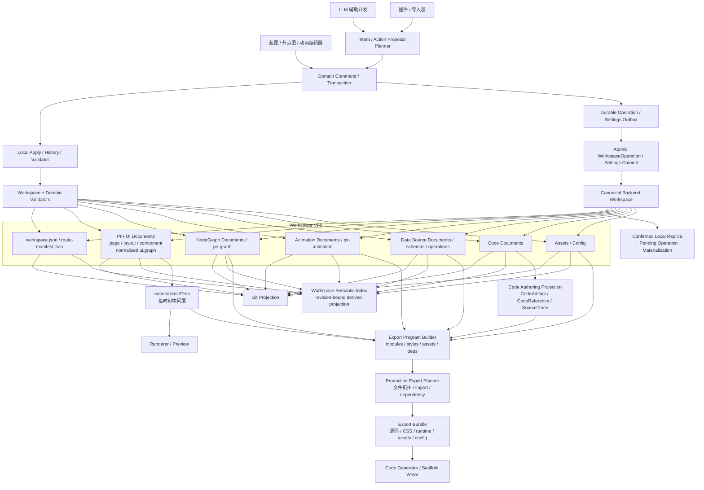

# Prodivix Agents 开发指南

你是一名资深前端开发工程师，正在开发一款叫 Prodivix 的工业级浏览器端可视化前端开发工具。以下是这款工具的核心架构。

## 当前全局阶段

- 当前产品位置：`G1 Passed / G2 Foundation`（G0、G1 `ProductGateStatus=Passed`，G2 `ProductGateStatus=In Progress`）。
- `specs/roadmap/global-phases.md` 是 Global Phase 的唯一来源，`specs/roadmap/g0-closure-evidence.md` 保存 G0 的可重复验证边界。
- G1 已形成 revision-bound TypeScript/JavaScript/CSS/SCSS/GLSL/WGSL Language Capability、独立 WebGL2/WebGPU Shader Compile Capability、跨编辑器 CodeSlot、external adapter 与 orphan lifecycle、跨领域 code refactor、PIR-current ↔ canonical React/JSX + standalone CSS controlled round-trip、DTCG Token/Resolver、Asset Semantic Provider、完整 Blueprint/Component/Collection 产品表面、唯一 durable 生产写入链，以及独立 React/Vite install/typecheck/test/build/browser-smoke Gate。G2 已建立 transport-neutral ExecutionProvider/ExecutionJob、instance-owned Execution Session coordinator、provider-neutral Executable Project Snapshot、共享 Browser Project Runtime Host、相互独立的 Preview/Test Provider、NodeGraph/Animation same-context provider，以及 Remote codec/client/provider projection、Remote Preview/Build Bundle/Test Report result、授权 artifact resolver、有界 HTTP envelope/content transport、Backend user-auth gateway/durable execution grant、Control Plane Core、PostgreSQL adapter/integration Gate、独立 HTTP service、Worker Agent、rootless Podman sandbox/GitHub Isolation Gate、D2 durable event/log、content-addressed artifact blob、总预算与 retention、短期 capability Remote Preview Host，以及同一 Golden neutral snapshot 的 Browser Preview/Test 与 Remote Preview/Test/Build contract matrix/GitHub Gate；真实 Golden snapshot 的 rootless Preview/Test/Build、internal install network + hostname/443 allowlist proxy、install/runtime 断网硬切、transport-neutral sanitized `network.request` 与 Execution Center Network 视图也已进入该 Gate，Blueprint Run Mode 已可显式选择 Browser/Remote provider。DataSourceDocument/DataOperationReference current contract、`data-source` typed Workspace document、Data Semantic Contribution、PIR/Collection durable binding 与显式 lifecycle mapping、Data invocation/mock-live adapter registry/lifecycle execute kernel、独立 HTTP adapter、session-scoped deterministic mock fixture/stateful CRUD namespace、content-addressed Executable Snapshot v4 fixture provisioning/Remote codec、Browser/Remote provider runtime asset projection、React/Vite standalone mock query lifecycle subscription，以及 Browser fetch composition 和 operation/invocation Network correlation 已建立。继续聚焦 Data schema/policy、standalone mutation/live runtime、Secret resolution/runtime-zone permission、Terminal、Secret canary 与第二 framework target。
- Canonical Workspace VFS 是作者态唯一真相。PIR、NodeGraph、Animation、Data Source、Code、Design Token、Design Token Resolver、Assets、Config 与 RouteManifest 是 Workspace 内由各领域 owner 管理的文档或清单；PIR 不是整个项目的单一巨型 JSON。

```mermaid
flowchart TD
    %% 核心作者态文件系统
    subgraph VFS [Workspace VFS]
        direction TB

        WorkspaceCore[workspace.json / route-manifest.json]
        PIR((PIR UI Documents<br>page / layout / component<br>normalized ui.graph)):::core
        NodeGraphDocs[NodeGraph Documents<br>pir-graph]
        AnimationDocs[Animation Documents<br>pir-animation]
        DataSourceDocs[Data Source Documents<br>schemas / operations / policies]
        CodeDocuments[Code Documents<br>TS / CSS / Shader / Adapter]
        VFSAssets[Assets / Config]
    end

    %% ----------------- 顶部：编辑器层 -----------------
    subgraph Editors [编辑器-三编辑器架构]
        direction TB

        %% 测试模块
        TestBox[测试]
        VisualTest[视觉回归测试等]
        UnitTest[单元测试等]

        TestBox --> VisualTest & UnitTest

        %% 具体编辑器
        Blueprint[蓝图编辑器]:::editor
        NodeGraph[节点图编辑器]:::editor
        AnimEditor[动画编辑器]:::editor

        %% 代码相关能力通过共享代码作者环境进入三编辑器

        %% 测试与编辑器的连接
        VisualTest -.-> Blueprint
        UnitTest -.-> NodeGraph

        %% 动画细节
        AnimDetail[关键帧 / CSS Filter / SVG Filter]
        AnimEditor --- AnimDetail
    end

    %% ----------------- 中部：共享代码作者环境 -----------------
    subgraph Authoring [共享代码作者环境]
        direction TB

        CodeEnv[Code Authoring Environment<br>三编辑器共享代码作者态底座]:::editor
        CodeWorkspace[Code Workspace / CodeArtifact]
        IntelliSense[IntelliSense / Language Service]
        CodeSlots[Code Slots<br>handler / executor / adapter / mounted CSS]
        CodeAssets[GLSL / WGSL / TS / CSS / Adapter]

        CodeEnv --> CodeWorkspace & IntelliSense & CodeSlots & CodeAssets
    end

    SemanticIndex[Workspace Semantic Index<br>WorkspaceSymbol / Scope / Reference / Resolution]

    Blueprint -->|"event / mounted CSS / adapter slot"| CodeEnv
    NodeGraph -->|"executor / transform slot"| CodeEnv
    AnimEditor -->|"easing / shader / timeline script slot"| CodeEnv
    Blueprint & NodeGraph & AnimEditor -->|"domain contribution / query"| SemanticIndex
    CodeEnv <-->|"Code Semantic Provider / query"| SemanticIndex
    CodeEnv -->|"edit / diagnostics"| CodeDocuments
    CodeEnv -->|"CodeReference / diagnostics"| PIR & NodeGraphDocs & AnimationDocs
    WorkspaceCore & PIR & NodeGraphDocs & AnimationDocs & DataSourceDocs & CodeDocuments & VFSAssets --> SemanticIndex

    %% 编辑器到 VFS 内核心 JSON 的连接
    Blueprint -->|"ui"| PIR
    NodeGraph -->|"node graph document"| NodeGraphDocs
    AnimEditor -->|"animation document"| AnimationDocs

    %% ----------------- 左侧：资源与项目 -----------------
    subgraph Assets [资源与依赖]
        ESM[esm.sh]
        ExtLib[外部库]
        BuiltIn[内置组件]
        HTML[HTML 原生]

        ESM --> ExtLib
        ExtLib & BuiltIn & HTML --> ProjectScope

        subgraph ProjectScope [项目]
            Router[路由]
            Component[组件]
        end
    end

    Router -->|"route manifest"| WorkspaceCore
    Component -->|"component PIR"| PIR
    Assets -->|"assets / dependencies"| VFSAssets
    ESM -.-> AnimEditor

    %% ----------------- 核心功能扩展 -----------------
    LLM[LLM 辅助开发]
    Planner[Intent / Action Proposal Planner]
    CommandLayer[Domain Command / Transaction]
    DurableChange[Durable Operation / Settings Outbox]
    AtomicCommit[Atomic WorkspaceOperation / Settings Commit]

    LLM -->|"code context / patch proposal"| CodeEnv
    LLM -->|"intent / proposal"| Planner
    Planner --> CommandLayer
    Blueprint & NodeGraph & AnimEditor --> CommandLayer
    CommandLayer -->|"validated local apply + History"| WorkspaceCore & PIR & NodeGraphDocs & AnimationDocs & DataSourceDocs & CodeDocuments & VFSAssets
    CommandLayer --> DurableChange --> AtomicCommit

    %% ----------------- 右侧：后端与 Git -----------------
    subgraph BackendSys [后端与社区]
        Backend[后端] --> Community[社区系统]
        Community --> OtherPlatform[其他平台上的社区]
    end

    AtomicCommit --> Backend
    WorkspaceCore & PIR & NodeGraphDocs & AnimationDocs & DataSourceDocs & CodeDocuments & VFSAssets <--> Backend

    subgraph VersionControl [版本控制]
        Git[Git]:::infra
        GitPlat[GitHub / Gitee / GitLab]
        License[依赖项 LICENSE 处理]

        Git <--> GitPlat
        License --> Git
    end

    WorkspaceCore & PIR & NodeGraphDocs & AnimationDocs & DataSourceDocs & CodeDocuments & VFSAssets -->|"VFS 投影"| Git

    %% ----------------- 底部：编译与部署 -----------------
    subgraph Compilation [编译器与输出]
        DomainCompilers[Domain Compilers<br>Blueprint / NodeGraph / Animation / CodeArtifact]:::output
        ExportProgram[Export Program IR<br>modules / styles / assets / deps / source trace]
        ExportPlanner[Production Export Planner<br>topology / imports / dependencies / assets]:::output
        ExportBundle[Export Bundle<br>source / styles / runtime / assets / config]
        TargetPresets[Target Presets<br>React Vite / Vue / Svelte / Web Components 等]

        %% 框架列表
        Frameworks[原生 / Web Components / React / Vue / Angular<br>Qwik / Svelte / Solid / Lit / Astro]

        Build[构建]
        Deploy[部署]:::infra

        %% 部署目标
        Targets[Nginx 配置 / Cloudflare 等 / 服务器 / CDN]
        Hosting[GitHub Pages / Vercel / Netlify]
        Perf[性能监控]

        DomainCompilers --> ExportProgram --> ExportPlanner --> ExportBundle
        TargetPresets --> ExportPlanner
        ExportBundle --> Frameworks
        Frameworks --> Build --> Deploy
        Deploy --> Targets & Hosting
        Targets --> Perf
    end

    %% 连接 VFS 内文档到编译器
    WorkspaceCore & PIR & NodeGraphDocs & AnimationDocs & DataSourceDocs & CodeDocuments & VFSAssets --> DomainCompilers
    ExportBundle -->|生成源码 / 配置 / 资源| Git

    %% ----------------- 右下角：文档 -----------------
    Docs[文档]
    Tutorials[教程]
```

## Workspace VFS 读写链路

Intent 保持为本地或 AI planner 输入；planner 将其转换为可逆 Command 或原子 Transaction。Patch 是 Command 内部可逆、可校验的操作。所有生产作者态远端写入先形成 `WorkspaceOperation`，将 exact request 持久化到 Durable Outbox，再进入强幂等 Atomic Commit。Settings 使用独立但同样 durable、强幂等的 Settings Outbox / Commit。

## Workspace Semantic Index 与 Code Authoring Environment

Prodivix 是 Blueprint、NodeGraph、Animation 三编辑器架构。`specs/decisions/28.code-authoring-environment.md` 定义的 Code Authoring Environment 是三编辑器共享的代码作者态底座。

- code-owned 源码仍由 Canonical Workspace code document 持久化；Code Authoring Environment 承载其编辑体验与 CodeArtifact 投影，包括 event handler、custom executor、animation function、mounted CSS、shader、external library adapter 和普通 Workspace 代码文件。所有入口以 `CodeAuthoringRequest` 传递目标、SourceSpan、CodeSlot、来源与 capability policy，并复用 `CodeAuthoringSession` 的多文件草稿、canonical baseline、stale 与保存语义。
- 三编辑器通过 code slot 连接代码能力。slot 需要声明 owner、输入、输出、能力约束和诊断落点；领域文档保存 `CodeSlotBinding`，registry 只聚合 slot 与 revision-bound binding projection，不拥有 binding 或源码。绑定值应使用 `CodeReference`，不应是散落在 UI 局部状态里的裸代码字符串。
- `specs/decisions/25.authoring-symbol-environment.md` 定义 Workspace Semantic Index：它是绑定 Canonical Workspace partitioned revisions 与 provider set、可丢弃和重建的只读派生索引，统一承载 `WorkspaceSymbol`、`WorkspaceScope`、Reference graph、`DiagnosticTargetRef`、`SourceSpan`、definition、completion、impact 和 semantic resolution 查询。
- Language Service 只通过 Code Semantic Contribution / Language Capability Provider 接入。`@prodivix/code-language` 拥有具体语言 adapter；Code Authoring Environment 拥有代码作者体验、CodeArtifact 投影、CodeReference、CodeSlot 与 revision-bound provider session 生命周期，并向 Workspace Semantic Index 贡献和查询代码语义；Canonical Workspace 继续拥有 code document，它也不拥有 Route、Component、Collection、NodeGraph 或 Animation 的全局 identity/visibility policy。
- 当前 TypeScript/JavaScript/CSS/SCSS/GLSL/WGSL 纵切使用 immutable `CodeLanguageSession` 统一 definition、references、completion、diagnostics、hover、rename proposal 与 semantic contribution。GLSL/WGSL 通过 parser-neutral shader symbol model 发布 entry/function/type/resource facts。GPU/目标后端编译校验由独立 `ShaderCompileSession`、provider registry 与 browser WebGL2/WebGPU backend 承载；`prodivix.shaderCompile` metadata 是 target/stage/entry profile 的 canonical contract，CodeArtifact 只投影已解码 profile。Code Editor 和 Issues 消费同一 revision-bound compile snapshot，`COD-5002` 不进入 Language Service parser session；rename proposal 必须转换为可逆 Workspace Transaction，不得由 Language Service 直接覆盖 VFS。
- Code Resources 的 F2 rename 必须先计算跨 artifact edits 与持久化 CodeReference owner impact；不能由 owner-specific planner 原子改写的命名引用要在 apply 前 fail closed。CodeArtifact path move 只改变 VFS path/tree projection，必须保持 artifact identity、source、binding 与 semantic reference，并由可逆 Workspace Operation 进入 History/Outbox/Atomic Commit。
- Controlled visual/code round-trip 通过 code document metadata 中的 typed ownership manifest 与版本化 region marker 明确 `PIR-owned / code-owned / adapted` 边界。PIR 文档是唯一 canonical owner；React/JSX writable projection 管理普通 Element structure、literal props 与 literal text，standalone CSS projection 管理 literal style。唯一性按 `(PIR document, capability)` 约束，不限制一个 PIR 文档可接入的 projection 数量。代码和视觉写入都必须由 planner 转换为同一个可逆 Workspace Operation，区域外未知源码逐字节保留，unsupported shape 与 ownership drift fail closed。
- “全项目共享符号”表示 stable identity 全局可寻址，不表示扁平全局可见。Scope、type 与 capability 继续约束解析、补全和绑定。
- Route、PIR、Component、Collection、NodeGraph、Animation、Code、Token 和 Asset 保存各自类型化引用；Semantic Index 只生成统一引用图，不取代领域保存态。
- Semantic Index 只产生 scope/reference/resolution 类 semantic diagnostics；全域 provider snapshot lifecycle、去重、presentation 与 Issues query 继续由 `@prodivix/diagnostics` 拥有。
- PIR 可以引用代码，但不吞并代码源码和复杂库内部状态。复杂库按 Native / Adapted / Embedded / Code-only 能力等级接入，不逐库承诺完整可视化编辑。
- code-owned 不等于黑盒放弃。Prodivix 仍应该提供编辑、引用、诊断、定位、预览和 AI patch 能力，并能从 Issues、Inspector、画布、节点图、动画轨道跳转到对应代码上下文。
- 三编辑器、Inspector、Resources、Code 和 AI 需要符号、引用、resolution 或影响时，应通过 Workspace Semantic Index 的稳定查询接口；Issues 通过 `@prodivix/diagnostics` 消费 semantic diagnostic provider snapshot。任何入口都不得扫描其他编辑器内部结构。

## G2 Execution 与 Data Foundation

- `BrowserProjectRuntimeHost` 是 composition-root-owned 的长期浏览器项目宿主，统一管理惰性 runtime、filesystem snapshot、dependency fingerprint/install、owner-scoped process 与 dispose。Preview 与 Test 可以复用匹配的依赖安装，但不得共享 provider identity、active Job、Session、取消或结果。
- Browser Preview 与 Browser Test 必须使用独立 `ExecutionProviderDescriptor`。Preview 接受 `preview/client/workspace|route`；Test 接受 `test/test/test`，两者都执行 exact Canonical Workspace revision 生成的独立工程 snapshot。
- `@prodivix/runtime-core` 拥有 transport-neutral `ExecutionTestReport` 与 `test.report` trace contract；`@prodivix/runtime-vitest` 在 adapter 边界把有界 Vitest 私有结果转换为该 contract，Browser 与 Remote Worker 共同消费，Web 和 durable Remote 层不解析或保存测试工具私有 JSON。
- G2 Workspace Test 是导出工程测试宿主。报告与 Session event 是可丢弃运行态，不写 Canonical Workspace、local replica 或 Outbox，也不提前等同于 G3 `BehaviorScenario`、`VerificationPlan` 或 `VerificationEvidence`。
- `@prodivix/data` 拥有无版本号 current DataSourceDocument、DataOperationReference、schema、operation、policy、lifecycle、wire codec 与 semantic contribution；Canonical Workspace 以一等 `data-source` document 持久化作者态。
- `@prodivix/data-mock` 提供 session-scoped deterministic fixture runtime；通过 mock-only adapter emulation 在不改写 canonical source adapterId 的前提下覆盖 live protocol adapter。fixture provisioning、initial collection、命中结果与 runtime namespace 都是可丢弃运行态；mutation 仅修改 session 副本，reset/dispose 清理它，不形成第二套 Workspace 真相。
- PIR 现有 `dataId` 只表示文档内局部数据作用域，不得重解释为全局 Data operation。PIR owner 在 `logic.dataById` 保存 durable DataOperationReference binding；Collection source 继续引用同一 local `dataId`，并以 `data-operation` lifecycle 明确映射 idle/loading/success/empty/error。snapshot 是 document-instance 可丢弃运行态，success 不得从 value shape 猜 empty；Inspector 新写入必须通过单个可逆 Workspace Transaction 原子更新 binding、source 与 lifecycle。
- `ExecutionEnvironmentSnapshotRef`、`EnvironmentBindingReference` 与 `SecretRef` 当前只承载 identity；带 environment reference 的 request 自动要求 provider `environment-binding` capability。Secret value 不得进入 Workspace、PIR、ExecutionRequest、Session event、diagnostic、log、artifact、Browser snapshot、生成源码或客户端产物；当前 strict shape 不从 arbitrary literal 猜测秘密，adapter configuration schema、resolver 与 runtime-zone permission 属于后续 G2 runtime adapter。

## 核心 package owner

| Package                             | 稳定职责                                                                                                                                                                                                                                                                          |
| ----------------------------------- | --------------------------------------------------------------------------------------------------------------------------------------------------------------------------------------------------------------------------------------------------------------------------------- |
| `@prodivix/workspace`               | Canonical Workspace model、Codec、Validator、Command、Transaction、History 与 Semantic snapshot composition                                                                                                                                                                       |
| `@prodivix/workspace-sync`          | Revision、semantic conflict、Atomic Commit plan、Durable Outbox、local replica                                                                                                                                                                                                    |
| `@prodivix/pir`                     | PIR normalize、graph mutation、Component/Collection contract、语义校验与 semantic contribution                                                                                                                                                                                    |
| `@prodivix/router`                  | RouteManifest contract、codec、match/navigation 语义与 semantic contribution                                                                                                                                                                                                      |
| `@prodivix/nodegraph`               | 无 DOM NodeGraph contract、codec、executor、deterministic trace、same-context ExecutionProvider 与 semantic contribution                                                                                                                                                          |
| `@prodivix/animation`               | Animation contract、codec、authoring factory、确定性 evaluator、Runtime Port、same-context ExecutionProvider 与 semantic contribution                                                                                                                                             |
| `@prodivix/data`                    | DataSourceDocument、DataOperationReference、schema/operation/policy/lifecycle current contract、wire codec、semantic contribution，以及 protocol-neutral invocation、adapter registry、lifecycle execute kernel 与 Network correlation                                            |
| `@prodivix/data-http`               | HTTP Data operation adapter、literal public configuration/JSON mapping 与注入式 network transport；不拥有 Browser fetch、environment/Secret resolver、Workspace 或第二套 lifecycle                                                                                                |
| `@prodivix/data-mock`               | mock-only adapter emulation、immutable fixture store/reference、exact-input/fallback matching、delay/error/page、session-namespaced stateful CRUD、reset/dispose；不拥有 Canonical Data document、live network、Secret 或第二套 lifecycle                                         |
| `@prodivix/runtime-core`            | transport-neutral runtime port、executor registry、ExecutionProvider/ExecutionJob、Execution Session、ExecutionPreviewBundle/ExecutionBuildBundle/ExecutionTestReport、Executable runtime asset projection，以及 reference-only environment/Secret contract                       |
| `@prodivix/runtime-remote`          | versioned Remote execution envelope/strict codec、snapshot wire、client、授权 artifact resolver，以及 transport-neutral authorization/quota/router/repository/snapshot store/queue lease Control Plane Core；不拥有 deployable HTTP/database/queue/blob adapter 或 worker sandbox |
| `@prodivix/runtime-remote-postgres` | Control Plane Core 的 PostgreSQL snapshot/repository/queue lease adapter、content-addressed artifact blob/grant、event/artifact 总预算与 retention、事务幂等/quota/claim/fencing 及真实数据库 Gate；不拥有 protocol/domain contract、HTTP service 或 worker sandbox               |
| `@prodivix/runtime-vitest`          | 有界 Vitest 私有 JSON decoder 与 transport-neutral `ExecutionTestReport` adapter；不拥有 provider、Job、Workspace 或 durable Remote contract                                                                                                                                      |
| `apps/remote-runner-control-plane`  | 独立 Remote envelope HTTP service、client/worker 分离认证、PostgreSQL composition、worker claim/lease/transition/snapshot/event ingestion 内部 API；不得执行用户代码或持有 Workspace 作者态                                                                                       |
| `apps/remote-runner-worker`         | 独立 claim/heartbeat/cancellation Worker Agent、lease-fenced snapshot/event、rootless Podman sandbox、argv process supervisor、资源/timeout/output/redaction/cleanup；filesystem adapter 仅是非生产参考，不得作为安全边界                                                         |
| `apps/remote-preview-host`          | 独立 Remote Preview 静态 origin；严格解码 Preview Bundle，以 hash-only、短期 capability 子域托管多文件产物并施加 deny-by-default CSP、Permissions Policy、无缓存与每 session browser origin 隔离；不持有 Control Plane credential                                                 |
| `@prodivix/runtime-browser`         | Browser Runtime Host、独立 Preview/Test provider、filesystem/dependency/Vite/HMR、client-safe fetch/Network trace adapter、`runtime-vitest` 消费边界，以及 Animation RAF/effect projection                                                                                        |
| `@prodivix/pir-react-renderer`      | PIR 的 React projection；不拥有作者态真相                                                                                                                                                                                                                                         |
| `@prodivix/authoring`               | Workspace Semantic Index contract、provider composition、稳定查询，以及 CodeArtifact/Reference/Slot、CodeAuthoringRequest/Session 基础                                                                                                                                            |
| `@prodivix/code-language`           | revision-bound 语言 adapter、Code Language/Shader Compile Capability provider 与代码 semantic contribution；当前实现 TS/JS/CSS/SCSS/GLSL/WGSL                                                                                                                                     |
| `@prodivix/tokens`                  | DTCG Format/Resolver profile 与 codec、无版本 current Token/Resolver model、group/alias/type/theme/variant resolution plan 与 semantic contribution                                                                                                                               |
| `@prodivix/diagnostics`             | Issues contract、provider snapshot、去重与 presentation                                                                                                                                                                                                                           |
| `@prodivix/prodivix-compiler`       | Domain compiler、ExportProgram、Production Export Planner，以及 controlled React/JSX、CSS 双向 adapter 与原子 round-trip planner                                                                                                                                                  |
| `@prodivix/golden-conformance`      | Living Golden App、G0 非浏览器 conformance，以及 G1 Public Contract/controlled round-trip/standalone export/browser Gate                                                                                                                                                          |

`apps/web` 只负责 React 编辑器表面、浏览器 adapter 和 composition root，不得重新拥有 transport-neutral Runtime、Router、NodeGraph、Animation、PIR Renderer、Workspace Sync Core 或 Authoring Core。后端 `projects` 只保存项目元数据与显式发布投影；不得恢复 Project PIR 作者态镜像或缺失 Workspace 的 lazy fallback。

## 代码规范

0. 执行新 session 时，先同步远端最新 Git 仓库状态；开始改动前运行 `git fetch` 并确认当前分支是否落后于远端，若远端已有新提交，先用非破坏方式集成后再继续。
1. 读写文档都要用 UTF-8 编码。
2. 所有代码必须考虑可扩展性和健壮性。
3. `@prodivix/ui` 包下组件库使用 SCSS 进行样式编写，其他样式统一使用最新的 Tailwind 4 写法；CSS 变量使用 `text-(--text-primary)` 这类 Tailwind 4 语法。
4. 优先使用 `@/...` 导入同一个包下的代码，而不是使用相对路径。
5. 为方便开发者看懂代码，当且仅当在重要模块的核心方法或核心组件前编写规范的文档注释，写明白模块的调用链路的逻辑。不要写无用注释。
6. 如果文件过长，拆分。
7. 当且仅当需要测试时，补全测试。考虑边界条件。
8. 不要加耦合测试，尤其不要写依赖 DOM 层级、内部 class、具体标签结构、`querySelector`、`closest`、`parentElement`、快照或实现细节的测试；优先测试用户可感知行为、公开 API、状态结果和稳定语义。
9. 当完整的功能写好后，先运行 `pnpm run format` 来格式化代码。
10. 仅在有明确提示的时候提交并推送。commit msg 使用纯英文，按照业界规范写法：使用 `type(scope): description` 格式。用户要求提交并推送且未指定分支时，先同步远端，然后直接提交并推送 `main`；不要自动创建功能分支或 PR。
11. 在保持 monochrome-ui 设计风格的前提下，样式和 UX 设计可以模仿 Figma 和 Dify。
12. 扫描文件名时，优先使用 `git ls-files`、`git diff --name-only` 等 Git 相关命令限定仓库文件，避免递归扫到 `node_modules` 等依赖目录。
13. 依赖安装或更新导致锁文件变化时，无需手动修改锁文件，接受包管理器自然生成的锁文件变更。
14. 文档语言按目标读者、已有文件语境和同一文档语言一致性决定。根 `README.md` 使用英文，`README.zh-CN.md` 使用简体中文。
15. 任何 code-owned 能力都要优先接入 Code Authoring Environment，不要让三编辑器直接保存任意代码字符串；任何领域需要符号、引用、作用域或影响分析时都要接入 Workspace Semantic Index，不得自行扫描其他编辑器内部状态。
16. 项目处于 alpha 阶段，重大更改直接实现当前目标架构，并以现行 canonical contract 作为唯一生产契约。实现应追求长期稳定、清晰 owner 边界和最佳软件工程质量。
17. 不追求最小修正。发现需要优化的地方应立即优化，并且力求最优；尤其是重复逻辑、错误抽象、临时补丁和会导致后续维护分叉的实现，应在当前改动中一并收敛。
18. 测试文件按测试性质统一命名：示例/单元测试使用 `<subject>.test.ts(x)`，属性测试使用 `<subject>.property.test.ts(x)`，conformance 使用 `<subject>.conformance.test.ts(x)`，integration 使用 `<subject>.integration.test.ts(x)`，E2E 用户旅程使用 `<journey>.spec.ts`。不要用 `Properties`、`PropertyTest` 等变体制造命名分叉。
19. 所有生产作者态领域写入都必须规划为可逆 `Command` 或原子 `Transaction`，再形成 `WorkspaceOperation` 进入 Durable Outbox 与 Atomic Commit；Canonical Workspace VFS 是作者态存储，Project publication projection 只承载显式发布投影。
20. `localStorage` 只保存主题、选择和视图等 UI 偏好。领域状态的浏览器持久化必须使用正式 local replica / outbox adapter；不得新增编辑器私有镜像作为第二真相源。
21. Workspace Semantic Index 必须绑定 Canonical Workspace partitioned revisions、semantic schema 与 provider set，可重建且只读。全项目 symbol address 可寻址不等于全局可见；领域保存态保留类型化引用，Language Service 只通过 Code contribution/capability provider 接入。
22. Blueprint 复用按 `pir-component` Definition、Public Contract、Component Instance 和一等 Collection 建模。subtree extraction 必须是带 impact/relocation 分析的原子 Workspace Transaction。整个 G1 只面向无版本号的 `PIR-current` 稳定领域模型；生产目录、公开 API 与实现统一使用无版本命名。数字 PIR 版本仅存在于 wire schema、codec、migration 与 persistence 边界；未来版本通过集中 migration 进入同一 current model，Renderer、Compiler、Workspace、Semantic Index 与 Web 作者表面保持稳定。

## 工具入口文件关系

- `AGENTS.md` 是跨 AI 工具共享的主规则来源，记录项目架构、Workspace VFS 读写链路与通用开发规范。
- `CLAUDE.md` 是 Claude Code 专用补充文件，用于记录 Claude 的命令速查、仓库路径索引、测试备注与文档边界。
- 两者内容冲突时，以本文件的通用项目规则为准；工具专属执行细节以对应工具文件为准。
