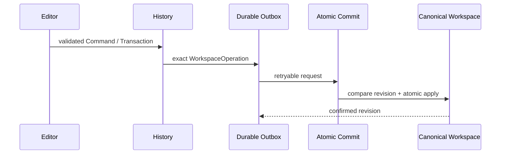

# Change 与 Sync

Prodivix 把“用户想做什么”“本地如何回放”和“远端如何持久化”分成明确层次。

## Intent、Command 与 Patch

- **Intent**：用户或 AI planner 的输入，还不是可执行保存契约。
- **Command**：一个可逆、可校验的领域动作。
- **Transaction**：必须原子成功或失败的一组动作。
- **Patch**：Command 内部用于 apply/revert 的结构化细节。

History 记录 Command/Transaction，因而能够按领域语义撤销和重做。把任意 JSON patch 当作公共作者 API 会丢失 owner、前置条件和影响分析。

## WorkspaceOperation

本地校验通过后，生产写入形成 `WorkspaceOperation`，包含 operation identity、base revision 和 exact request。Operation 先持久化到 Durable Outbox，再发送到 Atomic Commit。

服务端以 operation identity 强幂等：同一请求重试不会重复应用；相同 identity 携带不同 payload 必须拒绝。

## Confirmed 与 Pending

Local replica 保存 confirmed canonical state，并 materialize 尚未确认的 pending operations。UI 可以立即显示本地意图，但不能把 materialized tree 当成新的 canonical snapshot。

## Revision conflict

当 base revision 过期，同步层返回结构化冲突。客户端以 base/local/remote 做 semantic diff，再生成基于最新 revision 的 resolution operation。详见[Issues、History 与冲突](/editors/issues-history-conflicts)。

## Settings

Settings 使用独立的 durable outbox/commit，但遵守同样的幂等和失败恢复原则。它不能和 Workspace 作者文档混成一个模糊保存接口。
