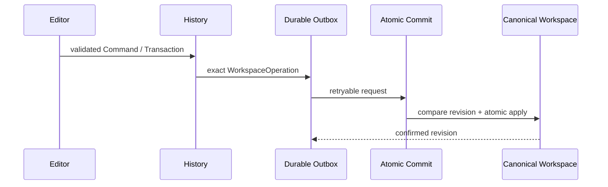

# Change 与 Sync

Prodivix 把“用户想做什么”“本地如何回放”和“远端如何持久化”分成明确层次。

## Intent、Command 与 Patch

- **Intent**：用户或 AI planner 的输入，尚未构成可执行的持久化契约。
- **Command**：一个可逆、可校验的领域动作。
- **Transaction**：必须原子成功或失败的一组动作。
- **Patch**：Command 内部用于 apply/revert 的结构化细节。

History 记录 Command/Transaction，因此能按领域语义进行撤销和重做。如果把任意 JSON patch 当作公共创作 API，就会丢失 owner、前置条件和影响分析信息。

## WorkspaceOperation

本地校验通过后，生产写入会生成 `WorkspaceOperation`，其中包含 operation identity、base revision 和 exact request。Operation 先持久化到 Durable Outbox，再提交至 Atomic Commit。

```mermaid
sequenceDiagram
  participant E as Editor
  participant H as History
  participant O as Durable Outbox
  participant C as Atomic Commit
  participant W as Canonical Workspace
  E->>H: validated Command / Transaction
  H->>O: exact WorkspaceOperation
  O->>C: retryable request
  C->>W: compare revision + atomic apply
  W-->>O: confirmed revision
```

服务端通过 operation identity 保证强幂等性：同一请求重试不会重复生效；如果相同 identity 携带了不同的 payload，则必须拒绝。

## Confirmed 与 Pending

Local replica 保存 confirmed canonical state，并将尚未确认的 pending operations 就地 materialize。UI 可以立即呈现本地意图，但不能把 materialized tree 视为新的 canonical snapshot。

## Revision conflict

当 base revision 过期时，同步层会返回结构化冲突信息。客户端根据 base/local/remote 做 semantic diff，再生成基于最新 revision 的 resolution operation。详见[Issues、History 与冲突](/editors/issues-history-conflicts)。

## Settings

Settings 使用独立的 durable outbox/commit，但遵守同样的幂等和失败恢复原则。它不能与 Workspace 创作文档混为同一个笼统的保存接口。
