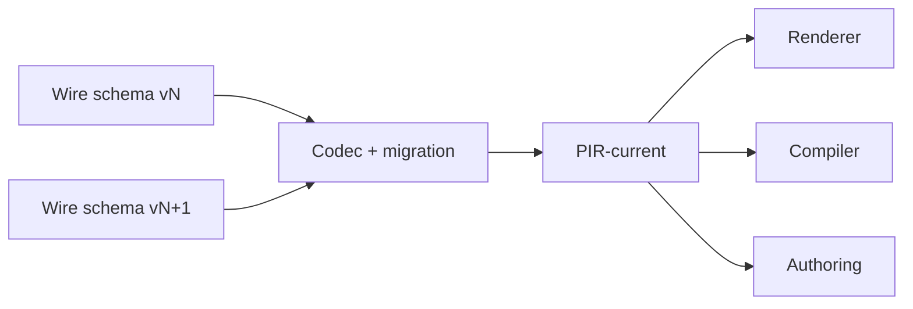

# PIR-current

PIR-current 是生产代码使用的无版本号 UI 领域模型。Renderer、Compiler、Workspace、Semantic Index 和 Web 作者表面只依赖 current API。

## 为什么生产 API 没有版本号

持久化 wire schema 会演进，但如果业务代码散布 `pirV14`、`pirV15` 等类型，每次升级都会迫使整个仓库迁移。Prodivix 把版本变化集中在 persistence 边界：

数字版本只允许存在于 wire schema、codec、migration 和 persistence compatibility 层。

## 文档形态

PIR UI 文档使用 normalized `ui.graph`，并以 page、layout、component 等文档分区存在。需要递归渲染时，`materializeUiTree` 生成临时树投影；树不回写为第二种保存格式。

## 复用模型

PIR-current 一等支持：

- Component Definition
- Public Contract
- Component Instance
- Collection
- 类型化 CodeReference 与跨领域目标引用

组件抽取是带 impact/relocation 分析的原子 Workspace Transaction，不是复制粘贴 JSON。

## Owner 边界

PIR 拥有 UI 结构与 UI 语义，但不吞并：

- NodeGraph 内部状态
- Animation 文档
- code-owned 源码
- RouteManifest
- Asset 二进制内容
- Semantic Index 派生图

它可以保存对这些领域的类型化引用。

详细字段和 validator 入口见[PIR-current 参考](/reference/pir-spec)。
