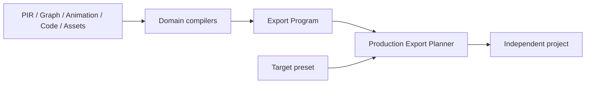

# Preview 与 Export

Preview 和 Export 都消费 Canonical Workspace，但服务于不同目标：Preview 提供快速交互反馈，Export 生成可脱离 Prodivix 运行的工程项目。

## Preview

Preview 从 PIR-current materialize 临时 UI tree，并使用 Renderer 与 browser runtime adapter 执行交互、NodeGraph 和 Animation。它保留 SourceTrace，以便运行或编译问题定位回 Workspace target。

Preview DOM 是运行投影，不是保存态，也不能用来反向覆盖 PIR。

## Export Program

各领域 compiler 把 Workspace 文档转换为统一 Export Program：modules、styles、assets、dependencies、runtime requirements 与 source trace。Production Export Planner 再按 target preset 决定文件拓扑、imports 和配置。

## Parity

Renderer 与 Compiler 必须对同一 current model 保持语义 parity。受控 JSX/CSS round-trip 也共享 SourceTrace 与 owner 边界，不能单独发明另一种组件结构。

## 当前 Gate

React/Vite target 已通过独立 install、typecheck、test、build 和真实浏览器 Gate，包括 WebGL2 及可用环境下的 WebGPU 验证。

第二框架 target、正式 ExecutionProvider、Data/API runtime、部署工作流、性能与视觉回归 Gate 尚未作为可用能力发布。只有通过对应证据后，产品文档才会将它们标记为可用。

操作教程见[导出 React/Vite 项目](/tutorials/export-react-vite)。
