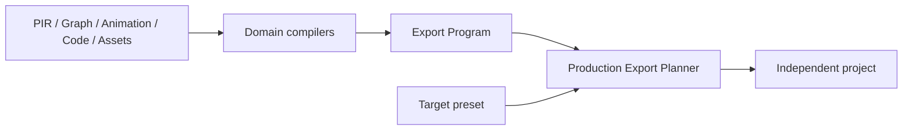

# Preview 与 Export

Preview 和 Export 都以 Canonical Workspace 为数据来源，但服务于不同目标：Preview 提供快速交互反馈，Export 生成可脱离 Prodivix 运行的工程项目。

## Preview

蓝图画布提供三种运行深度：Design 直接投影 PIR-current 并支持编辑操作；Interactive 在同一投影上执行轻量级进程内交互；Run 可把当前 Canonical Workspace 编译为独立 React/Vite 或 Vue/Vite 工程，在隔离 Browser/Remote Project Runner 中运行，并将真实项目 server 直接嵌入画布 iframe 中显示。framework target 与 execution provider 可分别选择。

Run 绑定精确 Workspace revision。当仅有源码变化时，Runner 同步文件并复用 Vite/HMR；若依赖清单发生变化，则重新安装并启动。stdout、console error、runtime failure 与 preview URL 通过统一 ExecutionJob 事件进入编辑器。

Execution Center 将生命周期较短的 Job 组织为稳定的项目运行会话，提供有界事件保留、All/Errors 过滤、停止、重启、刷新 iframe 与独立打开 Preview。离开 Run 后进程会停止，但在当前编辑器生命周期内仍可查看该会话的日志；这些事件不属于 Workspace 创作状态，也不会持久化为第二事实来源。

Preview DOM 是运行时投影，不是持久化状态，也不能用来反向覆盖 PIR。

## Test

Test 页面运行与 Preview 同一来源的 exact Workspace revision，可选择独立的 React/Vite 或 Vue/Vite export snapshot。Preview 与 Test 拥有各自的 ExecutionProvider descriptor、Job、Session、取消与结果；二者只共享长期运行的 `BrowserProjectRuntimeHost` 所管理的 filesystem、依赖安装与 browser Node runtime。

当前 Browser/Remote Test provider 执行同一 snapshot 中声明的 Vitest plan。工具内部的私有 JSON 仅在 Browser/Worker adapter 边界处转换为 transport-neutral 的 `ExecutionTestReport`，再通过 execution-bound `test.report` trace 与 report artifact 呈现在 Test 页面中。文件状态、用例状态、耗时、失败信息、运行日志、停止和重跑操作均来自同一个 revision-bound Execution Session；两个 Test target 均强制 mock-only。

测试报告是 G2 的导出工程运行结果，不写入 Workspace，也不自动成为 G3 的 `BehaviorScenario` 或 `VerificationEvidence`。

## Export Program

各领域 compiler 将 Workspace 文档转换为统一的 Export Program：modules、styles、assets、dependencies、runtime requirements 与 source trace。Production Export Planner 再按 target preset 决定文件拓扑、imports 和配置。

```mermaid
flowchart LR
  Docs["PIR / Graph / Animation / Code / Assets"] --> Compilers["Domain compilers"]
  Compilers --> Program["Export Program"]
  Program --> Planner["Production Export Planner"]
  Preset["Target preset"] --> Planner
  Planner --> Bundle["Independent project"]
```

## Parity

Renderer 与 Compiler 必须针对同一 current model 保持语义 parity。受控 JSX/CSS round-trip 同样共享 SourceTrace 与 owner 边界，不能自行发明另一种组件结构。

## 当前 Gate

React/Vite target 已通过独立的 install、typecheck、test、build 和真实浏览器 Gate，包括 WebGL2 及可用环境下的 WebGPU 验证。Vue/Vite 已通过 current PIR/Route/Auth/Server/Asset compiler、Export/Test/Blueprint target selector，以及独立 install、typecheck、test、build、authenticated Catalog CRUD、exact PNG decode 的真实 Chrome Gate。

ExecutionProvider/ExecutionJob、共享 Browser Runtime Host、Browser/Remote Preview/Test/Build、Terminal、Files、Network 与 Workspace Test 产品路径已经建立。Data/API 作者态已进入 Preview/Export snapshot：mock runtime 可跨 HTTP、GraphQL、AsyncAPI adapter 运行；public static client 可执行有界 HTTP、GraphQL query/mutation 与 AsyncAPI request-reply/publish live 调用；server/edge HTTP、GraphQL 与 AsyncAPI finite invocation 共用受审计 execution-parent gateway，public GraphQL subscription 与 AsyncAPI SSE/NDJSON stream 使用显式 pull/backpressure bridge。Workspace Test 始终编译独立 mock-only snapshot，不接受 environment binding，也不会回退到 live。

Secret 值仅允许在经过授权的 Remote effect 边界短暂注入，不进入 Workspace、snapshot、生成源码、浏览器产物或执行记录；长连接 Secret stream 仍 fail closed。Data Network 已可通过 metadata-only SourceTrace 和 exact snapshot fence 打开 canonical operation。真实 Remote authenticated Catalog live journey、Vue layout/outlet、完整跨 target Asset delivery/sanitize UI matrix、stream reconnect/resume、Secret credential renewal、更多 transport、部署工作流、性能与视觉回归将继续按各自 Gate 推进。

操作教程见[导出 React/Vite 项目](/tutorials/export-react-vite)。
