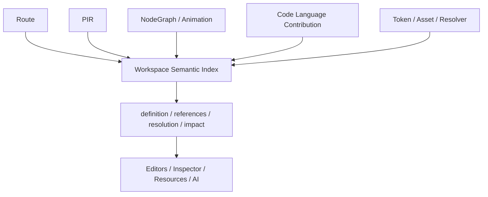

# Semantic Authoring

Workspace Semantic Index 让 Route、PIR、Component、Collection、NodeGraph、Animation、Code、Token 和 Asset 在整个项目中可寻址、可引用和可分析。

## 全局可寻址，不是全局可见

每个 `WorkspaceSymbol` 有稳定 identity 和 owner，但解析仍受 `WorkspaceScope`、类型与 capability 约束。一个符号能被 Issues 定位，不代表它会出现在所有编辑器的 completion 中。

## Revision-bound snapshot

Semantic Index 绑定：

- Canonical Workspace 的 partitioned revisions
- semantic schema
- provider set

任一身份发生变化，都应构建新 snapshot。索引只读、可丢弃、可重建，不允许保存领域作者态。

## Provider contribution

各领域只发布自己的 symbols、scopes、references、diagnostic targets 与 source spans。Index 负责组合和稳定查询，但不扫描编辑器私有结构。

## Code Language 的位置

Language Service 通过 Code Semantic Contribution 接入，不拥有 Component、Route 或 Collection 的 identity policy。它发布代码符号事实并提供 language capability；跨领域 rename/impact 由 authoring 与 Workspace transaction 补全。

## Diagnostics 的位置

Semantic Index 只生成 scope/reference/resolution 类 semantic diagnostics。Provider lifecycle、去重、presentation 和 Issues query 属于 `@prodivix/diagnostics`。

稳定接口见[Workspace Semantic Index 参考](/reference/authoring-symbol-environment)。
