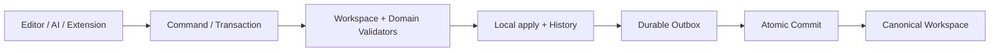

# Canonical Workspace VFS

Canonical Workspace VFS 是 Prodivix 作者态的唯一真相。所有编辑器、代码能力、AI proposal、同步和导出都围绕同一组 Workspace 文档工作。

## 它保存什么

Workspace 由多个领域分区组成，而不是一个巨型 JSON：

- Workspace metadata 与 RouteManifest
- page、layout、component 等 PIR UI 文档
- NodeGraph 与 Animation 文档
- Code documents 与 CodeArtifact projection
- Design Token、Asset、dependency 与 config

每个领域 owner 负责自己的 current model、codec 和 validator。Workspace 负责组合、revision、Command、Transaction、History 与 semantic snapshot composition。

## 写入链路

生产作者操作必须记录 exact request 和 base revision。网络失败时，outbox 能安全重试；服务端以 operation identity 提供强幂等提交。

## 读取与投影

Renderer、Semantic Index、Issues、Code Authoring 和 Compiler 都是从 canonical documents 构建的 revision-bound projection。它们可以丢弃和重建，因此不能反向成为第二真相源。

PIR 在渲染前可临时 materialize 为树；保存态仍是 normalized graph。React component tree、React Flow state、CodeMirror document 和浏览器 preview DOM 都不是持久化契约。

## 本地项目

本地项目也遵循同一原则：正式 local replica 保存 confirmed state，并叠加 pending operation materialization。`localStorage` 只适合主题、选择和视图偏好，不能新增编辑器私有领域镜像。

## Project 与 Workspace

Project 保存产品元数据和显式 publication projection；Canonical Workspace 保存作者态。后端不能在 Workspace 缺失时从旧 Project PIR 镜像懒恢复，否则会重新制造双真相源。

继续阅读：[Change 与 Sync](/concepts/change-and-sync)和[架构与 Package Owner](/developer/architecture)。
