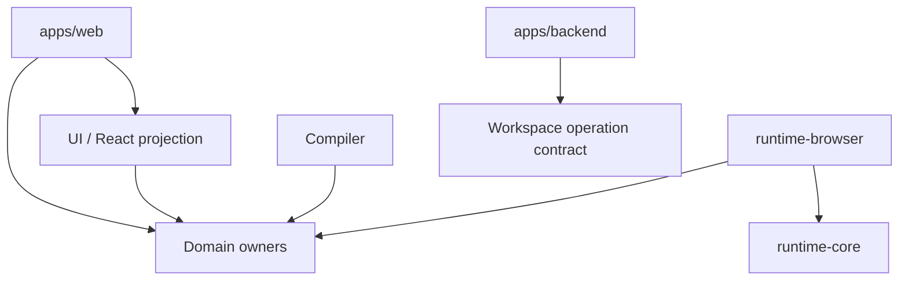

# 架构与 Package Owner

Prodivix 采用“Canonical documents + domain owners + revision-bound projections”的架构。应用只组合能力，稳定契约归 package。

## 核心 owner

| Package                        | 稳定职责                                                                                           |
| ------------------------------ | -------------------------------------------------------------------------------------------------- |
| `@prodivix/workspace`          | Canonical Workspace model、codec、validator、Command、Transaction、History 与 snapshot composition |
| `@prodivix/workspace-sync`     | Revision、semantic conflict、Atomic Commit plan、Durable Outbox 与 local replica                   |
| `@prodivix/pir`                | PIR-current normalize、graph mutation、Component/Collection 与 semantic contribution               |
| `@prodivix/router`             | RouteManifest、codec、match/navigation 与 semantic contribution                                    |
| `@prodivix/nodegraph`          | DOM-free NodeGraph contract、executor、deterministic trace 与 semantic contribution                |
| `@prodivix/animation`          | Animation contract、authoring factory、deterministic evaluator 与 semantic contribution            |
| `@prodivix/runtime-core`       | Transport-neutral runtime port 与 executor registry                                                |
| `@prodivix/runtime-browser`    | Browser NodeGraph/Animation runtime adapter                                                        |
| `@prodivix/pir-react-renderer` | PIR 的 React projection，不拥有作者态真相                                                          |
| `@prodivix/authoring`          | Semantic Index contract/query，以及 CodeArtifact/Reference/Slot 基础                               |
| `@prodivix/code-language`      | TS/JS/CSS/SCSS/GLSL/WGSL language session 与 shader compile capability                             |
| `@prodivix/diagnostics`        | Issues contract、provider snapshot、去重与 presentation                                            |
| `@prodivix/tokens`             | DTCG token/resolver current model、resolution 与 semantic contribution                             |
| `@prodivix/prodivix-compiler`  | Domain compiler、Export Program 与 Production Export Planner                                       |
| `@prodivix/golden-conformance` | Living Golden App 与产品 Gate conformance                                                          |

UI、plugin、i18n 与 debugger package 也各自拥有公开契约，但不应承接上述领域的临时副本。

## 应用边界

`apps/web` 只负责 React 编辑器表面、browser adapter 和 composition root。它不得重新拥有 Runtime、Router、NodeGraph、Animation、PIR Renderer、Workspace Sync 或 Authoring Core。

`apps/backend` 负责 canonical persistence、Atomic Commit、权限与服务边界。Project 只保存项目元数据与显式 publication projection，不保存 PIR 作者态镜像。

## 稳定依赖方向

领域层不能依赖 React、DOM、fetch transport 或编辑器内部 store。跨领域语义通过 Semantic Contribution/Query 协作，不互相扫描内部结构。

## 生产模型演进

Alpha 阶段直接收敛当前目标架构，不保留旧兼容层。PIR、Token 等生产 API 使用无版本 current model；wire version 与 migration 集中在 persistence 边界。

更完整的决策依据在仓库 `specs/decisions/`。全局阶段只以 `specs/roadmap/global-phases.md` 为准。
