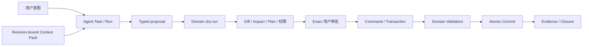

# AI 助手边界

Prodivix 将 AI 视为语义化作者环境的参与者，而非绕开项目模型的第二套编辑器。

## AI 可以做什么

AI 可以基于当前 Workspace revision、可见 scope、语义引用和诊断生成：

- 修改意图与变更 proposal
- 通过 CodeArtifact/CodeReference 领域 action 表达的代码变更 proposal
- 组件抽取或引用调整建议
- Issues 的解释与修复建议
- 导出、依赖和影响分析建议

这些能力会随产品阶段逐步开放；入口的出现并不意味着该功能已具备自主执行能力或生产安全保证。

## AI 不可以绕过什么

AI 不得直接覆盖 Canonical Workspace VFS，也不得将源码或领域状态持久化到私有聊天状态中。模型或 tool
只能产生不可信的 typed proposal；各领域 owner dry-run 后才能形成可逆 Command 或原子 Transaction。生产写入
还必须绑定 exact Workspace revision、semantic diff、Impact、Verification Plan、权限与用户审批，再经过
History、Durable Outbox 和 Atomic Commit。

```mermaid
flowchart LR
  Prompt["用户意图"] --> Task["Agent Task / Run"]
  Context["Revision-bound Context Pack"] --> Task
  Task --> Proposal["Typed proposal"]
  Proposal --> Planner["Domain dry-run"]
  Planner --> Review["Diff / Impact / Plan / 权限"]
  Review --> Approval["Exact 用户审批"]
  Approval --> Command["Command / Transaction"]
  Command --> Validate["Domain Validators"]
  Validate --> Workspace["Atomic Commit"]
  Workspace --> Verification["Evidence / Closure"]
```

## 上下文与秘密

项目中的符号虽然全局可寻址，但并不等于对 AI 全部可见。Context Pack 的 scope、来源、可信度、capability、
权限、privacy 和 data-residency 边界仍然生效。Data/API 与执行能力只能通过 opaque Secret reference 请求
callback-bound transport；密钥本体不得进入 Workspace、Context、模型请求、tool trace、artifact 或诊断。

图片、截图和 PDF/document 不是一个简单的“视觉开关”。媒体输入必须绑定原始摘要、裁剪/缩放/OCR/page render
转换、遗漏范围与敏感级别；其中隐藏文字、二维码、metadata、OCR/transcript和 tool返回媒体始终是 data-only。
视觉坐标不能成为 Workspace target。模型生成的图片或其他媒体也只能形成候选，经过 Binary Asset验证、扫描、
provenance、proposal与用户审批后才能写入。

Provider内建搜索、文件索引、代码执行、MCP、computer use、动态工具发现、缓存和后台任务同样不自动可信。
只有 exact capability profile、tool descriptor、grant、预算、状态/保留策略与调用 receipt齐全的能力才能启用；
opaque managed agent、任意 MCP、跨项目记忆和用 computer use点击编辑器完成修改不属于 G4 production apply。

## 当前状态

当前作者环境已提供稳定语义地址、引用图、Code Artifact、诊断目标、可逆写入链和 G3 Verification
基础设施。G4 V0 已在本地完成 `@prodivix/ai` current/wire owner hard cut、`agent-policy` Workspace/Backend
round-trip、plan-only draft boundary 与 diagnostics registry；durable CI evidence 仍待取得，V1–V9 尚未实现。
ADR 65–69 已冻结控制平面、Provider capability/invocation、多模态、Hosted capability和
真实模型统计评测，但完整 Agent 产品能力仍需按后续 Gate实现和验证。ordinary PR的 deterministic Gates与
scheduled/release model evaluation是独立证据；后者要求三个独立 native Provider/model families的 required
text/visual/document profiles、128 cases、protected holdout和至少11,640 journeys。LLM judge只能辅助，视觉
主观质量另需 blind human rubric。单次 smoke、同协议换模型或 aggregator alias只证明 adapter可连接；文档、
入口或 smoke存在都不等于生产 Agent已可用或 G4已通过。

架构细节见[Semantic Authoring](/concepts/semantic-authoring)和[Change 与 Sync](/concepts/change-and-sync)。
