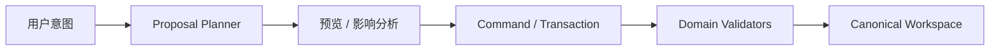

# AI 助手边界

Prodivix 将 AI 视为语义化作者环境的参与者，而非绕开项目模型的第二套编辑器。

## AI 可以做什么

AI 可以基于当前 Workspace revision、可见 scope、语义引用和诊断生成：

- 修改意图与变更 proposal
- 受控代码 patch
- 组件抽取或引用调整建议
- Issues 的解释与修复建议
- 导出、依赖和影响分析建议

这些能力会随产品阶段逐步开放；入口的出现并不意味着该功能已具备自主执行能力或生产安全保证。

## AI 不可以绕过什么

AI 不得直接覆盖 Canonical Workspace VFS，也不得将源码或领域状态持久化到私有聊天状态中。可写的 proposal 必须转换为可逆 Command 或原子 Transaction，经过领域校验、History、Durable Outbox 和 Atomic Commit。

```mermaid
flowchart LR
  Prompt["用户意图"] --> Planner["Proposal Planner"]
  Planner --> Review["预览 / 影响分析"]
  Review --> Command["Command / Transaction"]
  Command --> Validate["Domain Validators"]
  Validate --> Workspace["Canonical Workspace"]
```

## 上下文与秘密

项目中的符号虽然全局可寻址，但并不等于对 AI 全部可见。Scope、capability、权限和敏感数据边界仍然生效。未来 Data/API 与执行能力通过 `SecretRef` 引用秘密；密钥本体不应出现在 PIR、代码 proposal、诊断 payload 或可导出的 Workspace 文档中。

## 当前状态

当前作者环境已为 AI 提供了所需的基础设施：稳定语义地址、引用图、Code Artifact、诊断目标和可逆写入链路。真实 Runner、数据源、权限策略、审计和可验证的自动执行尚未形成完整的产品能力。

架构细节见[Semantic Authoring](/concepts/semantic-authoring)和[Change 与 Sync](/concepts/change-and-sync)。
