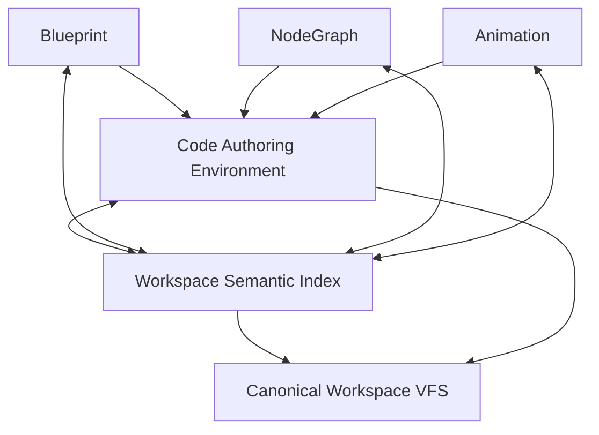

# 认识 Prodivix

Prodivix 是一个运行在浏览器中的语义化前端作者环境。它把视觉编辑、真实代码、项目资源、诊断和生产导出放在同一个 Canonical Workspace 上，让设计意图与工程事实保持可追踪的一致性。

它不是把页面压进私有 JSON 的传统页面搭建器，也不是用视觉表面遮住代码的“无代码黑盒”。视觉节点、组件契约、代码符号、路由、动画、节点图和资源都是可寻址、可诊断、可导出的项目事实。

## 三编辑器与一个共享代码环境

Prodivix 的视觉作者表面由三个编辑器组成：

- **Blueprint**：页面、布局、组件实例和 Collection。
- **NodeGraph**：可执行的数据流与行为图。
- **Animation**：时间轴、关键帧、滤镜和动画函数。

三个编辑器通过 Code Slot 使用同一个 Code Authoring Environment。TypeScript、JavaScript、CSS、SCSS、GLSL 和 WGSL 的 definition、references、completion、diagnostics、hover 与 rename 都绑定到同一份 Workspace revision，而不是由每个编辑器各维护一套源码。

## Workspace 才是作者态真相

一个项目不是一个巨型 PIR 文件。Workspace VFS 同时容纳：

- `workspace.json` 与 `route-manifest.json`
- page、layout、component 等 PIR UI 文档
- NodeGraph 与 Animation 文档
- TypeScript、CSS、Shader 和 Adapter 等代码文档
- Design Token、Asset、依赖与配置

各领域拥有自己的持久化契约；Workspace 负责组合、校验、事务、历史与同步。需要渲染、索引或导出时，再从这些文档构建可丢弃的派生投影。

## 当前能力边界

已经可用的核心链路包括：PIR-current、跨领域语义索引、组件契约与 Collection、视觉/代码受控双向编辑、统一 Issues、可逆 History、Durable Outbox、Atomic Commit，以及 React/Vite 独立导出验证。

ExecutionProvider、浏览器与远程 Runner、Data/API IR、SecretRef、完整项目开发服务器体验、Test、Deployment、多框架生产 target、团队协作和生产 SLA 尚未交付。

## 推荐阅读顺序

1. [本地启动](/guide/getting-started)
2. [产品导览](/guide/product-tour)
3. [创建第一个项目](/tutorials/first-project)
4. [Canonical Workspace VFS](/concepts/workspace-vfs)
5. [当前产品状态](/roadmap/current-status)

如果你要参与内核开发，直接从[架构与 Package Owner](/developer/architecture)开始。
