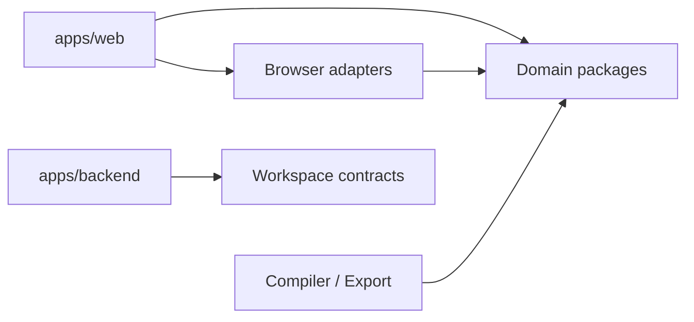

# 项目结构速览

Prodivix 使用 pnpm workspace 与 Turborepo。应用负责组合和交互表面，稳定领域能力归属于独立 package。

```text
prodivix/
├─ apps/
│  ├─ web/                 # React 编辑器与浏览器 composition root
│  ├─ backend/             # Go 后端
│  └─ docs/                # VitePress 文档站
├─ packages/               # 可复用领域、运行时、编译器与 UI package
├─ specs/                  # 决策、协议、roadmap 与证据
├─ scripts/                # Gate、生成器与边界检查
├─ tests/                  # 跨应用测试入口
└─ deploy/                 # 部署相关配置
```

## 关键边界

- `apps/web` 只拥有 React 编辑器表面、浏览器 adapter 与组合根。
- Workspace、PIR、Router、NodeGraph、Animation、Runtime、Renderer、Sync、Authoring 与 Compiler 的稳定逻辑必须位于对应 package。
- `packages/tokens` 拥有项目 Design Token 与 resolver 语义；`packages/themes` 只负责 Prodivix 自身界面主题。
- `specs/roadmap/global-phases.md` 是全局阶段唯一来源。
- `specs/decisions/` 记录稳定架构契约，产品文档不复制完整协议正文。

## Package 依赖方向

领域 package 应保持 transport-neutral 和 DOM-free；浏览器、React 或后端适配位于边界层。Web 可以组合 package，package 不应反向导入 Web 内部实现。



完整 owner 表、修改落点和依赖规则见[架构与 Package Owner](/developer/architecture)。
