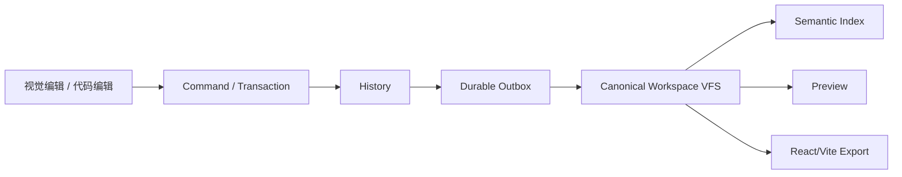

## 当前能力边界

Prodivix 已经具备语义化视觉/代码混合作者闭环，包括 PIR-current、组件复用、受控源码往返、统一诊断、可逆 History、持久化写入链路和 React/Vite 导出验证。

::: warning Alpha 边界
Prodivix 尚未承诺生产稳定性。Test、Deployment、完整 Data/API lifecycle、多框架 target、远程执行与团队协作尚未交付。文档会明确区分“可用能力”和“尚未交付能力”。
:::

## 从哪里开始

| 你的目标                     | 推荐入口                                                  |
| ---------------------------- | --------------------------------------------------------- |
| 运行仓库并创建项目           | [本地启动](/guide/getting-started)                        |
| 快速认识编辑器               | [产品导览](/guide/product-tour)                           |
| 完成一个端到端作品           | [创建第一个项目](/tutorials/first-project)                |
| 抽取和复用组件               | [组件与 Collection 复用](/tutorials/component-collection) |
| 在视觉与代码之间往返         | [视觉与代码双向编辑](/tutorials/visual-code-round-trip)   |
| 理解为什么不会出现第二真相源 | [Canonical Workspace VFS](/concepts/workspace-vfs)        |
| 参与开发                     | [开发环境](/developer/setup)                              |

## 一条完整作者链路

视觉表面、代码编辑器、Issues 和 AI proposal 都必须复用这条链路；没有任何入口可以直接覆盖另一个编辑器的私有状态。
