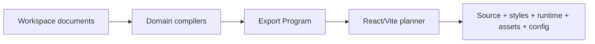

# 导出 React/Vite 项目

React/Vite 是当前 Golden 验证的生产 target。本教程说明导出前检查、导出内容和独立验证边界。

## 1. 处理阻断诊断

先打开 Issues，处理会阻断编译或导出的 Workspace、PIR、Route、Code、Asset 与依赖错误。导出不会用空占位悄悄替代不可解析引用。

## 2. 打开 Export

进入项目的 Export 表面，选择 React/Vite target。检查导出计划中的：

- 页面、布局与组件模块
- 路由拓扑和 imports
- standalone CSS 与 mounted styles
- NodeGraph/Animation 所需运行时
- assets、dependencies 与 config
- SourceTrace 和诊断映射

## 3. 生成项目

Compiler 先把各领域文档编译为统一 Export Program，再由 React/Vite preset 规划文件。这样目标框架只消费稳定中间语义，不会读取 Web 编辑器内部 state。



## 4. 在导出目录独立验证

导出结果必须能脱离 monorepo 安装和构建。使用生成项目声明的包管理器运行 install、typecheck、test 与 build；不要依赖 Prodivix 根目录的 workspace linking 来掩盖缺失依赖。

仓库维护者可运行 Golden Gate：

```bash
pnpm verify:g1:standalone
pnpm verify:g1:browser
```

`standalone` 验证独立 install/typecheck/test/build；`browser` 验证真实浏览器中的 React/Vite、WebGL2 与可用环境下的 WebGPU 路径。

## 当前限制

- React/Vite 是当前唯一完成 Golden Gate 的生产 target。
- Test 与 Deployment 产品表面尚未完成。
- Data/API runtime、SecretRef 和真实 Runner 尚未交付。
- 其他框架 target 必须通过自己的 parity 与独立构建 Gate 后才会标记为可用。

架构说明见[Preview 与 Export](/concepts/preview-and-export)和[测试与产品 Gate](/developer/testing-and-gates)。
