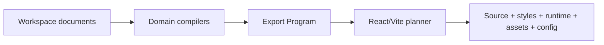

# 导出 React/Vite 项目

React/Vite 是当前通过 Golden 验证的生产 target。本教程说明导出前的检查事项、导出内容和独立验证的边界。

## 1. 处理阻断诊断

先打开 Issues，处理会阻断编译或导出的 Workspace、PIR、Route、Code、Asset 与依赖错误。导出不会以空占位符静默替代不可解析的引用。

## 2. 打开 Export

进入项目的 Export 表面，选择 React/Vite target。检查导出计划中的：

- 页面、布局与组件模块
- 路由拓扑和 imports
- standalone CSS 与 mounted styles
- NodeGraph/Animation 所需运行时
- assets、dependencies 与 config
- SourceTrace 和诊断映射

## 3. 生成项目

Compiler 先将各领域文档编译为统一的 Export Program，再由 React/Vite preset 规划文件结构。这样目标框架只需消费稳定的中间语义，无需读取 Web 编辑器的内部 state。


```mermaid
flowchart LR
  VFS["Workspace documents"] --> Domain["Domain compilers"]
  Domain --> Program["Export Program"]
  Program --> Planner["React/Vite planner"]
  Planner --> Bundle["Source + styles + runtime + assets + config"]
```

## 4. 在导出目录独立验证

导出结果必须能脱离 monorepo 独立完成安装和构建。请使用生成项目所声明的包管理器运行 install、typecheck、test 与 build，不要依赖 Prodivix 根目录的 workspace linking 来掩盖缺失的依赖。

仓库维护者可运行 Golden Gate：

```bash
pnpm verify:g1:standalone
pnpm verify:g1:browser
```

`standalone` 验证独立 install/typecheck/test/build；`browser` 验证真实浏览器中的 React/Vite、WebGL2 与可用环境下的 WebGPU 路径。

## 当前限制

- React/Vite 是当前唯一完成 Golden Gate 的生产 target。
- Workspace Test 页面已可通过独立的 Browser/Remote Test provider 运行当前 React/Vite snapshot，并在共享 Session 中展示 canonical test report。不过两者均为 mock-only，不等同于 G3 VerificationEvidence。
- Browser Project Runner 与 Remote provider 已可运行当前 snapshot。Data runtime 支持跨协议 mock、public static client 的有界 finite live，以及共用 execution authority 的 server/edge HTTP/GraphQL/AsyncAPI finite gateway；public GraphQL/AsyncAPI stream 采用显式 pull bridge。Workspace Test 不会执行 live Data。
- Vue/Vite 已通过 current PIR/Route/Auth/Server/Asset compiler、产品 target selector、独立构建与 authenticated Catalog CRUD + PNG Chrome Gate；但真实 Remote authenticated live journey、layout/outlet 和完整 Asset delivery/sanitize matrix 仍待关闭。其他框架 target 也必须通过各自的 parity 与独立构建 Gate 后，才会被标记为可用。
- Secret resolution 仅在授权的 Remote effect 边界内生效；client/static stream、Secret 长连接、stream reconnect/resume、更多 transport 与完整的部署产品面仍处于 fail closed 状态。

架构说明见[Preview 与 Export](/concepts/preview-and-export)和[测试与产品 Gate](/developer/testing-and-gates)。
