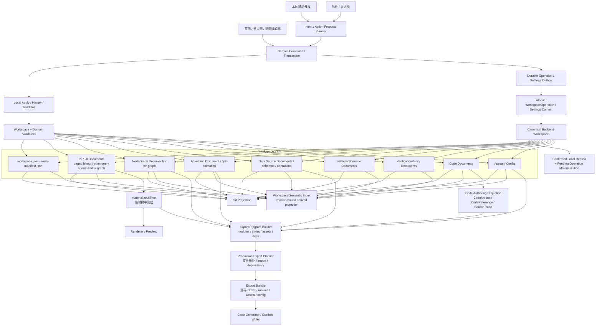
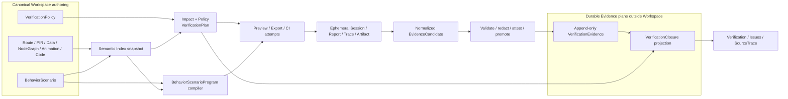

# Prodivix architecture overview

Prodivix 采用 Canonical Workspace VFS、领域 owner、revision-bound derived projection 与可逆写入链。本文只描述稳定架构，不记录当前里程碑状态；状态见 [`specs/roadmap/current-status.md`](../../specs/roadmap/current-status.md)。

## 产品与编译全景

```mermaid
flowchart TD
    subgraph VFS ["Workspace VFS"]
        direction TB
        WorkspaceCore["workspace.json / route-manifest.json"]
        PIR(("PIR UI Documents<br/>page / layout / component<br/>normalized ui.graph"))
        NodeGraphDocs["NodeGraph Documents<br/>pir-graph"]
        AnimationDocs["Animation Documents<br/>pir-animation"]
        DataSourceDocs["Data Source Documents<br/>schemas / operations / policies"]
        BehaviorDocs["BehaviorScenario Documents<br/>semantic steps / fixtures / controls"]
        VerificationPolicyDocs["VerificationPolicy Documents<br/>rules / matrix / budgets / exemptions"]
        CodeDocuments["Code Documents<br/>TS / CSS / Shader / Adapter"]
        VFSAssets["Assets / Config"]
    end

    subgraph Editors ["作者环境与验证"]
        direction TB
        TestBox["测试"] --> VisualTest["视觉回归测试等"] & UnitTest["单元测试等"]
        Blueprint["蓝图编辑器"]
        NodeGraph["节点图编辑器"]
        AnimEditor["动画编辑器"] --- AnimDetail["关键帧 / CSS Filter / SVG Filter"]
        ScenarioEditor["Scenario 编辑器"]
        VerificationView["Verification<br/>Impact / Plan / Evidence / Closure"]
        VisualTest -.-> Blueprint
        UnitTest -.-> NodeGraph
    end

    subgraph Authoring ["共享代码作者环境"]
        direction TB
        CodeEnv["Code Authoring Environment<br/>三编辑器共享代码作者态底座"]
        CodeWorkspace["Code Workspace / CodeArtifact"]
        IntelliSense["IntelliSense / Language Service"]
        CodeSlots["Code Slots<br/>handler / executor / adapter / mounted CSS"]
        CodeAssets["GLSL / WGSL / TS / CSS / Adapter"]
        CodeEnv --> CodeWorkspace & IntelliSense & CodeSlots & CodeAssets
    end

    SemanticIndex["Workspace Semantic Index<br/>WorkspaceSymbol / Scope / Reference / Resolution"]
    Blueprint -->|"event / mounted CSS / adapter slot"| CodeEnv
    NodeGraph -->|"executor / transform slot"| CodeEnv
    AnimEditor -->|"easing / shader / timeline script slot"| CodeEnv
    Blueprint & NodeGraph & AnimEditor -->|"domain contribution / query"| SemanticIndex
    ScenarioEditor -->|"target / reference / impact query"| SemanticIndex
    CodeEnv <-->|"Code Semantic Provider / query"| SemanticIndex
    CodeEnv -->|"edit / diagnostics"| CodeDocuments
    CodeEnv -->|"CodeReference / diagnostics"| PIR & NodeGraphDocs & AnimationDocs
    WorkspaceCore & PIR & NodeGraphDocs & AnimationDocs & DataSourceDocs & BehaviorDocs & VerificationPolicyDocs & CodeDocuments & VFSAssets --> SemanticIndex
    Blueprint -->|"ui"| PIR
    NodeGraph -->|"node graph document"| NodeGraphDocs
    AnimEditor -->|"animation document"| AnimationDocs
    ScenarioEditor -->|"behavior-scenario document"| BehaviorDocs
    VerificationView -->|"verification-policy document"| VerificationPolicyDocs

    subgraph Resources ["资源与依赖"]
        ESM["esm.sh"] --> ExtLib["外部库"]
        BuiltIn["内置组件"]
        HTML["HTML 原生"]
        ExtLib & BuiltIn & HTML --> ProjectScope
        subgraph ProjectScope ["项目"]
            Router["路由"]
            Component["组件"]
        end
    end
    Router -->|"route manifest"| WorkspaceCore
    Component -->|"component PIR"| PIR
    Resources -->|"assets / dependencies"| VFSAssets
    ESM -.-> AnimEditor

    LLM["LLM 辅助开发"] -->|"code context / patch proposal"| CodeEnv
    LLM -->|"intent / proposal"| Planner["Intent / Action Proposal Planner"]
    Planner --> CommandLayer["Domain Command / Transaction"]
    Blueprint & NodeGraph & AnimEditor & ScenarioEditor & VerificationView --> CommandLayer
    CommandLayer -->|"validated local apply + History"| WorkspaceCore & PIR & NodeGraphDocs & AnimationDocs & DataSourceDocs & BehaviorDocs & VerificationPolicyDocs & CodeDocuments & VFSAssets
    CommandLayer --> DurableChange["Durable Operation / Settings Outbox"] --> AtomicCommit["Atomic WorkspaceOperation / Settings Commit"]

    subgraph BackendSys ["后端与社区"]
        Backend["后端"] --> Community["社区系统"] --> OtherPlatform["其他平台上的社区"]
    end
    AtomicCommit --> Backend
    WorkspaceCore & PIR & NodeGraphDocs & AnimationDocs & DataSourceDocs & BehaviorDocs & VerificationPolicyDocs & CodeDocuments & VFSAssets <--> Backend

    subgraph VersionControl ["版本控制"]
        Git["Git"] <--> GitPlat["GitHub / Gitee / GitLab"]
        License["依赖项 LICENSE 处理"] --> Git
    end
    WorkspaceCore & PIR & NodeGraphDocs & AnimationDocs & DataSourceDocs & BehaviorDocs & VerificationPolicyDocs & CodeDocuments & VFSAssets -->|"VFS 投影"| Git

    subgraph Compilation ["编译器与输出"]
        DomainCompilers["Domain Compilers<br/>Blueprint / NodeGraph / Animation / CodeArtifact"]
        ExportProgram["Export Program IR<br/>modules / styles / assets / deps / source trace"]
        ExportPlanner["Production Export Planner<br/>topology / imports / dependencies / assets"]
        ExportBundle["Export Bundle<br/>source / styles / runtime / assets / config"]
        TargetPresets["Target Presets<br/>React Vite / Vue / Svelte / Web Components 等"]
        Frameworks["原生 / Web Components / React / Vue / Angular<br/>Qwik / Svelte / Solid / Lit / Astro"]
        Build["构建"] --> Deploy["部署"]
        Targets["Nginx 配置 / Cloudflare 等 / 服务器 / CDN"]
        Hosting["GitHub Pages / Vercel / Netlify"]
        Perf["性能监控"]
        DomainCompilers --> ExportProgram --> ExportPlanner --> ExportBundle
        TargetPresets --> ExportPlanner
        ExportBundle --> Frameworks --> Build
        Deploy --> Targets & Hosting
        Targets --> Perf
    end
    WorkspaceCore & PIR & NodeGraphDocs & AnimationDocs & DataSourceDocs & CodeDocuments & VFSAssets --> DomainCompilers
    ExportBundle -->|"生成源码 / 配置 / 资源"| Git
    Docs["文档"]
    Tutorials["教程"]
```

## Workspace VFS 读写链路

Intent 只作为本地或 AI planner 输入；planner 把它转换为可逆 Command 或原子 Transaction。Patch 是 Command 内部可逆、可校验的操作。生产作者态远端写入形成 exact `WorkspaceOperation`，先进入 Durable Outbox，再进入强幂等 Atomic Commit；Settings 使用独立但同样 durable 的写入链。

## G3 Behavior 与 Verification 链路

Scenario 与 Policy 是 Workspace 作者态；Impact、Plan、Program 和 Closure 是可重建 projection；Session/Report/trace 是
可丢弃运行态；只有经过 identity、artifact、redaction、provenance 与 attestation 验证的 candidate 才能进入独立的
append-only Evidence plane。Evidence 不随 Workspace undo 删除，baseline 更新仍通过 Workspace Transaction。

## 不变量与子系统文档

- Canonical Workspace VFS 是唯一作者态真相；PIR、Route、NodeGraph、Animation、Data、BehaviorScenario、VerificationPolicy、Code、Token、Asset 与 Config 由各自 owner 管理。PIR 不是整个项目的单一巨型 JSON。
- Renderer、Semantic Index、Code Authoring、Execution Snapshot、Git 与 Export 都是 revision-bound projection，不得成为第二作者态。
- Code-owned 能力通过 [Code Authoring Environment ADR](../../specs/decisions/28.code-authoring-environment.md)；跨领域符号与引用通过 [Workspace Semantic Index ADR](../../specs/decisions/25.authoring-symbol-environment.md)。
- Execution/Data/Auth 的长篇 contract 分别见 [Execution](../../specs/implementation/g2-execution-provider-remote-runner.md)、[Data](../../specs/implementation/g2-data-operation-environment-runtime.md) 与 [Auth/Server](../../specs/implementation/g2-auth-server-runtime.md)。
- G3 Behavior/Verification contract 见 [总实施计划](../../specs/implementation/g3-behavior-verification-closure.md)、[ADR 56-63](../../specs/decisions/README.md) 与 [milestones](../../specs/roadmap/g3-behavior-verification-milestones.md)。
- package 与应用 owner 见 [`package-ownership.md`](./package-ownership.md)。
