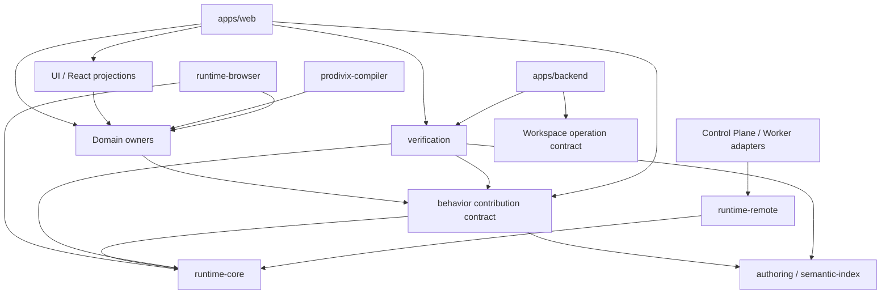

# Package ownership

Prodivix 采用“Canonical documents + domain owners + revision-bound projections”。应用组合能力，稳定 contract 归对应 package；当前进度不在本文维护，见 [`specs/roadmap/current-status.md`](../../specs/roadmap/current-status.md)。

## 核心 owner

| Package / App                       | 稳定职责与禁止边界                                                                                                                                                                                                                                                                                                                                                                                                                                                                 |
| ----------------------------------- | ---------------------------------------------------------------------------------------------------------------------------------------------------------------------------------------------------------------------------------------------------------------------------------------------------------------------------------------------------------------------------------------------------------------------------------------------------------------------------------- |
| `@prodivix/assets`                  | transport-neutral binary blob reference、SHA-256 digest/size/media verification、materialization/transformer/scanner/derived-cache port、delivery classification 与 deterministic sanitizer pipeline；不拥有 Workspace、HTTP、PostgreSQL、Browser、signed URL 或 provider locator。                                                                                                                                                                                                |
| `@prodivix/workspace`               | Canonical Workspace model、codec、validator、Command、Transaction、History、typed document composition 与 semantic snapshot composition。                                                                                                                                                                                                                                                                                                                                          |
| `@prodivix/workspace-sync`          | revision、semantic conflict、Atomic Commit plan、Durable Outbox 与 local replica。                                                                                                                                                                                                                                                                                                                                                                                                 |
| `@prodivix/pir`                     | PIR-current normalize、graph mutation、Component/Collection contract、领域校验与 semantic contribution。                                                                                                                                                                                                                                                                                                                                                                           |
| `@prodivix/router`                  | RouteManifest contract、codec、match/navigation 语义与 semantic contribution。                                                                                                                                                                                                                                                                                                                                                                                                     |
| `@prodivix/nodegraph`               | DOM-free NodeGraph contract、codec、executor、deterministic trace、same-context ExecutionProvider 与 semantic contribution。                                                                                                                                                                                                                                                                                                                                                       |
| `@prodivix/animation`               | Animation contract、codec、authoring factory、deterministic evaluator、Runtime Port、same-context ExecutionProvider 与 semantic contribution。                                                                                                                                                                                                                                                                                                                                     |
| `@prodivix/behavior`                | G3 BehaviorScenario current model、typed trigger/action/observation、semantic target、recorder draft、BehaviorScenarioProgram compiler 与 replay semantic；不拥有 Workspace persistence、领域 effect、browser driver、VerificationPlan 或 Evidence。                                                                                                                                                                                                                               |
| `@prodivix/verification`            | G3 ImpactSet、VerificationPolicy/Plan、adapter SPI、Evidence manifest/provenance/retention 与 Closure evaluator；不拥有 Workspace transport、工具私有 payload、runner、CI provider API 或 artifact provider locator。                                                                                                                                                                                                                                                              |
| `@prodivix/data`                    | DataSourceDocument、DataOperationReference、schema/operation/policy/lifecycle current contract、wire codec、semantic contribution、protocol-neutral invocation、typed input/dispatch、adapter registry、execute kernel、bounded cache、idempotency 与 optimistic projection。                                                                                                                                                                                                      |
| `@prodivix/data-http`               | HTTP Data adapter、resolved public configuration/JSON mapping、opaque idempotency header、授权 Secret transport callback 与注入式 network transport；不拥有 Browser fetch、environment/Secret resolver、Workspace 或第二套 lifecycle。                                                                                                                                                                                                                                             |
| `@prodivix/data-mock`               | mock-only emulation、fixture reference/store、exact-input/fallback、delay/error/page、session-namespaced stateful CRUD、reset/dispose；不拥有 Canonical Data document、live network、Secret 或第二套 lifecycle。                                                                                                                                                                                                                                                                   |
| `@prodivix/runtime-core`            | transport-neutral runtime port、executor registry、ExecutionProvider/Job/Session、Preview/Build/Test contract、Structured Console、Terminal controller/cursor/lease/checkpoint 与 DOM-free bounded emulator/copy contract、Runtime FS diff、Executable runtime asset projection，以及 environment/Secret reference、resolution lease 与 permission ports。                                                                                                                         |
| `@prodivix/server-runtime`          | transport-neutral Auth principal/session reference、permission decision、Server Function profile/invocation/outcome、reference-only Secret policy、callback-bound environment lease、strict bridge/metadata-only trace、authorization/schema kernel 与 adapter registry；不拥有 Workspace、React、Remote transport、Execution Session 或产品 credential。                                                                                                                          |
| `@prodivix/runtime-remote`          | versioned Remote envelope/codec、snapshot wire、client、artifact resolver、Remote Terminal wire/client/replicated broker/state-store/cipher ports、retryable cipher-unavailable boundary，以及transport-neutral authorization/quota/router/repository/snapshot store/queue lease、regional checkpoint/traffic authority、batch operator、fence/attestation port与strict evidence codec；不拥有deployable HTTP/database/crypto key、基础设施promotion/fencing实现或worker sandbox。 |
| `@prodivix/runtime-remote-postgres` | Control Plane PostgreSQL snapshot/repository/queue lease adapter、opaque Terminal state revision CAS、content-addressed artifact blob/grant、event/artifact budget/retention、transactional idempotency/quota/claim/fencing，以及repeatable-read regional probe、shared/exclusive advisory traffic epoch、cutover evidence与one-shot operator grant replay store；不拥有protocol/plaintext/proof private key、HTTP service、跨区row-copy或worker sandbox。                         |
| `@prodivix/runtime-vitest`          | bounded Vitest private JSON decoder 与 transport-neutral `ExecutionTestReport` adapter；不拥有 provider、Job、Workspace 或 durable Remote contract。                                                                                                                                                                                                                                                                                                                               |
| `@prodivix/runtime-browser`         | Browser Runtime Host、独立 Preview/Test provider、filesystem/dependency/Vite/HMR、client-safe fetch/Network trace adapter、`runtime-vitest` 消费边界与 Animation RAF/effect projection。                                                                                                                                                                                                                                                                                           |
| `@prodivix/pir-react-renderer`      | PIR 的 React projection；不拥有作者态真相。                                                                                                                                                                                                                                                                                                                                                                                                                                        |
| `@prodivix/authoring`               | Workspace Semantic Index contract/provider composition/query、CodeArtifact/Reference/Slot、CodeAuthoringRequest/Session 基础，以及跨 PIR/Data 使用的 durable typed input-binding shape。                                                                                                                                                                                                                                                                                           |
| `@prodivix/code-language`           | revision-bound language adapter、Code Language/Shader Compile Capability provider 与 code semantic contribution；当前覆盖 TS/JS/CSS/SCSS/GLSL/WGSL。                                                                                                                                                                                                                                                                                                                               |
| `@prodivix/tokens`                  | DTCG Format/Resolver profile、codec、current Token/Resolver model、group/alias/type/theme/variant resolution plan 与 semantic contribution。                                                                                                                                                                                                                                                                                                                                       |
| `@prodivix/diagnostics`             | Issues contract、provider snapshot lifecycle、去重、presentation 与 query。                                                                                                                                                                                                                                                                                                                                                                                                        |
| `@prodivix/prodivix-compiler`       | Domain compiler、ExportProgram、Production Export Planner、Executable Snapshot projection，以及 controlled React/JSX/CSS round-trip planner。                                                                                                                                                                                                                                                                                                                                      |
| `@prodivix/golden-conformance`      | Living Golden App 与跨 target 产品 Gate conformance；不成为领域 contract owner。                                                                                                                                                                                                                                                                                                                                                                                                   |
| `apps/web`                          | React 编辑器表面、browser adapter 与 composition root；Terminal 只渲染 Core emulator projection 并提供有界 keyboard/paste adapter，不解析私有 PTY payload；不得重新拥有 transport-neutral Runtime、Router、NodeGraph、Animation、Behavior、Verification、PIR Renderer、Workspace Sync 或 Authoring Core。                                                                                                                                                                          |
| `apps/backend`                      | canonical persistence、Atomic Commit、Auth/environment/permission gateway 与 service boundary；G3 组合 Evidence repository、artifact promotion、attestation/retention service，但不拥有 Behavior/Verification domain contract；Project 只保存项目元数据和显式 publication projection，不保存 PIR/Workspace 作者态镜像。                                                                                                                                                            |
| `apps/remote-runner-control-plane`  | Remote envelope HTTP service、client/worker分离认证、PostgreSQL composition、claim/lease/transition/snapshot/event ingestion、Terminal PRT1/PRT2与AWS KMS/MRK adapter、replicated mailbox/token API，以及独立非HTTP regional recovery one-shot job与role-separated Ed25519 proof verifier；不得执行用户代码、持久化stdin/token/proof明文、持有issuer private key/长期managed key material或Workspace作者态。                                                                       |
| `apps/remote-runner-worker`         | claim/heartbeat/cancellation Worker Agent、lease-fenced snapshot/event/Terminal command、rootless Podman sandbox/inner PTY、process supervisor、resource/timeout/output/redaction/cleanup；filesystem adapter 只是非生产参考，不是安全边界。                                                                                                                                                                                                                                       |
| `apps/remote-preview-host`          | 独立 Preview static origin；strict Preview Bundle decoder、hash-only 短期 capability 子域、多文件产物、deny-by-default CSP/Permissions Policy/no-cache/session origin isolation；不持有 Control Plane credential。                                                                                                                                                                                                                                                                 |
| `apps/asset-delivery-host`          | 独立 Binary Asset capability origin；组合 deterministic transform、scanner chain、ClamAV readiness/freshness、quarantine、derived/session cache 与安全响应头；不持有 Workspace、Backend user、database/object-store credential。                                                                                                                                                                                                                                                   |

## 稳定依赖方向

领域层不得依赖 React、DOM、具体 fetch transport 或编辑器内部 store。跨领域语义通过 Semantic Contribution/Query 协作，不互相扫描内部结构。

## Ownership 变更规则

1. 新稳定 contract 必须先确定 owner；adapter 与 composition root 不能以便利为由复制 contract。
2. Canonical Workspace document 仍由领域 owner 定义；Semantic Index、renderer、runtime、Git 与 compiler 只拥有 projection。
3. package owner 发生变更时，应同时更新相应 ADR、import boundary Gate 与本文件；不要在 `AGENTS.md` 追加临时表格。
