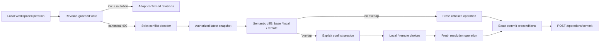

# Workspace 同步与 Revision Conflict 恢复

## 状态

- Accepted
- 日期：2026-02-08
- 最近更新：2026-07-13
- 实现状态：Partial（生产写入 Hard Cut、Operation/Settings Durable Outbox、正式 local replica 与离线恢复已落地；多端实时同步尚未完成）
- 关联：
  - `specs/decisions/06.command-history.md`
  - `specs/decisions/11.revision-partitioning.md`
  - `specs/decisions/35.canonical-workspace-hard-cut.md`
  - `specs/decisions/36.atomic-workspace-operation-commit.md`
  - `specs/implementation/workspace-revision-conflict-recovery.md`
  - `specs/api/workspace-sync.openapi.yaml`

## 决策背景

Canonical Workspace Hard Cut 已移除整份 Project PIR fallback。WorkspaceSnapshot、RouteManifest、WorkspaceDocument 与它们各自的 revision 是唯一作者态同步基线。

仅靠“请求失败后重载”不能满足以下要求：

1. 不相关的本地与远端修改应自动合并。
2. 同一语义实体上的竞争修改必须显式交给用户选择。
3. 冲突恢复不能重放基于旧 revision 生成的 reverse ops。
4. 同一套合并语义需要服务于文档保存、未来 outbox、Git revision review 与多端同步，而不能耦合某个 HTTP 客户端或 React 组件。

## 决策内容

Workspace 同步采用“分区 revision + canonical 409 + transport-neutral semantic diff3”的恢复模型：

1. 后端写入以 `expectedWorkspaceRev`、`expectedRouteRev` 或 `expectedContentRev` 执行 compare-and-set。
2. revision 过期时返回 canonical Backend ErrorEnvelope；冲突类型只有 `WORKSPACE_CONFLICT`、`ROUTE_CONFLICT` 与 `DOCUMENT_CONFLICT`。
3. 客户端严格解码 409 后，通过已授权的 `GET /api/workspaces/:id` 获取最新完整 WorkspaceSnapshot。409 本身只携带安全的 revision 摘要，不携带文档正文。
4. `@prodivix/workspace-sync` 以 `base`、`local`、`remote` 三份 canonical snapshot 进行语义 diff3；它不依赖 HTTP、Store 或 UI。
5. 无重叠修改自动 rebase；有重叠修改进入显式 conflict session。
6. 完成选择后，相对于最新 remote snapshot 生成一条全新的可逆 WorkspaceOperation，由 `planWorkspaceOperationCommit` 推导 exact expected vector，再交给 Atomic Commit transport 写回。不得直接重放旧 Operation、旧 reverse ops 或拆成多个请求。



## Canonical 409 契约

409 必须沿用统一 Backend ErrorEnvelope：

```json
{
  "error": {
    "code": "WKS-4003",
    "message": "Revision conflict.",
    "domain": "workspace",
    "retryable": true,
    "details": {
      "conflictType": "DOCUMENT_CONFLICT",
      "workspaceId": "ws_1",
      "expected": {
        "document": { "id": "doc_home", "contentRev": 7 }
      },
      "current": {
        "workspaceRev": 12,
        "routeRev": 4,
        "opSeq": 99,
        "document": {
          "id": "doc_home",
          "type": "pir-page",
          "path": "/pages/home.pir.json",
          "contentRev": 8,
          "metaRev": 2,
          "updatedAt": "2026-07-12T08:00:00Z"
        }
      }
    }
  }
}
```

稳定映射如下：

| 错误码     | `conflictType`       | 冲突分区                             |
| ---------- | -------------------- | ------------------------------------ |
| `WKS-4001` | `WORKSPACE_CONFLICT` | Workspace 结构 revision              |
| `WKS-4002` | `ROUTE_CONFLICT`     | Workspace + Route revision           |
| `WKS-4003` | `DOCUMENT_CONFLICT`  | 指定文档的 `contentRev` 或 `metaRev` |

`HYBRID_CONFLICT` 已 Hard Cut 移除，不属于 wire contract。一次失败只报告实际未通过 compare-and-set 的具体分区；客户端随后读取最新 snapshot，对所有作者态差异做统一语义分析。

`DOCUMENT_CONFLICT` 的 `expected.document` 必须包含 id，并至少包含 `contentRev` 或 `metaRev` 之一。Metadata-only conflict 仍使用 `WKS-4003`；`current.document` 属性在该 conflict 中必需，远端文档存在时返回安全 metadata，已删除时显式为 `null`。不引入第四种 conflict type。

安全不变量：

1. `details.current.document` 只允许是 `null` 或包含 id、type、path、contentRev、metaRev 与 updatedAt 的安全 metadata，不得包含 content。
2. Workspace 不存在与非 owner 访问都在 revision 检查前返回同样的 404，不泄露 revision 或文档元数据。
3. 客户端拒绝 revision details 与子对象中的未知字段、错误码与 conflict type 不匹配、Workspace ID 不匹配及不完整的分区详情。

## Transport-neutral Diff3

`@prodivix/workspace-sync` 负责以下稳定能力：

1. 捕获和比较 Workspace、Route、Document 与 opSeq revisions。
2. 对 Workspace tree、RouteManifest、文档 metadata/content 生成稳定语义 change set。
3. 按 stable entity id 比较 PIR/NodeGraph/Animation 集合；仅重排 stable-id 集合不形成作者态变化。
4. 对 code source 生成行级 text hunks，并执行三方文本合并。
5. 识别 `value`、`concurrent-add`、`delete-modify`、`structural` 与 `text` 冲突。
6. 将未解决冲突的 candidate 保持为 remote 值，禁止静默覆盖远端。
7. 通过显式 `local | remote` 选择维护可序列化 conflict session；所有冲突解决且最终 Workspace validation 通过后才产生 `resolvedSnapshot`。
8. 从最新 remote 到 resolved snapshot 重新生成 forward/reverse ops，并验证 Apply 结果确实等于 resolved snapshot。
9. `planWorkspaceOperationCommit` 从 Operation 写集推导 workspace/route/document content/meta exact expected vector；Web 不手写 revision preconditions。

Revision metadata 不是作者态内容。`contentRev`、`metaRev`、`updatedAt` 与 `opSeq` 的变化不会伪装成文档内容修改。

## Web 恢复链路

当前 Web 已接入：

1. Blueprint 与 CodeDocument 的文档写入在 409 后拉取最新 snapshot，并执行有上限的自动 rebase。
2. 无冲突时，客户端基于 remote snapshot 重建 document command 后重试；重复变更会进入 `already-applied`，不会再次写入。
3. 有冲突时，Store 保存 conflict session，Global Revision Conflict Surface 支持稍后继续、逐项选择和批量选择。
4. Code diff 展示 base/local/remote 行级 hunks。
5. NodeGraph diff 以只读画布展示节点、port、edge 与字段差异；删除为红色、添加为绿色、本地冲突为黄色、远端冲突为紫色。颜色同时由标签、图标、边框和线型补充，不以颜色作为唯一语义，也不把本地/远端冲突混成一个视觉状态。
6. 用户 review 期间继续产生的作者态修改会在写回前再次执行 diff3；发生新重叠时创建新的 session，不用旧 review 覆盖新编辑。
7. Conflict resolution 已统一提交 `POST /operations/commit`，覆盖 document、Workspace tree、RouteManifest 与 mixed Transaction；Web 不再依赖旧 `/batch`。
8. Workspace document 创建/删除使用 granular `/docsById/<document-id>` patch，整份 `/docsById` 替换已 Hard Cut。

## 当前未完成边界

以下能力不因 Revision Conflict UI 已存在而视为完成：

1. 多端实时订阅、presence 与按领域选择的 CRDT/typed transaction 协作。
2. Git revision 读取与完整的 Workspace/Route/Animation 专用 diff 产品面。
3. Replica retention、设备撤销、加密策略与团队级离线生命周期治理。

服务端的 strong idempotent replay 只定义重复 request 的结果，不自动提供客户端重试队列。客户端 Outbox 现在会在普通网络失败后持久复用 exact request；只有 canonical 409 进入 semantic recovery，并在确认未提交后生成 fresh rebased Operation。

## Durable Outbox 实现（2026-07-13）

1. `@prodivix/workspace-sync` 拥有 Outbox entry、exact request、causal head、lease、retry-wait、conflict、failed 与 ACK identity 状态机；该内核保持 ES2022、无 DOM。
2. Operation 在发送前连同 base snapshot 与 exact Atomic Commit request 写入 IndexedDB。网络失败、页面刷新或进程崩溃后继续复用同一 operation id 和 request，不生成第二条逻辑提交。
3. 同一 Workspace 只允许 causal head 获得发送 lease；过期 lease 可由新标签页接管，后续 Operation 不跨越 retry/conflict/failed head。
4. Retry 使用有上限的指数退避与 jitter；`online`、页面加载、retry deadline 和 Outbox 变更都会触发 drain。
5. 409 不按普通网络失败重试：继续进入现有 semantic diff3。自动 rebase 通过一次 IndexedDB 事务替换为 fresh Operation；显式 conflict session 持久化在原 entry 中，刷新后恢复 review。
6. ACK 必须同时匹配当前 lease 与 operation id。若响应丢失，过期 lease 会重发 exact request，由服务端 strong idempotent replay 收敛；若 `opSeq` 跨越未见提交，则先读取 canonical snapshot 再完成本地采用。
7. Blueprint、Route、NodeGraph、Animation、Code、Resource 与 Conflict resolution 已统一通过 Operation Outbox + Atomic Commit；旧 document PATCH、`POST /intents`、Project PIR 读写 API、lazy bootstrap fallback、post-commit project mirror 及对应 Handler/Store/Web API 已删除。社区 PIR 只由显式 publish 从 canonical Workspace 生成独立投影，不属于 authoring contract。
8. Settings 不属于作者态 WorkspaceOperation；它使用独立的 strong-idempotent Settings Commit 与 Settings Outbox。两类 IndexedDB queue 由全局 drain 按 `createdAt + id` 保持确定性因果顺序。
9. fresh project 与 `import-local-project` 复用同一原子创建边界：Project metadata 与初始 Workspace/Route/Settings/Documents 在一个数据库事务中提交，任一失败整体回滚；不再使用先建 Project、失败后补偿删除的崩溃窗口。

## Formal Local Replica 实现（2026-07-13）

1. `@prodivix/workspace-sync` 拥有 transport-neutral replica contract、canonical codec round-trip、snapshot/settings 独立 watermark、非回退 advance 与 pending Outbox materialization；Core 不依赖 IndexedDB、DOM、HTTP 或 React。
2. Web IndexedDB adapter 在与双 Outbox 相同的数据库中保存 server-confirmed WorkspaceSnapshot、settings、ProjectSummary、capabilities 和有限 ACK bridge ids。持久化记录使用显式 format version 严格解码，损坏记录 fail closed；只有完整远端读取能重建损坏副本。
3. 打开项目时，通过覆盖 replica 与双 Outbox store 的同一个 IndexedDB readonly transaction 取得一致视图；再以 confirmed replica 为 base，按因果顺序重放未确认 WorkspaceOperation、应用最新 pending Settings Commit，并恢复 conflict entry 的 local snapshot。Replica 不是第二个作者态真相源，而是“最近确认的 canonical base + durable pending requests”的可重建投影。
4. ACK 处理先推进 replica、记录 entry id，再删除 Outbox entry。崩溃发生在 replica 写入前时 entry 仍会重放；发生在 replica 写入后、Outbox 删除前时 ACK bridge id 会跳过残留 entry，避免重复本地应用。
5. 远端 snapshot 与 settings 使用独立 `opSeq` watermark，只允许前进；多标签页或迟到响应不能让已确认副本回退。Operation gap 与 Settings gap 都先读取最新 canonical Workspace，再完成 ACK 收敛。
6. 在线打开并行读取本地副本与远端权威状态；远端成功时先推进副本再覆盖 base，远端仅在 transport/retryable failure 时才回退到本地物化视图。401、403、404、422 等权威失败不会暴露缓存，离线打开仍要求有效认证上下文。
7. 该基线提供单设备跨刷新、崩溃与断网恢复，不宣称 multi-device sync、presence、comments、review 或通用 CRDT 已完成。

## 为什么现在不选 CRDT

1. 当前首先解决单用户、多标签页和轻协作下的可解释一致性。
2. 分区 revision + semantic diff3 已能避免大量无关冲突，并保留明确的服务端权威边界。
3. 未来可以在特定文档内容层接入 CRDT，而不推翻 Workspace/Route 分区、canonical snapshot 与 Operation 审计层。

## 验收标准

- [x] Workspace-only Hard Cut；同步链路不回退到整份 Project PIR 保存。
- [x] 三种冲突使用 canonical 409 且不返回文档正文。
- [x] transport-neutral semantic diff3、text merge、conflict session 与 fresh resolution operation。
- [x] Document mutation 的 bounded automatic rebase 与 explicit conflict recovery。
- [x] Code 与 NodeGraph revision diff 产品面。
- [x] Exact Operation Commit planner 与 tree/route/document/mixed Web transport。
- [x] 旧 `/batch` Web 依赖和整份 `/docsById` patch 已 Hard Cut。
- [x] 后端 Atomic WorkspaceOperation 单事务、强幂等 replay 与聚合 ACK。
- [x] transport-neutral Outbox 状态机、exact request、causal head、lease、retry/backoff 与 ACK identity。
- [x] IndexedDB 持久化、跨刷新/崩溃 lease recovery、online/deadline drain 与 durable conflict session。
- [x] Blueprint、Route、NodeGraph、Animation、Code、Resource 与 conflict resolution 统一通过 Outbox + Atomic Commit。
- [x] Settings 通过独立 strong-idempotent Commit + Durable Outbox，并与 Operation queue 做全局确定性 drain。
- [x] 旧 document PATCH、`POST /intents`、Handler/Store 分叉与 Web API 完成 Hard Cut。
- [x] 正式 local replica、独立 watermark、ACK-before-delete crash bridge 与离线 materialization。
