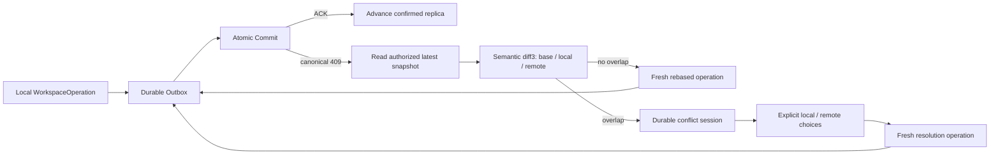

# Workspace Sync、Revision Conflict 与 Local Replica

## 状态

- DecisionStatus：Accepted
- 日期：2026-07-14
- ImplementationStatus：Semantic Recovery / Durable Outbox / Local Replica Implemented
- ProductGateStatus：G0 Passed / G5 Foundation
- Global Phase：G0、G5
- 关联：
  - `specs/decisions/06.command-history.md`
  - `specs/decisions/11.revision-partitioning.md`
  - `specs/decisions/35.canonical-workspace-hard-cut.md`
  - `specs/decisions/36.atomic-workspace-operation-commit.md`
  - `specs/api/workspace-sync.openapi.yaml`

## 决策摘要

Workspace 同步建立在 Canonical WorkspaceSnapshot、partitioned revisions、exact WorkspaceOperation request、semantic diff3、Durable Outbox 与正式 local replica 上。

无重叠修改自动 rebase；语义重叠形成可持久化 conflict session；显式 resolution 相对于最新 remote snapshot 生成新的可逆 WorkspaceOperation，并通过 Atomic Commit 写回。

## Revision conflict flow

## Canonical 409

Conflict 使用统一 Backend ErrorEnvelope 与三个 revision partition type：

| 错误码     | `conflictType`       | 分区                               |
| ---------- | -------------------- | ---------------------------------- |
| `WKS-4001` | `WORKSPACE_CONFLICT` | Workspace tree / metadata revision |
| `WKS-4002` | `ROUTE_CONFLICT`     | Workspace + Route revision         |
| `WKS-4003` | `DOCUMENT_CONFLICT`  | Document `contentRev` / `metaRev`  |

规则：

1. 409 返回安全 revision metadata、workspace id、document identity/type/path 与 updatedAt。
2. 完整 document content 通过 owner-authorized canonical snapshot read 获取。
3. Document delete/modify、metadata conflict 与 concurrent add 都使用 `WKS-4003` 的明确 current document state。
4. 多个 partition 同时过期时，服务端按稳定优先级返回一个具体分区；客户端对最新完整 snapshot 执行统一 semantic diff3。
5. Strict decoder 校验 error code、conflict type、workspace id、revision shape 与 unknown fields。

## Transport-neutral semantic diff3

`@prodivix/workspace-sync` 持有：

1. Workspace、Route、Document 与 opSeq revision capture/comparison。
2. Workspace tree、RouteManifest、document metadata/content 的稳定 semantic change set。
3. PIR、NodeGraph 与 Animation stable-id entity comparison。
4. Code source line hunks 与三方 text merge。
5. `value`、`concurrent-add`、`delete-modify`、`structural` 与 `text` conflict classification。
6. serializable conflict session 与显式 `local | remote` resolution。
7. latest remote -> resolved snapshot 的 fresh forward/reverse operation planning。
8. exact WorkspaceOperation commit vector planning。

Revision metadata 不构成作者态内容 change。`contentRev`、`metaRev`、`updatedAt` 与 `opSeq` 只描述 confirmed state。

## Revision conflict product surface

Web 提供全局 Revision Conflict Surface：

1. conflict session 可以稍后继续、逐项选择或批量选择。
2. Code diff 展示 base/local/remote 行级 hunks。
3. NodeGraph diff 以只读画布展示 node、port、edge 与 field changes。
4. NodeGraph diff 使用红色表示 delete、绿色表示 add、黄色表示 local conflict、紫色表示 remote conflict。
5. 颜色同时配合 label、icon、border 与 line style，保证语义不只依赖颜色。
6. Review 期间的新作者态修改会触发新的 semantic diff3；resolution 始终基于最新 canonical snapshot。
7. tree、route、document 与 mixed Transaction resolution 使用同一个 Atomic Commit path。

## Durable Outbox

Operation Outbox entry 持久化：

1. exact `WorkspaceOperationCommitRequest`、operation id 与 base snapshot。
2. causal head、lease owner/expiry、attempt、retry deadline 与 state。
3. conflict session、fresh replacement operation 与 ACK bridge identity。

同一 Workspace 的 causal head 获得发送 lease。Transport/retryable failure 使用 bounded exponential backoff + jitter；online、load、deadline 与 Outbox change 驱动 drain。Canonical 409 进入 semantic recovery。

ACK 同时匹配 lease 与 operation identity。Response gap 先读取最新 canonical snapshot；exact request retry 由服务端 strong idempotency 收敛。

Settings 使用独立 strong-idempotent Commit 与 Settings Outbox；全局 drain 按 `createdAt + id` 确定性协调两类 queue。

## Formal local replica

Local replica 保存：

1. server-confirmed canonical WorkspaceSnapshot 与 settings。
2. snapshot/settings 独立 watermark。
3. ProjectSummary、capabilities 与有限 ACK bridge identities。
4. explicit format version 与 strict codec。

打开项目时，在一个 IndexedDB readonly transaction 中读取 confirmed base 与双 Outbox，再按因果顺序 materialize pending WorkspaceOperations、pending Settings Commit 与 conflict local snapshot。

ACK 先推进 replica 并记录 bridge id，再删除 queue entry。snapshot/settings watermark 只前进；多标签页与迟到 response 通过 canonical refresh 收敛。

在线读取成功时先推进 replica再采用 remote state。Transport/retryable failure 可以使用本地 materialized view；认证、授权、not-found 与 schema diagnostics 保持权威边界。

## G5 扩展

G0 已提供单设备跨刷新、崩溃、断网与冲突恢复基线。G5 在同一 contract 上增加：

1. multi-device subscription 与 replica lifecycle。
2. presence、comments、review 与 team authorization。
3. text CRDT 与 PIR/NodeGraph/Animation typed transaction collaboration。
4. replica retention、encryption、device revoke 与 backup policy。
5. Git review、production feedback 与 Workspace revision linking。

## 长期不变量

1. Canonical WorkspaceSnapshot 是同步和恢复基线。
2. Durable Outbox 在发送前保存 exact request。
3. Atomic Commit 以 operation id 强幂等提交。
4. Conflict resolution 生成 fresh WorkspaceOperation。
5. Local replica 是 confirmed base + durable pending requests 的可重建投影。
6. Semantic diff3 与 conflict session 保持 transport-neutral。

## 验收标准

- [x] 三种 canonical conflict partitions 与 strict 409 decoder 已实现。
- [x] semantic diff3、text merge、conflict session 与 fresh resolution operation 已实现。
- [x] Code 与 NodeGraph diff 产品面已实现稳定语义与配色。
- [x] exact commit planner、Operation/Settings Durable Outbox 与 strong-idempotent Atomic Commit 已实现。
- [x] IndexedDB lease/retry/drain、durable conflict session 与 ACK bridge 已实现。
- [x] formal local replica、独立 watermark 与 pending materialization 已实现。
- [ ] multi-device、presence、review 与 team-level local-first closure 完成 G5 Gate。
