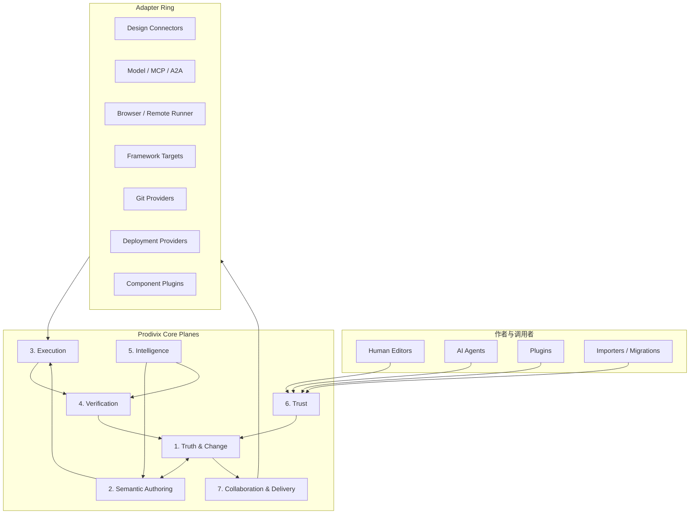
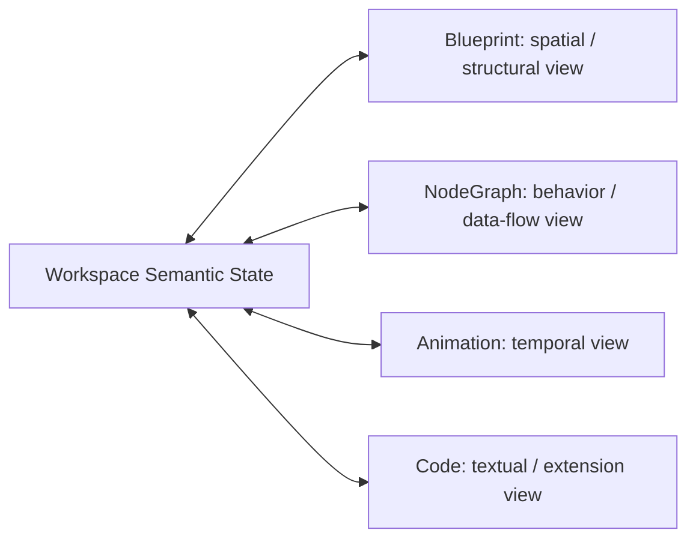
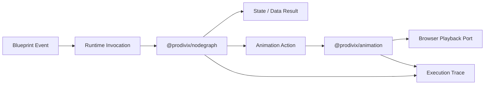
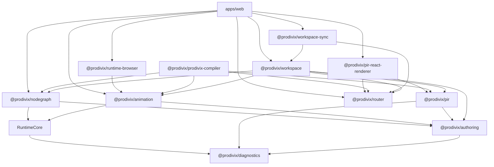

# Verified Semantic Authoring Architecture

## 状态

- DecisionStatus：Accepted
- 日期：2026-07-14
- ImplementationStatus：G1 Semantic Hybrid Authoring Implemented / G2+ Architecture In Progress
- ProductGateStatus：G0-G1 Passed / G2 Foundation
- Global Phase：G0-G6
- 关联：
  - `specs/roadmap/global-phases.md`
  - `specs/roadmap/g0-closure-evidence.md`
  - `specs/roadmap/g1-closure-evidence.md`
  - `specs/decisions/06.command-history.md`
  - `specs/decisions/07.workspace-sync.md`
  - `specs/decisions/22.llm-integration-architecture.md`
  - `specs/decisions/25.authoring-symbol-environment.md`
  - `specs/decisions/28.code-authoring-environment.md`
  - `specs/decisions/29.plugin-extension-points.md`
  - `specs/decisions/31.production-export-planner.md`
  - `specs/decisions/34.core-package-boundaries.md`
  - `specs/decisions/36.atomic-workspace-operation-commit.md`
  - `specs/decisions/38.blueprint-component-instance-and-collection.md`
  - `specs/decisions/56.behavior-scenario-and-cross-domain-action-contract.md`
  - `specs/decisions/57.verification-plan-impact-and-policy.md`
  - `specs/decisions/58.verification-evidence-provenance-and-retention.md`
  - `specs/decisions/59.deterministic-scenario-replay-and-runtime-controls.md`
  - `specs/decisions/60.nodegraph-typed-flow-and-behavior-debugging.md`
  - `specs/decisions/61.animation-route-composition-and-reduced-motion.md`
  - `specs/decisions/62.verification-adapter-matrix-and-cross-target-closure.md`
  - `specs/decisions/63.verification-product-surface-diagnostics-and-ci.md`

## 决策摘要

Prodivix 不再按“设计、开发、测试、构建、部署、社区”的瀑布阶段组织核心架构。产品统一采用持续验证作者闭环：

```text
Intent
  -> Semantic Model
  -> Human / Agent Authoring
  -> Execute
  -> Verify
  -> Review
  -> Deliver
  -> Observe
  -> Learn / Repair
```

系统按七个长期能力平面划分 owner：

1. Truth & Change
2. Semantic Authoring
3. Execution
4. Verification
5. Intelligence
6. Trust
7. Collaboration & Delivery

外部框架、模型、设计工具、组件库、Runner、Git 平台、部署平台和 Agent 协议均位于 Adapter Ring，不拥有 Prodivix 内部真相。

Blueprint、NodeGraph、Animation 和 Code 是同一应用语义的四类作者视图。它们保持独立领域模型和 UI，但通过稳定的 Trigger、Action、Reference、Execution 和 Diagnostic 协议协作，不形成四套平行运行时。

## 决策背景

旧功能地图隐含了三个已经不成立的假设：

1. 设计完成后才进入开发，开发完成后才测试和部署。
2. 代码生成是视觉编辑器的最终输出，而不是持续作者态的一部分。
3. AI 只是一个生成内容的辅助面板。

现代 Web 项目同时包含 client、worker、server、edge、build 和 test 运行边界；设计组件正在与真实代码组件建立正式映射；浏览器可以承载更完整的构建与本地推理能力；AI Agent 则需要结构化工具、权限、任务生命周期和验证证据。

相关外部方向包括：

- React Server Components 与 Server Functions 使 server/client 边界成为组件模型的一部分：<https://react.dev/reference/rsc/server-components>
- WebContainers 提供浏览器内 Node.js runtime API：<https://webcontainers.io/api>
- WebNN 正在标准化浏览器本地推理硬件抽象：<https://www.w3.org/TR/webnn/>
- Figma Code Connect 将设计组件映射到真实代码组件，并向 AI 提供上下文：<https://developers.figma.com/docs/code-connect/code-connect-ui-setup/>
- WebMCP 探索网页向 Agent 暴露结构化工具：<https://developer.chrome.com/docs/ai/webmcp>
- MCP 与 A2A 分别覆盖外部工具授权和 Agent 间任务协作：<https://modelcontextprotocol.io/specification/2025-11-25/basic/authorization>、<https://a2a-protocol.org/>

这些变化不要求 Prodivix 绑定任何单一实现，但要求核心架构把执行、验证、权限、来源和机器可操作语义视为一等能力。

## 架构原则

### 1. 唯一真相，多个投影

Workspace VFS 是作者态唯一真相源。Tree、Canvas、NodeGraph、Timeline、Code Editor、Preview、Issues、Git 和 AI Context 都是投影或 Adapter。

任何投影都不得持有可独立演化的第二套领域事实。局部 UI state 只能保存 selection、viewport、panel state、draft interaction 等瞬时信息。

### 2. 唯一写路径，多个调用者

人类、AI、插件、导入器、迁移器和同步恢复共享 Command / Transaction / WorkspaceOperation / Atomic Commit 路径。

不同调用者可以拥有不同权限、审批和 dry-run 要求，但不能拥有不同的数据正确性规则。

### 3. Preview、Test 与 Export 同语义

Preview Runtime、Test Runtime 和 Export Runtime 必须复用同一领域 evaluator、runtime contract 或 conformance suite。禁止在 Web Preview 中实现一套行为、在 Compiler 中重新猜一套行为。

### 4. 代码是一等作者态

PIR 可以引用代码，但不吞并真实源码。Code-owned 内容通过 Code Authoring Environment 提供编辑、语言语义贡献、诊断、预览、定位和 AI patch；跨领域索引由 Plane 2 的 Workspace Semantic Index 统一承担。

### 5. 验证证据属于修改

Diff 只描述变化，不证明变化正确。重要 Change 必须能够关联影响分析、诊断、构建、测试、视觉、无障碍、性能和安全证据。

### 6. 权限跟随对象和动作

权限不能只按“是否允许使用 AI/插件”判断。授权至少需要包含 actor、target、operation、runtime zone、resource、budget、expiry 和 approval policy。

### 7. Vendor 能力通过 Adapter 接入

Prodivix Core 拥有语义、状态机、验证和安全边界；供应商 Adapter 负责协议转换与能力声明。

## 总体结构



图中的箭头表达主要调用关系，不代表所有 package 的直接依赖。Trust 是所有外部调用者进入写路径的策略层；Intelligence 只通过稳定查询与动作接口工作，不绕过 Truth & Change。

## Plane 1：Truth & Change

### Owner

- `@prodivix/workspace`
- `@prodivix/workspace-sync`
- Workspace backend store 与 canonical API

### 拥有

1. Workspace VFS、RouteManifest、PIR、Code Documents、Assets 和 Config 的 canonical snapshot。
2. Command、Transaction、Patch policy、Operation History 和 reverse/replay。
3. Revision vector、Atomic Commit、idempotency、conflict、outbox 和 ACK causality。
4. Schema version、Codec、Validator、migration 和 recovery。
5. Change identity、actor、intent reference 和 durable audit reference。

### 不拥有

- React Store、Canvas selection、CodeMirror state、DOM 或具体网络客户端。
- NodeGraph 调度、Animation 求值、框架代码生成或 AI 推理。

## Plane 2：Semantic Authoring

### Owner

- `@prodivix/pir`
- `@prodivix/authoring`
- `@prodivix/router`
- `@prodivix/nodegraph`
- `@prodivix/animation`

### 拥有

1. UI Graph、Route、Component、Collection、CodeArtifact、NodeGraph 和 Animation 的作者态语义。
2. Workspace Semantic Index，以及绑定 Workspace revision 的 Symbol、Reference、Dependency、Scope、Slot、Target 和 SourceSpan 查询。
3. Domain semantic provider contribution、Codec、Normalizer、Validator、Command planner 和 projection。
4. Component Contract、Component Instance、Collection scope、Data Contract、Behavior Scenario 等跨视图语义引用。

### 四类作者视图



四个视图不直接互相扫描内部状态。它们通过 Workspace、Workspace Semantic Index、Runtime contracts 和 Diagnostics 进行协作。Semantic Index 是 Canonical Workspace 的 revision-bound 派生投影，不是第二真相源。

### Component Contract

长期 Component Contract 应连接：

- design identity；
- code component identity；
- props、events、slots 和 variants；
- tokens 与 responsive behavior；
- accessibility requirements；
- runtime requirements；
- examples 与 tests；
- framework mapping；
- AI usage instructions。

设计工具连接器只负责将外部模型转换为该 Contract，不把外部文件格式变成 Prodivix Core。

用户创建的可复用组件由 `pir-component` Definition、Public Contract 和稳定 Component Instance 组成；Blueprint subtree extraction 是一个跨文档原子 Transaction。Collection 使用显式 item/empty/loading/error regions 与 item/index semantic scope，并可在 item region 中消费 Component Instance。完整 contract 见 `specs/decisions/38.blueprint-component-instance-and-collection.md`。

## Plane 3：Execution

### Owner

- `@prodivix/runtime-core`
- `@prodivix/runtime-browser`
- Remote ExecutionProvider adapter
- Domain runtime packages

### 核心概念

```ts
type ExecutionProfile = 'preview' | 'test' | 'build' | 'production';

type RuntimeZone = 'client' | 'worker' | 'server' | 'edge' | 'build' | 'test';
```

以上类型只表达架构方向，具体 wire contract 由后续 Runtime ADR 冻结。

### 拥有

1. ExecutionContext、Invocation、Result、Cancellation、Trace 和 RuntimePort。
2. Browser 与 Remote ExecutionProvider 的统一 job lifecycle。
3. Preview、HMR、Console、Network、Terminal、Test 和 Build 的宿主能力声明。
4. Runtime zone 边界、SecretRef resolution 和跨区调用策略。
5. NodeGraph、Animation、Route、Data 和 CodeSlot runtime composition。

### 不拥有

- Workspace durable mutation。
- React Flow、Timeline Panel 或具体云厂商 API。
- Domain Schema 的作者态编辑规则。

## Plane 4：Verification

### Owner

- `@prodivix/verification` 拥有 Impact、Policy、Plan、adapter、Evidence 与 Closure contract；
  `@prodivix/behavior` 独立拥有 BehaviorScenario 与 BehaviorScenarioProgram。Web 只做 composition，不再临时拥有 contract。

### 核心概念

- `BehaviorScenario`：可重复执行的用户或系统行为。
- `VerificationPlan`：某次 Change 必须运行的检查集合。
- `VerificationEvidence`：诊断、测试、构建、截图、性能和安全结果。
- `ImpactSet`：Change 可能影响的 Route、Component、Behavior、Code、Target 和 Scenario。

### 规则

1. Verification 不直接写 Workspace，只能提出 Quick Fix 或新的 Action Proposal。
2. Evidence 必须记录 revision、runtime profile、target、tool version 和输入摘要。
3. Preview 通过不代表 Export 通过；两者必须进入同一 Scenario matrix。
4. 视觉、无障碍、性能和安全检查属于同一 Verification Plan，而不是互不关联的报告页面。

### 测试策略

1. 纯领域内核以属性测试验证不变量、确定性、round-trip、预算边界和隔离性。
2. 示例单元测试保持轻量，只固定公开 API、关键错误语义和一条代表性调用链，不镜像内部实现。
3. Web Adapter 使用少量 integration test；Preview/Export parity 使用 conformance scenario。
4. 只有 Threat Model、权限边界或协议攻击面发生变化时才增加安全测试，不把常规重构升级为大规模安全矩阵。
5. 属性测试使用 `<subject>.property.test.ts(x)`；conformance、integration 和 E2E 分别使用对应统一后缀。
6. 属性测试 run 数量必须有确定 seed 和合理上限，以较低执行成本获得高输入覆盖。

## Plane 5：Intelligence

### Owner

- `@prodivix/ai` 的模型无关计划、上下文、tool 和 trace 层。
- 后续构建在 Workspace Semantic Index 之上的 Intelligence projections。

### 拥有

1. 消费 Plane 2 的 Symbol、Reference、Dependency、Route、Component、Behavior、Token 和 Test link queries。
2. Context Pack Builder、任务级 impact interpretation、change planning 和 migration assistance。
3. WorkspaceActionProposal、repair loop、eval 和 failure classification。
4. Model capability routing、cost/privacy policy 输入和 AI provenance。

### 规则

1. Intelligence 通过 Workspace Semantic Index 的稳定查询接口读取，不扫描其他编辑器私有状态。
2. AI 只输出 Plan、Proposal、Code Patch 或受约束 Action，不直接覆盖 Workspace。
3. Embedding、vector index、context cache 和模型缓存是可重建 Intelligence projection，不是 Workspace Semantic Index 或作者态真相。
4. MCP、A2A 和 WebMCP 是 Adapter；内部仍使用 Workspace、Task、Action 和 Change 语义。

## Plane 6：Trust

### Owner

- Capability policy、Plugin sandbox、Agent policy、Secret service 和 supply-chain verification。

### 拥有

1. Actor identity 和 object-scoped capability grant。
2. Read、write、execute、network、secret、deploy 和 publish 权限。
3. Step-up approval、budget、timeout、cancellation 和 audit policy。
4. Secret redaction、untrusted content marking 和 prompt injection boundary。
5. Plugin signature、SBOM、License、artifact provenance 和 dependency policy。
6. Data residency、retention、export 和 deletion policy。

### 强制约束

任何 Agent、插件或远程 Runner 都不能因为“已经被用户启用”而获得 Workspace 全局写权限。授权必须绑定目标对象、动作和有效期；网络与 Secret 权限单独授予。

## Plane 7：Collaboration & Delivery

### Owner

- Local replica / sync adapter。
- Git projection 与 provider adapter。
- Deployment、environment、promotion 和 telemetry adapters。

### 拥有

1. Offline replica、presence、comments、review 和 semantic merge workflow。
2. Branch、commit、PR、Checks 与 ChangeSet / Evidence 映射。
3. Preview environment、promotion、approval、deployment 和 rollback。
4. Production telemetry 到 Workspace revision、SourceTrace 和 BehaviorScenario 的映射。
5. Release manifest、provenance、environment binding 和 operational audit。

### 规则

Git 是代码投影、评审和外部协作协议，不取代运行时 Workspace truth。Production telemetry 是外部事实，通过稳定 link 回到作者态，不直接修改 PIR 或源码。

## ChangeSet 的定位

`ChangeSet` 是产品级审阅、影响和证据聚合概念，不是新的持久化写协议，也不替代 `WorkspaceOperation` 或 Atomic Commit。

概念关系：

```text
Intent / User Gesture / Agent Task
  -> one or more Workspace Command / Transaction
  -> WorkspaceOperation
  -> Atomic Commit
  -> Revision / Operation Log
  -> Semantic Diff + ImpactSet + VerificationEvidence
  -> ChangeSet Review View
```

一个 ChangeSet 可以关联多个因果相关 Operation，例如 AI repair loop 或跨文档重构；每个 durable Operation 仍必须遵守现有 idempotency、revision 和 replay 契约。

后续若持久化 ChangeSet，必须另写协议 ADR，不得在 UI Store 中先行发明不兼容结构。

## NodeGraph 与 Animation 的独立 package 决策

NodeGraph 和 Animation 必须成为独立领域 package。二者共享 Runtime 与 Authoring contracts，但不合并为一个巨型 Behavior package。

### `@prodivix/runtime-core`

拥有：

- Execution request/result；
- trigger/action invocation；
- cancellation、budget 和 deterministic trace；
- runtime port 与 capability contract；
- transport-neutral error taxonomy。

禁止依赖：

- DOM、Window、CustomEvent、React、Zustand、React Flow、WAAPI；
- NodeGraph 或 Animation 具体文档结构。

### `@prodivix/nodegraph`

拥有：

- NodeGraph document contract、codec、normalizer 和 validator；
- typed port、control/data edge 和 graph reference；
- Executor Registry；
- scheduler、branch、async、error、cancel、transaction 和 subgraph；
- breakpoint、step、variable 和 trace projection；
- NodeGraph domain compiler contribution。

强制边界：

1. Executor 接收 NodeGraph domain document，不接收整个 `PIRDocument`。
2. Domain model 不引用 `@xyflow/react` 的 `Edge` 或 Node 类型。
3. Core executor 不读写 `window`、不派发 `CustomEvent`、不通过 `console` 充当 Trace。
4. Custom executor 以 CodeSlot / CodeReference 连接，不保存裸函数源码。

### `@prodivix/animation`

拥有：

- Animation document contract、codec、normalizer 和 validator；
- timeline、clip、track、keyframe、easing 和 stable target reference；
- evaluator、composition、conflict 和 lifecycle；
- route transition 与 reduced-motion policy；
- CSS keyframes、runtime module、SVG filter 和 shader contribution；
- animation trace 与 diagnostic mapping。

强制边界：

1. Core evaluator 不依赖 DOM、React、WAAPI 或具体 Canvas。
2. Browser playback 通过 `@prodivix/runtime-browser` port 接入。
3. Custom easing、shader 和 timeline script 通过 CodeSlot / CodeReference 接入。
4. Animation editor 不直接保存任意代码字符串。

### 两者的协作



NodeGraph 负责行为、控制流和数据流；Animation 负责时间和视觉状态变化。共享的是 invocation、reference、CodeSlot、diagnostic 和 trace，不共享内部图结构。

## 目标 package 拓扑

依赖箭头从消费者指向被依赖方：



Canonical Workspace 分别保存 PIR、NodeGraph 与 Animation documents。PIR 通过类型化、document-qualified reference 与后两者组合；各领域 contract、codec、validator 和 evaluator 由对应 package 持有。

Web 通过各 package 的公开 API 与 `@prodivix/runtime-browser` Browser Adapter 组合这些能力。

## Adapter Ring

以下能力必须实现为 Adapter 或 Plugin，而不是 Core 特判：

| 外部能力                     | 内部稳定边界                                             |
| ---------------------------- | -------------------------------------------------------- |
| Figma 等设计工具             | Design Connector -> Component Contract / Tokens / Assets |
| Ant Design、MUI、Radix       | Component Plugin / React Host ABI                        |
| OpenAI-compatible 或其他模型 | Model Provider -> AI runtime                             |
| MCP、A2A                     | Tool / Remote Agent Adapter -> Agent Control Plane       |
| WebMCP                       | ActionContract -> generated agent-facing web adapter     |
| WebContainers、远程容器      | ExecutionProvider                                        |
| GitHub、GitLab、Gitee        | Git Projection / Review Provider                         |
| Vercel、Netlify、Cloudflare  | DeploymentProvider                                       |
| React、Vue、Svelte 等        | Export Target Preset                                     |

Core 只依赖 Adapter contract 和 capability declaration，不依赖供应商 SDK 的领域类型。

## Agent-ready 应用

Prodivix 导出的应用既要 human-accessible，也应逐步支持 machine-operable。

长期方向：

1. 从 ActionContract、Form contract 和权限策略生成结构化 Agent tool 描述。
2. 保留语义 HTML、ARIA 和标准表单作为基础交互面。
3. WebMCP 等协议作为 progressive enhancement Adapter。
4. Agent 操作仍由应用自身权限和业务 Validator 验证。
5. 不为 Agent 可操作性牺牲人类可访问性或引入隐藏高权限入口。

## Standards Capability Profile

项目级配置应逐步声明：

- Browser Baseline target；
- progressive enhancement 与 polyfill policy；
- accessibility target；
- performance 和 bundle budget；
- runtime zones 与 deployment capabilities；
- DTCG design token version；
- supply-chain provenance level。

相关基线：

- Web Platform Baseline：<https://web.dev/baseline/2026>
- DTCG Design Tokens 2025.10：<https://www.designtokens.org/tr/2025.10/format/>
- OpenTelemetry JavaScript：<https://opentelemetry.io/docs/languages/js/>
- SLSA 1.2 Provenance：<https://slsa.dev/spec/v1.2/provenance>

外部标准版本通过 profile 和 adapter 管理，不应散落为 UI 组件中的条件判断。

## 实施顺序

### A0：文档与 Contract Freeze

1. 接受本 ADR 与 Global Phase。
2. 审计现有 `apps/web/src/core`、NodeGraph、Animation、Preview 和 Compiler 重复语义。
3. 为 Runtime、NodeGraph 和 Animation 分别编写 contract ADR 或 schema freeze。
4. 建立 package boundary lint 规则。

### A1：Runtime Core 与 NodeGraph

1. [已完成] `@prodivix/runtime-core` 持有 transport-neutral runtime ports 与 executor registry。
2. [已完成] `@prodivix/nodegraph` 持有无 DOM contract、codec、executor 与 deterministic trace。
3. [已完成] NodeGraph domain model 保持独立于 React Flow。
4. [已完成] Web 通过 domain-owned ExecutionProvider、revision-bound Session 与共享 Console 组合 NodeGraph 执行能力。

### A2：Animation

1. [已完成] 创建可独立 build/test 的 `@prodivix/animation`，由其拥有 contract、确定性 normalizer、作者态工厂、keyframe/timeline evaluator、Runtime Port 与 same-context ExecutionProvider。
2. [已完成] Web 与 Compiler 共享 `@prodivix/animation` evaluator；Web 连续播放通过 Browser generation-fenced effect adapter 与共享 Execution Session 组合。
3. [已完成] `@prodivix/runtime-browser` 承接浏览器 ID port、Animation CSS/SVG preview projection 与隔离 Browser Project Runner；NodeGraph 执行语义由其领域 provider 持有。
4. [进行中] 将 Web Timeline 的剩余 mutation/persistence 收敛到 domain command，并补 lifecycle、composition、conflict、reduced-motion 与 playback port。
5. [待开始] 建立 Preview、Compiler、Test 共用的 Animation conformance scenarios。

### A2.5：Durable Change Kernel

1. [已完成] `@prodivix/workspace-sync` 建立 exact-request Outbox、causal head、lease、retry/backoff、conflict blocking 与 ACK identity 状态机。
2. [已完成] Web IndexedDB adapter、跨刷新/崩溃 lease recovery、online/deadline drain 与 durable conflict session 接线。
3. [已完成] Document save 与 conflict resolution 统一通过 Outbox + Atomic Commit，边界检查禁止其他 Web 模块直接调用 Atomic Commit transport。
4. [已完成] Resource、Route、NodeGraph、Animation 等作者态写入统一进入 WorkspaceOperation Outbox；Settings 进入独立 strong-idempotent Settings Outbox。
5. [已完成] 建立正式 local replica：confirmed canonical cache、snapshot/settings 独立 watermark、pending Outbox materialization、ACK-before-delete crash bridge 与网络失败离线恢复已接线。

### A2.75：G1 Semantic Composition

1. [已完成] 建立 revision-bound Workspace Semantic Index，并接入 Workspace、Route、PIR、NodeGraph、Animation 与 Code provider。
2. [已完成] 以 Language Capability Provider 作为 Code Semantic Contribution，贯通 definition、reference、completion、diagnostics、rename 与 impact query。
3. [已完成] 落地 Component Definition、Public Contract、Component Instance、依赖 DAG 与原子 subtree extraction。
4. [已完成] 建立一等 Collection、稳定 item/index scope 和显式状态 regions。
5. [已完成] 建立 Component/Collection Preview、Export、SourceTrace、Issues 与 Golden controlled round-trip conformance。

### A3：Execution 与 Verification

1. [已完成] 创建相互独立的 Browser Preview/Test ExecutionProvider 与共享 Runtime Host；Remote ExecutionProvider 继续复用同一 Job、Session 和 test report contract。
2. [contract 已冻结 / implementation 未开始] ADR 56-63 已建立 BehaviorScenario、VerificationPlan、
   VerificationEvidence、deterministic replay、adapter matrix 与产品/CI contract。
3. [进行中] Preview、Export 和 Test 接入同一 conformance suite。
4. [G1 基线已完成] `@prodivix/golden-conformance` 覆盖 create/edit/History、Atomic Commit save planning、Outbox/local replica recovery、显式 conflict resolution、route-level PIR artifact 复用、Blueprint extraction/Instance/Collection、Public Contract props/events/slots/variants、Slot Outlet、controlled JSX/CSS、full-workspace React/Vite export 与进程内 build。
5. [G1 基线已完成] 独立生成项目已完成 install、typecheck、test、production build、runtime behavior 与 Chrome browser smoke；真实 WebGL2/WebGPU availability 已进入同一 Gate。Visual regression 与正式 `VerificationEvidence` 继续按后续验证层收敛。

### A4：Intelligence、Agent 与 Production Feedback

1. 在 G1 Workspace Semantic Index 之上建立 Context、Embedding 与任务级 Intelligence projections。
2. AI Action Proposal 消费 Change、Execution 和 Verification 能力。
3. 建立 Agent Control Plane 与 adapter authorization。
4. 将 production telemetry 映射回 revision、SourceTrace 和 Scenario。

## 非目标

1. 本 ADR 不冻结所有新概念的最终 TypeScript 或 wire schema。
2. 不要求一次性创建七个物理 package；Plane 是 owner 边界，package 在 contract 稳定时建立。
3. 不把 Blueprint、NodeGraph、Animation 和 Code 合并为一个通用 JSON 图。
4. 不在当前阶段实现 Marketplace、多框架或全自治 Agent。

## 影响与取舍

### 正向影响

1. Global Phase、package owner 和产品 Gate 使用同一套方向。
2. Preview、Compiler、AI 和未来 Runner 可以复用领域语义。
3. NodeGraph 与 Animation 能独立重建，不再受 Web UI 数据结构约束。
4. AI 写入、插件写入和人类写入共享验证与审计链路。
5. Vendor 能力可以替换，不把产品锁死在单一模型、Runner、设计或部署平台。

### 成本

1. 需要继续拆分 `apps/web` 中的领域逻辑。
2. 建立 Verification Evidence、Remote ExecutionProvider 和后续 Intelligence projections 需要新的基础设施投入。
3. 在语义和 Gate 稳定前，新增表面功能的速度会主动降低。

这些成本是有意接受的。项目仍处于 alpha，当前优先级是建立长期稳定的工程内核。

## 验收标准

- [x] `specs/roadmap/global-phases.md` 成为全局阶段唯一来源。
- [x] 新 RFC 与实施计划模板强制包含 Global Phase 和 Product Gate。
- [x] transport-neutral runtime 与 NodeGraph executor 分别由 `@prodivix/runtime-core` 和 `@prodivix/nodegraph` 持有，Web 只负责组合。
- [x] `@prodivix/runtime-core` 与 `@prodivix/nodegraph` 可独立 build/test。
- [x] `@prodivix/animation` 可独立 build/test。
- [x] `@prodivix/router` 与 `@prodivix/pir-react-renderer` 可独立 build/test。
- [x] Router 与 PIR React Renderer 分别通过独立 package public API 提供能力。
- [x] NodeGraph domain contract 不依赖 React Flow、Window 或完整 PIR 文档。
- [x] Animation evaluator 不依赖 DOM、React 或 WAAPI。
- [x] Durable Outbox Core、ACK identity、跨刷新恢复与 conflict session persistence 已落地。
- [x] 所有生产写入统一经过 Operation/Settings Durable Outbox 与 Atomic Commit。
- [x] 正式 local replica 可在无远端读取条件下恢复 canonical Workspace 与 pending authoring/settings changes。
- [x] Living Golden App 基线可重复验证 create、edit、save、recovery、conflict、full-workspace export 与进程内 Vite build。
- [x] Golden App 在独立导出项目中完成 install、typecheck、test 与 production build。
- [x] Golden App 在独立导出项目中完成 runtime behavior 与 browser smoke。
- [ ] Golden App 在独立导出项目中完成 visual verification。
- [ ] Preview、Test 和 Export 至少共享一组 NodeGraph/Animation conformance scenarios。
- [x] AI、插件和导入器统一经过 Workspace Command / Operation / Validator，Hard Cut checker 持续守护唯一写入路径。
- [ ] ChangeSet Review 可以展示语义 Diff、ImpactSet 和 VerificationEvidence，而不复制 durable write protocol。
