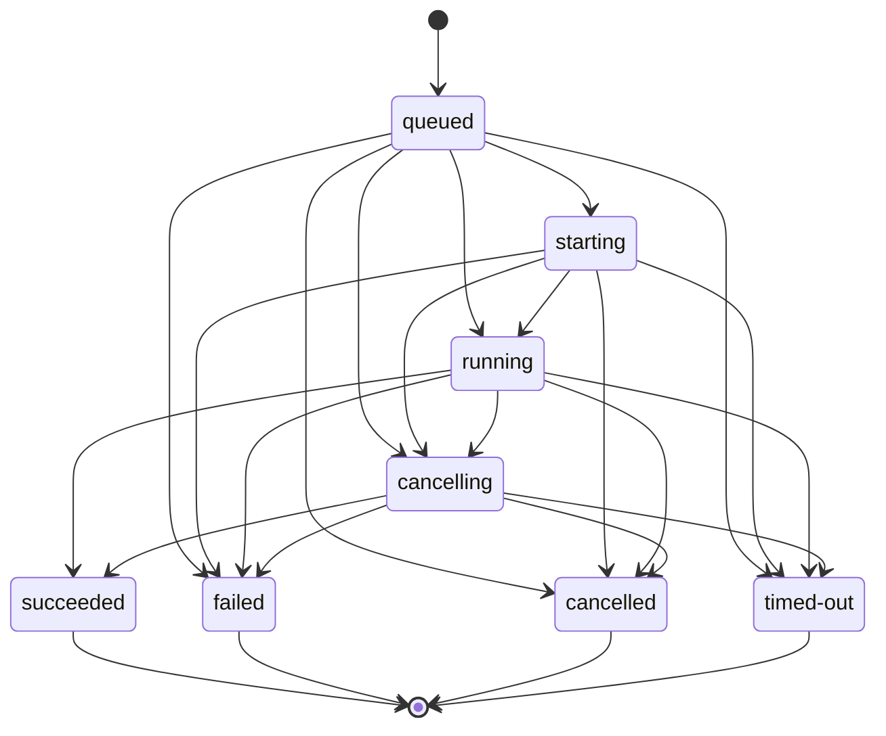

# ExecutionProvider 与 ExecutionJob

## 状态

- DecisionStatus：Accepted
- 日期：2026-07-15
- ImplementationStatus：Contract + Browser Preview/Test + Remote Control Plane/Worker + Provider Preview/Build/Test Results Implemented
- ProductGateStatus：G2 In Progress
- Global Phase：G2 Executable Full-stack Workspace
- Owner：`@prodivix/runtime-core`、`@prodivix/runtime-remote`
- 关联：
  - `specs/implementation/g2-executable-full-stack-workspace.md`
  - `specs/implementation/g2-execution-provider-remote-runner.md`
  - `specs/roadmap/global-phases.md`
  - `specs/decisions/34.core-package-boundaries.md`
  - `specs/decisions/37.verified-semantic-authoring-architecture.md`

## 背景

Preview、Test、Build、NodeGraph、Animation 与 Code 都需要执行，但它们不能分别定义不可互通的任务、日志、取消和错误协议。Browser Runner 与 Remote Isolated Runner 也必须可替换，不能让 Workspace、编辑器或领域包依赖某个容器供应商的 SDK。

`RuntimeExecutionRequest` 与 executor registry 继续表达领域内的一次调用；它们不是项目级运行宿主。项目级执行统一使用 `ExecutionProvider / ExecutionJob`。

## 决策

### Revision-bound ExecutionRequest

每次执行都携带 immutable `ExecutionRequest`：

- stable `requestId`；
- `preview / test / build / production` profile；
- `client / worker / server / edge / build / test` runtime zone；
- Workspace、snapshot 与可选 partition revision vector；
- `workspace / route / code / nodegraph / animation / test / build` invocation；
- 稳定 `DiagnosticTargetRef`、可选 entrypoint 与 transport-safe input；
- required provider capabilities、正整数 timeout 与非秘密 metadata。

Provider 必须执行请求绑定的 snapshot。Host 要运行新的 Workspace 状态时创建新 request，不得在同一个 job 中静默换 revision。

### 静态 Provider 能力

`ExecutionProviderDescriptor` 声明 provider 的：

- id、version 与 isolation；
- profiles、runtime zones 与 invocation kinds；
- cancellation、timeout、streaming logs、diagnostics、artifacts、source trace、filesystem、dependency install、HMR、console、network、terminal、test 与 build capability。

Registry 只负责 instance-owned 注册、精确查找、静态兼容性过滤与 start contract 校验。它不自动选择 provider；Browser、Remote、成本、权限、地区和用户偏好等选择策略属于 composition root。

### Job 生命周期

Terminal status 为 `succeeded / failed / cancelled / timed-out`，不可再次迁移。取消是幂等请求；它可以得到 accepted、already-requested、already-terminal、unsupported 或 rejected。取消请求与 job 最终完成存在竞态，因此 accepted 不强制最终状态一定为 cancelled。

### 有序事件与最终结果

每个 job 发布从 1 开始严格递增的 sequence：

- state；
- stdout/stderr/console log；
- `ProdivixDiagnostic`；
- artifact reference；
- runtime trace 与 authoring `SourceTrace`。

订阅以 `afterSequence` 为 cursor 重放历史并继续接收新事件，Browser 与 Remote adapter 必须保持同一 ordering contract。`completion` 只结算一次，并汇总最终 diagnostics 与 artifacts。Artifact 通过 URI、digest、media type 和 metadata 引用，不把任意二进制内容塞进事件流。

`createExecutionJobController` 是 provider adapter 的 canonical in-process 状态机，统一保证 transition、sequence、重放和 terminal settlement。Remote adapter 可以使用自己的 transport，但必须满足同一公开语义与 conformance。

### 稳定 Execution Session

Job 永远绑定一次 immutable request 与 Workspace revision，不能为了产品 UI 的连续性变成长生命周期可变容器。`ExecutionSessionCoordinator` 在 Job 之上提供稳定的产品会话 identity：

- 一个 session 指向当前 active job，并保留 provider、profile、runtime zone 与 snapshot identity；
- 新 revision 启动新 Job 后可以替换 active job，同时按配置保留前序 Job 的有界事件尾部；
- session 统一提供 snapshot/list/subscribe、clear events 与 cancel 入口；
- coordinator 是 instance-owned、可替换且仅存在于 composition root 生命周期内，不写入 Workspace、local replica 或 Outbox；
- 替换或移除 session 不隐式终止 provider process，启动和停止仍由拥有该 provider 的 host 明确负责。

这使 Blueprint、NodeGraph、Animation、Test 与 Build 能共享同一 Console 和控制面，同时保持 Job 的 revision-bound 不变量。

## Owner 边界

`@prodivix/runtime-core` 拥有：

- Execution request、provider descriptor、compatibility 与 registry；
- job lifecycle、event/result、cancel/timeout、log/diagnostic/artifact/trace contract；
- transport-neutral `ExecutionTestReport` 与 `test.report` trace contract；
- stable session identity、active-job projection、有界事件保留与订阅/取消协调；
- transport-neutral controller 与状态机不变量。

`@prodivix/runtime-browser` 或未来 Remote adapter 拥有：

- iframe/worker/WebContainer/remote sandbox 等具体宿主；
- transport、进程、filesystem、terminal、network 与依赖安装 adapter；
- 将宿主事件映射到 canonical job event。

领域 runtime 拥有：

- NodeGraph、Animation、Route、Data 和 Code 的具体执行语义；
- 领域 trace、diagnostic 与 source mapping contribution。

Execution 不拥有 Workspace durable mutation、作者态 Command、React UI、容器供应商 SDK 或 Secret 明文。

## 安全与可移植性

1. `metadata` 只允许字符串标签，不承载环境变量或 Secret。
2. `SecretRef` 只携带 binding identity；Secret material 只能在后续 resolution boundary 中进入获授权 runtime zone，不得进入 request、PIR、日志或客户端产物。
3. Provider 必须在声明 capability 后才能接受相应请求；timeout request 自动要求 timeout capability。
4. 失败使用可传输的 code/message/details/source trace，不依赖跨进程序列化原生 `Error`。
5. Subscriber 异常不得破坏 provider 状态机或其他订阅者。

## 当前实现与后续

已实现：

- `ExecutionRequest` 与 `ExecutionProviderDescriptor` canonical factory；
- capability compatibility 与 instance-owned provider registry；
- canonical job controller、完整 lifecycle、事件 cursor/replay、取消、timeout 与 terminal result；
- instance-owned Execution Session coordinator、有界 event retention 与订阅/控制入口；
- reference-only `ExecutionEnvironmentSnapshotRef`、`EnvironmentBindingReference`、`SecretRef`，以及 ExecutionRequest 对 immutable environment snapshot identity 的可选绑定；
- 属性测试与 provider conformance test；
- `@prodivix/runtime-browser` 的 Browser Project Runner：隔离 filesystem、dependency install、Vite server、HMR、console forwarding 与 preview artifact；
- Browser Preview 与 Test provider 以独立 descriptor、Job 和 Session 共享 composition-root-owned Runtime Host；Test provider 通过 `@prodivix/runtime-vitest` 将 Vitest JSON 转换为 transport-neutral `ExecutionTestReport`，并通过 canonical trace 与 report artifact 发布；
- 蓝图 Run Mode 以 revision-bound Export Bundle 启动 Browser ExecutionProvider，并在原画布 iframe 中消费 job artifact。
- `@prodivix/nodegraph` 的 same-context provider：从 revision-bound document 执行确定性 kernel，把 trace/log/diagnostic/SourceTrace、取消、timeout 与 state patch result 映射到 canonical Job；NodeGraph 编辑器和 Blueprint trigger 复用同一 Session/Console。
- `@prodivix/animation` 的 same-context provider：通过无 DOM scheduler/effect lease port 执行完整单 timeline lifecycle；Browser generation fence、Animation Play/Stop/Restart 与共享 Session/Console 已贯通，逐帧 effect 不进入 Job history。
- `@prodivix/runtime-remote` 的 versioned wire envelope、strict codec、start/status/cancel/events/artifact client、bounded retry/backoff、幂等与 cursor recovery conformance；该基础不等同于 Remote Isolated Provider 已完成。
- `@prodivix/runtime-remote` 的 transport-neutral Control Plane Core、atomic quota/create contract、
  content-addressed snapshot store、owner isolation、FIFO claim、lease expiry takeover 与 fencing
  conformance；memory adapter 不等同于 deployable database/queue/blob control plane。
- Remote PostgreSQL/HTTP/Worker D2 已形成 lease-fenced durable log/event、server-assigned cursor、
  content-addressed artifact blob/grant、binary digest/size verification、strong idempotency、owner-scoped
  download、execution total budgets 与 bounded retention sweep；生产默认 rootless Podman sandbox 和
  remote-only GitHub Isolation Gate 已实现，reference filesystem/process adapter 仅允许非生产使用。
- `@prodivix/runtime-remote` 已提供独立 Remote Preview/Test/Build descriptor 与供应商中立 provider
  projection，把 durable replay、diagnostic、artifact、取消与 terminal state 映射回 canonical Job；
  Worker 侧 Remote Build 已按 snapshot 显式 output plan 生成严格 `ExecutionBuildBundle`；Remote Test
  在 rootless sandbox 外的可信 Worker 边界把私有 Vitest JSON 转换为 canonical report，并发布
  `test.report` trace 与 report artifact；Remote Preview 按显式 `static-bundle` plan 生成严格
  `ExecutionPreviewBundle`，仅在 HTML entrypoint、snapshot/target/file digest 全部验证后发布
  `ready/healthy` artifact。durable event 已移除 grant authority 与私有工具 payload；transport-neutral
  resolver 会重新校验 grant expiry/scope、descriptor digest/size 与 Preview Bundle identity 后才返回内容。
  注入式 HTTP envelope/content transport 与 Web bounded streaming adapter 已完成。Backend 已以
  Workspace owner 校验和 durable execution grant 代理用户请求，并将 Control Plane credential 保留在
  服务端；Web 已提供只接受登录 session token 的 Remote composition factory。独立 Preview Host 通过
  Backend 权威 artifact 拉取、media/digest 校验和内部认证签发 hash-only 短期 capability 子域，以严格
  CSP/Permissions Policy、CSP sandbox、无缓存和每 session origin 隔离托管多文件静态结果；它不持有
  Control Plane credential。Remote provider 在保持 durable artifact identity 的前提下异步增加短期 URI，
  Blueprint Run Mode 已显式接入 Browser/Remote provider selection。
- `@prodivix/golden-conformance` 已建立同一 neutral snapshot 的 provider contract matrix：living Golden
  Workspace 只编译一次；Browser Preview/Test 通过共享 Runtime Host 消费并复用依赖安装，Remote
  Preview/Test/Build 分别以独立 descriptor 消费 exact digest。矩阵比较 canonical Test semantics，验证
  Preview readiness/URI 与 Remote Build bundle，并将 Browser live Preview / Remote finite Preview 及
  Browser Build unsupported 作为显式 provider capability 差异。真实 rootless Gate 通过 strict Remote
  wire 消费同一 living Golden snapshot，在显式安装网络完成真实依赖安装，然后由 Worker 断开网络并
  inspect 确认为空，才放行 Preview/Test/Build；Preview/Build bundle 与 canonical Test/source trace 均
  strict decode。安装网络现为 internal bridge，唯一出口是 Worker 校验 exact hostname/443 policy 的
  infrastructure proxy；实际请求仅形成 metadata-only `network.request`，严格模型不承载 header、path、
  query、body 或 credential，Execution Center Network 视图只消费 strict decode。首次阶段性推送后的
  远端通过证据仍待生成。

尚未由本 ADR 宣称完成：

- generated-project/Remote Data Network adapter、policy correlation、Secret leak canary；
- Terminal 产品面与完整 Network 调试旅程；
- Secret resolver、runtime-zone permission 与 Data operation runtime。

这些能力在 G2 后续纵切中实现，并复用本契约，不建立第二套 job 协议。

## 验收

- [x] Runtime Core 可在无 DOM 环境独立 build/typecheck/test。
- [x] request 与 descriptor 被规范化并精确匹配 capability。
- [x] environment reference 保持 reference-only，并自动要求 provider `environment-binding` capability。
- [x] job transition fail-closed，terminal 不可回退。
- [x] event sequence 与 cursor replay 确定且无订阅竞态丢失。
- [x] cancel 幂等，timeout 与 terminal result 可表达。
- [x] diagnostics、artifacts 与 source trace 进入统一事件协议。
- [x] 稳定 session 可以跨 revision-bound Jobs 保留有界事件并复用取消入口。
- [x] Browser provider 通过 project snapshot、preview artifact 与 source-only HMR conformance。
- [x] Browser Test provider 通过 exact export snapshot 运行测试，并发布 canonical test report trace/artifact。
- [x] Remote protocol/client 通过重复 start/cancel、丢失响应、断线、cursor gap/乱序、provider drift 与 terminal regression conformance。
- [ ] Remote provider 通过同一 provider conformance scenarios。
