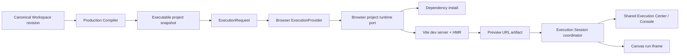

# Project Runner 与蓝图画布三模式

## 状态

- DecisionStatus：Accepted
- 日期：2026-07-15
- ImplementationStatus：Browser Vertical Slice + Neutral Snapshot Implemented
- ProductGateStatus：G2 In Progress
- Global Phase：G2 Executable Full-stack Workspace
- Owner：`@prodivix/runtime-core`、`@prodivix/runtime-browser`、`@prodivix/prodivix-compiler`、`apps/web` composition root
- 关联：
  - `specs/implementation/g2-executable-full-stack-workspace.md`
  - `specs/implementation/g2-project-runner-execution-devtools.md`
  - `specs/decisions/31.production-export-planner.md`
  - `specs/decisions/40.execution-provider-and-job.md`
  - `specs/roadmap/global-phases.md`

## 决策

蓝图画布提供三个边界明确的 mode：

1. `design`：直接投影 revision-bound PIR-current，提供选择、拖拽和作者态诊断。
2. `interactive`：继续使用同一个 PIR projection 与轻量进程内领域 runtime，用于快速验证事件和局部交互。
3. `run`：Compiler 从 Canonical Workspace revision 生成完整 React/Vite Export Bundle，Browser ExecutionProvider 在隔离工程 runtime 中安装依赖、启动 Vite，并将 preview URL 作为 `ExecutionJob` artifact 原位显示在画布 iframe。

`run` 不是 PIRRenderer 的第三种渲染参数，也不直接读取编辑器 React state。它只消费 immutable Workspace snapshot 对应的独立工程产物。

## Runtime 与供应商边界

`@prodivix/runtime-core` 拥有 provider-neutral `ExecutableProjectSnapshot`、file manifest、command/test/build plan 与 content digest contract，Compiler 从 exact Workspace/ExportBundle 生成该 snapshot。`@prodivix/runtime-browser` 只公开 `BrowserProjectRuntime` port 与 `createBrowserProjectRunner` 并消费 neutral snapshot；WebContainer API 只存在于该 port 的默认 adapter 内。Remote Isolated Runner 消费同一 snapshot 和 ExecutionProvider/Job 语义，不改变画布消费方式。

Browser 纵切曾以 `BrowserProjectSnapshot` 暂存通用工程输入；该 Hard Cut 已完成，Browser type、factory 和双 contract 兼容层均已删除。ExecutionRequest、Workspace、Compiler 与 Web UI 均不得暴露 WebContainer 或 Remote 供应商类型；command plan 也不得携带 Secret 或未分类 literal environment map。

浏览器项目 runtime 由 composition-root-owned `BrowserProjectRuntimeHost` 作为单实例、惰性启动的长期资源管理：

- 第一次 snapshot mount 完整文件树、安装依赖并启动 server；
- source-only revision 只同步变更文件，复用现有 server 和 HMR；
- package manifest、lockfile、workspace config 或运行命令变化时重新安装并启动；
- 新 snapshot 取消旧 revision 的 job，但不建立第二套 session/event 协议；
- stdout、console error、runtime failure 与 preview URL 统一映射为 ExecutionJob event/artifact。

## 安全与生命周期

- 宿主页启用 COOP 与 COEP，运行工程位于 sandboxed iframe。
- WebContainer API key 只允许在 adapter 构造边界提供，不进入 ExecutionRequest、Workspace、PIR、日志或导出文件。
- 退出 Run Mode 会停止项目进程；浏览器 runtime 保留以降低下一次启动成本，显式 dispose 才释放实例。Execution Session 在当前编辑器生命周期内保留有界事件，因此切回 Design/Interactive 后仍可检查刚才的日志和终止状态。
- Run Mode 禁用画布 drop authoring，避免把执行表面误当成设计表面；Inspector 或其他正式作者入口产生的新 Workspace revision 会触发新执行 snapshot。

Execution Center 是 provider-neutral 产品表面。Blueprint Project Runner、Browser Test provider、NodeGraph provider 与 Animation provider 已复用同一 Session/Console；项目预览额外提供 iframe 刷新与独立打开。面板折叠和过滤属于 UI 偏好，Job、事件与控制动作来自共享 Execution Session。Preview 与 Test 拥有独立 descriptor、Job、Session 和 owner-scoped process，只共享 Host 的 filesystem、dependency install 与 browser Node runtime；后续 Remote provider 继续复用这一边界，不建立私有 console store。

## 当前范围

本纵切完成 Browser Project Runner、文件同步、依赖安装、Vite server、HMR、console forwarding、原位 iframe、route URL、共享 Execution Center、跨画布模式事件保留、失败反馈、运行控制与 neutral snapshot Hard Cut。Browser Test provider 与共享 Runtime Host 由 ADR 44 收敛；NodeGraph 与 Animation session 由独立 ADR 收敛；reference-only environment/Secret 与 Data 作者态基础由 ADR 45 收敛。Remote Isolated Runner、Terminal/Network、Secret resolution、Data operation runtime 与单一第二 target 可移植性证明继续属于 G2 后续 Gate；广泛 Target 生态属于 G6。

## 验收

- [x] 三个画布 mode 使用不同且稳定的执行边界。
- [x] Run Mode 只运行 Compiler 生成的独立工程 snapshot。
- [x] Browser adapter 满足 canonical ExecutionProvider/ExecutionJob contract。
- [x] source-only revision 复用 server，依赖变化触发重新安装。
- [x] preview URL 通过 artifact 进入 iframe，console/runtime failure 进入 job event。
- [x] Execution Center 通过稳定 session 观察与控制当前 Job，并在离开 Run 后保留有界事件。
- [x] Preview/Test 使用独立 descriptor 与 owner-scoped process，共享 Runtime Host 的 filesystem 和 dependency install。
- [x] Browser runtime 供应商 SDK 不扩散到 Workspace、Compiler 或 Web UI。
- [x] Browser-owned snapshot 已 Hard Cut 为 provider-neutral Executable Project Snapshot，且无兼容 alias。
- [x] Remote Isolated Runner 通过同一 provider conformance、Golden Preview/Test/Build与本地 rootless snapshot contract。
