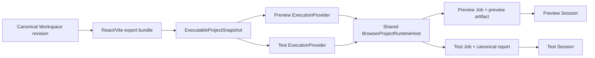

# Browser Test ExecutionProvider 与共享 Runtime Host

## 状态

- DecisionStatus：Accepted
- 日期：2026-07-15
- ImplementationStatus：Browser Test Vertical Slice + Shared Runtime Host + Neutral Snapshot + Remote Test Result Adapter Implemented
- ProductGateStatus：G2 In Progress
- Global Phase：G2 Executable Full-stack Workspace
- Owner：`@prodivix/runtime-core`、`@prodivix/runtime-vitest`、`@prodivix/runtime-browser`、`@prodivix/runtime-remote`、`apps/web` composition root
- 关联：
  - `specs/implementation/g2-executable-full-stack-workspace.md`
  - `specs/implementation/g2-browser-test-execution-runtime-host.md`
  - `specs/decisions/40.execution-provider-and-job.md`
  - `specs/decisions/41.project-runner-and-canvas-modes.md`
  - `specs/decisions/37.verified-semantic-authoring-architecture.md`
  - `specs/roadmap/global-phases.md`

## 背景

G2 的项目预览与项目测试都需要运行 Compiler 从同一个 Canonical Workspace revision 导出的独立 React/Vite 工程。若 Preview 与 Test 各自启动浏览器 Node runtime、复制文件并安装依赖，会重复消耗资源，也会形成两套文件同步与依赖缓存语义；若把两者合并为一个 Provider，又会混淆 capability、Job 生命周期、取消、日志与结果边界。

测试工具的原始 JSON 也不能成为 Web UI 私有协议。Browser 与未来 Remote provider 必须向产品表面交付同一种 transport-neutral 测试报告，且不能因为当前使用 Vitest，就让 `@prodivix/runtime-core` 或编辑器依赖 Vitest schema。

## 决策

### 独立 Provider，共享 Host

Preview 与 Test 使用两个独立 descriptor：

- Preview provider `prodivix.browser.web-container` 接受 `preview` profile、`client` runtime zone 与 `workspace / route` invocation；
- Test provider `prodivix.browser.web-container.test` 接受 `test` profile、`test` runtime zone 与 `test` invocation。

两者各自创建 revision-bound `ExecutionJob`，使用独立 owner id、Session、取消和 terminal result。Provider identity、active Job、事件历史或结果绝不合并。

`BrowserProjectRuntimeHost` 是 composition-root-owned 的长期宿主资源。它惰性启动一个 browser Node runtime，并统一管理：

- project snapshot 文件同步；
- dependency fingerprint、依赖安装与串行 prepare；
- owner-scoped process、输出订阅、停止与释放；
- server ready、preview error 与 runtime error 的 host event；
- Host dispose 时的完整进程和 runtime 清理。

Preview 与 Test 只共享 runtime、filesystem 和已经匹配 dependency fingerprint 的安装结果。依赖拓扑变化时，Host 在存在其他 active owner 的情况下 fail closed，避免一方重装依赖时破坏另一方的运行进程。

### Revision-bound Workspace Test

Test 产品表面先从当前 Canonical Workspace snapshot 生成 production export bundle。存在 blocking export diagnostic 时不得启动 runtime；准备成功后，以 snapshot identity 创建 `test` ExecutionRequest，并运行 snapshot 声明的 test plan。

当前 Browser 与 Remote Test adapter 实现同一个 Vitest 纵切：

1. Host 同步 exact snapshot 并按需安装依赖。
2. Test provider 运行 snapshot 中声明的 Vitest command。
3. Adapter 从保留路径读取 Vitest JSON，并通过 `@prodivix/runtime-vitest` 的有界 decoder 转换为 canonical `ExecutionTestReport`。Remote 的私有 JSON 只存在于 sandbox 到可信 Worker 的进程边界，不进入 durable event、artifact 或 Control Plane contract。
4. Job 以 `test.report` trace 发布报告，同时发布 report artifact、日志、诊断与 terminal result。
5. Test 页面从稳定 Execution Session 读取报告，展示 file/case status、duration、failure message，并复用共享 Execution Center 的停止、重跑和日志能力。

Provider 使用两项稳定 G2 execution diagnostic：

- `TST-5001`：已取得 canonical report，且断言或用例失败；按可用 SourceTrace 定位失败文件/目标，且不可通过原样重试改变结果；
- `TST-5002`：snapshot prepare、test command、无断言失败时的异常进程退出、report 读取或私有 JSON 到 canonical report 的转换失败；这是可重试的宿主/报告基础设施失败。

两者使用 Workspace diagnostic domain，不定义 G3 Verification failure code。完整码表见 `specs/diagnostics/test-diagnostic-codes.md`。

Report artifact 使用稳定 envelope：

- `artifactId`：`test-report:{jobId}`；
- `kind`：`report`；
- `mediaType`：`application/vnd.prodivix.test-report+json`；
- `digest / size / sourceTrace`：在可用时由 adapter 发布并由 shared contract 校验；
- locator：调用方以 `artifactId + provider/session identity` 通过 artifact resolver 获取。`uri` 只能是可选、短生命周期、opaque adapter locator，不得把 `browser-project://` 或 Remote 供应商 URL 固化为 shared contract。

当前 Browser 纵切的 `browser-project://` URI 属待迁移实现细节；neutral snapshot/Remote Test 阶段应改为 artifact resolver，并删除 Web 对 scheme 的认知。

### Transport-neutral 测试报告

`@prodivix/runtime-core` 拥有 immutable `ExecutionTestReport`，统一表达：

- runner tool identity；
- passed/failed report status；
- file 与 case 的 passed/failed/skipped/todo 状态；
- duration、failure message 与 summary；
- 可选 `ExecutionSourceTrace`。

`@prodivix/runtime-vitest` 只拥有 Vitest JSON decoder。Browser provider 与 Remote Worker 在各自 adapter 边界复用它，其他测试工具必须转换为同一 report contract；Web、Remote Provider 和 Control Plane 不解析工具私有 JSON，也不依赖容器供应商 SDK。

Adapter 对原始报告字符数、file/case 数、failure message 与 SourceTrace 数量设置确定性上限；超过可安全保留的报告直接作为 `TST-5002` 基础设施失败，不把截断提示伪装成断言失败，也不向有界 Session history 写入无限 report detail。

### G2 与 G3 的边界

本纵切是 G2 的 Workspace 导出工程测试宿主：它证明指定 Workspace snapshot 可以在一个真实项目 runtime 中运行已声明的测试，并把结果带回统一执行表面。

它不定义 G3 的 `BehaviorScenario`、`VerificationPlan` 或 `VerificationEvidence`，也不把一次测试报告自动升级为 Change 的验证证据。报告和 Session event 是可丢弃运行态，不写入 Canonical Workspace、local replica、Outbox 或 publication projection。G3 后续可以引用本 report contract 形成证据，但必须另行建立 scenario identity、impact、policy、provenance 与 evidence lifecycle。

## Owner 边界

`@prodivix/runtime-core` 拥有：

- ExecutionProvider、ExecutionJob 与 Execution Session contract；
- `ExecutionTestReport`、`test.report` trace name 与验证/normalization 语义；
- Browser、Remote 和其他工具共同遵守的 transport-neutral report shape。

`@prodivix/runtime-browser` 拥有：

- `BrowserProjectRuntimeHost` 与 browser Node runtime adapter；
- Preview/Test provider、owner-scoped process 和 shared filesystem/dependency lifecycle；
- Browser project test plan 与 `runtime-vitest` adapter composition；
- host event 到 canonical Job event/artifact/result 的映射。

`@prodivix/runtime-vitest` 拥有：

- 有界 Vitest 私有 JSON decoder 与 canonical report conversion；
- 不拥有 ExecutionProvider、Job、Workspace、durable event/artifact 或 runtime process。

Remote Worker 在 rootless sandbox 外调用该 adapter，发布 canonical report artifact 与 `test.report` trace；`@prodivix/runtime-remote` 只验证和重放 canonical report，不接触 Vitest 私有 schema。

`apps/web` 拥有：

- Host、Preview provider、Test provider 与 Execution Session 的 composition；
- 从 Canonical Workspace 构造 exact export snapshot 和 request；
- Test 页面与 report presentation；
- 不持有第二份 runtime、report 或 Workspace 真相源。

Compiler 继续拥有 Workspace 到独立工程 bundle 的确定性转换；它不启动 Browser runtime，也不拥有测试进程。

## 拒绝的方案

### Preview 与 Test 共用一个 Provider descriptor

拒绝。两者需要不同 profile、runtime zone、capability、invocation、artifact 与 terminal semantics。共享 descriptor 会让静态 capability matching 失去意义。

### Preview 与 Test 各自启动完整 runtime

拒绝。它会重复 filesystem mount 和 dependency install，并让依赖缓存、进程竞争与 dispose 形成两套实现。

### Web UI 直接读取 Vitest JSON

拒绝。工具私有 schema 会扩散到产品层，Remote provider 与其他 runner 无法复用同一表面。

### 将测试结果直接保存为 VerificationEvidence

拒绝。单次工具报告缺少 scenario、impact、policy、provenance 与 evidence lifecycle，不能提前替代 G3 验证模型。

## 验收

- [x] Preview 与 Test 使用独立 provider descriptor、Job、Session 和 owner-scoped process。
- [x] 两个 provider 共享一个 composition-root-owned Browser Runtime Host。
- [x] exact Workspace revision 先生成独立 React/Vite snapshot，再进入 Test provider。
- [x] dependency fingerprint 一致时复用安装结果，冲突性依赖变化 fail closed。
- [x] Vitest JSON 在 Browser/Remote Worker adapter 边界转换为 transport-neutral `ExecutionTestReport`。
- [x] report 同时通过 canonical trace 与 artifact envelope 发布。
- [x] assertion/test failure 与 host/report failure 分别使用稳定 `TST-5001`、`TST-5002` 诊断。
- [x] Test 页面消费 Execution Session 和共享 Execution Center，不建立私有 console/report store。
- [x] 测试运行态不写 Canonical Workspace，也不宣称 G3 VerificationEvidence 已完成。
- [x] Browser Test 已迁移到 provider-neutral Executable Project Snapshot。
- [ ] Browser Test artifact 已通过 resolver 获取，Web 不再认知 adapter URI scheme。
- [x] Remote Test provider 通过同一 ExecutionProvider 与 report conformance；rootless GitHub Test 探针已加入 Gate，远端通过证据待阶段性推送生成。
