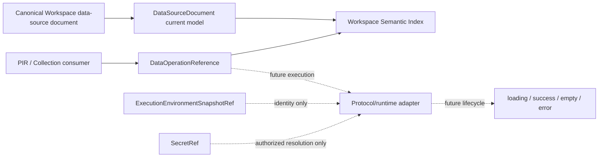

# DataOperation 与执行环境引用基础

## 状态

- DecisionStatus：Accepted
- 日期：2026-07-15
- ImplementationStatus：Data Runtime + Environment Resolution First Vertical Implemented
- ProductGateStatus：G2 In Progress
- Global Phase：G2 Executable Full-stack Workspace
- Owner：`@prodivix/data`、`@prodivix/runtime-core`、`@prodivix/workspace`
- 关联：
  - `specs/implementation/g2-executable-full-stack-workspace.md`
  - `specs/implementation/g2-data-operation-environment-runtime.md`
  - `specs/roadmap/global-phases.md`
  - `specs/decisions/25.authoring-symbol-environment.md`
  - `specs/decisions/38.blueprint-component-instance-and-collection.md`
  - `specs/decisions/40.execution-provider-and-job.md`
  - `specs/diagnostics/data-diagnostic-codes.md`

## 背景

G2 要让 Blueprint、NodeGraph、Animation、Preview、Test 与 Export 使用同一套真实数据语义。仅在组件属性里保存 URL、在 PIR 中嵌入请求代码，或让每个运行表面自行解释 loading/error，会产生彼此不兼容的 Data runtime，也会让 Secret 泄漏进 Workspace、ExecutionRequest、日志或客户端产物。

现有 PIR `dataId` 表达 PIR 文档内的局部数据作用域，并由 Collection 和 value binding 读取。它不是跨文档 Data operation identity，不能被重解释为 API operation reference。全局 Data/API 作者态需要独立 canonical document、稳定引用、revision-bound semantic contribution，以及与执行环境分离的 Secret 引用。

## 决策

### Canonical DataSourceDocument

`@prodivix/data` 拥有无版本号的 current domain model。一个 `DataSourceDocument` 聚合：

- source identity、adapter identity、runtime zone 与引用式 configuration；
- `schemasById` 中的 JSON Schema 2020-12 shape；
- `operationsById` 中的 query/mutation operation；
- pagination、cache、retry 与 optimistic CRUD effect policy；
- `idle / loading / success / empty / error` lifecycle 的稳定运行投影契约。

current model 不携带数字版本。数字版本只存在于 wire codec；当前 wire envelope 使用 `wireVersion: 1`，decode 后立即进入同一个 current model。Workspace、Semantic Index、PIR、Compiler 与 Web 后续只消费 current API，不复制 `v1` 生产目录或类型。

Lifecycle snapshot 是一次 operation execution 的可丢弃运行态，不是 Canonical Workspace 中需要持续改写的第二真相源。Cache、retry、pagination 与 optimistic policy 是作者态声明；当前 runtime 已执行其首个 bounded kernel，运行投影仍不进入 Workspace。

### Durable operation identity

跨领域引用统一使用：

```ts
type DataOperationReference = {
  documentId: string;
  operationId: string;
};
```

`documentId` 指向一个 `data-source` Workspace document，`operationId` 指向其中的 operation。重命名、移动、impact 与 resolution 必须通过 Workspace Semantic Index 和领域 planner 处理，消费者不得扫描 Data editor 私有状态。

### 引用式环境与 Secret

Data source configuration 只允许以下值来源：

- 可安全持久化的 literal；
- `EnvironmentBindingReference { bindingId }`；
- `SecretRef { bindingId }`。

`@prodivix/runtime-core` 同时定义 `ExecutionEnvironmentSnapshotRef { environmentId, revision, mode }`，其中 `mode` 为 `mock | live`。ExecutionRequest 可以绑定该 immutable snapshot reference，但不携带 environment map、credential 或 Secret value。Request 一旦包含 environment reference，就自动要求 provider capability `environment-binding`；不具备该 capability 的 provider 必须在 compatibility check 阶段拒绝 request，不得静默忽略环境绑定。

`SecretRef` 是不透明引用，不是加密后的 Secret 容器。Secret material 只能由后续获授权 provider 在允许的 runtime zone resolution boundary 中取得；它不得进入：

- Canonical Workspace、PIR、DataSourceDocument wire 或 local replica；
- ExecutionRequest、Session event、diagnostic meta、log 或 artifact；
- Browser snapshot、生成源码、客户端 bundle 或 Git projection。

后续 G2 纵切已在 Backend 建立 production store first vertical：immutable environment revision、AES-256-GCM authenticated encryption、principal/session-bound short-lived grant、exact provider/zone/purpose/binding/field 校验与 value-free durable audit。execution-bound Remote Data HTTP/GraphQL/AsyncAPI finite gateway 已组合该 store，并额外绑定 exact snapshot/document revision 与公网 HTTPS/SSRF policy；ADR 49 进一步建立 public GraphQL subscription 与 AsyncAPI SSE/NDJSON pull-driven stream，Secret-authenticated 长连接继续 fail closed。generated Remote Preview 通过 opaque iframe value-only request、exact frame/generation fence、父窗口 product-authenticated gateway client 与 exact capability-origin CSP 接入。mutation 使用 effect-before durable claim、SHA-256 exact request fingerprint、sanitized success replay 与 pending/indeterminate fail-closed ledger；显式 `invocation-key` policy 只有在 adapter 声明 capability 且 operation 提供安全 public header mapping 时才启用。所有 attempt 复用不含 input/Secret/raw identity 的 opaque key，v3 ledger 只把 retryable outcome 原子释放给紧邻下一 attempt；未声明 contract 时 attempt 固定为 1。该语义依赖上游遵守 header，不描述为 distributed exactly-once。Remote Data 的 metadata-only Network result 已通过 exact active-job Session observation 关联产品视图：finite Preview Job 保持 terminal，Session 只保存有界、可丢弃 observation，替换 generation 或 active Job 后拒绝 stale result；Data Network SourceTrace 通过 exact snapshot fence 导航至 canonical operation。React/Vite compile 现在消费显式 Data runtime target manifest：默认 static-client，server/edge 必须声明 execution parent gateway，并把 `network`/`environment-binding` 传播到 snapshot/provider/request；subscription 额外要求 `data-stream`，Browser 与 ZIP export 对该能力 fail closed。Remote 当前 durable 输出的 request/snapshot/cache/log/diagnostic/trace/artifact/test-report/crash canary 已由 Worker 与 Control Plane 双 Gate 覆盖；Structured Console copy 与 Remote Terminal transport-wide/cross-chunk、stdout/stderr 分流和 bounded copy redaction 已完成。KMS rotation 尚未完成，因此仍不能把该纵切描述为完整 Secret runtime。

Strict codec 能保证 `secret-ref` / binding 使用 exact reference shape，且该对象不接受 `value`、`material` 等附加字段；它不能从 arbitrary literal 的 key 或内容推断某个值是否敏感。哪些 adapter configuration 字段必须使用 `secret-ref`，需要由后续 adapter configuration schema 与 runtime-zone permission policy 强制执行。因而“Secret material 不进入作者态与产物”是长期架构 invariant，当前 reference-only shape 只是其中一层，不代表 plaintext detection 已完整实现。

### Workspace 与 Semantic Index

Canonical Workspace 注册一等 `data-source` document type。TypeScript Workspace codec/validator 复用 Data strict codec；Canonical backend 在 persistence 边界验证对应 wire envelope 与基础 shape，不复制 current domain runtime。Data 文档继续通过 Command/Transaction、Durable Outbox 与 Atomic Commit 修改，不建立 Data editor 私有持久化。

Data Semantic Contribution 发布 `data-source`、`data-schema` 与 `data-operation` symbols、scope 和 typed reference facts，并绑定 Canonical Workspace partitioned revision。Semantic Index 是可丢弃、可重建的只读投影，不拥有 DataSourceDocument 或 operation binding。

Diagnostics 增加 `data` domain，以及 `data-source` / `data-operation` target。作者态与未来运行时诊断必须以引用定位目标，且不得把 configuration value 或 resolved Secret 复制到 diagnostic meta。

### PIR、Collection 与 Data operation 的边界

现有 PIR `dataId` 保持文档内局部数据作用域语义。PIR owner 在 `logic.dataById` 持久化 operation binding：map key 是局部 `dataId`，binding 使用 `DataOperationReference` 指向全局 operation。Collection source 继续使用本地 `{ kind: 'data', dataId, path? }` binding，不把跨文档 identity 塞进 `dataId`。

Collection 通过 `{ kind: 'data-operation', dataId, idle }` 保存显式 lifecycle mapping。`loading -> loading`、`success -> item`、`empty -> empty`、`error -> error` 是固定语义，`idle` 明确选择 loading 或 empty；success 即使携带空数组也不能被猜成 empty。运行态必须提供与 durable operation reference 精确匹配的 `DataLifecycleSnapshot`，snapshot 只投影进对应 document instance 的 `dataById` 与 lifecycle scope，不进入 Workspace、History 或 Outbox。

Collection Inspector 只从 revision-bound Workspace Semantic Index 选择 query operation，并通过一个可逆 Workspace Transaction 原子写入 local binding、Collection source、lifecycle、input 与 activation。Blueprint Trigger Inspector 同样只从 Semantic Index 选择 mutation，并以专用原子事务写入 PIR v1.6 event；query/mutation 失配在 effect 前 fail closed。code-owned input transform 只保存 CodeSlot/CodeReference。cache/retry/pagination 与 optimistic 已进入共享 Data execute kernel；React/Vite generated mock runtime 已执行 document/route/input-change query activation、semantic typed input、Blueprint mutation CRUD 与 query revalidation，live HTTP/policy 和完整协议产品投影继续由后续纵切实现。

### Adapter 与 CodeSlot 边界

Canonical Data IR 不直接等同于 HTTP、OpenAPI、GraphQL 或 AsyncAPI。后续 protocol importer/adapter 把外部 schema 与 operation 转换到 DataSourceDocument，并由 runtime adapter 执行；`@prodivix/data` 不依赖某个浏览器 plugin gateway 或供应商 SDK。

自定义 transform、auth adapter 或 response mapping 中的 code-owned 逻辑必须通过 Code Authoring Environment 和 CodeSlot/CodeReference 接入，不在 operation 或 PIR 中保存裸代码字符串。



## Owner 边界

`@prodivix/data` 拥有：

- DataSourceDocument、schema、operation、policy、lifecycle 与 DataOperationReference current contract；
- strict current validation、wire codec 和 normalization；
- Data semantic contribution。

`@prodivix/runtime-core` 拥有：

- transport-neutral ExecutionEnvironmentSnapshotRef；
- EnvironmentBindingReference 与 SecretRef 的 reference-only contract；
- ExecutionRequest 与 environment snapshot identity 的组合。

`@prodivix/workspace` 拥有 `data-source` typed document read/write boundary、revision composition 与默认 Semantic Index provider composition。Canonical backend Workspace 只验证和持久化 wire，不拥有 Data runtime。

后续 protocol/runtime adapter 拥有外部网络协议与 provider execution；PIR 拥有 operation binding、Collection lifecycle mapping 和局部 data scope；Renderer/Compiler 拥有 document-instance projection；`@prodivix/diagnostics` 拥有 Data diagnostic lifecycle、去重与 presentation。

## 拒绝的方案

### 把 PIR `dataId` 改成全局 operation id

拒绝。它会破坏现有局部数据作用域、Collection binding 与 document isolation，并让跨文档引用缺少 document identity。

### 把 endpoint、credential 或任意请求代码直接存入 PIR

拒绝。它会把 Data、Code 与 Secret ownership 混入 UI graph，并绕过 CodeSlot、Semantic Index 和 canonical Data document。

### 在 ExecutionRequest 中传递完整环境变量 map

拒绝。Request 会经过 Session、transport、日志与调试面；传值会扩大 Secret 暴露面，也无法稳定绑定 environment revision。

### 让 HTTP/OpenAPI/GraphQL/AsyncAPI schema 成为 canonical model

拒绝。外部协议是 adapter/import boundary；把任一协议设为 canonical 会锁定其分页、mutation、subscription 与鉴权语义，并阻碍 Preview/Remote/Export parity。

### 把 lifecycle snapshot 持久化为 Workspace 作者态

拒绝。一次运行的 loading/result/error 属于 revision-bound execution state，持久化会产生高频写入和第二真相源。

## 当前完成边界

- [x] DataSourceDocument current contract、strict validation、normalization 与 wire codec。
- [x] DataOperationReference、query/mutation、schema、policy 与 lifecycle contract。
- [x] `data-source` Canonical Workspace typed document 与后端 validation boundary。
- [x] Data source/schema/operation Semantic Contribution 与统一 diagnostic targets。
- [x] ExecutionEnvironmentSnapshotRef、EnvironmentBindingReference 与 SecretRef reference-only contract。
- [x] PIR operation binding、Collection lifecycle mapping、Semantic 选择与可逆 authoring transaction。
- [x] transport-neutral trigger origin、typed invocation input mapping、query activation equality 与 mutation replay fencing。
- [x] PIR-current v1.6 query activation/input 与 Blueprint mutation event、CodeSlot projection、Workspace 原子事务和 Inspector durable authoring。
- [x] exact document execute kernel、adapter registry、schema preflight、lifecycle fencing、retry 与 pagination runtime。
- [x] transport-neutral environment resolution lease、exact revision/binding preflight、Secret zone/provider/field permission matrix，以及 HTTP transport injection first vertical。
- [x] HTTP live runtime、deterministic mock runtime，以及 OpenAPI 3.1 bounded proposal/provenance/reimport、
      reversible Workspace adoption、产品 preview/diff/impact/conflict、Inspector/Issues/Network navigation 与
      Browser/Remote/standalone mapping；GraphQL、受限 AsyncAPI 与 React/Vue cross-target conformance已完成。
- [x] bounded instance-owned cache、SHA-256 partition key、cache-first/network-first/SWR/no-store execution 与 Browser composition。
- [x] owner/version fenced optimistic CRUD projection、authoritative response mapping、rollback 与 concurrency property Gate。
- [x] Backend production environment/Secret store first vertical、principal/session partition、durable grant/audit 与 at-rest/API/callback canary Gate。
- [x] Remote create 的 authenticated principal/session + exact environment revision preflight 与 value-free durable execution authority binding。
- [x] Remote server HTTP/material query/mutation gateway、effect-before durable mutation replay fence、显式 upstream `invocation-key` retry、generated Remote Preview value-only bridge/CSP、exact active-job Network/Console Session observation、React/Vite server-gateway compile Gate、Remote 当前 durable 输出 canary Gate、Structured Console copy redaction，以及 Remote Terminal transport-wide/cross-chunk、stdout/stderr 分流和 bounded copy redaction；key rotation/managed-KMS local adapter已完成。
- [x] Browser/Remote Preview、Browser/Remote Test与React/Vue standalone Export的同语义 CRUD vertical slice。
