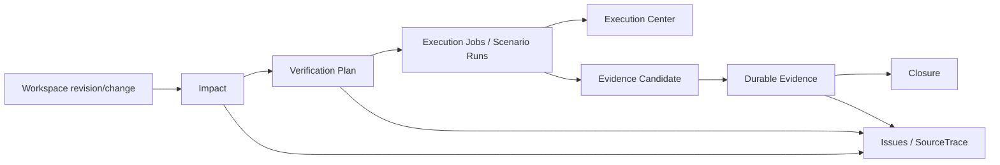

# Verification 产品表面、Diagnostics 与 CI Contract

## 状态

- DecisionStatus：Accepted
- 日期：2026-07-20
- ImplementationStatus：Not Started
- ProductGateStatus：Blocked by G2 Exit Gate
- Global Phase：G3 Behavior & Verification Closure
- Owner：`@prodivix/verification`、`@prodivix/diagnostics`、`apps/web`、`apps/backend`、`apps/cli`
- 关联：
  - `specs/implementation/g3-verification-adapters-product-ci.md`
  - `specs/decisions/27.diagnostic-presentation-contract.md`
  - `specs/decisions/41.project-runner-and-canvas-modes.md`
  - `specs/decisions/57.verification-plan-impact-and-policy.md`
  - `specs/decisions/58.verification-evidence-provenance-and-retention.md`
  - `specs/decisions/62.verification-adapter-matrix-and-cross-target-closure.md`

## 背景

G2 已有Test页面、Execution Center、Issues和SourceTrace debugger，但用户仍需自行判断一次运行是否覆盖当前改动、
是否使用正确target/control，以及某个历史结果是否仍然有效。CI也只能运行脚本，无法输出与产品相同的Plan、Evidence和
Closure。

G3需要一个IDE级Verification表面：Scenario authoring、Impact/Plan、active execution、durable Evidence、comparison和CI
必须围绕相同identity组织，而不是再堆一组独立页面或供应商徽章。

## 决策

### 信息架构

产品增加两个稳定工作面并复用现有Execution Center/Issues：

1. **Scenarios**：canonical Scenario列表、编辑、录制draft、typed target/action/assertion、controls和baseline。
2. **Verification**：Impact、Plan、matrix、active run、Evidence、compare和Closure。

Execution Center继续显示当前run的Console/Network/Test/Files/trace；Issues聚合authoring、plan、run和evidence诊断。
Evidence详情是durable read-only表面，不能把历史artifact重新写回Execution Session或Workspace。
Execution Center 作为可拖拽/折叠/最大化的 docked IDE panel 参与主区布局，不用固定高度或默认覆盖内容；layout
preference 只保存为本地 UI preference。



### Scenarios surface

- tree/list按criticality/tag/route/target显示，不重复解释显而易见图标；状态、失败和stale使用稳定icon/color/token，并有
  tooltip/accessible name；
- editor采用step/lane/checkpoint/assertion结构和typed picker，保留Code/JSON高级入口但不暴露wire version；
- recorder先进入review draft，显示unresolved/ambiguous/sensitive events；采纳是一个Workspace Transaction；
- 单步运行/调试使用共享Execution Session；保存assertion/breakpoint与运行时pause严格分离；
- baseline review显示old/current/diff，接受/拒绝都有显式影响和Command history；
- no-code 默认消费项目 current target 与 canonical Plan，不常驻 framework/provider 下拉；matrix authoring、unsupported
  resolution 或高级调试才显示 target/provider Inspector。

### Verification surface

- 顶部显示target revision、base revision、Policy和stale状态；
- Impact按Route/Component/Code/Data/Graph/Animation/Scenario/target分组，并解释每个plan check的selection reason；
- matrix使用紧凑cell状态：queued/running/passed/failed/blocked/unsupported/stale/unstable，不用大量重复卡片文字；
- active cell跳转Execution Center；failed check跳转Issue/SourceTrace；artifact按授权resolver打开；
- compare仅允许compatibility key匹配，展示semantic、visual、a11y、performance和diagnostic差异；
- Closure明确列出missing/failed/incompatible evidence，不能只显示一个绿色总数。

用户可以run impacted、run required、run all或单cell；产品调用canonical planner，不能让UI自行删减required check。取消、重跑
和retry遵守Plan/attempt lineage。

产品 picker/menu 统一使用 `@prodivix/ui` 可样式化、可访问 primitive，不新增 raw HTML `select`。icon-only 操作必须有
tooltip、accessible name、keyboard focus/shortcut；destructive、permission、promotion 等高风险操作保留必要文字确认。

### Diagnostics domains

新增稳定domain/prefix：

- `behavior` / `BHV-xxxx`：Scenario schema、reference、compile、runtime/replay；
- `verification` / `VER-xxxx`：Impact、Policy、Plan、adapter、Evidence、retention、CI/closure。

`TST-5001/5002`继续表达一次G2 Workspace Test job。Verification adapter可以将其关联到check，但不得改写原code。
新的码表见：

- `specs/diagnostics/behavior-diagnostic-codes.md`
- `specs/diagnostics/verification-diagnostic-codes.md`

Diagnostic target扩展Scenario、step/assertion、Verification plan/check/evidence。所有presentation与Quick Fix继续使用
`@prodivix/diagnostics`；baseline/exemption/repair只返回proposal或Workspace Command reference。

### CLI/CI contract

`apps/cli`增加provider-neutral命令方向：

```text
prodivix verify plan
prodivix verify run --plan <digest>
prodivix verify upload --run <id>
prodivix verify inspect --evidence <id>
```

最终参数由implementation冻结，但必须满足：

- non-interactive、machine-readable canonical JSON summary和stable exit code；
- exact Workspace/export/snapshot/plan digest输入；
- CI不能重新规划不同check，除非显式输出新plan并使旧plan失效；
- OIDC/token只用于短期artifact/evidence upload，不写log/report；
- interrupted job可幂等resume upload，但不能续跑不确定的browser/runtime state；
- upload前本地完成schema/digest/canary validation，Backend再次验证；
- exit code区分verification failed、blocked/missing、infrastructure和invalid contract。

`.github/workflows/g3-verification.yml`作为受控参考adapter运行`pnpm run verify:g3`/CLI，但GitHub check、PR review、
deployment approval与organization policy映射属于G5。G3只要求普通CI环境可重复运行并回传attested Evidence。

### API boundary

Backend提供project/workspace-authorized API：

- plan create/get/list（derived inputs与digest）；
- run/attempt registration；
- evidence candidate intake与artifact upload；
- evidence/closure list/get/compare；
- retention protection request与delete eligibility；
- baseline blob upload receipt（最终Scenario mutation仍走Atomic Commit）。

写API具备strong idempotency、exact digest、size/budget、principal/session和scope checks。Evidence API不能修改Workspace，
Workspace API不能伪造Evidence。

### Recovery

- 页面刷新从Backend/local run registry恢复Plan/attempt identity；active Execution Session若不可恢复则标记interrupted；
- completed staged candidate可以幂等继续upload/intake；
- browser crash后不从中间step继续required attempt，创建新attempt；
- Evidence已接受后客户端ACK丢失，通过candidate id+digest返回同一Evidence；
- stale revision/plan在UI显式，不自动把旧passed套到新revision。

### G4/G5/G6边界

- G4：Agent proposal、自动repair/eval、approval loop消费Plan/Evidence，不在G3自动修改Workspace；
- G5：多人review、branch/PR、deploy/promotion、production telemetry和organization retention；
- G6：第三方Verification adapter SDK、签名、Marketplace和revocation。

G3产品可提供手动Quick Fix、rerun和baseline proposal，但不宣称Agentic或Collaborative closure。

## 拒绝的方案

### 在Test页面追加Evidence标签

拒绝。Test只是一种check；Impact、matrix、visual/a11y、retention和closure需要独立Verification surface。

### CI只回传绿色徽章

拒绝。必须携带exact plan/evidence/provenance并可在产品中定位。

### UI自行选择“最相关”测试

拒绝。选择由canonical planner完成，UI只表达用户允许的scope命令。

### 自动接受visual baseline或Quick Fix

拒绝。任何作者态改变仍需Command/Transaction与显式用户/后续Agent approval。

## 后果

- Web route/navigation、Issues target和Execution Center correlation扩展。
- Backend/CLI新增Verification service与wire/API，而不改变Workspace写协议。
- CI workflow成为adapter证据，不因文件存在就标记Passed。
- 产品可为G4/G5提供稳定Plan/Closure入口。

## 验收

- [ ] Scenarios/Verification/Execution Center/Issues使用同一revision/plan/run/check/evidence identity。
- [ ] matrix、Impact selection reason、stale/unstable/missing和SourceTrace可导航。
- [ ] BHV/VER诊断前后端共享，TST保持原语义。
- [ ] CLI/CI strict contract、exit code、idempotent upload和credential hard cut完成。
- [ ] refresh/crash/ACK loss恢复不重复Evidence或把中断run标passed。
- [ ] 产品不自动写Workspace，也不提前实现G4/G5/G6能力。
