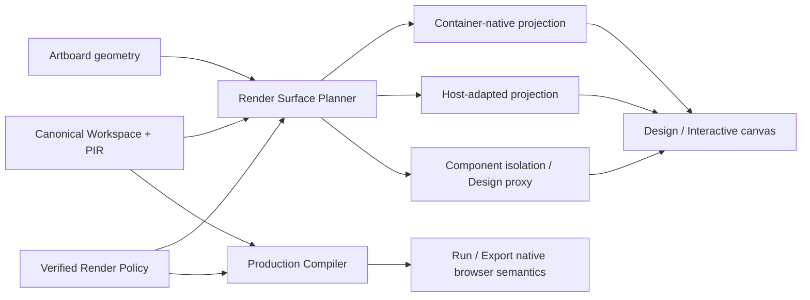

# 第三方渲染表面兼容、Viewport/Portal 与隔离策略

## 状态

- DecisionStatus：Accepted
- 日期：2026-07-24
- ImplementationStatus：Entry Surface and Render Policy V2 Foundation Implemented / Advanced Adaptation and Isolation Planned
- ProductGateStatus：G6 Planned / Blocked by G4 and G5 Exit Gates
- Global Phase：G6 Trusted Ecosystem
- Contract Owner：`@prodivix/plugin-contracts`、`@prodivix/plugin-host`
- Projection Owner：`@prodivix/plugin-react-host`、`@prodivix/plugin-browser`、`@prodivix/prodivix-compiler`
- Composition Root：`apps/web`
- 关联：
  - `specs/decisions/14.plugin-sandbox-and-capability.md`
  - `specs/decisions/17.external-library-runtime-and-adapter.md`
  - `specs/decisions/29.plugin-extension-points.md`
  - `specs/decisions/31.production-export-planner.md`
  - `specs/decisions/41.project-runner-and-canvas-modes.md`
  - `specs/decisions/48.controlled-vue-vite-portability-target.md`
  - `specs/decisions/54.vue-vite-product-surface-and-authenticated-catalog-golden.md`

## 背景

Blueprint 的页面与布局在 Design/Interactive 中直接投影到 Prodivix 宿主文档。画布 viewport 是用户选择的
artboard 宽高，而不是 Chrome 宿主页面的 CSS viewport。因此：

1. 百分比尺寸可以通过明确的入口 containing block 与画布尺寸闭合。
2. 原生 `vh`、`vw`、`position: fixed`、`window.innerHeight` 仍指向宿主 browsing context。
3. Portal 到 `document.body` 的弹层会逃逸画布的坐标、裁剪、层级与选择边界。
4. 第三方 CSS、运行时注入 style、全局 DOM 查询和浏览器尺寸读取不一定受父容器控制。
5. 把整个 Design 画布迁入 iframe 可以获得原生 viewport，却会切断默认的事件冒泡、拖拽、快捷键、焦点、
   React Context、样式继承、Inspector 定位和 selection overlay 链路。

现有 `renderPolicy` 已定义 `inline`、`host-overlay`、`disabled` Portal 模式；Official React Surface Host 已提供
owner-scoped style/overlay host 与 cleanup。但当前 contract 尚未声明组件对 viewport、browser metrics、动态 CSS
和隔离的要求，也不能说明“画布可见”是否等于“Design/Run 行为一致”。

## 决策摘要

采用“**声明式表面要求 + 容器单位投影 + Host Adapter + 有界隔离 fallback**”：

1. 页面/布局的 Authoring Viewport 由 artboard 内容盒定义；缩放和平移只改变观察变换，不改变 viewport。
2. Prodivix 控制的 PIR 样式在 Design/Interactive 中可以把 viewport unit 投影为 container query unit；Run/Export
   保留目标浏览器的原生单位。
3. 第三方 Render Policy 必须声明并经 Host 验证其表面要求，分类为 `container-native`、`host-adapted` 或
   `isolated`，不得由 Web UI 按组件名特判。
4. Portal、尺寸读取、Resize 与坐标换算通过 Host-owned Surface Environment 提供；不得 monkey-patch 全局
   `window`、`document` 或浏览器 API。
5. 无法安全适配的组件使用组件级隔离表面或 Design proxy；Run 继续使用完整应用 iframe。不得仅为解决
   `vh/vw` 把整个 Design/Interactive 画布切换为 iframe。
6. Compatibility declaration 属于 revision-bound plugin contribution projection，不进入 PIR，不形成第二作者态。

## 术语

- **Authoring Viewport**：页面/布局在 Design/Interactive 中使用的画布内容盒宽高。
- **Browser Viewport**：当前 browsing context 的原生 CSS viewport；Design 中通常是 Prodivix 宿主页面，Run
  中是 preview iframe。
- **Entry Surface**：PIR 页面/布局根节点外部、由投影层提供的确定尺寸 containing block。
- **Surface Environment**：Host 提供的只读 viewport、Resize、Portal root、坐标映射与生命周期能力。
- **Isolation Surface**：由 Host 管理的独立 browsing context；只通过版本化消息与 typed event bridge 通信。
- **Design Proxy**：无法安全直接渲染时用于选择、布局和诊断的可解释占位投影，不宣称运行时等价。

## 兼容等级

`renderPolicy` 的后续 wire revision 必须把下列要求解码到单一 current model；不得在 Web 内维护另一份 profile。
现有 `portal` 规则继续作为 Portal 事实源，新的 surface requirements 与其交叉校验。

| 等级               | 适用条件                                                                | Design/Interactive 行为                         |
| ------------------ | ----------------------------------------------------------------------- | ----------------------------------------------- |
| `container-native` | 依据父容器尺寸；不依赖 body Portal、原生 viewport unit 或全局浏览器尺寸 | 直接投影，完整节点选择和事件链路                |
| `host-adapted`     | 需要受控 CSS 投影、Portal root、Surface Environment 或 attested wrapper | 通过验证过的 Host Adapter 直接投影              |
| `isolated`         | 依赖独立 document、不可控全局 CSS/DOM、动态注入或无法适配的浏览器 API   | 组件级隔离；不能满足作者交互时使用 Design Proxy |

`unsupported` 不是第四种能力等级，而是当前 Host/target 无法满足已声明要求时的解析结果。解析必须 fail closed，并输出
可定位诊断，不能静默降级为 `container-native`。

兼容等级同时具有 `declared` 与 `verified` 状态。插件自声明不能自动获得主线程 DOM authority；只有 bundled official
或满足 G6 trust、integrity、capability 与 conformance 要求的 Host implementation 才能进入直接投影路径。

## Authoring Viewport 与 CSS 投影

### Entry Surface

1. `pir-page` 与 `pir-layout` 使用 viewport-sized Entry Surface。
2. `pir-component` 独立编辑保持 intrinsic surface；嵌套组件不得创建新的 Authoring Viewport。
3. Entry Surface 使用明确宽高和 size query container；artboard border、padding 与 scrollbar 的内容盒规则必须固定。
4. 画布 zoom 使用外层观察变换；不能把缩放后的像素值写回 viewport 或 PIR。

### 单位规则

对 Prodivix 可控制、可解析的作者样式，Design/Interactive projection 使用：

| 作者意图                  | 画布投影                               | Run/Export |
| ------------------------- | -------------------------------------- | ---------- |
| `%`、`h-full`、`w-full`   | 由 Entry Surface containing block 解析 | 原样       |
| `vh`、`svh`、`lvh`、`dvh` | `cqh`                                  | 原样       |
| `vw`、`svw`、`lvw`、`dvw` | `cqw`                                  | 原样       |
| `vmin`                    | `cqmin`                                | 原样       |
| `vmax`                    | `cqmax`                                | 原样       |

Authoring Viewport 是固定矩形，因此 small/large/dynamic viewport variants 在画布中收敛到同一个 container 维度；需要
验证移动浏览器 chrome 动态变化的场景必须进入 Run/Verification，Design 不得伪称覆盖。

投影必须使用 CSS value parser/AST，正确处理 `calc()`、`min()`、`max()`、`clamp()` 与嵌套函数，禁止正则全局替换。
Tailwind/class protocol 的 `h-screen` 等 utility 通过作者态 stylesheet projection 解释，不修改 PIR 中的 class token。
preview-only stylesheet 是 revision-bound、可丢弃 projection；导出源码不得残留 Prodivix 私有 container 替换。

### 第三方 CSS

第三方 CSS 只有在下列条件全部满足时才允许生成 Design preview variant：

1. package、版本、CSS resource 与 content digest 已固定；
2. Render Policy 显式声明允许的 transform；
3. parser 能完整理解目标语法，且不会执行 `@import`、网络 URL 或脚本；
4. 输出挂载到 owner-scoped style host，并随 disable/update/shutdown 清理；
5. 原始 CSS 保持不变，Codegen Policy 明确 Run/Export 使用的资源。

运行时动态插入的 stylesheet、CSSOM mutation、无法解析的 custom-property value 和未知预处理器输出不得猜测重写；
对应组件必须进入 `host-adapted` 的专用实现、`isolated` 或 Design Proxy。

`position: fixed` 不能通过 container unit 自动获得画布语义。只有 Render Policy 明确接受语义变化时，Adapter 才可将其
投影为画布内 absolute/overlay；否则使用隔离表面。

## Portal 与 Surface Environment

现有 `portal.mode` 保持唯一 Portal 策略：

- `inline`：内容留在节点投影位置。
- `host-overlay`：挂载到当前画布的 owner-scoped overlay root。
- `disabled`：Design 中关闭 Portal 行为并使用明确 fallback。

Host-side Surface Environment 至少提供：

1. 只读 viewport width/height 与稳定 surface identity；
2. 有界 Resize subscription；
3. style root 与 overlay root；
4. surface-local 到宿主坐标的映射；
5. focus、Escape、outside-interaction 与 cleanup bridge；
6. mode、target 与 projection revision。

这些能力通过受信任 Host port/React context 提供，不进入 JSON descriptor，不进入 Workspace，也不把 DOM handle 暴露给
community plugin runtime。Adapter 应优先使用第三方库公开的 Portal container、measurement 和 provider API。

多个画布或设备预览可以同时存在，因此任何基于全局 singleton viewport、全局 body Portal 或进程级当前画布的方案都被
禁止。所有 lease 必须绑定 plugin owner、installation、generation、surface 与 projection revision。

## Browser Metrics 与运行时 API

读取 `window.innerWidth`、`window.innerHeight`、`visualViewport` 或全局 `resize` 的第三方实现不能仅靠 CSS 修复：

1. 有注入点的库通过 Surface Environment Adapter 获取尺寸与 resize。
2. build-attested wrapper 可以把 surface metrics 映射为库公开 props/context。
3. 无注入点、强依赖真实 document/window identity 的库进入 `isolated`。

禁止重写宿主 `window.innerHeight`、替换全局 `ResizeObserver`、代理 `document.body` 或为某个组件安装全局浏览器 shim。
此类做法会污染编辑器、其他画布和并行 projection，也无法安全清理。

## 组件级隔离

组件级 iframe 是 fallback，不是默认渲染器：

1. 外层 wrapper 继续作为 PIR 节点参与父级 Grid/Flex/absolute 布局；iframe 填充 wrapper。
2. 固定或约束尺寸优先；intrinsic auto-height 只能通过有界、去抖、循环检测的 size handshake。
3. frame 只接收 revision-bound projection input，不能持有 Canonical Workspace 或直接写 Outbox。
4. 交互输出为 typed component event/intent，经 Host validation 后进入现有 Behavior/Command 链路。
5. 父编辑器默认只选择整个隔离节点；若未来支持 frame 内部 authoring，必须有独立 instrumentation contract，不能靠
   跨 frame `querySelector`。
6. keyboard、focus、pointer、clipboard 与 accessibility boundary 必须声明支持矩阵；跨边界拖拽不得假装原生可靠。
7. sandbox origin、CSP、Permissions Policy、网络、Secret 与 resource budget 复用 Plugin/Execution 安全不变量。

布局容器、Route outlet 或需要让子节点直接参与父级 CSS layout 的组件不适合组件级 iframe；无法提供 verified adapter 时，
Design 使用 Proxy，Run 才提供真实行为。

## Mode Contract

| Mode        | Viewport 语义                   | 第三方投影                                             | 作者态写入               |
| ----------- | ------------------------------- | ------------------------------------------------------ | ------------------------ |
| Design      | Authoring Viewport / container  | native、adapted；isolated 必要时使用 atomic-node/Proxy | 仅经 Command/Transaction |
| Interactive | Authoring Viewport / container  | native、adapted 或有界组件隔离；typed event bridge     | 不直接写入               |
| Run         | preview iframe Browser Viewport | Compiler 生成的完整应用与原生第三方运行时              | 禁止画布 drop authoring  |
| Export      | 目标 Browser Viewport           | Codegen Policy 输出原始生产依赖、CSS 与 adapter        | 只读 projection          |

Design/Interactive 成功不等于 Run parity；Run 成功也不证明 Design 可编辑。产品必须分别展示 authoring compatibility 与
runtime compatibility，不能用一个绿色状态合并。

## Canonical Data 与 Owner

1. PIR 保存组件 identity、props、children、class/style 作者意图与 typed references，不保存 compatibility result、
   DOM handle、iframe URL 或 preview CSS。
2. Render Policy contribution 保存纯数据 surface requirements；Host registry 保存 revisioned resolved projection。
3. 项目启用状态与配置继续由 Workspace/Settings owner 管理，并通过正式写入链路更新。
4. viewport mapping、scoped CSS、Portal root、iframe session 和 measurement 是可丢弃 projection/runtime state。
5. Compiler 消费同一 resolved policy snapshot，不能从 Web runtime object 反射 Codegen 规则。

## Diagnostics 与产品表达

诊断遵循既有 owner：

- Manifest、surface requirement、Host binding、attestation、lifecycle 与 isolation policy failure 使用 `PLG-*`；
- CSS/Codegen transform 与目标输出 failure 使用 Compiler diagnostics；
- PIR composition/reference failure 使用 `PIR-*`；
- Design approximation、交互受限与修复引导使用 `UX-*`。

组件库与 Inspector 至少显示：

1. authoring compatibility：完整、需适配、隔离节点、仅 Proxy、不可用；
2. runtime targets：React/Vite、Vue/Vite 等目标的 verified/unsupported 状态；
3. 影响能力：viewport、Portal、browser metrics、focus/keyboard、intrinsic size；
4. 可执行修复：启用 verified adapter、切到 Run、设置显式尺寸或移除不支持的能力。

未知状态是 `unknown`/evidence pending，不得显示为通过，也不得当作数值零风险。

## 拒绝的方案

### 整个 Design/Interactive 画布统一 iframe

拒绝作为默认架构。它能提供原生 viewport，但会让选择、拖拽、快捷键、React Context、Inspector 与 overlay 全部依赖
跨 frame 协议，并为已能容器化的组件支付不必要成本。Run 继续使用 iframe。

### 全局把所有 `vh/vw` 文本替换为 `cqh/cqw`

拒绝。正则无法理解 CSS grammar、字符串、custom properties 与动态 stylesheet，也会污染导出源码。

### 修改全局 `window` 欺骗第三方库

拒绝。全局浏览器对象无法按多个画布安全分区，且破坏宿主与其他插件。

### 在 `apps/web` 按库名维护兼容分支

拒绝。兼容事实属于 Render Policy 与 verified Host implementation；Web 只组合 surface。

### 任意第三方默认视为 container-native

拒绝。未声明或未验证的全局 CSS、Portal 和 browser API 会逃逸画布，必须 fail closed。

## 后果

- Design 可在不引入整画布 iframe 的情况下获得与 artboard 一致的百分比和 viewport-unit 语义。
- Official/verified 第三方库可以复用同一 Surface Environment，而不是各自访问编辑器 DOM。
- 不可控组件仍有组件级隔离或 Proxy 路径，但跨 frame authoring 能力会显式受限。
- Render Policy wire、Host ABI、CSS projection、diagnostics 和 conformance matrix 需要新增实现。
- 多 target parity 必须分别证明 authoring projection 与生产运行，验证成本增加但结果可审计。

## 实施顺序

1. 冻结 Render Policy surface requirements 的新 wire revision、current model、semantic validator 与 diagnostics。
2. 将 Entry Surface 升级为 size query container，并实现 author-controlled CSS value AST projection。
3. 扩展 Official React Surface Host 的 viewport/Resize/coordinate environment，复用现有 style/overlay lease。
4. 为 bundled official plugins 声明兼容等级并补 Portal、focus、resize 与 cleanup conformance。
5. 建立 digest-bound 第三方 preview CSS pipeline 与 fail-closed policy。
6. 建立组件级 isolation port、Design Proxy 与 typed event/size handshake。
7. 在 React/Vite、Vue/Vite、Design、Interactive、Run 与 Export matrix 中完成 Golden。

实现不得用长期双 schema owner、Web 私有 compatibility map 或 PIR 临时字段过渡；wire migration 在边界统一进入 current
model。

## 当前实现（2026-07-24）

1. `renderPolicy@2.0` 已冻结为新的 exact wire contract；v1 schema 仅保留为历史 wire，Web Host 不再注册 v1。
2. v2 必须声明 library-level `surface`，rule 可完整覆盖；strict Schema 与 semantic validator 会交叉检查兼容等级、
   viewport、browser metrics、style scope、focus/keyboard、intrinsic size 和既有 Portal 策略。
3. v2 wire 在 `@prodivix/plugin-contracts` 边界解码为无数字版本的 `RenderPolicyContribution` current model；Web
   resolver、batch validator 和 query projection 只消费 current model。
4. 当前 Host 已验证 `container-native` 与已 attested、owner-scoped 的有限 `host-adapted` profile；尚未实现的
   container projection、Surface Environment、verified CSS transform 和 isolation 会 fail closed 为 `PLG-*`
   resolver diagnostic。
5. Ant Design、MUI 与 Radix bundled resources 已迁移到 v2，并由 artifact generator 按 point 校验 exact contract、
   resource integrity 与 package digest。
6. 页面/布局 Entry Surface 已成为 CSS `container-type: size` query container；作者样式 AST 单位投影仍是下一步。

## 验收

- [x] 页面/布局 Entry Surface 已提供确定 containing block 与 size query container，组件入口保持 intrinsic。
- [x] React/Vite 与 Vue/Vite 生成应用 mount 已提供 viewport-sized root surface。
- [x] Official Surface Host 已有 owner-scoped style/overlay root 与 cleanup。
- [x] Render Policy surface requirements 与三档兼容等级通过 strict codec/semantic validation。
- [ ] Design/Interactive 的 author-controlled viewport unit 使用 CSS AST 投影为 container unit。
- [ ] Portal、browser metrics、focus、resize 与坐标不依赖全局 singleton 或 Web 库名特判。
- [ ] 未适配的第三方 CSS/JS fail closed 到 isolation、Proxy 或 unsupported，并有诊断。
- [ ] 组件级 isolation 满足尺寸、事件、权限、资源与 cleanup conformance。
- [ ] React/Vite、Vue/Vite、Design、Interactive、Run、Export 的兼容矩阵与 Golden 通过。
