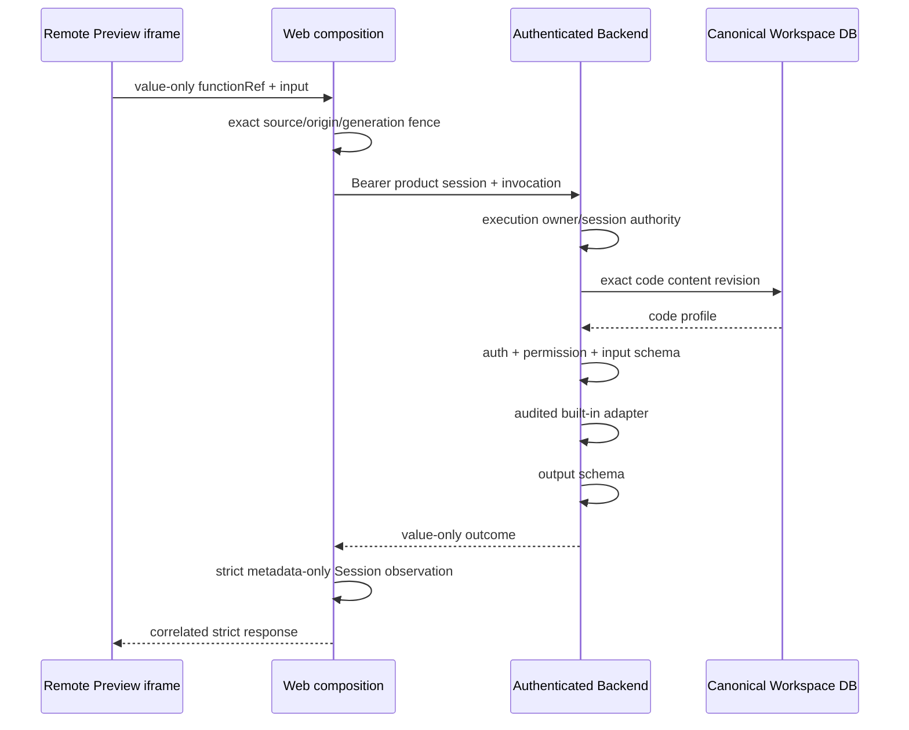

# G2 Auth 与 Server Runtime 实施计划

## 状态

- DecisionStatus：Accepted
- ImplementationStatus：A0-A5 Implemented / A6 Authenticated + Permission First Vertical + Import Graph + Live Mutation Safety Gate Implemented / A7 Golden Target Matrix + Route/Auth Configuration Authoring/Issues + Cross-producer Invocation Devtools First Vertical Implemented / A8 Remote Live Audited Secret HMAC First Vertical Implemented / A9 Isolated Worker Sealed Secret Resolution First Vertical Implemented / A10 Worker-attempt Secret Recovery First Vertical Implemented
- ProductGateStatus：G2 In Progress
- Global Phase：G2 Executable Full-stack Workspace
- 日期：2026-07-19
- Owner：`@prodivix/server-runtime`、Compiler、Remote composition、Backend、Remote Worker
- 关联：
  - `specs/decisions/46.auth-and-server-runtime.md`
  - `specs/implementation/g2-executable-full-stack-workspace.md`
  - `specs/diagnostics/server-runtime-diagnostic-codes.md`

## 目标

让同一个 canonical route CodeReference 在 Preview/Test/Export 中使用稳定 Auth/permission/Server Function
语义；Remote current-principal/owner-guard 与 deterministic Auth Test/action 两条纵切共同证明 identity、
authorization、schema、client/server partition、fixture isolation、取消和 mutation replay，而不在 Backend API
进程执行任意项目源码。

## Canonical 与运行态边界

| 内容                                          | Owner / 持久性                                              |
| --------------------------------------------- | ----------------------------------------------------------- |
| code source、`prodivix.serverRuntime` profile | Canonical Workspace code document，durable                  |
| route loader/action/guard binding             | RouteManifest CodeReference，durable                        |
| Auth provider 与 permission catalog           | `/config/auth.json` project-config，reference-only、durable |
| product principal/session                     | Auth service；session server-only                           |
| permission decision                           | invocation-local，可审计但不写 Workspace                    |
| invocation/outcome/redirect/error             | execution/session-local，可丢弃                             |
| iframe bridge                                 | bounded value-only transport，不含 authority material       |
| generated isolated server bundle              | derived artifact，可重建，不是作者态真相                    |
| Server Function environment policy            | canonical profile 只保存 field -> SecretRef identity        |
| environment snapshot/grant/Secret material    | Backend Environment store；execution-local、短期、可审计    |

## 实施阶段

### A0：Decision 与 owner hard cut

状态：Implemented。

- Accepted ADR 冻结 metadata、Auth、permission、invocation、outcome、target 与安全边界。
- Server Function 复用 code document/CodeReference/route CodeSlot，不新增私有保存态。

### A1：Transport-neutral contract/kernel

状态：Implemented。

- `@prodivix/server-runtime` 提供 strict profile、bridge codec、adapter registry。
- authorization 与 input schema 在 effect 前；output schema 与 outcome compatibility 在 effect 后。
- adapter 只看到 value input、workspace/function/invocation identity 与 principal，不看到 session/token。

### A2：Backend Auth first vertical

状态：Implemented。

- execution grant 无条件绑定创建 session。
- exact snapshot partition读取 `code` content revision。
- strict profile 与 JSON Schema 2020-12 validation；schema/code document 具有 bytes/depth/nodes 预算且不解析外部 ref。
- read 只允许 `core.auth.current-principal` 和 `core.auth.require-workspace-owner`；不执行 source。
- live mutation 只允许 `core.server.execution-state.put`，将 typed Route action value 写入 execution-scoped
  durable state；不执行 source、不访问网络/Secret、不写 Canonical Workspace。
- authenticated/no-store endpoint 与稳定 `SVR-*` error envelope。

### A3：Remote Preview bridge

状态：Implemented。

- generated iframe 发送 value-only function reference/input，并以 1 MiB/64-depth/65536-node 预算 fail closed。
- Web 校验 exact active frame 与 opaque capability origin，token 只用于 Web -> Backend。
- run coordinator 以 generation/job fencing 拒绝旧 Preview response。
- completion 只通过 `server.function` / `prodivix.server-function-invocation-trace.v1` 投影 metadata-only
  observation，并要求 exact active generation、Session 与 Job；terminal finite Preview 不被重新打开。

### A4：Compiler/Route first vertical

状态：Implemented。

- static-client 与 execution-parent-gateway target manifest。
- route profile export/kind/adapter/auth compatibility preflight；整个 profiled Code document 从客户端文件图隔离。
- server module 不进入 App import graph；Remote Preview snapshot 要求 `server-function` capability。
- guard -> loader -> render；deny/redirect/error fail closed。
- Browser Preview/ZIP 未配置安全 target 时 compile blocked。

### A5：Deterministic Auth Test 与 route action

状态：Implemented。

- `@prodivix/server-runtime` 提供 strict execution-only principal/permission/function fixture 与 isolated session；
  未命中 fixture不 fallback live。
- Executable Project Snapshot v6 保留 provision digest/Remote strict codec，只在 Test filesystem 投影
  `deterministic-test`；Preview/Build 投影 `disabled` 且不含 fixture value。
- Compiler `deterministic-test` target 在 effect 前验证 exact fixture、principal、permission 与 mutation
  invocation-key policy；Workspace Test为当前内置 Auth adapter生成默认 fixture，任意 action 需要显式 fixture。
- generated React/Vite runtime 提供 typed Route action input、redirect/error、AbortSignal/navigation cancel、
  invocation-key replay/conflict fence与 value outcome 后 loader revalidation。
- iframe cancel 经 exact frame/origin decoder、active run coordinator、AbortController 与 HTTP signal 终止请求。
- 当时 Remote live mutation 保持关闭；后续 A6.5 已只为 execution-state 安全 adapter 开放该边界。

### A6：Isolated full-stack server target

状态：Authenticated + `workspace.owner` permission read/guard + bounded import graph Implemented；更新后的 GitHub rootless 证据待阶段性推送；Secret/mutation 扩展能力 Planned。

- Snapshot v6 新增 digest-bound `production` entrypoint 与 strict `serverFunctionPlan`；Remote codec、
  Control Plane 与独立 `prodivix.remote.server-function` provider使用同一 neutral contract。
- Compiler `isolated-server-function` target 将一个 canonical TypeScript/JavaScript named export 及其 relative static
  ESM dependencies 转译为确定性 Node ESM graph；最多 128 modules、64 depth、4 MiB UTF-8 source。exact/
  extensionless/`.js -> .ts` resolution 必须唯一，cycle 可保留；external/dynamic/CommonJS/import-type/triple-slash、
  missing/ambiguous/escape 与非 TS/JS target 在 snapshot 创建前 fail closed。当前 policy 接受
  `public|authenticated|permission(workspace.owner) + read + server + prodivix.code-export`；其他 permission、mutation、edge 或其他 adapter 均 blocked。
- Backend 在 exact Workspace owner preflight 后，于 authenticated create 的受信 transport header 中投影短期
  `providerId + principalId + sorted allowed permissions + Workspace + snapshot + expiry` attestation；permission list
  严格去重、最多 32 项且当前只签发 `workspace.owner`。TTL 默认 2 分钟、最大 5 分钟且不晚于
  product session。它不进入 public Remote envelope、ExecutionRequest、snapshot 或源码。Control Plane 将 authority
  与 execution 同事务写入独立 PostgreSQL row，SHA-256 idempotency identity 绑定 principal/target；Worker claim
  再绑定 execution/worker/attempt，终态删除 authority。session id、Bearer、cookie、service token 与 Secret 不在该 shape。
- Worker 在 rootless Podman networkless runtime 中投影 exact value-only invocation；可信 Server Runtime/Worker
  会再次强制 public|authenticated|workspace.owner-permission/read/server/code-export policy。protected function 必须获得未过期且 exact
  execution/worker-attempt/Workspace/snapshot 匹配的 authority；permission function 还必须命中 exact
  `workspace.owner` grant。Worker 只向 sandbox 写入最小 `AuthPrincipal + allowed permissions` 文件，generated runner
  在调用项目代码前严格校验并删除，public function 不接收该 projection。随后按原始 snapshot
  profile/output schema校验结果，再发布唯一 canonical result artifact。request/result/authority runtime path
  不进入 filesystem diff，预算、取消、lease fencing、Secret canary 与 orphan cleanup 复用现有边界。
- Worker canonical result 聚合 root/import module 的 bounded CodeArtifact SourceTrace；GitHub rootless Gate 的 production
  探针已扩展为真实执行 transitive helper module，并将在阶段性推送后验证 runtime network hard cut、result contract、
  source trace 与 cleanup。
- Worker 只在 canonical result 二次校验和 artifact upload 成功后发布 strict metadata-only `server.function` durable
  trace；Remote provider 以 request/span/function identity、artifact status/error、唯一 root CodeArtifact 与 exact
  artifact/trace SourceTrace correlation 双重校验，缺失、乱序、重复或漂移时不能接受 production success。
- Backend API 与 Control Plane 继续不加载或执行项目源码；A9 只让 isolated Worker 在 exact claim/lease
  下取得直接密封给临时 Worker key 的 one-shot Secret material。isolated code-export mutation、其他 permission、
  KMS/key rotation 与完整 Remote Preview gateway parity仍保持关闭。

### A6.5：Remote live mutation 安全 Gate

状态：Implemented。

- Compiler 的 execution-parent-gateway target 只放行
  `core.server.execution-state.put + route-action + server + mutation + authenticated + invocation-key`；其他
  mutation adapter、public/permission 组合、缺 replay policy 与 Browser/ZIP target 在 effect 前 fail closed。
- Web parent HTTP client 固定发送 `X-Prodivix-Server-Function-Intent: mutation-v1`，Bearer 仍不进入 iframe；
  Backend mutation 要求 exact `BACKEND_ALLOWED_ORIGINS` Origin。missing/cross-origin/wrong-intent 与同 invocation
  跨 allowed-origin replay 均拒绝，CORS preflight 只开放显式 intent header。
- Backend 在 exact execution owner/session/snapshot/code revision 与 input schema 后执行审计过的 state adapter。
  adapter 只接收 generated `prodivix.route-action-input.v1` 的 JSON `{ key, value }`，不接收 session、token、
  cookie、Origin、源码或 Secret；credential canary 命中时不调用 effect，响应只保留固定安全 code。
- PostgreSQL migration v6 以 execution/function/state-key 隔离最多 256 个 state entry，并以
  execution/function/invocation 隔离最多 256 个 replay。snapshot/code revision、origin、adapter、function 与
  canonical input 共同形成 SHA-256 identity；state revision 与 replay result 在同一 transaction 中提交。
  exact duplicate 返回首次结果，identity drift、取消、容量耗尽和 execution authority 删除均 fail closed。
- 本机 PostgreSQL/CI Gate 重复验证 24-way concurrent exact replay 只有一次 effect、revision 1 与一条 ledger，
  并覆盖第二 mutation revision、identity drift、取消、双容量预算和 authority cascade。

### A7：产品闭环与 G2 Golden

状态：Golden target contract matrix + Route/Auth Configuration Authoring/Issues + Remote Preview/isolated production Invocation Devtools first vertical Implemented；完整产品闭环继续建设。

- Workspace 从 canonical Code document profile 确定性投影 loader/action/guard 候选、Route binding 与 exact
  profile/export/definition/slot issue；projection 不拥有源码或 binding。现有候选的 bind/unbind 复用
  `set-runtime-ref` 可逆 Route intent，不建立第二套 registry/config 保存态。
- Blueprint Inspector Code 页已为 active canonical Route 提供 Guard/Loader/Action 选择、跳转 CodeArtifact，以及
  Remote audited adapter / isolated code-export 两种 `workspace.owner` guard preset。preset 在单个 Workspace
  Transaction 中同时创建 canonical TypeScript CodeArtifact 和 Route guard binding；只读 Workspace 与 mounted
  Route module 继续 fail closed。
- Web Issues 复用同一 Workspace projection 发布 `WKS-EXPORT-SERVER-PROFILE-INVALID`、
  `WKS-EXPORT-SERVER-EXPORT-REQUIRED`、`WKS-EXPORT-SERVER-DEFINITION-MISSING` 与
  `WKS-EXPORT-SERVER-SLOT-MISMATCH`；诊断 metadata 只含 path/route/slot/artifact/export identity，不含源码、
  authority 或调用 value。
- `@prodivix/server-runtime` 已提供 `/config/auth.json` 的 exact reference-only contract；只允许 version、provider id
  与 sorted unique 32-item permission catalog，credential-shaped/unknown field fail closed。Workspace read/create/update
  只经可逆 Operation，Resources 已提供产品会话启用、`workspace.owner` declaration 与 Route binding 状态视图。
- 受保护 binding 在作者投影、Issues、React/Vite Remote target 与 isolated production target 同时要求 valid config、
  exact supported provider 和 declared permission。Golden fixture 固定 config wire persist/reload，并覆盖 missing/
  undeclared fail-close。声明不替代 runtime permission decision，Test principal 继续是 execution-only。
- Remote Preview completion 与 isolated production Worker 现在以同一 strict metadata-only contract 关联 exact
  active Session/Job 或 durable execution；isolated trace 只在 canonical artifact upload 后发布，Remote provider
  强制 artifact/trace correlation。Execution Center 的独立 Server 表面显示 function/export、attempt、result kind/
  安全错误码与 duration；仅对唯一 root CodeArtifact 显示源码按钮，并在打开共享 Code Authoring overlay 前重算
  exact Workspace snapshot。input/output、principal/session/cookie/token/Secret/source 不进入 detail；stale snapshot/
  generation、missing/stale Session Job、ambiguous source、conflict 与未知字段 fail closed，terminal Job 保持 terminal。
- 任意第三方 Auth provider、任意 permission policy 编辑，以及 Remote Test/后续 producer 的完整 invocation debugger
  继续建设。
- loader result 与 Data/PIR runtime composition。
- Living Golden Auth/Server fixture 在同一 server-owned code document 中保存两个具有相同
  `route-guard + permission(workspace.owner) + read + server + input/outcome` contract 的 canonical export：
  审计内置 `core.auth.require-workspace-owner` 与 isolated `prodivix.code-export`。矩阵显式验证
  Browser/static 两者均 blocked、deterministic Test 两者均 supported、Remote live 只允许审计内置 adapter、
  isolated production 只允许 code-export；不把 target-specific adapter 差异伪装成全目标通用执行。
- deterministic Test 对两个 export 执行 exact fixture/permission session；isolated production 实际 materialize
  production filesystem、执行 transitive helper import、消费 `0600` one-shot authority，并以原 request/function/schema
  二次校验响应。Remote live 验证 source-free React/Vite gateway projection，真实 Backend effect 继续由现有
  Auth/Server Backend Gate 覆盖。
- matrix 同时固定 invocation correlation、root/helper CodeArtifact SourceTrace、client snapshot source isolation、
  snapshot/result credential canary 与 strict invocation/authority extra-field rejection，并进入普通 execution matrix
  和 GitHub rootless workflow。
- Golden Gate 另从两种产品 preset 出发，验证原子 create+bind、Workspace wire persist/reload、无 authoring issue、
  Remote source-free gateway compile 与 isolated TypeScript transpile/production plan，避免手写 fixture 掩盖作者链路漂移。
- token/session/cookie/Secret/source leak canary 覆盖 request、snapshot、log、trace、artifact、crash。

### A8：Remote live audited Secret HMAC first vertical

状态：Implemented；A9 已另行关闭 isolated Worker Secret resolution first vertical；任意 adapter Secret、KMS/key rotation 与完整跨表面 leak closure 继续关闭。

- `@prodivix/server-runtime` profile 新增 exact reference-only `environment.secretsByField`，最多 32 个 field，
  每项只能是 `SecretRef { bindingId }`。authorization/schema kernel 只向 adapter 提供声明 field 的
  callback-bound `useSecret`，拒绝 missing/extra lease、undeclared field 与 material-bearing output，并在所有终态 revoke lease。
- Remote execution-parent Compiler 只放行
  `core.server.hmac-sha256 + route-action + server + read + authenticated + exactly key SecretRef`；已有 Auth/mutation
  adapter 携带 environment privilege 会 blocked。ready snapshot 的 Preview capability 同时要求
  `server-function` 与 `environment-binding`。Browser/static、deterministic Test 与 isolated production 分别以
  gateway/environment/isolated-policy blocking code fail closed，Test fixture 不能模拟或降级 live Secret。
- Backend 从 exact execution owner/session/snapshot/code revision 与 live environment authority 解析 profile；HMAC input
  必须是 strict typed Route action + JSON submission。Environment store grant 固定
  `prodivix.remote.server-function-gateway/sandboxed/trusted-service/server/process`，并绑定
  workspace、principal/session、environment revision、execution/artifact/export/invocation、binding 与 `key` field；
  TTL 最多 30 秒且受 product session expiry 截断。
- Secret 只以 bytes 进入 `UseSecret` callback，长度预算为 32-4096 bytes；callback 内对 canonical JSON value 计算
  HMAC-SHA256，只返回 algorithm 与 64 位 hex digest。grant 在 callback 后立即 revoke；material/source/session/grant/
  binding identity 均不进入 bridge response。Backend fake-store contract 覆盖 exact IssueGrant/UseSecret/Revoke 与 HTTP
  composition，真实 PostgreSQL grant/audit/at-rest 语义复用已建立的 Environment integration Gate。
- Living Golden matrix 新增 `audited-secret-hmac` 列：Browser/static blocked、deterministic Test blocked、Remote live
  supported、isolated production blocked；Remote cell 必须同时携带 `environment-binding` 与 `server-function`，并继续
  通过 client snapshot source isolation 与 credential/Secret canary。
- `audited-secret-hmac` 仍不能降级为 isolated code export；A9 使用独立 `isolated-secret-code-export` target cell，
  不复用 HMAC adapter 或扩大 Remote live adapter allowlist。

### A9：Isolated Worker sealed Secret resolution first vertical

状态：Implemented；A10 已另行关闭 bounded cross-worker-attempt recovery；KMS/key rotation、其他 permission、mutation 与完整 leak closure 继续关闭。

- isolated Compiler 只对 `prodivix.code-export + read + server + public|authenticated|workspace.owner` 放行
  reference-only environment policy，并在 production snapshot 显式要求 `environment-binding`；mutation、edge、其他
  adapter 与未知 permission 仍在 snapshot 前 blocked。
- Worker 为每次 resolution 生成临时 X25519 recipient key；Control Plane 的 worker-token endpoint 先验证 exact
  execution/worker/lease/attempt、snapshot digest、production plan 与 environment capability，再只向 Backend broker
  转发公钥和不可变 function/invocation identity。resolution 只允许初始 `starting` 或 exact active lease reclaim 的
  `running` phase，Worker 请求固定 15 秒超时，
  Backend 与 Control Plane 两段 ciphertext response 都强制 JSON + `no-store` + `nosniff`，并在读取时执行 768 KiB
  streaming hard cut；网络、状态、解封或 identity 失败统一成为 `secret-resolution-denied`。Control Plane、claim、
  authority、snapshot 与 request 均不承载 material。
- Backend internal broker 使用独立 service token，重新读取 exact execution authority、code content revision 与 canonical
  profile，要求 live environment/session/workspace/snapshot/binding 全匹配后签发
  `remote-isolated/isolated-runner/server/process` 30 秒 grant。Secret 只在 `UseSecret` callback 中进入内存，随后直接以
  X25519 + HKDF-SHA256 + AES-256-GCM 密封给 Worker，grant 立即 revoke。
- PostgreSQL migration 7 以 execution 为主键保存 current worker attempt、function、invocation、recipient key 与 ciphertext-only
  envelope；exact retry 返回同一 envelope，pending、同 attempt key drift 与 function/invocation drift fail closed。明文、environment grant 与
  service credential 不进入该 replay row。
- Worker 将解封后的 exact sorted field map加入当前执行 output guard，只向 rootless sandbox 写 mode-0600 one-shot
  material 文件。install-phase payload 不含 invocation/authority/Secret；install 结束后先清除残留进程、完成 runtime
  network-none 验证、删除并 mode-0700 重建 reserved `.prodivix` transport directory、固定四个 canonical path，再通过每次执行随机 nonce 绑定的第二 control message 投影 runtime material，防止 install output
  伪造 phase marker。generated runner 在 import/effect 前严格校验并删除，只通过 callback-bound `useSecret` 暴露声明
  字段，对返回值递归执行 material leak scan；runtime 结束后再次清除残留进程才允许 filesystem capture。Worker 在所有
  终态清空 field projection，Worker/Control Plane 双输出 Gate继续覆盖 log/trace/artifact/report/crash。
- Living Golden matrix 新增 `isolated-secret-code-export`：Browser/static、deterministic Test、Remote live blocked，isolated
  production supported并真实执行/消费 material；GitHub rootless probe 同时验证 owner authority、Secret use、transport
  file exclusion、runtime network hard cut、canonical result 与 source trace。

### A10：Worker-attempt Secret recovery first vertical

状态：Implemented；仅覆盖同一 immutable read-only isolated invocation 的 lease-expiry recovery，KMS/key rotation、mutation replay、跨 replica artifact/quota recovery 与任意 identity drift 继续关闭。

- Execution repository 继续只在旧 lease 过期后 reclaim `starting|running|cancelling` Job，并原子递增 attempt；Worker 对
  reclaimed `running` Job 不再重复提交非法 `running -> running` transition。reclaimed `cancelling` 在读取 snapshot、
  resolution 或启动 sandbox 前直接完成 cancellation。
- Backend resolution row 保持每个 execution 唯一一行。更高 attempt 只有在 artifact/export/invocation identity 完全不变时
  才能通过 PostgreSQL conditional upsert 原子替换 worker/recipient，清空旧 envelope并成为新的 pending current attempt；
  同 attempt key drift、低 attempt、跨 function/invocation drift全部冲突。
- rotation 之后，旧 attempt 的延迟 `Complete`、exact replay 与 abandon 都无法修改 current row；新 attempt 重新读取 exact
  environment revision、签发独立短期 grant、使用新 X25519 recipient 生成新 envelope。旧 ciphertext 不能被新 Worker
  解封，数据库也不保留 superseded envelope history。
- Control Plane 只对 exact active worker/lease、positive attempt、未过期 `starting|running` 状态开放 broker；HTTP response
  仍执行完整 identity校验。Worker Gate 真实覆盖 attempt 2 在 `running` 状态重新解析 Secret、执行、上传 canonical result
  并终态成功，且没有第二次 running transition。

## First vertical 调用链

## 验证证据

- `pnpm --filter @prodivix/server-runtime test`
- `pnpm --filter @prodivix/workspace test`
- `pnpm --filter @prodivix/runtime-core test`
- `pnpm --filter @prodivix/runtime-remote test`
- `pnpm --filter @prodivix/prodivix-compiler test`
- `pnpm --filter @prodivix/web test`
- `pnpm --filter @prodivix/remote-runner-control-plane test`
- `pnpm --filter @prodivix/remote-runner-worker test`
- `cd apps/backend && go test ./internal/modules/remoteexecution`
- `pnpm check:core-boundaries`
- 汇总 Gate：`pnpm verify:g2:auth-server-runtime`
- Golden target matrix Gate：`pnpm verify:g2:auth-server-golden`
- live mutation 汇总 Gate：`pnpm verify:g2:auth-server-live-mutation`
- live mutation PostgreSQL Gate：
  `go test ./internal/modules/remoteexecution -run '^TestServerFunctionLiveMutationPostgreSQLGate$' -count=1 -v`
- isolated 汇总 Gate：`pnpm verify:g2:isolated-server-runtime`
- isolated import graph Gate：`pnpm verify:g2:isolated-server-import-graph`
- isolated authenticated/permission authority Gate：`pnpm verify:g2:isolated-server-auth-authority`
- isolated worker-attempt Secret recovery Gate：`pnpm verify:g2:isolated-server-secret-recovery`
- recovery PostgreSQL concurrency Gate：
  `go test ./internal/modules/remoteexecution -run '^TestIsolatedSecretResolutionPostgreSQLAttemptRecoveryGate$' -count=1 -v`
- Linux rootless Gate：`pnpm verify:g2:rootless-sandbox`（GitHub Actions）

Contract tests必须证明：unknown field、session mismatch、revision drift、schema mismatch、unsupported adapter、
Browser/static target、cross-origin frame、HTTP Origin/intent 与 stale generation 均在 effect/render 前失败；
mutation exact replay 只执行一次，跨 origin/input drift、取消、容量与 credential echo 均 fail closed；成功响应
不得出现 session id、token、cookie、source 或 Secret canary。Test 还必须证明 fixture missing、permission/principal missing、
mutation replay conflict、取消，以及 Preview/Build disabled projection 均 fail closed。
Secret vertical 还必须证明 profile 只含 reference、undeclared/missing/extra lease fail closed、Backend grant/use/revoke
完全绑定 execution/principal/session/environment/function/invocation/binding/field、material echo 被拒绝，以及
Remote capability propagation和 Browser/Test/isolated target matrix 不发生降级。
Remote invocation observation 还必须证明 exact generation/session/job correlation、post-terminal retention、
stale/cancel/conflict 语义、strict unknown-field rejection，以及 input/output/credential/source canary 不进入 detail；
Browser 未有安全 producer 时不得伪造 Server observation。
Isolated target 还必须证明 production plan/digest codec、provider identity、invocation correlation、output schema二次校验、
result artifact唯一性、runtime断网与 container cleanup；authenticated authority 的 missing/expired/target/attempt drift、
session/token extra field，以及不支持的 auth/effect/adapter 和 external/dynamic/unresolved/
ambiguous/budget-exhausted import graph 必须在执行前失败。

## 风险与停止条件

1. 任一设计要求把产品 credential 传入 iframe、Workspace、snapshot 或生成源码时停止。
2. 任一 custom adapter 需要在 Backend API 进程加载项目 source 时停止，转入 isolated target。
3. 未有 deterministic fixture 时 Workspace Test 不得 fallback live Auth。
4. 除 A6.5 审计过的 execution-state adapter 外，未有 CSRF/idempotency/replay fence 时不得启用 live route action mutation。
5. profile/route kind/target capability不匹配时必须 compile blocked，不允许跳过 guard。
6. isolated production target 需要 product credential 或 runtime network 时停止；principal 只能通过独立短期 authority
   lease 投影，Secret 只能通过 A9 exact lease + ephemeral recipient sealed channel进入 one-shot material 文件。它们都不能进入
   value request、snapshot、源码或通用 Worker authority。Remote live 仅允许 A8 审计 HMAC，不得复用任一例外扩张 adapter。

## 验收标准

- [x] 没有第二套 Server 源码/route binding 保存态。
- [x] Auth/session/permission 与 Server Function 公开 contract、错误语义、owner 已稳定。
- [x] Remote authenticated guard/loader first vertical 可重复验证。
- [x] Browser/static/client graph 与 session/token boundary fail closed。
- [x] deterministic Test、typed action mutation/replay/cancel/revalidation 完成。
- [x] public|authenticated|workspace.owner-permission/read bounded canonical TS/JS graph 的 isolated production vertical 完成。
- [x] Remote execution-state live mutation 的 exact-origin/intent、durable replay 与 canary 安全 Gate 完成。
- [x] static relative import graph 的 deterministic projection、预算、transitive fail-close、本地执行与 SourceTrace Gate 完成。
- [x] isolated authenticated read/guard 的 Backend attestation、Control Plane atomic store、worker-attempt lease、runner
      one-shot principal projection 与本地 PostgreSQL/canary Gate 完成。
- [x] isolated `workspace.owner` permission read/guard 的 sorted bounded grant、idempotency identity、Worker/runner
      pre-effect enforcement 与 rootless probe contract完成。
- [x] Auth/Server Golden target matrix first vertical 覆盖 Browser/static、deterministic Test、Remote live gateway
      projection 与 isolated production 的显式支持/拒绝单元格、真实 Test/production 执行、correlation、SourceTrace
      和 credential/source boundary。
- [x] Route Auth/Server authoring first vertical 完成 canonical candidate/binding/issue projection、可逆 bind/unbind、
      原子 Remote/isolated owner-guard preset、Blueprint Inspector/Code jump、Issues 与 wire reload -> compile Golden Gate。
- [x] Auth provider/permission configuration authoring first vertical 完成 strict reference-only contract、
      `/config/auth.json` 可逆 Workspace authoring、Resources/Issues 产品面、Remote/isolated compile Gate 与 Golden reload。
- [x] Remote Preview invocation devtools first vertical 完成 metadata-only trace contract、exact Session/Job
      correlation、terminal retention、CodeArtifact SourceTrace、Execution Center Server 表面与 credential canary Gate。
- [x] isolated production invocation devtools second producer 完成 artifact-upload-before-trace、Remote artifact/trace
      双校验、唯一 root CodeArtifact、exact Workspace snapshot SourceTrace navigation 与 missing-trace fail-close Gate。
- [x] Remote live audited Secret HMAC first vertical 完成 reference-only profile/kernel、exact Backend
      IssueGrant/UseSecret/Revoke、HTTP composition、`environment-binding` propagation、Golden target matrix 与 canary Gate。
- [x] isolated Worker sealed Secret resolution first vertical 完成 exact claim/lease broker、X25519 sealed envelope、
      PostgreSQL one-shot replay、remote-isolated grant、Worker/rootless one-shot `useSecret`、Golden target matrix 与 leak Gate。
- [ ] 更新后的 transitive import rootless GitHub probe 取得阶段性推送后的远端证据。
- [x] exact active lease 下的 read-only isolated Secret cross-worker-attempt recovery、旧 ciphertext/attempt revoke 与 PostgreSQL concurrency Gate。
- [ ] KMS/key rotation、完整 leak closure、其他 permission 与任意项目源码 mutation target 完成。
- [ ] Auth/Server 完整 Golden 与 G2 Product Gate closure 完成。
