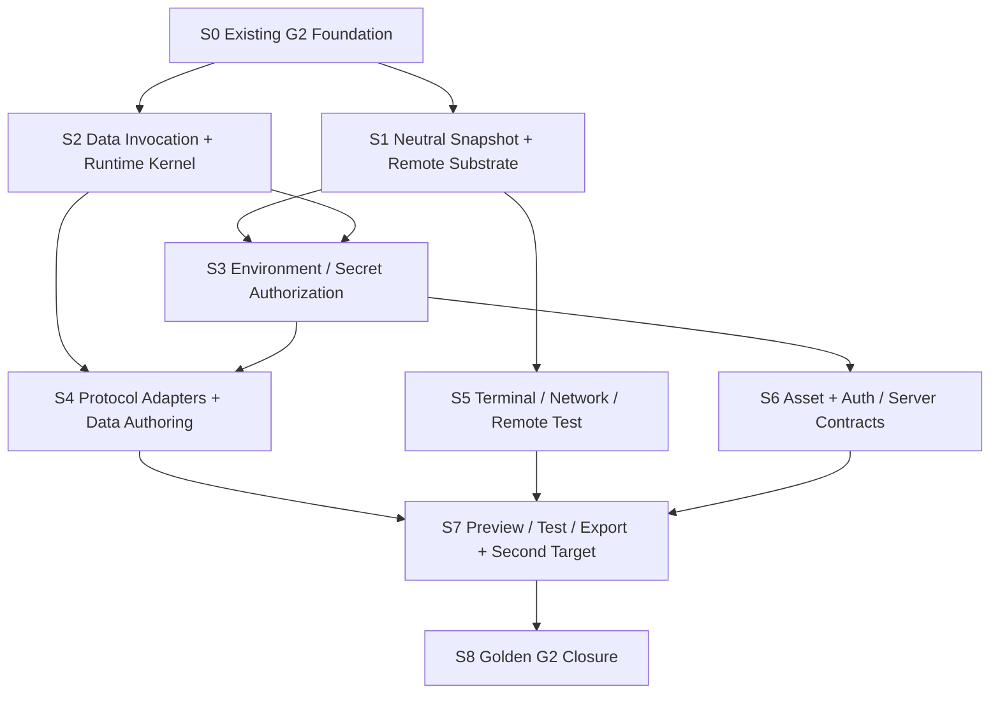

# G2 Executable Full-stack Workspace 总实施计划

## 状态

- DecisionStatus：Accepted
- ImplementationStatus：S0-S2 Implemented / S3-S8 In Progress / S6 Auth A10 Worker-attempt Secret Recovery First Vertical Implemented
- ProductGateStatus：In Progress
- Global Phase：G2 Executable Full-stack Workspace
- 日期：2026-07-19
- Owner：`@prodivix/runtime-core`、`@prodivix/runtime-browser`、`@prodivix/data`、`@prodivix/server-runtime`、`@prodivix/prodivix-compiler`、`@prodivix/workspace`、Remote Runner service、`apps/backend`、`apps/web` composition root
- 关联：
  - `specs/roadmap/global-phases.md`
  - `specs/decisions/31.production-export-planner.md`
  - `specs/decisions/40.execution-provider-and-job.md`
  - `specs/decisions/41.project-runner-and-canvas-modes.md`
  - `specs/decisions/42.nodegraph-execution-session.md`
  - `specs/decisions/43.animation-runtime-and-execution-session.md`
  - `specs/decisions/44.browser-test-execution-and-runtime-host.md`
  - `specs/decisions/45.data-operation-and-environment-reference-foundation.md`
  - `specs/decisions/46.auth-and-server-runtime.md`
  - `specs/implementation/g2-auth-server-runtime.md`

本文是 G2 的实施编排入口。Global Phase 的目标和退出 Gate 仍以
`specs/roadmap/global-phases.md` 为唯一来源；ADR 冻结 why、contract、owner 与不变量；本计划
负责依赖、实施顺序、产品旅程和可重复证据。ADR 40-46 的具体交付分别由对应 implementation
文档展开，不在本文件复制第二套局部状态。

## 目标

G2 把 Prodivix 从“能够可靠作者和导出前端”升级为“能够运行、调试和测试真实数据应用的
工程环境”。用户应能从同一个 Canonical Workspace revision 完成：

```text
声明 Data Source / schema / operation / policy
  -> 以类型化引用绑定 Collection 和事件
  -> 选择 mock 或 live environment
  -> 在 Browser 或 Remote Isolated Runner 中运行
  -> 观察 loading / empty / error / retry / pagination / optimistic lifecycle
  -> 在 Console / Terminal / Network / Test 中定位到作者态 SourceTrace
  -> 导出独立工程并运行同一 Data runtime conformance journey
```

G2 不建立 G3 的 canonical `BehaviorScenario`、`VerificationPlan` 或
`VerificationEvidence`。这里的“journey”是可重复的 runtime conformance fixture，不是持久化
行为作者态。

## 范围边界

- G2 建立 server/edge function、Auth/session/permission 与 Data runtime contract 及可运行纵切，
  不建设通用数据库托管、完整 Serverless 平台或生产部署控制面。
- G2 建立可替换的 Browser/Remote Runner 与一个受控第二 target 证明，不开放公共 Runner/Target
  SDK、供应商市场或广泛框架目录。
- G2 的测试报告用于验证导出工程与 Data runtime；跨编辑器 Behavior composition、正式 Evidence、
  断点/单步行为验证属于 G3。
- 多设备协作、Git Review、Preview promotion、Production telemetry/rollback 属于 G5；Agent 自治
  写入与评测闭环属于 G4。

## 当前基础与真实缺口

| 能力                          | 当前基础                                                                                                                                                                                                                                                                                                                                                                                                                                                                                                                                                                                                                                                                                                                                                                                                                                                                                                                                                                                                                                                                                                                                                                                                                                                                                                                                                                                                                                                                                  | G2 剩余缺口                                                                                                         |
| ----------------------------- | ----------------------------------------------------------------------------------------------------------------------------------------------------------------------------------------------------------------------------------------------------------------------------------------------------------------------------------------------------------------------------------------------------------------------------------------------------------------------------------------------------------------------------------------------------------------------------------------------------------------------------------------------------------------------------------------------------------------------------------------------------------------------------------------------------------------------------------------------------------------------------------------------------------------------------------------------------------------------------------------------------------------------------------------------------------------------------------------------------------------------------------------------------------------------------------------------------------------------------------------------------------------------------------------------------------------------------------------------------------------------------------------------------------------------------------------------------------------------------------------- | ------------------------------------------------------------------------------------------------------------------- |
| Execution Core                | revision-bound Request/Provider/Job/Session、neutral snapshot v6、Remote codec/client/provider projection/Preview Bundle/Build Bundle/Test Report result、授权 artifact resolver、有界 HTTP transport、Backend auth gateway/durable execution grant、Control Plane/PostgreSQL/HTTP、Worker、D2 durable ingestion/artifact retention、rootless sandbox Gate、短期 capability Preview Host、Blueprint Browser/Remote selection、Golden contract matrix，以及真实 Golden rootless Preview/Test/Build、install/runtime 网络阶段隔离、install hostname/443 allowlist proxy、Browser fetch/Data HTTP adapter、operation correlation、sanitized Network 产品视图、provider-neutral mock query/mutation CRUD runtime asset projection、显式 mock/live runtime manifest、environment resolution first vertical、Backend production Environment/Secret store、Remote create snapshot authority、execution-bound HTTP/material query/mutation gateway、effect-before durable replay fence、显式 upstream idempotency/next-attempt ledger、真实 PostgreSQL replay concurrency Gate、generated Remote Preview value-only bridge/CSP、finite Preview 后续 Data Network/Console Session observation、Structured Console 双预算投影与 manual new-request recovery、Terminal Core session/controller、cursor/lease/幂等/双预算/copy 安全边界，以及 Remote 当前 durable 输出双边 Secret canary Gate、isolated production plan/Remote Server Function provider/rootless trusted result first vertical 已实现 | Remote PTY transport/reconnect/cleanup 与 artifact/quota/worker-loss 的完整 recovery UX                             |
| Browser Project Runtime       | React/Vite Preview、HMR、shared Browser Host、三画布 mode、Execution Center、Browser/Remote selection、sanitized Network、Structured Console、Terminal capability/permission/unsupported 状态、manual cancellation/restart 与 neutral snapshot consumer 已实现                                                                                                                                                                                                                                                                                                                                                                                                                                                                                                                                                                                                                                                                                                                                                                                                                                                                                                                                                                                                                                                                                                                                                                                                                            | Remote PTY、完整 SourceTrace navigation 与 Remote failure recovery UX                                               |
| Workspace Test                | Browser/Remote Test、共享 `runtime-vitest` adapter、canonical report/artifact/trace 已实现；Browser Test 页面已接入                                                                                                                                                                                                                                                                                                                                                                                                                                                                                                                                                                                                                                                                                                                                                                                                                                                                                                                                                                                                                                                                                                                                                                                                                                                                                                                                                                       | 产品 composition、完整跨 provider matrix 与真实 transport journey                                                   |
| NodeGraph                     | deterministic kernel、same-context provider、Editor/Blueprint trigger 与 Session 已实现                                                                                                                                                                                                                                                                                                                                                                                                                                                                                                                                                                                                                                                                                                                                                                                                                                                                                                                                                                                                                                                                                                                                                                                                                                                                                                                                                                                                   | G2 无新增行为节点；Remote/privileged NodeGraph 延后到 G3 capability 语义成立后                                      |
| Animation                     | 单 timeline runtime port、generation lease、Browser effect、Editor Session 已实现                                                                                                                                                                                                                                                                                                                                                                                                                                                                                                                                                                                                                                                                                                                                                                                                                                                                                                                                                                                                                                                                                                                                                                                                                                                                                                                                                                                                         | ADR 43 的 G2 slice 已完成；composition/route/reduced-motion/CodeSlot/shader 属 G3                                   |
| Data Authoring                | DataSource current/wire、Workspace typed document、Semantic contribution、PIR v1.6 query activation/input 与 mutation event、Inspector/CodeSlot/atomic transaction、Collection lifecycle、typed dispatch、schema preflight、retry/pagination/HTTP response mapping、bounded cache、optimistic CRUD、HTTP、mock、snapshot provision，以及 React/Vite generated activation/semantic input/mock CRUD/public client live HTTP/policy/revalidation 和 Remote server/edge query/mutation bridge 已实现                                                                                                                                                                                                                                                                                                                                                                                                                                                                                                                                                                                                                                                                                                                                                                                                                                                                                                                                                                                          | protocol importer、完整 Remote parity 与产品旅程                                                                    |
| Environment / Secret          | immutable reference shape/capability matching、snapshot/permission/material ports、短期 lease、exact revision/binding preflight、zone/execution-class/isolation/field permission matrix、principal/session cache partition、Backend immutable revision/AES-256-GCM store、durable exact grant/audit、Remote create 的 exact environment/session/snapshot durable authority、execution-bound HTTP server Secret injection/API/at-rest/callback canary、generated Remote value-only bridge/CSP、React/Vite server-gateway compile Gate、Remote durable output canary、Structured Console/Terminal redaction，以及 isolated Worker exact lease + ephemeral recipient sealed one-shot Secret resolution + monotonic worker-attempt ciphertext rotation 已实现                                                                                                                                                                                                                                                                                                                                                                                                                                                                                                                                                                                                                                                                                                                                 | KMS/key rotation 与完整跨表面 leak Gate                                                                             |
| Preview / Export              | React/Vite independent install/typecheck/test/build/browser Gate、Data runtime target manifest、static-client 默认值、server/edge execution parent gateway requirement、Remote `network`/`environment-binding` propagation 与 Browser/ZIP fail-closed 已实现                                                                                                                                                                                                                                                                                                                                                                                                                                                                                                                                                                                                                                                                                                                                                                                                                                                                                                                                                                                                                                                                                                                                                                                                                              | 完整 CRUD parity、第二 target portability proof                                                                     |
| Binary Asset                  | ADR 47、`@prodivix/assets` strict reference/materialization/transform pipeline、Workspace reference-only hard cut、Workspace-scoped PostgreSQL 与 IndexedDB local-only upload/read、commit reference fence、Web Resources upload/on-demand preview、local duplicate/delete lifecycle、bounded multipart local-to-cloud atomic import、Run/Test/Export composition、binary Export/Executable/Remote codec、Golden contract matrix，以及 deterministic PNG/baseline-JPEG sanitizer、各自 structural + ClamAV scan/quarantine、required multi-engine chain、replica failover、bounded fleet readiness/database freshness、atomic fresh-update generation/session revocation、policy-version cache re-scan、bounded derived cache、Backend exact transform/media owner gateway、Web Resources isolated preview、独立 capability Asset Delivery Host、Browser JPEG product journey、Workspace-locked PostgreSQL retention/reference sweep、deterministic Git binary/LFS projection 与 upload-receipt-fenced runtime Asset import/replace 已实现                                                                                                                                                                                                                                                                                                                                                                                                                                                | real-daemon remote evidence、multi-vendor/full-raster/more-format/public-CDN delivery、cross-target product journey |
| Auth / Route / Server Runtime | ADR 46、`@prodivix/server-runtime` current contract、canonical code profile、authorization/schema kernel、session-bound exact-revision Backend gateway、Remote value-only bridge、React/Vite guard/loader projection、`server-function` capability、Browser/ZIP fail-close、Snapshot v6 deterministic Auth Test provision、typed action/replay/cancel/revalidation、bounded canonical TS/JS import graph isolated production provider/worker、exact-origin/intent + PostgreSQL replay live mutation Gate，以及 A10 lease-fenced sealed isolated Secret + worker-attempt recovery first vertical 已实现                                                                                                                                                                                                                                                                                                                                                                                                                                                                                                                                                                                                                                                                                                                                                                                                                                                                                    | rootless 远端证据、其他 permission、KMS/key rotation、项目源码 mutation 与完整 leak Gate                            |

特别需要避免两个错误完成信号：

1. Renderer 与 standalone runtime 已能消费 `DataLifecycleSnapshot`；React/Vite 已从 exact runtime manifest
   隔离 mock 与 public client live，并以父窗口 gateway 执行 Remote server/edge query/mutation；但该 mutation
   fence 不等同于 upstream distributed exactly-once；Remote Data Network 已通过 exact active-job Session
   observation、generation fence 与 bounded dedupe 进入产品视图，完整 canary 和第二
   target 尚未完成，不能把该纵切描述为完整 Data runtime。
2. Executable Project Snapshot Hard Cut 与 Remote wire codec/client 已完成；后续 control plane、worker
   和 provider command policy 必须继续消费该 current contract，不得恢复 Browser owner、双契约兼容层
   或 literal environment escape hatch。

## G2 需求到实施文档映射

| Global G2 Requirement                             | 主 ADR / Implementation                           | 当前状态                                                                                                | 退出证据                                                                                              |
| ------------------------------------------------- | ------------------------------------------------- | ------------------------------------------------------------------------------------------------------- | ----------------------------------------------------------------------------------------------------- |
| ExecutionProvider / Job / Session                 | ADR 40 / `g2-execution-provider-remote-runner.md` | Implemented                                                                                             | Browser + Remote shared conformance                                                                   |
| Browser 与 Remote Isolated Runner                 | ADR 40、41                                        | Implemented                                                                                             | exact snapshot digest 的 Preview/Test/Build parity                                                    |
| 文件、依赖、HMR、Console、Terminal、Network、Test | ADR 41、44                                        | Console/Network/Test + Terminal Core/unsupported UX implemented; Remote PTY pending                     | provider-neutral Execution Center journey                                                             |
| Data/API IR 与 lifecycle policies                 | ADR 45                                            | Runtime foundation                                                                                      | schema/policy suite 与完整 CRUD parity                                                                |
| HTTP/OpenAPI、GraphQL、AsyncAPI adapter           | ADR 45                                            | Not Started                                                                                             | importer/runtime fixture conformance                                                                  |
| client/worker/server/edge/build/test zones        | ADR 40、45                                        | Authorization first vertical                                                                            | compatibility + authorization matrix                                                                  |
| SecretRef、environment、permission、mock/live     | ADR 40、45、46                                    | Production + isolated sealed Secret first vertical implemented                                          | KMS/key rotation + complete cross-surface leak Gate                                                   |
| Binary Asset pipeline                             | ADR 47 + `g2-binary-asset-pipeline.md`            | B0-B5 local/cloud/transform/delivery + B6 retention/Git/runtime import + B7 Browser journey implemented | real-daemon evidence + multi-vendor/full-raster/more-format/public delivery/cross-target journey Gate |
| Auth/session/permission/server function           | ADR 46 + `g2-auth-server-runtime.md`              | A0-A10 first verticals implemented                                                                      | other permission/source mutation + full-stack closure                                                 |
| 单一第二 framework portability proof              | ADR 31 + 本计划                                   | Planned                                                                                                 | independent install/test/build/runtime journey                                                        |

G2 只要求一个明确选择的第二 framework target 证明 Compiler、Data runtime、Runner 与 Test
没有被 React 私有实现锁死；广泛框架目录、公共 Target SDK 与生态 conformance 仍属于 G6。
默认候选是 Vue 3 + Vite，但在 Target ADR 接受前不得把候选写成已承诺产品能力。

## Canonical truth 与运行态边界

| 数据类别                                                   | Owner / 保存位置                           | 是否 durable | 规则                                                      |
| ---------------------------------------------------------- | ------------------------------------------ | ------------ | --------------------------------------------------------- |
| PIR、DataSource、Route、Code、Config、Asset metadata       | Canonical Workspace VFS                    | 是           | 只经 Command/Transaction、Outbox、Atomic Commit           |
| DataOperationReference、trigger/input mapping、policy      | 领域文档                                   | 是           | stable typed reference，不保存裸 endpoint/credential/code |
| Environment snapshot identity、binding identity            | 受保护 environment catalog                 | 是           | 不属于 Workspace；revision immutable                      |
| Secret material                                            | Secret broker / runner resolution boundary | 是但不可导出 | Web、Workspace、request、snapshot、log、artifact 均不可见 |
| original binary asset blob                                 | Workspace logical asset / blob store       | 是           | VFS 保存 identity/metadata/reference，不把二进制塞入 JSON |
| Executable project snapshot manifest                       | Compiler/runtime derived projection        | 否，可重建   | exact revision、content digest、target 与 SourceTrace     |
| Job、Session、Terminal、Network、Test report               | Execution runtime                          | 否           | 有界、可丢弃，不进 Workspace/local replica/Outbox         |
| Data lifecycle、cache、retry、pagination、optimistic patch | Data runtime instance                      | 否           | 按 revision/environment/principal/instance 隔离           |
| Binary transform output                                    | content-addressed derived artifact store   | 否，可重建   | 原始 blob identity 与 transform recipe 可追踪             |

Runtime filesystem 或 Terminal 中发生的修改不是 Workspace 作者态。未来若支持“导入运行时改动”，
必须先形成显式 diff，再由 owner planner 转成可逆 Workspace Transaction。

## 不可绕过的架构检查点

### 1. Executable Project Snapshot Hard Cut

该 Hard Cut 已完成：通用工程执行输入由 `@prodivix/runtime-core` 作为 transport-neutral owner，
形成无 Browser 命名的 `ExecutableProjectSnapshot`、file manifest、command plan、test/build plan
与 content digest。

- Compiler 从 exact Workspace/ExportBundle 生成 snapshot。
- Browser 和 Remote adapter 消费同一 contract。
- 不保留 Browser type alias 兼容层。
- command 不允许成为 Secret/environment 明文 escape hatch；仅显式 public/build-safe literal
  可以进入生成配置。
- 二进制文件通过 digest/content reference materialize，不塞入 Job event。

### 2. Data Invocation 与 Application Runtime

现有 `ExecutionInvocationKind` 没有 Data operation。G2 必须冻结 Data invocation、input、
instance identity、environment revision、cancellation 和 lifecycle result 的稳定边界，并明确：

- Data Editor 的 Test Operation 可以是独立 `data` Execution invocation；
- Preview/Export 内部 operation 是应用 runtime invocation，通过 trace/network bridge 对宿主可观测；
- 每次应用请求不强制成为一个长期 Project Job，但必须拥有 invocationId、sequence、SourceTrace
  与明确 lifecycle；
- 直接 query、Collection mount、refresh/retry/page 和 mutation trigger 不得各建私有协议。

### 3. Environment 与 Secret Authorization

静态 provider capability 只证明“能做”，不证明“被允许做”。实际启动进程前必须形成：

```text
principal + workspace + provider + profile + runtime zone
  -> environment revision
  -> binding/SecretRef set
  -> operation/adapter purpose
  -> network policy
  -> allow / deny + short-lived resolution lease
```

Resolver 不向 Web 或通用 caller 返回可序列化 Secret map；Secret 只在获授权 sandbox 的进程
注入边界短暂可见。`client` 和 browser/shared worker 禁止 Secret；当前 `worker` zone 若没有额外的
trusted execution-class/isolation 证明必须拒绝 resolution，不能因名称为 worker 就视为服务端。
`test` 默认 mock，live mutation 要求显式授权，`build` 默认不执行 live Data operation。

### 4. 后续 G2 决策闭环

Binary Asset 已由 ADR 47 与 `g2-binary-asset-pipeline.md` 冻结 owner、reference-only 保存态、blob adapter、
materialization 与 delivery stop rules，并完成 B0-B5 local/cloud blob、upload-aware atomic import、PNG/baseline-JPEG/ClamAV isolated
与 multi-engine/failover/fresh-update first vertical、B6 PostgreSQL retention/reference sweep、deterministic Git/LFS、
runtime filesystem Asset import/replace 和 B7 Browser JPEG 产品旅程。real-daemon remote evidence、
multi-vendor/full-raster/more-format/public-CDN delivery与 cross-target product journey 仍待关闭。Auth/session/permission/server function 已由 ADR 46 与
`g2-auth-server-runtime.md` 冻结 owner、保存态与 first vertical；受限 execution-state live mutation 安全 Gate、
bounded canonical import graph、authenticated/`workspace.owner` authority、isolated Worker sealed Secret resolution及
monotonic worker-attempt recovery 均已完成。其他 permission、项目源码 mutation isolated target、KMS/key rotation 和完整 leak Gate仍按该计划继续。两条主线都不得把
first vertical 误写成 G2 closure。

### 5. Target Portability

G2 的第二 target 是严格受控的 portability Gate：同一个 ExportProgram、Data runtime
contract、SourceTrace 与 conformance fixture 生成另一个独立 Vite 工程。它不扩大 controlled
visual/code round-trip 的 React/JSX 可写子集，也不承诺多个 framework 的完整作者体验。

## Owner 边界

| Owner                          | G2 稳定职责                                                                                                                                                                                                                                      |
| ------------------------------ | ------------------------------------------------------------------------------------------------------------------------------------------------------------------------------------------------------------------------------------------------ |
| `@prodivix/runtime-core`       | execution/project/terminal/network transport-neutral contract、Job/Session、environment/permission port、shared conformance                                                                                                                      |
| `@prodivix/runtime-remote`     | versioned remote wire、strict codec、client，以及 transport-neutral authorization/quota/router/repository/snapshot store/queue lease Control Plane Core；不暴露供应商 SDK 或拥有 deployable infrastructure                                       |
| `@prodivix/runtime-vitest`     | Vitest 私有 JSON 的有界 decoder 与 canonical `ExecutionTestReport` adapter；不拥有 provider、Job、Workspace 或 durable Remote contract                                                                                                           |
| `@prodivix/assets`             | binary blob reference、digest/size/media verification、materialization/transformer/scanner/derived-cache port、PNG/baseline-JPEG structural sanitizer 与 deterministic pipeline；不拥有 Workspace、HTTP、PostgreSQL、Browser 或 provider locator |
| `apps/asset-delivery-host`     | credential-free short-lived capability origin、PNG/baseline-JPEG transform/scan/cache composition、active-inline hard cut 与 attachment security headers；不持有 Workspace、Backend user、database/object-store credential                       |
| 独立 Remote Runner service     | sandbox、process tree、quota、network policy、snapshot materialization、Secret resolution boundary                                                                                                                                               |
| `@prodivix/runtime-browser`    | WebContainer/browser project、client-safe fetch/Network adapter、Browser Host；不拥有 Remote 或 Data domain semantics                                                                                                                            |
| `@prodivix/data`               | Data current model、typed trigger/input dispatch、invocation、adapter registry、lifecycle/policy kernel、Network correlation、protocol-neutral importer mapping                                                                                  |
| `@prodivix/data-http`          | HTTP Data adapter 与注入式 transport；不拥有 Browser fetch、Secret/environment、Workspace 或 lifecycle                                                                                                                                           |
| `@prodivix/data-mock`          | session-scoped deterministic fixture adapter、mock-only protocol emulation、strict matching、stateful CRUD namespace 与 reset/dispose；不拥有 canonical Data、live network 或第二套 lifecycle                                                    |
| `@prodivix/workspace`          | Data/Asset/Auth 作者态 document 与 Transaction、revision、Semantic composition                                                                                                                                                                   |
| `@prodivix/pir`                | local data binding、query activation、mutation trigger/input mapping、Collection lifecycle projection contract                                                                                                                                   |
| `@prodivix/prodivix-compiler`  | ExportProgram、zone partition、portable runtime contribution、target preset、executable snapshot projection                                                                                                                                      |
| `@prodivix/pir-react-renderer` | document-instance lifecycle projection；不执行网络或保存 cache                                                                                                                                                                                   |
| `apps/backend`                 | authentication/control plane、authorization、environment/Secret service gateway；不在主 API 进程执行不可信项目                                                                                                                                   |
| `apps/web`                     | authoring UI、provider/target/environment selection、Execution Center；不保存第二份 runtime truth                                                                                                                                                |
| `@prodivix/diagnostics`        | execution/data/runtime provider snapshot、去重、Issues presentation                                                                                                                                                                              |

## 全局依赖关系



S1 与 S2 可以并行；S3 是 live server/edge Data execution 的安全合流点；S4 与 S5 可以并行；
S6 的缺失 ADR 是当前最长的决策阻塞；S7 只能在前述 owner 和安全边界成立后开始。

## 实施阶段

### S0：G2 Foundation Baseline

状态：Implemented。

冻结现有 Execution Core、Browser Preview/Test Host、三画布 mode、NodeGraph/Animation
same-context Session、Data current/wire/semantic、PIR/Collection durable binding/lifecycle 与
reference-only environment/Secret。该阶段只证明 foundation，不代表 Remote 或 Data runtime。

### S1：Provider-neutral Project 与 Remote Execution Substrate

状态：Implemented；neutral snapshot Hard Cut、Remote protocol/client、真实 control plane/PostgreSQL/HTTP、
worker/rootless sandbox、Preview/Test/Build/Server Function providers、capability Preview Host 与产品 provider selection 已实现。详细计划见 `g2-execution-provider-remote-runner.md`、
`g2-project-runner-execution-devtools.md` 与 `g2-browser-test-execution-runtime-host.md`。

完成条件：

1. Executable Project Snapshot Hard Cut 完成，Browser/Remote 使用同一 content digest。
2. versioned Remote transport 支持 idempotent start/cancel、cursor replay、reconnect、result 与
   artifact resolution。
3. 独立 worker 对 CPU/memory/PID/disk/time/output/network/process tree 设置限制并确定性清理。
4. Remote Preview/Test/Build/Server Function 通过共享 provider conformance 和真实 isolated adapter smoke。
5. 替换供应商 adapter 不修改 Workspace、Compiler、Canvas、Test UI 或 Execution Center。

### S2：Data Invocation、Runtime Kernel 与 Mock

状态：Implemented；invocation/registry/mock、exact document schema preflight、lifecycle stale fencing、
deterministic retry、pagination input/page fencing、bounded cache、optimistic policy、typed dispatch kernel、PIR v1.6 trigger authoring与 React/Vite generated mock trigger execution 已实现，
public client HTTP response mapping/live policy runtime 与 Remote server/edge gateway first vertical 也已实现；协议 importer 与完整产品 parity 在 S4/S7 继续建设。详细计划见
`g2-data-operation-environment-runtime.md`。

完成条件：

1. query activation、refresh/retry/page 与 mutation trigger/input 有类型化作者态 contract。
2. input 在 adapter 前按 schema 验证，复杂 transform 只通过 CodeSlot。
3. instance-owned adapter registry 与 deterministic mock adapter 通过 conformance。
4. lifecycle coordinator 独占 sequence、attempt、clock、cancel 与 stale fencing。
5. mock/live 严格隔离；Test 默认 mock，缺 mock 不得静默 fallback live。
6. 作者态变更可 undo/redo/replay；result/cache/lifecycle 从不进入 History。

### S3：Environment、Secret 与 Runtime-zone Permission

状态：In Progress / transport-neutral resolver first vertical implemented。

完成条件：

1. immutable environment snapshot catalog、public binding resolver、Secret resolver 与 permission
   decision 的 owner 明确。
2. client/worker/server/edge/build/test 的 allow/deny matrix 有属性测试。
3. resolution 使用短生命周期 lease，不向 Web 返回 value map。
4. Secret canary 不出现在 request、project snapshot、generated source、log、diagnostic、trace、
   report、artifact、Terminal、Network 或 cache key。
5. permission denial 发生在 process/network 启动前，并产生稳定、无秘密诊断。

### S4：Protocol Adapter 与 Data 产品表面

状态：In Progress；HTTP runtime、policy kernel 与基础 Data 作者/Inspector 表面已实现，协议 importer 与完整产品旅程继续建设。

实施顺序：HTTP runtime -> OpenAPI 3.1 importer -> policy kernel/full CRUD -> GraphQL -> AsyncAPI
有限子集。

- Importer 先产生 proposal/diff，再由 Workspace Transaction apply；reimport 保留 stable external
  identity、provenance 和用户 override。
- OpenAPI security scheme 只生成 binding/Secret placeholders。
- GraphQL 支持 query/mutation、variables、fragment 与 partial data/error policy。
- 当前 Data model 只有 finite query/mutation lifecycle，因此 AsyncAPI G2 默认只支持 publish 和
  request/reply；subscription/stream 必须先修订 ADR45，引入 stream/backpressure/reconnect contract，
  否则以稳定 unsupported diagnostic fail closed。

产品表面至少包含 Data Source/Schema/Operation/Policy editor、import preview、binding selector、
mock fixture、Test Operation、lifecycle 与 Network navigation。UI 不展示 Secret value。

### S5：Execution Devtools 与 Remote Test

状态：In Progress；canonical Session/Test、Browser/Remote provider selection、metadata-only Network 产品视图、
Remote finite Preview 的 generation-fenced Session observation、Structured Console、Terminal Core/显式 unsupported
产品状态与 manual new-request recovery 已实现；Remote PTY、完整 SourceTrace navigation 与 Remote failure recovery
继续建设。

完成条件：

1. Console 使用 canonical Session/diagnostics，并按事件数和字节双重有界。
2. Terminal 使用独立双向 session contract，支持 input/resize/signal/reconnect，不把 byte stream
   塞进 Job history。
3. Network 使用 bounded、sanitized record；默认不采集 body，认证 headers 永不展示。
4. Browser 与 Remote Run 共用 provider-neutral UI；Interactive 对不支持的 server/Secret 能力
   fail closed 并引导 Run。
5. Browser/Remote Test 交付同一 `ExecutionTestReport`、TST diagnostic 与 SourceTrace。

### S6：Binary Asset 与 Auth/Server Runtime

状态：In Progress；Auth/Server ADR、Remote read/deterministic Test/action/isolated public-read 与受限 live mutation vertical 已实现；
Binary Asset ADR 47、B0-B5 local/cloud blob/transform/delivery、B6 PostgreSQL retention/Git/LFS/runtime import、
B7 Browser JPEG journey 与 Golden binary contract matrix 已实现。

Binary Asset 已冻结并实现：

- original blob identity、content digest、metadata、MIME/dimension、dedup 与 ownership；
- Workspace-scoped IndexedDB local blob、Resources upload/preview、Run/Test/Export reader selection 与 duplicate/delete lifecycle；
- bounded multipart local-to-cloud sync、strict manifest/raw-part validation 与 Project/Workspace/blob/document 单事务回滚；
- 上传/下载、local replica 与 Git projection 的引用边界；
- deterministic transform recipe、strict transformer/scanner/cache coordinator、bounded derived cache；
- PNG chunk/CRC/dimension 与 baseline JPEG segment/table/scan/orientation policy、metadata sanitizer、各自 versioned structural + ClamAV quarantine 与 private capability delivery；
- ClamAV exact-byte preflight、有界 INSTREAM frame/response/timeout、固定 malware finding 与 scanner-unavailable hard cut；
- bounded PING/VERSIONCOMMANDS fleet readiness、signature database age、freshest converged cohort、downgrade/divergence hard cut；
- required engine chain、ordered replica failover、atomic scanner generation refresh、old-session revocation、in-flight signing fence 与 policy-version cache re-scan；
- Data file upload/download 只传 asset/blob reference，不把 binary/base64 塞入 lifecycle 或 Job event；
- Compiler、Browser/Remote snapshot、CDN/export 的同一 manifest 与 SourceTrace；
- deterministic Git binary/LFS manifest、canonical pointer、exact upload object、managed `.gitattributes` 与 stale path lifecycle；
- runtime filesystem Asset added/modified 的 exact baseline/media/upload receipt fence，以及与 Code change 的单事务采纳；
- 不把大二进制塞进 Workspace JSON、Operation、Job event 或 Git text projection。

Binary Asset 尚待取得 GitHub rootless real-daemon Gate 首次通过证据，并完成 multi-vendor/full-raster/more-format/public-CDN delivery
与 Remote/Test/Build/Export/第二 target 产品旅程；这些缺口不能通过恢复 inline data URL 兼容层规避。

Auth/Server Runtime 已由 ADR 46 冻结并完成 Remote read 与 deterministic Test/action vertical：

- Auth provider、principal、session、permission decision 与 route/server-function identity；
- server function 的 CodeSlot/CodeReference、input/output schema、runtime zone 与 invocation；
- route guard/loader 与 deterministic Test action 的 navigation、redirect/error/cancel/revalidation；
- Snapshot v6 Test-only Auth fixture、invocation-key replay/conflict 与 Preview/Build disabled projection；
- client/server boundary、CORS/cookie/token policy 与 SecretRef；
- auth/session material 不进入 Workspace、Data document、日志或客户端生成配置。
- live execution-state mutation 的 exact configured Origin、自定义 intent header、credential echo hard cut；
- execution/function/state partition、SHA-256 invocation identity、PostgreSQL effect/replay 单事务与并发/容量/cascade Gate。
- isolated production 的 128-module/64-depth/4 MiB bounded canonical TS/JS import graph、deterministic `.mjs`
  projection、transitive fail-close、per-module/aggregate SourceTrace 与 GitHub rootless production probe。
- isolated production Secret 的 exact execution/snapshot/function/invocation/worker-attempt claim、30 秒
  `remote-isolated/isolated-runner` grant、X25519 临时 recipient、HKDF + AES-256-GCM sealed envelope、
  PostgreSQL current-attempt ciphertext-only replay/monotonic recovery、mode 0600 material file、effect 前 delete 与 `useSecret` callback；
  Secret material 不进入 Control Plane、durable event、artifact、trace、filesystem diff 或可信 result。

任意项目源码 mutation、其他 permission、KMS/key rotation、跨 replica artifact/quota recovery、完整跨表面 leak Gate
与独立 full-stack product journey 仍待完成；不得把 execution-state 安全 adapter 或 isolated Secret code-export
扩写为通用 Backend source executor。

### S7：Preview/Test/Export CRUD Parity 与第二 Target

状态：In Progress / depends on S3-S6 closure；React/Vite standalone public live/mock CRUD 已进入独立 Gate，
第二 target 与完整 server/client split 继续建设。

Compiler 必须输出 Data runtime requirement、adapter manifest/dependency、zone partition 与
SourceTrace。server/edge source 和 Secret 不得进入 client bundle；不支持所需 zone 的 target
必须 fail closed，不能生成“看似可运行”的 client-only 项目。

React/Vite 与选定第二 target 应消费同一个 Data policy kernel或同一 conformance suite，并分别
完成 independent install、typecheck、test、build、runtime smoke。第二 target 不扩展 G1
controlled round-trip ownership。

### S8：Golden G2 Closure

状态：In Progress；living Golden snapshot、Browser/Remote contract matrix 与真实 rootless Preview/Test/Build
已建立，完整 authenticated CRUD/Devtools/second-target closure journey 继续建设。

建立 Catalog CRUD Golden Workspace：

```text
import/create Data Source
  -> bind product Collection query
  -> mock loading / success / explicit empty / error
  -> live authenticated query in authorized server zone
  -> authenticated route loader + permission denial + server function mutation
  -> offset or cursor pagination
  -> transient retry
  -> create / update / delete mutation
  -> optimistic success and rollback
  -> cancel + stale response fencing
  -> binary product asset transform/delivery
  -> Browser Preview + Browser Test
  -> Remote Preview + Remote Test + Build
  -> React/Vite standalone Export
  -> selected second-target standalone Export
  -> save/reload/History restores authoring only, never runtime lifecycle/cache
```

所有步骤绑定 exact Workspace/environment/provider/target identity，并能从 diagnostic、Network、
Test 和 generated artifact 回到 SourceTrace。完成后新增
`specs/roadmap/g2-closure-evidence.md`，在证据落地前不得标记 G2 Passed。

## 横向产品 Gate

| Gate                       | G2 要求                                                                                                                                                 |
| -------------------------- | ------------------------------------------------------------------------------------------------------------------------------------------------------- |
| Security & Privacy         | least privilege、zone authorization、egress policy、Secret/PII redaction、dependency/supply-chain scan、isolated worker evidence                        |
| Accessibility              | Runner/Execution Center/Test/Data editor/Terminal/Network 全键盘可操作，状态与错误有可感知文本；Golden CRUD 输出通过基础 a11y Gate                      |
| Performance                | 在关闭 Gate 前冻结 runner boot/install/HMR、Data invocation、Terminal/Network retention、bundle/asset budget；所有长流按数量和字节有界                  |
| Version Governance         | Remote wire、Data wire、adapter descriptor、environment revision、target capability 与 Browser Baseline 有明确版本和 migration policy                   |
| Observability & Provenance | provider/version、snapshot digest、environment identity、adapter digest、invocationId、job/session/trace、artifact digest 与 SourceTrace 可关联且不泄密 |
| Resilience                 | disconnect/replay、duplicate start/cancel、worker crash、stale response、retry/rollback、artifact expiry 与 partial install 均有 fail-closed semantics  |

## 验证证据

现有 foundation 入口：

```text
pnpm --filter @prodivix/runtime-core test
pnpm --filter @prodivix/runtime-browser test
pnpm --filter @prodivix/nodegraph test
pnpm --filter @prodivix/animation test
pnpm --filter @prodivix/data test
pnpm --filter @prodivix/workspace test
pnpm --filter @prodivix/prodivix-compiler test
pnpm --filter @prodivix/web test:ci
```

G2 实施中必须新增可组合入口，建议最终收敛为：

```text
pnpm run verify:g2
pnpm run verify:g2:browser
pnpm run verify:g2:remote
pnpm run verify:g2:standalone
pnpm run verify:g2:second-target
```

这些名称是计划中的统一 Gate，不代表当前脚本已经存在。`verify:g2` 必须聚合真实 contract、
integration、independent project 和 browser/remote evidence，不能只检查文件或类型。

## 风险与停止条件

出现以下任一情况时停止当前纵切并先修架构：

1. Remote adapter 依赖 `@prodivix/runtime-browser` 或供应商 SDK 类型进入 core/Web。
2. Remote 断线通过重新 start 恢复，可能重复 mutation 或 build。
3. 在主 backend API 进程内直接执行不可信项目代码。
4. literal environment、Terminal、Network 或 generated source 成为 Secret 明文旁路。
5. cache 未按 Workspace/data revision、environment mode/revision、zone、adapter digest 和
   principal/session partition 隔离。
6. mutation retry 没有 idempotency contract，或 optimistic inverse patch 能覆盖更新版本。
7. mock 缺失时静默 fallback live，或 Test 默认访问 live mutation。
8. 用 value shape 猜 empty，或把 AsyncAPI subscription 伪装成 finite query。
9. OpenAPI/GraphQL import 无 provenance，reimport 直接覆盖用户修改。
10. client-only target 把 server/edge Secret 或受保护 operation 打进 bundle。
11. 未分类 `worker` zone 因名称被当作可信服务端并获得 Secret。
12. Runtime/Terminal filesystem 自动回写 Workspace，绕过 Command/Transaction。
13. 用普通测试报告冒充 G3 VerificationEvidence。
14. Binary Asset/Auth/Server Function 绕过 ADR 47/46 建立新的保存态或私有写入协议。

## 验收标准

- [x] G2 foundation 与未完成能力已按真实证据分开记录。
- [x] ADR 40-45 各有 implementation、owner、阶段、Gate 与停止条件。
- [x] Executable Project Snapshot Hard Cut 完成，无 Browser owner/alias 泄漏。
- [x] Remote Preview/Test/Build/Server Function provider projection、result、授权 resolver、capability hosting 与产品 composition 使用同一 request/job/session/snapshot contract。
- [ ] Terminal、Network、Console 与 Test 无私有 execution truth。
- [x] Data invocation、adapter registry、policy kernel与 mock/live HTTP runtime foundation 完成。
- [ ] HTTP/OpenAPI、GraphQL 和明确范围的 AsyncAPI adapter 通过 conformance。
- [ ] Environment/Secret resolver、zone permission 与 canary leak Gate 通过。
- [x] Binary Asset 与 Auth/Server Runtime 均有 Accepted ADR 和 first vertical 实现证据。
- [ ] Binary Asset transform/delivery/cross-target product journey 与 Auth/Server Runtime 完整安全 Gate 继续建设。
- [ ] React/Vite 与单一第二 target 通过同一 CRUD runtime journey。
- [ ] Golden G2 在 Browser、Remote、Test 与 standalone Export 中通过。
- [ ] 没有新增第二套生产写入协议、runtime 持久化镜像或 G3 Evidence 模型。
- [ ] `g2-closure-evidence.md` 引用全部可重复证据后，才更新 ProductGateStatus。
