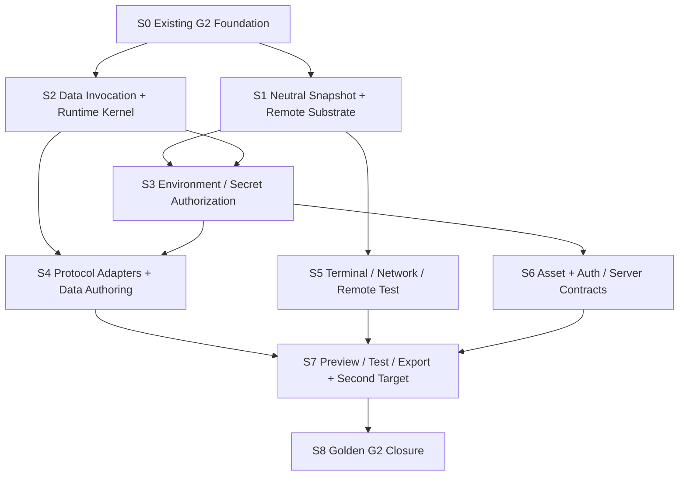

# G2 Executable Full-stack Workspace 总实施计划

## 状态

- DecisionStatus：Accepted
- ImplementationStatus：S0-S2 Implemented / S3-S6、S8 In Progress / S7 Vue Current-contract Product Vertical Implemented
- ProductGateStatus：In Progress
- Global Phase：G2 Executable Full-stack Workspace
- 日期：2026-07-19
- Owner：`@prodivix/runtime-core`、`@prodivix/runtime-browser`、`@prodivix/data`、`@prodivix/server-runtime`、`@prodivix/prodivix-compiler`、`@prodivix/workspace`、Remote Runner service、`apps/backend`、`apps/web` composition root
- 关联：
  - `specs/roadmap/global-phases.md`
  - `specs/decisions/31.production-export-planner.md`
  - `specs/decisions/40.execution-provider-and-job.md`
  - `specs/decisions/41.project-runner-and-canvas-modes.md`
  - `specs/decisions/42.nodegraph-execution-session.md`
  - `specs/decisions/43.animation-runtime-and-execution-session.md`
  - `specs/decisions/44.browser-test-execution-and-runtime-host.md`
  - `specs/decisions/45.data-operation-and-environment-reference-foundation.md`
  - `specs/decisions/46.auth-and-server-runtime.md`
  - `specs/decisions/54.vue-vite-product-surface-and-authenticated-catalog-golden.md`
  - `specs/implementation/g2-auth-server-runtime.md`

本文是 G2 的实施编排入口。Global Phase 的目标和退出 Gate 仍以
`specs/roadmap/global-phases.md` 为唯一来源；ADR 冻结 why、contract、owner 与不变量；本计划
负责依赖、实施顺序、产品旅程和可重复证据。ADR 40-46 的具体交付分别由对应 implementation
文档展开，不在本文件复制第二套局部状态。

## 目标

G2 把 Prodivix 从“能够可靠作者和导出前端”升级为“能够运行、调试和测试真实数据应用的
工程环境”。用户应能从同一个 Canonical Workspace revision 完成：

```text
声明 Data Source / schema / operation / policy
  -> 以类型化引用绑定 Collection 和事件
  -> 选择 mock 或 live environment
  -> 在 Browser 或 Remote Isolated Runner 中运行
  -> 观察 loading / empty / error / retry / pagination / optimistic lifecycle
  -> 在 Console / Terminal / Network / Test 中定位到作者态 SourceTrace
  -> 导出独立工程并运行同一 Data runtime conformance journey
```

G2 不建立 G3 的 canonical `BehaviorScenario`、`VerificationPlan` 或
`VerificationEvidence`。这里的“journey”是可重复的 runtime conformance fixture，不是持久化
行为作者态。

## 范围边界

- G2 建立 server/edge function、Auth/session/permission 与 Data runtime contract 及可运行纵切，
  不建设通用数据库托管、完整 Serverless 平台或生产部署控制面。
- G2 建立可替换的 Browser/Remote Runner 与一个受控第二 target 证明，不开放公共 Runner/Target
  SDK、供应商市场或广泛框架目录。
- G2 的测试报告用于验证导出工程与 Data runtime；跨编辑器 Behavior composition、正式 Evidence、
  断点/单步行为验证属于 G3。
- 多设备协作、Git Review、Preview promotion、Production telemetry/rollback 属于 G5；Agent 自治
  写入与评测闭环属于 G4。

## 当前基础与真实缺口

| 能力                          | 当前 G2 实现                                                                                                                                                                                                                                                                                                                                                                                                                                                                                                                                                                                                                                                                                                                                                                                                                                                                                                                                                                                                                                                                                                                                                                                                                                                                                                                                                                                                                                                                                                                                                                                                                                                                                                                                                                                                                                                                                                                                                                                                                                                                                                                                                                                                                                          | 外部证据 / 明确 post-G2 边界                                                                                                                                 |
| ----------------------------- | ----------------------------------------------------------------------------------------------------------------------------------------------------------------------------------------------------------------------------------------------------------------------------------------------------------------------------------------------------------------------------------------------------------------------------------------------------------------------------------------------------------------------------------------------------------------------------------------------------------------------------------------------------------------------------------------------------------------------------------------------------------------------------------------------------------------------------------------------------------------------------------------------------------------------------------------------------------------------------------------------------------------------------------------------------------------------------------------------------------------------------------------------------------------------------------------------------------------------------------------------------------------------------------------------------------------------------------------------------------------------------------------------------------------------------------------------------------------------------------------------------------------------------------------------------------------------------------------------------------------------------------------------------------------------------------------------------------------------------------------------------------------------------------------------------------------------------------------------------------------------------------------------------------------------------------------------------------------------------------------------------------------------------------------------------------------------------------------------------------------------------------------------------------------------------------------------------------------------------------------------------- | ------------------------------------------------------------------------------------------------------------------------------------------------------------ |
| Execution Core                | revision-bound Request/Provider/Job/Session、neutral snapshot v6、Remote codec/client/provider projection/Preview Bundle/Build Bundle/Test Report result、授权 artifact resolver、有界 HTTP transport、Backend auth gateway/durable execution grant、Control Plane/PostgreSQL/HTTP、Worker、D2 durable ingestion/artifact retention、rootless sandbox Gate、短期 capability Preview Host、Blueprint Browser/Remote selection、Golden contract matrix，以及真实 Golden rootless Preview/Test/Build、install/runtime 网络阶段隔离、install hostname/443 allowlist proxy、Browser fetch/Data HTTP adapter、operation correlation、sanitized Network 产品视图、provider-neutral mock query/mutation CRUD runtime asset projection、显式 mock/live runtime manifest、environment resolution first vertical、Backend production Environment/Secret store、Remote create snapshot authority、execution-bound HTTP/material query/mutation gateway、effect-before durable replay fence、显式 upstream idempotency/next-attempt ledger、真实 PostgreSQL replay concurrency Gate、generated Remote Preview value-only bridge/CSP、finite Preview 后续 Data Network/Console Session observation、Structured Console 双预算投影、Remote PTY/FS capture、Terminal Core/redactor checkpoint、PostgreSQL revision CAS 跨 Control Plane 副本恢复、PRT2 per-revision data key、AWS KMS/PRT1 migration/retryable outage fence、related MRK regional broker continuation，以及 repeatable-read regional checkpoint/shared drain/exclusive traffic epoch/durable evidence/live lease continuation/attempt+1 reclaim/Terminal generation replacement 双 Control Plane DR Gate、DOM-free bounded Terminal emulator/keyboard/paste/exact retry 产品 Gate、Browser/Remote Test 产品 composition、execution-bound report correlation、Remote Test live hard cut、D8 security/journey/capability/target Gate、Remote Test metadata-only invocation/report-before-trace、runtime diagnostic/Issues exact-snapshot 双向 SourceTrace debugger、Vue current-contract Local/Remote authenticated Catalog product target，以及 same-execution cursor、artifact、quota、bounded worker-loss、authorization/permission/network denial、cancel/timeout recovery contract与产品提示已实现 | regional DR 首次真实云端 RPO/RTO evidence 与 AWS KMS/MRK 首次远端证据；future provider-specific debugger extension 不作为当前 G2 closure 的替代条件          |
| Browser Project Runtime       | React/Vite Preview、HMR、shared Browser Host、三画布 mode、Execution Center、Browser/Remote selection、sanitized Network、Structured Console、Remote Terminal、manual cancellation/restart、细分 Remote recovery presentation、neutral snapshot consumer、Browser/Remote Test metadata-only invocation 与 runtime diagnostic/Issues exact-snapshot SourceTrace closure 已实现                                                                                                                                                                                                                                                                                                                                                                                                                                                                                                                                                                                                                                                                                                                                                                                                                                                                                                                                                                                                                                                                                                                                                                                                                                                                                                                                                                                                                                                                                                                                                                                                                                                                                                                                                                                                                                                                         | future provider-specific debugger extension；当前 G2 产品闭环不再依赖缺失的通用 producer入口                                                                 |
| Workspace Test                | Browser/Remote Test、共享 `runtime-vitest` adapter、canonical report/artifact/trace、同一产品 selector/Session/report UI、Remote durable transport correlation与 mock-only security Gate 已实现                                                                                                                                                                                                                                                                                                                                                                                                                                                                                                                                                                                                                                                                                                                                                                                                                                                                                                                                                                                                                                                                                                                                                                                                                                                                                                                                                                                                                                                                                                                                                                                                                                                                                                                                                                                                                                                                                                                                                                                                                                                       | 大规模 suite 产品能力与 G3 Evidence 建模                                                                                                                     |
| NodeGraph                     | deterministic kernel、same-context provider、Editor/Blueprint trigger 与 Session 已实现                                                                                                                                                                                                                                                                                                                                                                                                                                                                                                                                                                                                                                                                                                                                                                                                                                                                                                                                                                                                                                                                                                                                                                                                                                                                                                                                                                                                                                                                                                                                                                                                                                                                                                                                                                                                                                                                                                                                                                                                                                                                                                                                                               | G2 无新增行为节点；Remote/privileged NodeGraph 延后到 G3 capability 语义成立后                                                                               |
| Animation                     | 单 timeline runtime port、generation lease、Browser effect、Editor Session 已实现                                                                                                                                                                                                                                                                                                                                                                                                                                                                                                                                                                                                                                                                                                                                                                                                                                                                                                                                                                                                                                                                                                                                                                                                                                                                                                                                                                                                                                                                                                                                                                                                                                                                                                                                                                                                                                                                                                                                                                                                                                                                                                                                                                     | ADR 43 的 G2 slice 已完成；composition/route/reduced-motion/CodeSlot/shader 属 G3                                                                            |
| Data Authoring                | DataSource current/wire、Workspace typed document、Semantic contribution、PIR v1.6 query activation/input 与 mutation event、Inspector/CodeSlot/atomic transaction、Collection lifecycle、typed dispatch、schema preflight、retry/pagination/HTTP response mapping、bounded cache、optimistic CRUD、HTTP/OpenAPI、finite GraphQL/AsyncAPI、mock、snapshot provision、手工 Schema/Operation/Policy authoring、mock-only Test Operation，以及 React/Vite/Vue generated PIR activation、mock CRUD、public client live HTTP/GraphQL/AsyncAPI finite runtime、Remote server/edge 三协议 finite gateway、GraphQL/AsyncAPI public/renewed-Secret pull stream、HMAC SSE resume、reconnect Network correlation、keyed incremental collection、Remote Test/live parity、authenticated Vue Catalog live CRUD 与 D8 security/journey/capability/target matrix 已实现                                                                                                                                                                                                                                                                                                                                                                                                                                                                                                                                                                                                                                                                                                                                                                                                                                                                                                                                                                                                                                                                                                                                                                                                                                                                                                                                                                                              | WebSocket/GraphQL WS、Kafka/MQTT、durable/cross-execution recovery 与未来 adapter stream leak matrix属于 post-G2；跨副本 KMS/MRK availability 是延后的云证据 |
| Environment / Secret          | immutable reference shape/capability matching、snapshot/permission/material ports、短期 lease、exact revision/binding preflight、zone/execution-class/isolation/field permission matrix、principal/session cache partition、Backend immutable revision/per-record KMS data-key envelope、durable exact grant/audit、versioned static key-ring、bounded atomic rewrap/legacy migration/aggregate rotation audit、AWS managed KMS exact ARN/hashed context/static decrypt-only migration、Remote create 的 exact environment/session/snapshot durable authority、execution-bound HTTP server Secret injection/API/at-rest/callback canary、generated Remote value-only bridge/CSP、React/Vite server-gateway compile Gate、Remote durable output canary、Structured Console/Terminal redaction，以及 isolated Worker exact lease + ephemeral recipient sealed one-shot Secret resolution + monotonic worker-attempt ciphertext rotation 已实现；G2 固定的 request/snapshot/cache/log/diagnostic/trace/artifact/report/copy/terminal/crash 与 client fixture/export surface canary matrix 已通过                                                                                                                                                                                                                                                                                                                                                                                                                                                                                                                                                                                                                                                                                                                                                                                                                                                                                                                                                                                                                                                                                                                                                         | AWS live evidence延后；第二 managed KMS provider与未来 adapter surface属于 post-G2                                                                           |
| Preview / Export              | React/Vite 与 Vue/Vite 使用同一 standalone Data/Server contract；Vue 已实现 current PIR/Route/Auth/Server/Asset compiler、root-to-leaf Route guard/loader chain、layout/default/named outlet composition、Export/Test/Blueprint target selector、authenticated Catalog CRUD + exact PNG Chrome、Remote live iframe bridge、authenticated PostgreSQL gateway、Remote Preview/Test/Build snapshot/capability/codec、React/Vue exact-byte Asset matrix 与 static protected export fail-close                                                                                                                                                                                                                                                                                                                                                                                                                                                                                                                                                                                                                                                                                                                                                                                                                                                                                                                                                                                                                                                                                                                                                                                                                                                                                                                                                                                                                                                                                                                                                                                                                                                                                                                                                             | public Target SDK 属 G6；durable CDN promotion 属部署面，不阻塞 G2                                                                                           |
| Binary Asset                  | ADR 47、`@prodivix/assets` strict reference/materialization/transform pipeline、Workspace reference-only hard cut、PostgreSQL/IndexedDB blob、local/cloud lifecycle、Run/Test/Export/Remote exact bytes、PNG/JPEG structural sanitizer + bounded Sharp full-raster、required ClamAV/YARA-X chain、replica/freshness/policy generation、bounded derived cache、Backend owner gateway、capability Asset Delivery Host、Browser JPEG product journey、retention、Git/LFS、runtime import/replace，以及 React/Vue Browser/Test/Remote Preview/Test/Build matrix与 protected static fail-close已实现；ClamAV + YARA-X rootless real-engine evidence已通过                                                                                                                                                                                                                                                                                                                                                                                                                                                                                                                                                                                                                                                                                                                                                                                                                                                                                                                                                                                                                                                                                                                                                                                                                                                                                                                                                                                                                                                                                                                                                                                                  | 更多格式/额外 vendor/durable CDN是 post-G2 adapter范围                                                                                                       |
| Auth / Route / Server Runtime | ADR 46、A0-A13/A15-A17 已实现并取得 GitHub rootless/PostgreSQL/product evidence；A14 AWS managed KMS official adapter、本地/PostgreSQL Gate 与 OIDC workflow 已配置；当前 G2 Auth/Secret surface matrix 与 Golden closure 已通过                                                                                                                                                                                                                                                                                                                                                                                                                                                                                                                                                                                                                                                                                                                                                                                                                                                                                                                                                                                                                                                                                                                                                                                                                                                                                                                                                                                                                                                                                                                                                                                                                                                                                                                                                                                                                                                                                                                                                                                                                      | A14 live AWS evidence待取得；其他 permission/role/provider属于 post-G2                                                                                       |

特别需要避免两个错误完成信号：

1. Renderer 与 standalone runtime 已能消费 `DataLifecycleSnapshot`；React/Vite 已从 exact runtime manifest
   隔离 mock 与 public client live，并以父窗口 gateway 执行 Remote server/edge query/mutation；但该 mutation
   fence 不等同于 upstream distributed exactly-once；Remote Data Network 已通过 exact active-job Session
   observation、generation fence 与 bounded dedupe 进入产品视图，完整 canary 和第二
   target 的 current-contract 产品 proof 已完成；完整 Remote live/security 尚未完成，不能把该纵切描述为
   全部 Data/G2 closure。
2. Executable Project Snapshot Hard Cut 与 Remote wire codec/client 已完成；后续 control plane、worker
   和 provider command policy 必须继续消费该 current contract，不得恢复 Browser owner、双契约兼容层
   或 literal environment escape hatch。

## G2 需求到实施文档映射

| Global G2 Requirement                             | 主 ADR / Implementation                           | 当前状态                                                                                                                                                                | 退出证据                                                                      |
| ------------------------------------------------- | ------------------------------------------------- | ----------------------------------------------------------------------------------------------------------------------------------------------------------------------- | ----------------------------------------------------------------------------- |
| ExecutionProvider / Job / Session                 | ADR 40 / `g2-execution-provider-remote-runner.md` | Implemented                                                                                                                                                             | Browser + Remote shared conformance                                           |
| Browser 与 Remote Isolated Runner                 | ADR 40、41                                        | Implemented                                                                                                                                                             | exact snapshot digest 的 Preview/Test/Build parity                            |
| 文件、依赖、HMR、Console、Terminal、Network、Test | ADR 41、44、49                                    | provider-neutral Console/Network/Test、Remote PTY/FS、细分 recovery、Remote Test invocation 与 runtime diagnostic/Issues exact-snapshot SourceTrace closure implemented | future provider-specific debugger extension；不作为当前 G2 closure 的替代条件 |
| Data/API IR 与 lifecycle policies                 | ADR 45、49、55                                    | Canonical authoring、finite runtime、bounded stream recovery与incremental collection implemented                                                                        | durable/cross-execution recovery与更多 transport                              |
| HTTP/OpenAPI、GraphQL、AsyncAPI adapter           | ADR 45、49、55                                    | HTTP/OpenAPI、finite GraphQL/AsyncAPI 与 public/renewed-Secret GraphQL subscription/AsyncAPI SSE/NDJSON pull stream implemented                                         | WebSocket/GraphQL WS、Kafka/MQTT与跨副本 recovery availability                |
| client/worker/server/edge/build/test zones        | ADR 40、45                                        | G2 authorization/capability/target matrix implemented                                                                                                                   | future zone/adapter expansion is post-G2                                      |
| SecretRef、environment、permission、mock/live     | ADR 40、45、46                                    | Production + isolated sealed Secret + exact workspace.read composition + Backend KMS/AWS local adapter + G2 cross-surface canary Gate                                   | A14 AWS live evidence；future provider/surface expansion is post-G2           |
| Binary Asset pipeline                             | ADR 47 + `g2-binary-asset-pipeline.md`            | B0-B7 local/cloud/full-raster/required engines/retention/Git/runtime import/Browser journey/React+Vue target matrix与real-engine CI closure implemented                 | extra formats/vendor/CDN promotion are post-G2                                |
| Auth/session/permission/server function           | ADR 46 + `g2-auth-server-runtime.md`              | A0-A13/A15-A17 current-scope local + GitHub closure；A14 configured / live evidence pending                                                                             | A14 live AWS；future roles/providers are post-G2                              |
| 单一第二 framework portability proof              | ADR 31、48 + 本计划                               | Vue/Vite protocol/target matrix + independent install/typecheck/test/build + deterministic/Remote Chrome CRUD Gate implemented                                          | public Target SDK and wider framework catalog are G6                          |

G2 只要求一个明确选择的第二 framework target 证明 Compiler、Data runtime、Runner 与 Test
没有被 React 私有实现锁死；广泛框架目录、公共 Target SDK 与生态 conformance 仍属于 G6。
选定 target 是 ADR 48 接受的 Vue 3 + Vite controlled subset；完整 Vue 产品能力与公共 Target SDK 不在该
完成声明内。

## Canonical truth 与运行态边界

| 数据类别                                                   | Owner / 保存位置                           | 是否 durable | 规则                                                      |
| ---------------------------------------------------------- | ------------------------------------------ | ------------ | --------------------------------------------------------- |
| PIR、DataSource、Route、Code、Config、Asset metadata       | Canonical Workspace VFS                    | 是           | 只经 Command/Transaction、Outbox、Atomic Commit           |
| DataOperationReference、trigger/input mapping、policy      | 领域文档                                   | 是           | stable typed reference，不保存裸 endpoint/credential/code |
| Environment snapshot identity、binding identity            | 受保护 environment catalog                 | 是           | 不属于 Workspace；revision immutable                      |
| Secret material                                            | Secret broker / runner resolution boundary | 是但不可导出 | Web、Workspace、request、snapshot、log、artifact 均不可见 |
| original binary asset blob                                 | Workspace logical asset / blob store       | 是           | VFS 保存 identity/metadata/reference，不把二进制塞入 JSON |
| Executable project snapshot manifest                       | Compiler/runtime derived projection        | 否，可重建   | exact revision、content digest、target 与 SourceTrace     |
| Job、Session、Terminal、Network、Test report               | Execution runtime                          | 否           | 有界、可丢弃，不进 Workspace/local replica/Outbox         |
| Data lifecycle、cache、retry、pagination、optimistic patch | Data runtime instance                      | 否           | 按 revision/environment/principal/instance 隔离           |
| Binary transform output                                    | content-addressed derived artifact store   | 否，可重建   | 原始 blob identity 与 transform recipe 可追踪             |

Runtime filesystem 或 Terminal 中发生的修改不是 Workspace 作者态。未来若支持“导入运行时改动”，
必须先形成显式 diff，再由 owner planner 转成可逆 Workspace Transaction。

## 不可绕过的架构检查点

### 1. Executable Project Snapshot Hard Cut

该 Hard Cut 已完成：通用工程执行输入由 `@prodivix/runtime-core` 作为 transport-neutral owner，
形成无 Browser 命名的 `ExecutableProjectSnapshot`、file manifest、command plan、test/build plan
与 content digest。

- Compiler 从 exact Workspace/ExportBundle 生成 snapshot。
- Browser 和 Remote adapter 消费同一 contract。
- 不保留 Browser type alias 兼容层。
- command 不允许成为 Secret/environment 明文 escape hatch；仅显式 public/build-safe literal
  可以进入生成配置。
- 二进制文件通过 digest/content reference materialize，不塞入 Job event。

### 2. Data Invocation 与 Application Runtime

现有 `ExecutionInvocationKind` 没有 Data operation。G2 必须冻结 Data invocation、input、
instance identity、environment revision、cancellation 和 lifecycle result 的稳定边界，并明确：

- Data Editor 的 Test Operation 可以是独立 `data` Execution invocation；
- Preview/Export 内部 operation 是应用 runtime invocation，通过 trace/network bridge 对宿主可观测；
- 每次应用请求不强制成为一个长期 Project Job，但必须拥有 invocationId、sequence、SourceTrace
  与明确 lifecycle；
- 直接 query、Collection mount、refresh/retry/page 和 mutation trigger 不得各建私有协议。

### 3. Environment 与 Secret Authorization

静态 provider capability 只证明“能做”，不证明“被允许做”。实际启动进程前必须形成：

```text
principal + workspace + provider + profile + runtime zone
  -> environment revision
  -> binding/SecretRef set
  -> operation/adapter purpose
  -> network policy
  -> allow / deny + short-lived resolution lease
```

Resolver 不向 Web 或通用 caller 返回可序列化 Secret map；Secret 只在获授权 sandbox 的进程
注入边界短暂可见。`client` 和 browser/shared worker 禁止 Secret；当前 `worker` zone 若没有额外的
trusted execution-class/isolation 证明必须拒绝 resolution，不能因名称为 worker 就视为服务端。
`test` 默认 mock，live mutation 要求显式授权，`build` 默认不执行 live Data operation。

### 4. G2 决策闭环

Binary Asset 已由 ADR 47 与 `g2-binary-asset-pipeline.md` 冻结 owner、reference-only 保存态、blob adapter、
materialization 与 delivery stop rules，并完成 B0-B5 local/cloud blob、upload-aware atomic import、PNG/JPEG full-raster、
required ClamAV/YARA-X chain、B6 PostgreSQL retention/reference sweep、deterministic Git/LFS、runtime filesystem Asset
import/replace，以及 B7 Browser JPEG与 React/Vue exact-byte target matrix。ClamAV + YARA-X rootless real-engine
workflow证据已取得。更多格式、额外 vendor与 durable public-CDN promotion是
post-G2 adapter/deployment扩展。Auth/session/permission/server function 已由 ADR 46 与
`g2-auth-server-runtime.md` 冻结 owner、保存态与 current G2 vertical；受限 execution-state live mutation 安全 Gate、
bounded canonical import graph、authenticated/`workspace.owner` + exact `workspace.read` authority、isolated Worker sealed Secret resolution及
monotonic worker-attempt recovery，以及 Backend at-rest per-record KMS envelope、versioned static key ring、bounded atomic rewrap 与 legacy migration 均已完成。A13 已完成 `workspace.write` 单文件项目源码 mutation，A15 已完成 `workspace.read` authority + one-shot Secret，A16 已完成 canonical viewer role 到 exact read-only durable/Worker authority，三者均取得 GitHub rootless/PostgreSQL evidence；A17 editor/sharing 也已完成本机与 GitHub PostgreSQL/product/rootless Gate。A14 已配置 AWS managed KMS且 live evidence待取得；其他 permission/role、第二 managed KMS provider与未来 adapter leak matrix 是 post-G2 扩展，不再伪装成本地 G2 阻塞项。

### 5. Target Portability

G2 的第二 target 是严格受控的 portability Gate：同一个 ExportProgram、Data runtime
contract、SourceTrace 与 conformance fixture 生成另一个独立 Vite 工程。它不扩大 controlled
visual/code round-trip 的 React/JSX 可写子集，也不承诺多个 framework 的完整作者体验。
当前 Vue/Vite first vertical 已通过 HTTP/GraphQL/AsyncAPI mock protocol/target snapshot matrix、Remote codec、
独立 package 与 Chrome CRUD Gate；完整 PIR/Route/Auth/Server/Asset surface 继续 fail closed。

## Owner 边界

| Owner                          | G2 稳定职责                                                                                                                                                                                                                                      |
| ------------------------------ | ------------------------------------------------------------------------------------------------------------------------------------------------------------------------------------------------------------------------------------------------ |
| `@prodivix/runtime-core`       | execution/project/terminal/network transport-neutral contract、Job/Session、environment/permission port、shared conformance                                                                                                                      |
| `@prodivix/runtime-remote`     | versioned remote wire、strict codec、client，以及 transport-neutral authorization/quota/router/repository/snapshot store/queue lease Control Plane Core；不暴露供应商 SDK 或拥有 deployable infrastructure                                       |
| `@prodivix/runtime-vitest`     | Vitest 私有 JSON 的有界 decoder 与 canonical `ExecutionTestReport` adapter；不拥有 provider、Job、Workspace 或 durable Remote contract                                                                                                           |
| `@prodivix/assets`             | binary blob reference、digest/size/media verification、materialization/transformer/scanner/derived-cache port、PNG/baseline-JPEG structural sanitizer 与 deterministic pipeline；不拥有 Workspace、HTTP、PostgreSQL、Browser 或 provider locator |
| `apps/asset-delivery-host`     | credential-free short-lived capability origin、PNG/baseline-JPEG transform/scan/cache composition、active-inline hard cut 与 attachment security headers；不持有 Workspace、Backend user、database/object-store credential                       |
| 独立 Remote Runner service     | sandbox、process tree、quota、network policy、snapshot materialization、Secret resolution boundary                                                                                                                                               |
| `@prodivix/runtime-browser`    | WebContainer/browser project、client-safe fetch/Network adapter、Browser Host；不拥有 Remote 或 Data domain semantics                                                                                                                            |
| `@prodivix/data`               | Data current model、typed trigger/input dispatch、invocation、adapter registry、lifecycle/policy kernel、Network correlation、protocol-neutral importer mapping                                                                                  |
| `@prodivix/data-http`          | HTTP Data adapter 与注入式 transport；不拥有 Browser fetch、Secret/environment、Workspace 或 lifecycle                                                                                                                                           |
| `@prodivix/data-mock`          | session-scoped deterministic fixture adapter、mock-only protocol emulation、strict matching、stateful CRUD namespace 与 reset/dispose；不拥有 canonical Data、live network 或第二套 lifecycle                                                    |
| `@prodivix/workspace`          | Data/Asset/Auth 作者态 document 与 Transaction、revision、Semantic composition                                                                                                                                                                   |
| `@prodivix/pir`                | local data binding、query activation、mutation trigger/input mapping、Collection lifecycle projection contract                                                                                                                                   |
| `@prodivix/prodivix-compiler`  | ExportProgram、zone partition、portable runtime contribution、target preset、executable snapshot projection                                                                                                                                      |
| `@prodivix/pir-react-renderer` | document-instance lifecycle projection；不执行网络或保存 cache                                                                                                                                                                                   |
| `apps/backend`                 | authentication/control plane、authorization、environment/Secret service gateway；不在主 API 进程执行不可信项目                                                                                                                                   |
| `apps/web`                     | authoring UI、provider/target/environment selection、Execution Center；不保存第二份 runtime truth                                                                                                                                                |
| `@prodivix/diagnostics`        | execution/data/runtime provider snapshot、去重、Issues presentation                                                                                                                                                                              |

## 全局依赖关系



S1 与 S2 可以并行；S3 是 live server/edge Data execution 的安全合流点；S4 与 S5 可以并行；
S6 的 ADR 已补齐；S7/S8 已在前述 owner 和安全边界上完成本地 closure。

## 实施阶段

### S0：G2 Foundation Baseline

状态：Implemented。

冻结现有 Execution Core、Browser Preview/Test Host、三画布 mode、NodeGraph/Animation
same-context Session、Data current/wire/semantic、PIR/Collection durable binding/lifecycle 与
reference-only environment/Secret。该阶段只证明 foundation，不代表 Remote 或 Data runtime。

### S1：Provider-neutral Project 与 Remote Execution Substrate

状态：Implemented；neutral snapshot Hard Cut、Remote protocol/client、真实 control plane/PostgreSQL/HTTP、
worker/rootless sandbox、Preview/Test/Build/Server Function providers、capability Preview Host 与产品 provider selection 已实现。详细计划见 `g2-execution-provider-remote-runner.md`、
`g2-project-runner-execution-devtools.md` 与 `g2-browser-test-execution-runtime-host.md`。

完成条件：

1. Executable Project Snapshot Hard Cut 完成，Browser/Remote 使用同一 content digest。
2. versioned Remote transport 支持 idempotent start/cancel、cursor replay、reconnect、result 与
   artifact resolution。
3. 独立 worker 对 CPU/memory/PID/disk/time/output/network/process tree 设置限制并确定性清理。
4. Remote Preview/Test/Build/Server Function 通过共享 provider conformance 和真实 isolated adapter smoke。
5. 替换供应商 adapter 不修改 Workspace、Compiler、Canvas、Test UI 或 Execution Center。

### S2：Data Invocation、Runtime Kernel 与 Mock

状态：Implemented；invocation/registry/mock、exact document schema preflight、lifecycle stale fencing、
deterministic retry、pagination input/page fencing、bounded cache、optimistic policy、typed dispatch kernel、PIR v1.6 trigger authoring与 React/Vite generated mock trigger execution 已实现，
public client HTTP response mapping/live policy runtime 与 Remote server/edge gateway first vertical 也已实现；协议 importer 与完整产品 parity 在 S4/S7 继续建设。详细计划见
`g2-data-operation-environment-runtime.md`。

完成条件：

1. query activation、refresh/retry/page 与 mutation trigger/input 有类型化作者态 contract。
2. input 在 adapter 前按 schema 验证，复杂 transform 只通过 CodeSlot。
3. instance-owned adapter registry 与 deterministic mock adapter 通过 conformance。
4. lifecycle coordinator 独占 sequence、attempt、clock、cancel 与 stale fencing。
5. mock/live 严格隔离；Test 默认 mock，缺 mock 不得静默 fallback live。
6. 作者态变更可 undo/redo/replay；result/cache/lifecycle 从不进入 History。

### S3：Environment、Secret 与 Runtime-zone Permission

状态：Local G2 closure implemented / AWS live evidence pending。

完成条件：

1. immutable environment snapshot catalog、public binding resolver、Secret resolver 与 permission
   decision 的 owner 明确。
2. client/worker/server/edge/build/test 的 allow/deny matrix 有属性测试。
3. resolution 使用短生命周期 lease，不向 Web 返回 value map。
4. Secret canary 不出现在 request、project snapshot、generated source、log、diagnostic、trace、
   report、artifact、Terminal、Network 或 cache key。
5. permission denial 发生在 process/network 启动前，并产生稳定、无秘密诊断。

### S4：Protocol Adapter 与 Data 产品表面

状态：Controlled First Vertical Implemented；HTTP runtime、policy kernel、OpenAPI 3.1 bounded
proposal/reimport/Workspace adoption、finite GraphQL/AsyncAPI、public/显式 renewal GraphQL subscription/AsyncAPI SSE/NDJSON
pull stream、Browser/Remote/standalone execution mapping、手工 Schema/Operation/Policy authoring、mock-only Test
Operation，以及 preview/diff/impact/conflict、canonical Inspector、operation-scoped Issues、sanitized Network 与
exact-snapshot SourceTrace navigation 已实现。ADR 55 已完成same-execution HMAC SSE resume、per-connection credential
renewal、reconnect Network correlation与keyed incremental collection；更多transport、durable/cross-execution recovery与
跨副本KMS/MRK availability继续fail closed；authenticated Vue Catalog Remote cross-target journey已由ADR 54关闭。

实施顺序：HTTP runtime -> OpenAPI 3.1 importer -> policy kernel/full CRUD -> GraphQL -> AsyncAPI
有限子集。

- Importer 先产生 proposal/diff，再由 Workspace Transaction apply；reimport 保留 stable external
  identity、provenance 和用户 override。
- OpenAPI security scheme 只生成 binding/Secret placeholders。
- GraphQL 支持 query/mutation、variables、fragment 与 partial data/error policy。
- 当前 Data model 只有 finite query/mutation lifecycle，因此 AsyncAPI G2 默认只支持 publish 和
  request/reply；subscription/stream 必须先修订 ADR45，引入 stream/backpressure/reconnect contract，
  否则以稳定 unsupported diagnostic fail closed。

产品表面已包含 Data Source/Schema/Operation/Policy authoring、import preview、mock Test Operation、lifecycle 与
Network navigation；binding identity 保持 reference-only，UI 不展示 Secret value。完整 provider credential
authoring 与 live Remote/Test journey 不由本 first vertical 冒充完成。

### S5：Execution Devtools 与 Remote Test

状态：Local G2 closure implemented / real-cloud evidence pending；canonical Session/Test、Browser/Remote provider selection、metadata-only Network 产品视图、
Remote finite Preview 的 generation-fenced Session observation、Structured Console、rootless Remote PTY、Terminal
Core/显式 unsupported 产品状态、manual new-request recovery 与统一 SourceTrace navigation 已实现。ADR 50 已以
Core/redactor checkpoint、PostgreSQL opaque revision CAS 和双副本 Gate 关闭 Control Plane process owner 故障；ADR 51
进一步完成 PRT2 per-revision data key、AWS KMS exact envelope、PRT1 migration、retryable outage revision fence 与 related
MRK regional broker continuation；ADR 52进一步完成1-128 execution single-epoch batch、独立one-shot operator、Ed25519
authorization/fence/replication三签名角色、PostgreSQL grant replay fence、source-unavailable attested-RPO hard cut、strict sanitized
evidence export，以及exact regional checkpoint、shared request drain/exclusive epoch、双Control Plane HTTP hard cut、live lease
continuation、attempt+1 reclaim与旧PTY generation replacement；ADR 53 完成 DOM-free bounded
Terminal emulator、ANSI/alternate screen/scrollback/resize、conceal-safe copy、可访问 keyboard/paste 与 exact input retry。
上述新增operator/batch/source-unavailable contract已取得本地真实PostgreSQL双schema Gate，但regional DR首次真实云端RPO/RTO
evidence与首次live MRK evidence继续建设；当前 runtime diagnostic/Issues
producer closure已由 exact-snapshot Gate关闭，未来 provider-specific debugger extension不作为该外部证据的替代。

完成条件：

1. Console 使用 canonical Session/diagnostics，并按事件数和字节双重有界。
2. Terminal 使用独立双向 session contract，支持 input/resize/signal/reconnect，不把 byte stream
   塞进 Job history。
3. Network 使用 bounded、sanitized record；默认不采集 body，认证 headers 永不展示。
4. Browser 与 Remote Run 共用 provider-neutral UI；Interactive 对不支持的 server/Secret 能力
   fail closed 并引导 Run。
5. Browser/Remote Test 交付同一 `ExecutionTestReport`、TST diagnostic 与 SourceTrace。

### S6：Binary Asset 与 Auth/Server Runtime

状态：Local + non-cloud GitHub closure Implemented / live cloud evidence pending；Auth/Server A0-A13/A15-A17已实现并
取得远端证据，A14 AWS live evidence待取得；Binary Asset B0-B7 local/cloud blob、full-raster、required
ClamAV/YARA-X、retention/Git/LFS/runtime import、Browser JPEG、React/Vue target matrix与 real-engine CI证据已完成。

Binary Asset 已冻结并实现：

- original blob identity、content digest、metadata、MIME/dimension、dedup 与 ownership；
- Workspace-scoped IndexedDB local blob、Resources upload/preview、Run/Test/Export reader selection 与 duplicate/delete lifecycle；
- bounded multipart local-to-cloud sync、strict manifest/raw-part validation 与 Project/Workspace/blob/document 单事务回滚；
- 上传/下载、local replica 与 Git projection 的引用边界；
- deterministic transform recipe、strict transformer/scanner/cache coordinator、bounded derived cache；
- PNG chunk/CRC/dimension 与 baseline JPEG segment/table/scan/orientation policy、metadata sanitizer、各自 versioned structural + ClamAV quarantine 与 private capability delivery；
- ClamAV exact-byte preflight、有界 INSTREAM frame/response/timeout、固定 malware finding 与 scanner-unavailable hard cut；
- bounded PING/VERSIONCOMMANDS fleet readiness、signature database age、freshest converged cohort、downgrade/divergence hard cut；
- required engine chain、ordered replica failover、atomic scanner generation refresh、old-session revocation、in-flight signing fence 与 policy-version cache re-scan；
- Data file upload/download 只传 asset/blob reference，不把 binary/base64 塞入 lifecycle 或 Job event；
- Compiler、Browser/Remote snapshot、CDN/export 的同一 manifest 与 SourceTrace；
- deterministic Git binary/LFS manifest、canonical pointer、exact upload object、managed `.gitattributes` 与 stale path lifecycle；
- runtime filesystem Asset added/modified 的 exact baseline/media/upload receipt fence，以及与 Code change 的单事务采纳；
- 不把大二进制塞进 Workspace JSON、Operation、Job event 或 Git text projection。

Binary Asset 新 ClamAV + YARA-X rootless workflow远端证据已取得。更多格式、额外 vendor与 durable public-CDN
publish/purge是 post-G2 adapter/deployment范围，不能通过恢复 inline data URL兼容层实现。

Auth/Server Runtime 已由 ADR 46 冻结并完成 Remote read 与 deterministic Test/action vertical：

- Auth provider、principal、session、permission decision 与 route/server-function identity；
- server function 的 CodeSlot/CodeReference、input/output schema、runtime zone 与 invocation；
- route guard/loader 与 deterministic Test action 的 navigation、redirect/error/cancel/revalidation；
- Snapshot v6 Test-only Auth fixture、invocation-key replay/conflict 与 Preview/Build disabled projection；
- client/server boundary、CORS/cookie/token policy 与 SecretRef；
- auth/session material 不进入 Workspace、Data document、日志或客户端生成配置。
- live execution-state mutation 的 exact configured Origin、自定义 intent header、credential echo hard cut；
- execution/function/state partition、SHA-256 invocation identity、PostgreSQL effect/replay 单事务与并发/容量/cascade Gate。
- isolated production 的 128-module/64-depth/4 MiB bounded canonical TS/JS import graph、deterministic `.mjs`
  projection、transitive fail-close、per-module/aggregate SourceTrace 与 GitHub rootless production probe。
- isolated production Secret 的 exact execution/snapshot/function/invocation/worker-attempt claim、30 秒
  `remote-isolated/isolated-runner` grant、X25519 临时 recipient、HKDF + AES-256-GCM sealed envelope、
  PostgreSQL current-attempt ciphertext-only replay/monotonic recovery、mode 0600 material file、effect 前 delete 与 `useSecret` callback；
  Secret material 不进入 Control Plane、durable event、artifact、trace、filesystem diff 或可信 result。
- isolated `workspace.write` 只开放 invocation-key mutation：generated context 对 import-graph staging target 提出一次
  whole-file replacement，Worker 在 upload 前强校验唯一 diff，Canonical Workspace 仍通过用户显式选择的
  revision/content/meta/baseline-fenced Runtime Files Transaction采纳。

A14 live AWS evidence仍待外部运行；其他 permission/role、其他 managed-cloud KMS adapter、
任意 adapter surface 和更宽源码 mutation profile属于 post-G2。execution-state 安全 adapter、isolated Secret code-export 或
单文件 staging mutation不得扩写为通用 Backend source executor。

### S7：Preview/Test/Export CRUD Parity 与第二 Target

状态：Current-contract Product Target + D8 Bounded Matrix Gate Implemented；React/Vite 与 Vue/Vite standalone
public client live/mock CRUD 已进入独立 Gate，HTTP/GraphQL/AsyncAPI mock/live snapshot、Preview/Test/Build runtime
policy、Remote codec 和 provider capability matrix 已跨两个 target 验证；Vue PIR/Route/Auth/Server/Asset compiler、
产品 target selector 与 authenticated Catalog CRUD + PNG Chrome Gate 由 ADR 54 完成；Remote live Vue frame bridge 与
authenticated create/PostgreSQL Data/Server replay Golden 也已关闭同一 vertical；同一 Golden 现在以 parent layout route +
leaf page route 覆盖 root-to-leaf guard/loader、default main outlet 与 named sidebar outlet。Asset exact-byte与
full-raster policy已由 React/Vue target matrix与 Browser/Vue Chrome产品 Gate关闭。

Compiler 必须输出 Data runtime requirement、adapter manifest/dependency、zone partition 与
SourceTrace。server/edge source 和 Secret 不得进入 client bundle；不支持所需 zone 的 target
必须 fail closed，不能生成“看似可运行”的 client-only 项目。

React/Vite 与选定第二 target 应消费同一个 Data policy kernel或同一 conformance suite，并分别
完成 independent install、typecheck、test、build、runtime smoke。第二 target 不扩展 G1
controlled round-trip ownership。

当前选定 target 与 Data portability 基线由 ADR 48 固定；产品纵切、安全边界与 authenticated Catalog Gate 由
ADR 54 固定，受控范围外必须稳定 fail closed。

### S8：Golden G2 Closure

状态：Local Golden closure implemented / ProductGateStatus remains In Progress for external evidence；living Golden snapshot、
Browser/Remote contract matrix、真实 rootless Preview/Test/Build、second-target CRUD/lifecycle、Vue deterministic
authenticated PIR/Route/Server/Asset Chrome journey、parent layout route + leaf page route、default/named outlet、Remote live
strict parent bridge，以及 authenticated Remote create + 真实 PostgreSQL Data/Server replay/state/non-owner denial 已建立。
viewer/editor collaboration UI、Asset delivery matrix与跨产品面 local closure已建立；更高组织角色属于 G5。

建立 Catalog CRUD Golden Workspace：

```text
import/create Data Source
  -> bind product Collection query
  -> mock loading / success / explicit empty / error
  -> live authenticated query in authorized server zone
  -> authenticated route loader + permission denial + server function mutation
  -> offset or cursor pagination
  -> transient retry
  -> create / update / delete mutation
  -> optimistic success and rollback
  -> cancel + stale response fencing
  -> binary product asset transform/delivery
  -> Browser Preview + Browser Test
  -> Remote Preview + Remote Test + Build
  -> React/Vite standalone Export
  -> selected second-target standalone Export
  -> save/reload/History restores authoring only, never runtime lifecycle/cache
```

所有步骤绑定 exact Workspace/environment/provider/target identity，并能从 diagnostic、Network、
Test 和 generated artifact 回到 SourceTrace。可重复本地证据已进入
`specs/roadmap/g2-closure-evidence.md`；明确延后的真实云 evidence落地前保持 G2 `In Progress`。

## 横向产品 Gate

| Gate                       | G2 要求                                                                                                                                                 |
| -------------------------- | ------------------------------------------------------------------------------------------------------------------------------------------------------- |
| Security & Privacy         | least privilege、zone authorization、egress policy、Secret/PII redaction、dependency/supply-chain scan、isolated worker evidence                        |
| Accessibility              | Runner/Execution Center/Test/Data editor/Terminal/Network 全键盘可操作，状态与错误有可感知文本；Golden CRUD 输出通过基础 a11y Gate                      |
| Performance                | 在关闭 Gate 前冻结 runner boot/install/HMR、Data invocation、Terminal/Network retention、bundle/asset budget；所有长流按数量和字节有界                  |
| Version Governance         | Remote wire、Data wire、adapter descriptor、environment revision、target capability 与 Browser Baseline 有明确版本和 migration policy                   |
| Observability & Provenance | provider/version、snapshot digest、environment identity、adapter digest、invocationId、job/session/trace、artifact digest 与 SourceTrace 可关联且不泄密 |
| Resilience                 | disconnect/replay、duplicate start/cancel、worker crash、stale response、retry/rollback、artifact expiry 与 partial install 均有 fail-closed semantics  |

## 验证证据

现有 foundation 入口：

```text
pnpm --filter @prodivix/runtime-core test
pnpm --filter @prodivix/runtime-browser test
pnpm --filter @prodivix/nodegraph test
pnpm --filter @prodivix/animation test
pnpm --filter @prodivix/data test
pnpm --filter @prodivix/workspace test
pnpm --filter @prodivix/prodivix-compiler test
pnpm --filter @prodivix/web test:ci
```

G2 本地 closure 已收敛为：

```text
pnpm run verify:g2
pnpm run verify:g2:runner-devtools
pnpm run verify:g2:data-closure
pnpm run verify:g2:auth-server-runtime
pnpm run verify:g2:binary-assets
pnpm run verify:g2:rootless-contract
```

完整本机 PostgreSQL证据需同时设置`PRODIVIX_BACKEND_POSTGRES_TEST_URL`与
`PRODIVIX_REMOTE_POSTGRES_TEST_URL`；不设置时相应 integration suite 会显式 skip。`verify:g2` 聚合真实 contract、
integration、independent project、browser/remote、regional DR 与 rootless snapshot contract。真实 Podman isolation使用
`pnpm run verify:g2:rootless-sandbox`，AWS live KMS使用受保护 GitHub workflow，不由本地 aggregate伪造。

## 风险与停止条件

出现以下任一情况时停止当前纵切并先修架构：

1. Remote adapter 依赖 `@prodivix/runtime-browser` 或供应商 SDK 类型进入 core/Web。
2. Remote 断线通过重新 start 恢复，可能重复 mutation 或 build。
3. 在主 backend API 进程内直接执行不可信项目代码。
4. literal environment、Terminal、Network 或 generated source 成为 Secret 明文旁路。
5. cache 未按 Workspace/data revision、environment mode/revision、zone、adapter digest 和
   principal/session partition 隔离。
6. mutation retry 没有 idempotency contract，或 optimistic inverse patch 能覆盖更新版本。
7. mock 缺失时静默 fallback live，或 Test 默认访问 live mutation。
8. 用 value shape 猜 empty，或把 AsyncAPI subscription 伪装成 finite query。
9. OpenAPI/GraphQL import 无 provenance，reimport 直接覆盖用户修改。
10. client-only target 把 server/edge Secret 或受保护 operation 打进 bundle。
11. 未分类 `worker` zone 因名称被当作可信服务端并获得 Secret。
12. Runtime/Terminal filesystem 自动回写 Workspace，绕过 Command/Transaction。
13. 用普通测试报告冒充 G3 VerificationEvidence。
14. Binary Asset/Auth/Server Function 绕过 ADR 47/46 建立新的保存态或私有写入协议。

## 验收标准

- [x] G2 foundation 与未完成能力已按真实证据分开记录。
- [x] ADR 40-45 各有 implementation、owner、阶段、Gate 与停止条件。
- [x] Executable Project Snapshot Hard Cut 完成，无 Browser owner/alias 泄漏。
- [x] Remote Preview/Test/Build/Server Function provider projection、result、授权 resolver、capability hosting 与产品 composition 使用同一 request/job/session/snapshot contract。
- [x] Terminal、Network、Console 与 Test 使用 provider-neutral contract；Terminal 的 encrypted short-lived recovery
      authority 不进入 Job event、Workspace 或 Verification Evidence。
- [x] Terminal managed PRT2 只向 KMS 发送 data key，PRT1 migration、key rotation/retirement、retryable outage 和
      related MRK regional continuation 均有独立 Gate。
- [x] Data invocation、adapter registry、policy kernel与 mock/live HTTP runtime foundation 完成。
- [x] HTTP runtime 与 OpenAPI 3.1 importer first vertical 通过 proposal/reimport/Workspace adoption 及
      Browser/Remote/standalone mapping conformance。
- [x] OpenAPI import preview/diff/impact/conflict 与 exact approval、Data Source/Operation Inspector、
      operation-scoped Issues/sanitized Network filter 和双向 navigation 通过产品 Gate。
- [x] GraphQL 和明确范围的 AsyncAPI adapter 通过 importer/runtime conformance；public server/edge subscription/stream
      通过 pull/backpressure/authority/SourceTrace Gate，client/Secret/未声明 transport fail closed。
- [x] Environment/Secret resolver、zone permission 与 G2 固定 surface canary leak Gate 通过；AWS live evidence独立 pending。
- [x] Binary Asset 与 Auth/Server Runtime 均有 Accepted ADR 和 first vertical 实现证据。
- [x] Binary Asset full-raster/required-engine delivery、React/Vue cross-target product journey与 Auth/Server Runtime
      local/GitHub安全 Gate完成；只有 AWS live evidence保持 pending。
- [x] React/Vite 与 Vue/Vite 通过同一 mock CRUD runtime、protocol/target snapshot matrix 与独立
      install/typecheck/test/build/browser journey；Vue current PIR/Route/Auth/Server/Asset 产品纵切与 authenticated
      Catalog CRUD + PNG Chrome Gate、Remote live iframe bridge 与 authenticated PostgreSQL gateway journey 已完成。
- [x] Golden G2 在 Browser、Remote、Test 与 standalone React/Vue Export 的本地 contract/product Gate 及
      current-worktree rootless GitHub Gate中通过。
- [x] 没有新增第二套生产写入协议、runtime 持久化镜像或 G3 Evidence 模型。
- [x] `g2-closure-evidence.md` 已引用本地可重复证据；ProductGateStatus 在外部证据完成前保持 `In Progress`。
