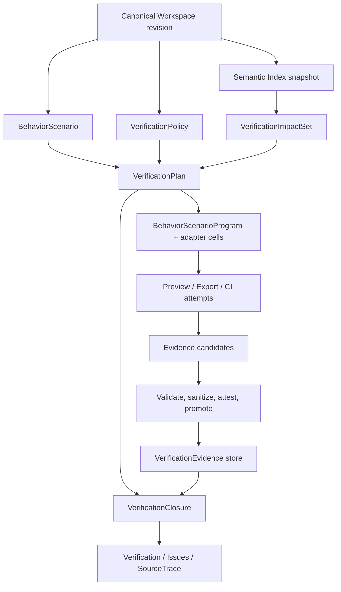

# G3 Behavior & Verification Closure 总实施计划

## 状态

- DecisionStatus：Accepted
- ImplementationStatus：Not Started
- ProductGateStatus：Blocked by G2 Exit Gate
- Global Phase：G3 Behavior & Verification Closure
- 日期：2026-07-20
- Owner：`@prodivix/behavior`、`@prodivix/verification`、`@prodivix/workspace`、`@prodivix/authoring`、`@prodivix/runtime-core`、`@prodivix/diagnostics`、`apps/backend`、`apps/web` composition root
- 关联：
  - `specs/roadmap/global-phases.md`
  - `specs/decisions/34.core-package-boundaries.md`
  - `specs/decisions/35.canonical-workspace-hard-cut.md`
  - `specs/decisions/37.verified-semantic-authoring-architecture.md`
  - `specs/decisions/56.behavior-scenario-and-cross-domain-action-contract.md`
  - `specs/decisions/57.verification-plan-impact-and-policy.md`
  - `specs/decisions/58.verification-evidence-provenance-and-retention.md`
  - `specs/decisions/59.deterministic-scenario-replay-and-runtime-controls.md`
  - `specs/decisions/60.nodegraph-typed-flow-and-behavior-debugging.md`
  - `specs/decisions/61.animation-route-composition-and-reduced-motion.md`
  - `specs/decisions/62.verification-adapter-matrix-and-cross-target-closure.md`
  - `specs/decisions/63.verification-product-surface-diagnostics-and-ci.md`
  - `specs/roadmap/g3-behavior-verification-milestones.md`
  - `specs/roadmap/g3-closure-evidence.md`

本文是 G3 的实施编排入口。Global Phase 定义与退出条件仍以
`specs/roadmap/global-phases.md` 为唯一来源；ADR 冻结 contract、owner 与安全不变量；各子系统
implementation 文档负责具体数据结构、调用链、测试矩阵和停止条件。本文件不把规划状态写成已实现，
也不把 G2 的一次性 Test Report 当成 G3 Evidence。

## 目标

G3 将 G2 已能运行的 Workspace 升级为可作者、可复现、可审计的行为与验证系统。用户应能从同一个
Canonical Workspace revision 完成：

```text
作者跨 Route / PIR / Data / NodeGraph / Animation 的 BehaviorScenario
  -> Semantic Index 解析稳定 target 与 impact
  -> VerificationPolicy 选择 required checks 和受控 matrix
  -> 生成 exact-revision VerificationPlan
  -> 在 Preview / Export / CI 编译并运行同一 Scenario Program
  -> 将候选结果提升为具备 provenance 的 VerificationEvidence
  -> 在 Issues / SourceTrace / debugger 中定位、比较和重放
  -> 对指定 revision 得出可审计的 VerificationClosure
```

G3 关闭的是“同一行为是否在受控环境和目标上得到可信证明”，不是“某次运行返回了 passed”。

## 前置条件

1. G2 Exit Gate 通过，至少存在稳定的 exact-revision Snapshot、Browser/Remote provider、ExportProgram、
   SourceTrace、Data mock/runtime、Auth/Server vertical 与 React/Vite、Vue/Vite controlled target。
2. Canonical Workspace VFS、Durable Outbox、Atomic Commit、Workspace Semantic Index 与 Code Authoring
   Environment 继续是唯一作者态和引用边界。
3. G2 Execution Session、Test Report、Console、Network、trace 和 artifact 继续是可丢弃运行态；只有通过
   G3 promotion contract 的 candidate 才能成为 Evidence。
4. required verification 默认只允许 fixture、mock 或明确批准的 hermetic adapter，不允许消费生产 Secret、
   生产用户数据或未固定的 live Internet response。
5. G3 开始前必须冻结 Behavior、Verification、Workspace document kind、diagnostic target 与 wire owner，
   不允许由 `apps/web` 私自定义第二份 contract。

## Canonical artifact matrix

| Artifact                  | 类型                          | Canonical owner                                  | 可变性                  | 身份绑定                                           | 禁止承载                                   |
| ------------------------- | ----------------------------- | ------------------------------------------------ | ----------------------- | -------------------------------------------------- | ------------------------------------------ |
| `BehaviorScenario`        | Workspace authoring document  | `@prodivix/behavior` + `@prodivix/workspace`     | 仅 Command/Transaction  | document revision、semantic schema                 | CSS/XPath、编辑器 state、provider 私有脚本 |
| `VerificationPolicy`      | Workspace authoring document  | `@prodivix/verification` + `@prodivix/workspace` | 仅 Command/Transaction  | policy revision                                    | CI YAML、运行结果、Secret                  |
| `VerificationImpactSet`   | derived projection            | `@prodivix/verification`                         | 可重建                  | before/after revision、provider set                | 用户决策、测试结果                         |
| `VerificationPlan`        | derived immutable plan        | `@prodivix/verification`                         | 重新生成，不原地编辑    | workspace revision、policy/evaluation、plan digest | artifact bytes、mutable progress           |
| `BehaviorScenarioProgram` | compiled projection           | `@prodivix/behavior`                             | 可重建                  | scenario/revision/compiler digest                  | provider handle、live credential           |
| `ReplayRecord`            | attempt-scoped runtime result | `@prodivix/runtime-core`                         | append-only for attempt | plan/cell/attempt                                  | Workspace mutation、Secret value           |
| `EvidenceCandidate`       | transient promotion input     | verification adapter                             | 一次性                  | run/result/artifact digests                        | 未清洗日志、任意工具对象                   |
| `VerificationEvidence`    | durable append-only record    | `@prodivix/verification` + `apps/backend`        | immutable/superseding   | revision/plan/cell/attempt/provenance              | Workspace mirror、可变 passed flag         |
| `VerificationClosure`     | derived verdict               | `@prodivix/verification`                         | 对输入确定性重算        | revision、policy、plan、evidence set               | 部署决定、自动修复决定                     |

Baseline 是被 Scenario 或 Policy 引用的作者态输入。Baseline 更新必须通过 Workspace Transaction；
Evidence 只能引用 baseline digest，不能通过一次运行自动覆盖 baseline。

## Owner 与依赖边界

| Owner                                       | G3 职责                                                                                                      | 明确不拥有                                                           |
| ------------------------------------------- | ------------------------------------------------------------------------------------------------------------ | -------------------------------------------------------------------- |
| `@prodivix/behavior`                        | Scenario current model、typed trigger/action/observation、compiler、Program、recorder draft、replay semantic | Workspace persistence、browser driver、Evidence store、领域运行实现  |
| `@prodivix/verification`                    | Impact、Policy、Plan DAG、adapter SPI、Evidence manifest、retention、Closure                                 | Workspace authoring transport、具体测试工具私有对象、CI provider API |
| `@prodivix/workspace`                       | `behavior-scenario`、`verification-policy` document，Command/Transaction、revision 与 import/export          | Scenario 执行、Evidence 存储                                         |
| `@prodivix/authoring`                       | Workspace Semantic Index 的 target/reference/impact contribution、跨领域 resolve 与 SourceTrace              | 执行和验证 policy                                                    |
| `@prodivix/runtime-core`                    | deterministic controls、attempt/replay event、cancellation/budget、runtime observation ports                 | canonical Scenario/Policy、durable Evidence                          |
| NodeGraph / Animation / Route / Data owners | 各自 typed capability、effect 与 observation provider                                                        | 通用 Scenario、Plan 或 Evidence                                      |
| Verification adapters                       | 将 canonical plan cell 映射到 Vitest/Browser/a11y/visual/perf/security runner 并规范化 candidate             | policy 决策、Workspace 写入、Evidence 直接落库                       |
| `apps/backend`                              | Evidence API/store、artifact promotion、attestation、retention worker、authorization                         | 行为语义、测试工具解码规则                                           |
| `apps/web`                                  | Scenarios、Verification、debugger、Issues/Execution composition                                              | domain contract、plan selection、证据可信性判断                      |

依赖必须单向：



## 写入与读取链路

### 作者态写入

1. Scenarios/Policy UI 或 recorder 只产生 draft Intent。
2. `@prodivix/behavior` / `@prodivix/verification` 校验 current model，并经 Semantic Index 解析引用。
3. `core.behavior.*` 或 `core.verification.*` Command 进入 Workspace Transaction。
4. Durable Outbox 与 Atomic Commit 提交 exact revision。
5. Semantic Index、compiler 和 Impact projection 从新 revision 重建；UI 不自行 patch 缓存。

### 执行与 Evidence 写入

1. planner 对 exact revision、policy digest、显式 policy evaluation instant、provider set 和 matrix budget 生成
   deterministic plan digest。
2. provider 只接收 plan cell、`BehaviorScenarioProgram`、bounded fixture 和短期 capability；不接收 Workspace 写权限。
3. 每次运行创建新的 attempt identity，产生 ReplayRecord、normalized result 和 EvidenceCandidate。
4. Backend 在 promotion 前复核 identity chain、artifact digest/size/media、redaction、attestation 和授权。
5. promotion 成功后 append Evidence；失败只产生诊断，不得把 candidate 伪装成 Evidence。
6. Closure 对 immutable plan 和当前可接受 Evidence 集合计算 verdict；过期、撤销、被 supersede 或不兼容的
   Evidence 不能满足 required cell。

### 读取

- Scenarios surface 读取 Workspace document + Semantic projection；
- Verification surface 读取 Impact/Plan projection + Evidence/Closure service；
- Execution Center 读取当前 attempt；Issues 聚合 `BHV-*` / `VER-*` diagnostic；
- SourceTrace 导航必须以 exact revision 为前提，revision 不可用时展示历史定位，不跳到近似当前节点。

## 实施阶段

### V0：Owner hard cut 与 contract skeleton

状态：Not Started。

交付 `@prodivix/behavior`、`@prodivix/verification` 包，Workspace document/Command registry、diagnostic
domain/target、public codec 与 boundary check。任何 G3 domain type 不得先落在 `apps/web`。

完成条件：

1. package dependency DAG 无环，应用只通过公开入口依赖 contract；
2. current model 不暴露数字版本，wire/codec/migration 明确 fail closed；
3. 两种 Workspace document 都有 schema、Command、Transaction、undo/redo、import/export round-trip；
4. `BHV-*`、`VER-*` 能进入统一 Issues store；
5. 建立 `verify:g3:boundaries` aggregate Gate。

### V1：Scenario authoring、semantic target 与 recorder

状态：Not Started。详见 `g3-behavior-scenario-authoring-and-composition.md`。

交付 Scenario CRUD、step editor、typed target picker、recording draft review、reference/impact contribution、
compile diagnostics 和最小 semantic UI/Route/Data journey。

完成条件：Scenario 不保存 CSS/XPath；删除/移动目标产生 impact；recorder 不直接提交；同一 Scenario 可编译
为 provider-neutral Program。

### V2：跨领域行为 composition

状态：Not Started。详见 NodeGraph 与 Animation/Route implementation 文档。

交付 NodeGraph typed flow/debugger、Route lifecycle、Animation composition/reduced-motion、Data/Auth actions 和
统一 observation。所有领域 effect 通过 owner capability 执行，不允许 Scenario 复制领域语义。

完成条件：Golden Scenario 同时跨越 Route、PIR、Data、NodeGraph、Animation，且每一步可定位到 SourceTrace。

### V3：Deterministic controls 与 replay

状态：Not Started。详见 `g3-deterministic-replay-runtime-controls.md`。

交付 clock/random/id/scheduler/network/storage/viewport/motion/font controls、condition wait、barrier、fresh replay
attempt、divergence detection 与 debugger time travel boundary。

完成条件：相同 Program + control profile 在受支持 provider 上得到相同 semantic observation sequence；无法控制的
环境因子明确标记 unsupported/unstable，不能静默通过。

### V4：Impact、Policy 与 Plan

状态：Not Started。详见 `g3-verification-plan-impact-policy.md`。

交付 revision diff→semantic ImpactSet、canonical Policy authoring、required/advisory rule evaluation、matrix
expansion、budget、exemption、retry semantics 与 deterministic plan digest。

完成条件：相同输入生成 byte-stable plan；不完整 impact 只会扩大 required scope；缺失 adapter 使 required cell
blocked，不降级为 skipped。

### V5：Evidence、provenance 与 retention

状态：Not Started。详见 `g3-verification-evidence-provenance-retention.md`。

交付 Backend Evidence store、artifact promotion、local/remote/CI/import trust、attestation verification、comparison、
supersession、retention/tombstone 与 Closure evaluator。

完成条件：失败 attempt 不被重跑覆盖；Secret canary 无泄漏；损坏/错配/过期证据不能满足 Closure；受保护引用
阻止删除。

### V6：Verification adapter matrix

状态：Not Started。详见 `g3-verification-adapters-product-ci.md`。

交付 diagnostics/build/unit/integration/E2E/visual/a11y/performance/security adapters，Preview/Export/CI surface，
React/Vite 与 Vue/Vite controlled target，以及 Chromium 主矩阵和 Firefox/WebKit critical subset。

完成条件：工具私有 payload 不越过 adapter；required matrix cell 均产生规范 candidate 或明确 blocked reason；
不以跨 framework 像素相同冒充 portability。

### V7：产品面、CLI 与 CI

状态：Not Started。详见 `g3-verification-adapters-product-ci.md`。

交付 Scenarios、Verification、Plan/Impact/Evidence/Compare/Replay surfaces，复用 Execution Center、Issues 和
SourceTrace；交付 provider-neutral CLI JSON contract 与 CI evidence upload/finalize。

完成条件：UI 不选择 plan；CLI 和 Web 使用同一 planner/evaluator；断线恢复不重复 promotion；错误可从 Evidence
导航到 scenario step、domain source 和 artifact。

### V8：G3 Golden Closure

状态：Not Started。

对 Authenticated Catalog CRUD Living Golden 建立正式 BehaviorScenario：登录/失效会话、Route guard/loader、
loading/empty/error/retry/pagination、optimistic mutation/conflict、NodeGraph 派生行为、Animation full/reduced-motion。

必须证明：

1. 同一 Scenario identity 在 Preview、独立 Export 和 CI 执行；
2. React/Vite 与 Vue/Vite 保持 contract-equivalent 结果；
3. Chromium 完整 required matrix，Firefox/WebKit critical black-box subset；
4. deterministic conflict/retry 在重复运行和 worker recovery 后保持一致；
5. required functional、visual、accessibility、performance/security policy cells 均有 current、compatible、可信 Evidence；
6. Closure 可从 revision 和 plan digest 重算，且所有失败可定位、可比较、可重放；
7. 全程无 editor-private state、production Secret、live production data 或自动 baseline 接受。

## 子计划索引

| 子系统                         | Implementation 文档                                                      |
| ------------------------------ | ------------------------------------------------------------------------ |
| Scenario authoring/composition | `specs/implementation/g3-behavior-scenario-authoring-and-composition.md` |
| Impact/Policy/Plan             | `specs/implementation/g3-verification-plan-impact-policy.md`             |
| Evidence/provenance/retention  | `specs/implementation/g3-verification-evidence-provenance-retention.md`  |
| Deterministic replay           | `specs/implementation/g3-deterministic-replay-runtime-controls.md`       |
| NodeGraph                      | `specs/implementation/g3-nodegraph-typed-flow-debugger.md`               |
| Animation/Route                | `specs/implementation/g3-animation-route-composition-reduced-motion.md`  |
| Adapter/product/CI             | `specs/implementation/g3-verification-adapters-product-ci.md`            |

## G3 需求追踪

| Global G3 requirement                                   | 决策            | 实施与 Gate                                              |
| ------------------------------------------------------- | --------------- | -------------------------------------------------------- |
| 一等 BehaviorScenario 与跨领域行为                      | ADR 56          | Scenario authoring + `verify:g3:scenario-authoring`      |
| NodeGraph typed flow/debugging                          | ADR 60          | NodeGraph plan + `verify:g3:behavior-composition`        |
| Animation/Route composition 与 reduced motion           | ADR 61          | Animation/Route plan + `verify:g3:behavior-composition`  |
| deterministic time/random/network/storage/render/replay | ADR 59          | Runtime controls plan + `verify:g3:deterministic-replay` |
| semantic impact、Policy、required matrix 与 Plan        | ADR 57          | Impact/Policy/Plan + `verify:g3:verification-plan`       |
| durable Evidence、provenance、comparison、retention     | ADR 58          | Evidence plane + `verify:g3:evidence`                    |
| unit/integration/E2E/visual/a11y/performance/security   | ADR 62          | Adapter matrix + `verify:g3:adapter-matrix`              |
| Scenarios/Verification/Issues/SourceTrace 与 CLI/CI     | ADR 63          | Product/CI + `verify:g3:product`                         |
| Preview/Export/CI、React/Vue、browser/motion closure    | ADR 56/59/62/63 | V8 Golden + `verify:g3:golden`                           |

## 计划中的 Gate

以下命令名是 G3 实施时必须建立的稳定入口；在脚本落地并取得证据前不得标记 Passed：

- `pnpm run verify:g3:boundaries`
- `pnpm run verify:g3:scenario-authoring`
- `pnpm run verify:g3:behavior-composition`
- `pnpm run verify:g3:deterministic-replay`
- `pnpm run verify:g3:verification-plan`
- `pnpm run verify:g3:evidence`
- `pnpm run verify:g3:adapter-matrix`
- `pnpm run verify:g3:product`
- `pnpm run verify:g3:golden`
- `pnpm run verify:g3`

## 风险与停止条件

- 若 G2 snapshot/provider/target contract 仍在漂移，停止 G3 产品纵切，只允许完善 owner-neutral contract。
- 若 Semantic Index 无法给出 exact-revision target/impact，required plan 必须扩大或 blocked，不能使用 DOM selector 猜测。
- 若 runner 无法控制 clock/network/storage/motion 等 required factor，对应 cell 必须 unsupported/blocked，不能生成可信 Evidence。
- 若 candidate 中发现 Secret、PII、越界 artifact 或 identity mismatch，promotion fail closed，并保留经过清洗的安全诊断。
- 若 adapter 需要把工具私有对象暴露给 Web/Workspace，先补 canonical normalization contract，停止 UI 直连。
- 若 closure 依赖未 attested、已过期或不兼容 Evidence，verdict 必须为 incomplete/blocked。
- 回滚只撤销 Workspace Scenario/Policy 的 Command；Evidence append、tombstone 和审计记录不得用 Workspace undo 删除。

## 验收标准

- [ ] Scenario 与 Policy 是唯一 canonical G3 authoring documents，所有写入可逆且 revision-bound。
- [ ] Plan、Program、Impact、Closure 都是可重建 projection，无第二作者态。
- [ ] Evidence 独立持久化、append-only、可验证 provenance，并与 Execution runtime 明确隔离。
- [ ] 同一 Scenario 在 Preview、Export、CI 和受控 target/browser matrix 中保持 semantic contract。
- [ ] NodeGraph、Animation、Route、Data、Auth/Server 行为由各领域 owner 执行，并共享 observation/SourceTrace。
- [ ] deterministic replay、reduced motion、retry/conflict 和网络隔离有正向、边界、fail-closed 证据。
- [ ] 产品 surface、CLI 和 CI 使用同一 planner、adapter 和 Closure evaluator。
- [ ] G3 Golden 所有 required cells 具备 current、compatible、可信 Evidence，Global G3 Exit Gate 才可标记 Passed。
