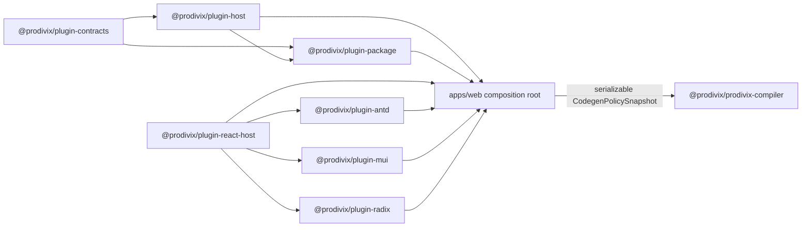

# Official Component Plugins Phase 4.6-4.8 实现与验收记录

## 状态

- Implemented（Phase 4.6-4.8）
- Phase 4.9：Implemented（由上位 Phase 4 计划完成最终 hardening）
- 日期：2026-07-11
- 覆盖阶段：Phase 4.6 Ant Design、Phase 4.7 MUI、Phase 4.8 Radix
- 上位计划：`specs/implementation/plugin-browser-sandbox-phase4.md`
- 对应 ADR：
  - `specs/decisions/17.external-library-runtime-and-adapter.md`
  - `specs/decisions/29.plugin-extension-points.md`
- 前置实现：
  - `specs/implementation/plugin-host-core-phase2.md`
  - `specs/implementation/plugin-host-palette-phase3.md`
  - Phase 4.0-4.5 已完成

本文是 Phase 4.6-4.8 的实现事实源。上位 Phase 4 文档负责且已完成安全边界、Browser Sandbox、Gateway、Phase 4.9 hardening 和整阶段 Exit Criteria；本文记录 official React component plugin 的 package/Host ABI、真实 artifact、Blueprint Template、逐库迁移、删除门禁和测试矩阵。

实现结果：

1. `@prodivix/plugin-antd` 发布 81 个 Palette item：46 个 supported、1 个 template、34 个 degraded，包含 6 个 contribution point。
2. `@prodivix/plugin-mui` 发布 18 个 Palette item、2 个 template-only runtime component 和 20 条 Codegen Policy rule，包含 6 个 contribution point。
3. `@prodivix/plugin-radix` 发布 10 个 Palette item、7 个 compound template 和 37 条 runtime/codegen rule，包含 5 个 contribution point，且不声明 icon provider。
4. 三库通过同一个 bundled catalog、Host transaction、Blueprint 创建、Renderer 与 compiler policy snapshot 链路运行；默认 workspace 仍全部禁用。
5. Ant Design/MUI remote profile、manifest、icon/d.ts loader，Radix headless/factory/placeholder/fallback，以及 Compiler 中三库与 icon provider 特判均已删除。
6. AntD-only、MUI-only、Radix-only 和三库组合导出项目均完成 install、build 与 browser behavior gate；official component Playwright 用例 3/3 通过。

## 1. 目标

Phase 4.6-4.8 要把现有 Ant Design、MUI 和 Radix 库专属实现从 Web/Compiler core 直接迁移为 bundled official plugin，不保留生产双轨。

完成后必须同时满足：

1. `@prodivix/plugin-antd`、`@prodivix/plugin-mui`、`@prodivix/plugin-radix` 都拥有真实 Manifest、resource contribution、确定性 package artifact 和 build-attested React Host Module。
2. Web 通过一个 generic bundled official plugin catalog 发现 package，不直接导入库专属 profile、manifest、renderer、icon provider 或 compiler adapter。
3. official package 的 static contribution 仍经过 Manifest、permission、batch validation、owner/generation transaction、revision snapshot、disable/update/shutdown cleanup 全链路。
4. React component、preview、render wrapper、icon implementation 和 portal wrapper 只通过冻结的 privileged React Host ABI 绑定，不进入 JSON descriptor，也不依赖 Web 私有类型。
5. Ant Design 与 MUI 可独立启用、禁用、替换 generation；默认配置仍不启用任何外部组件库。
6. `blueprintTemplate@1.0` 能用 normalized PIR fragment 表达 Form.Item、Accordion 和 Radix compound component，并通过一个 Workspace Command 原子实例化、插入和撤销。
7. Radix Accordion、Tabs、Dialog、Popover、Tooltip、DropdownMenu、Switch 使用真实 Radix runtime 和 React codegen，不再映射为 `div`/`button` placeholder。
8. Compiler 只消费显式 `CodegenPolicySnapshot`；Web/Compiler 不出现 `libraryId === 'antd'`、`libraryId === 'mui'` 或 `type.startsWith('Radix')` 一类库特判。
9. 迁移完成后删除旧 profile、remote esm.sh loader、Palette 特判、preview CSS selector、icon branch、renderer placeholder 和 compiler fallback；旧实现测试若只证明已删除路径，不迁移为耦合测试。

## 2. 实现前事实与根因（已解决）

### 2.1 Phase 4.5 已有能力

当前已有五个 exact contribution contract：

- `paletteContribution@1.0`
- `externalLibrary@1.0`
- `renderPolicy@1.0`
- `codegenPolicy@1.0`
- `iconProvider@1.0`

Host 已支持多 point batch semantic validation、owner/generation transaction、build-attested implementation binding、Render Policy projection、Icon Provider bridge 和 immutable Codegen Policy snapshot。library-neutral fixture 已证明五点 contribution 可以完成 Palette -> Canvas -> React export。

这在 Phase 4.5 只证明通用 contract 能工作，当时还不表示现有库已经插件化；Phase 4.6-4.8 已完成三库直接迁移。

### 2.2 不存在真实 `@prodivix/core` package

`@prodivix/core` 当前只是 `nativeCorePlugin.ts` 使用的逻辑 plugin id，不是 workspace package。Phase 4.6 不创建聚合式 `@prodivix/core` 包，也不把 Workspace Authoring、Blueprint、Renderer、Compiler 或 Plugin Host 全部搬进一个大包。

Phase 4.6.0 已新增两个窄边界 package：`@prodivix/plugin-package` 承载 framework-neutral artifact/source/catalog，`@prodivix/plugin-react-host` 只承载 official React Host projection ABI。领域实现继续由各自 package 所有。

### 2.3 React Host ABI 曾被 Web 私有类型锁住

实现前以下类型位于 Web 内部：

- `OfficialHostModule` 与 implementation union 位于 `apps/web/src/plugins/platform/officialHostImplementations.ts`。
- `TrustedWebPluginInput` 位于 `apps/web/src/plugins/platform/types.ts`。
- `PaletteRuntimeProjection` 依赖 Web 私有 `ComponentGroup` / `ComponentPreviewItem`。
- Render implementation 直接依赖 Web 私有 `AdapterContext` / `AdapterResult`。
- Icon implementation 直接依赖 Web 私有 `IconComponent`。

Phase 4.6.0 已先提取稳定 ABI，再实现具体库包，避免 official package 反向导入 `apps/web`。

### 2.4 trusted source 曾不是真实 package artifact

Phase 4.6.0 前，`createTrustedPackageSource` 从 Web input 临时合成 inline Manifest，并只对该 Manifest bytes 计算 digest。它适合 native/test 过渡输入，但不满足 official package 的长期要求：

- 没有真实 contribution resource bytes。
- package source 与 Host Module catalog 的 digest 容易重复声明或漂移。
- package-local JSON 无法独立做 strict validation、生成和发布检查。
- 依赖版本、implementation id、support matrix 与 descriptor 之间没有 build-time 一致性门禁。

三个 official package 均已改用真实 canonical resource artifact；生产路径不再使用这条合成方式。

### 2.5 Palette 创建曾存在三套结构特判

实现前至少有三条相互分叉的复杂组件创建路径：

1. `palette.ts` 对 `antd-form-item` 硬编码创建 `AntdFormItem -> AntdInput`。
2. `muiProfile.tsx` 在 render callback 中为无 children 的 Accordion 注入临时 React children，但 PIR 中没有真实结构。
3. `radix.ts` 只创建十种单节点 placeholder，Renderer/Compiler 再把 compound component 降级为 HTML。

`blueprintTemplate@1.0` 已在 Phase 4.6.0 建立，并由 Ant Design Form.Item、MUI Accordion 和 7 个 Radix compound template 完成逐级验证；三条库专属创建路径均已删除。

### 2.6 启用状态必须继续由 workspace 配置决定

当前 configured external library id 默认是空数组。bundled 表示 package 随 Web build 可用，不表示自动安装到每个 workspace。

Phase 4.6-4.8 保持以下语义：

- 默认不启用 Ant Design、MUI 或 Radix。
- workspace 配置新增 library id 时安装对应 official plugin。
- 删除 library id 时 disable 对应 plugin，但不删除已保存 PIR 节点。
- package digest 变化时执行 generation replacement，不先 clear 全部库。
- 一个库失败不清理其他已启用库。
- bundled official package 离线可安装，不再因 esm.sh/CDN 不可用而失败。

### 2.7 实现前库基线

- Ant Design profile 是固定 include-only 的 81 个 component path，版本基线为 `antd@5.28.0`。
- MUI profile 当前实际有 18 个 Palette 项，而旧 backlog 的“建议 20 个”从未冻结为事实。Phase 4.7 使用 18 个 Palette 项，并新增 `AccordionSummary` / `AccordionDetails` 两个 template-only runtime component。
- Radix 当前有 10 个 Palette placeholder；只有 Label 有部分 codegen，其他 compound type 基本降级为 HTML。
- 实现前 `antd`、`@ant-design/icons`、`@mui/material`、`@mui/icons-material` 尚未作为 workspace dependency 安装；Phase 4.6-4.8 已由 official package 和 exact Codegen Policy dependency closure 接管。

## 3. 非目标

Phase 4.6-4.8 不实现：

1. public plugin SDK、marketplace、远程下载、签名 PKI 或 community React Host Module。
2. 任意 npm/esm.sh package 在 Host main realm 动态执行；generic external-library plugin 属于后续阶段。
3. Vue、Svelte、Angular 等 target 的 official component plugin；本阶段只验证 React Vite target。
4. 对每个库所有组件、所有 props、所有内部状态提供完整视觉编辑。
5. 将复杂库私有状态塞入 PIR；无法稳定表达的能力标记 degraded/unsupported。
6. 让 template 保存 event handler、任意代码字符串、callback、React value、DOM handle 或 CodeReference source。
7. 为旧 core profile、旧 Radix placeholder 或旧 remote icon loader 保留 compatibility shim。
8. 自动转换历史 `RadixAccordion` 等 placeholder 节点。alpha 阶段直接删除旧 fallback；旧节点产生明确 unsupported diagnostic。
9. 把 `@prodivix/plugin-react-host` 扩张为 Workspace、Authoring、Blueprint 或 Compiler 的通用 core 包。

## 4. Frozen 架构决策

### 4.1 依赖方向



禁止反向依赖：

- official plugin package 不导入 `apps/web`、Blueprint、PIR renderer 或 compiler。
- `@prodivix/plugin-react-host` 不导入 Web/Blueprint/Workspace/Compiler。
- `@prodivix/plugin-package` 不导入 React、DOM、Web、Blueprint、Workspace 或 Compiler。
- `@prodivix/plugin-host` 不依赖 React、DOM 或 official package。
- compiler 不依赖 Plugin Host、React Host ABI 或具体 official plugin。

### 4.2 Package 与 composition root 职责

| 所有者                   | 负责                                                                                               | 不负责                                                       |
| ------------------------ | -------------------------------------------------------------------------------------------------- | ------------------------------------------------------------ |
| `plugin-contracts`       | JSON Schema、生成类型、strict/semantic validation、diagnostics                                     | React、DOM、package discovery                                |
| `plugin-host`            | Manifest、permission、owner/generation、transaction、lifecycle、audit                              | Web projection、组件库实现                                   |
| `plugin-package`         | canonical bytes、artifact digest、package source、bundled catalog/reconciliation plan              | React、DOM、Host lifecycle、Workspace/PIR mutation           |
| `plugin-react-host`      | official React implementation ABI、Palette/render/icon projection、surface/overlay context         | Artifact、Registry 实现、Provider UI、Workspace/PIR mutation |
| official library package | Manifest/resources、support matrix、React module、preview、provider/wrapper、icons                 | Web registry、Editor store、Compiler callback                |
| Web composition root     | bundled catalog、implementation registry、resolver、query service、workspace config reconciliation | 库专属 component map 或 codegen branch                       |
| Compiler                 | 消费 snapshot、生成 imports/elements/dependencies/license                                          | 浏览器 registry、库 package 动态导入                         |

### 4.3 一个 plugin 一个原子 owner graph

同一 official plugin 的 Palette、External Library、Blueprint Template、Render Policy、Codegen Policy 与 Icon Provider 必须在同一 Manifest、同一 owner/generation 和同一 installation transaction 中发布。

任一 descriptor、cross-point reference、Host implementation 或 identity claim 失败时，整个 candidate rollback；不得出现 Palette 已可见但 Renderer/Compiler 尚未可用的半安装状态。

### 4.4 Production 不保留双轨

每个库的 cutover change set 必须同时：

1. 注册真实 official package。
2. 让 workspace config coordinator 使用 official package path。
3. 删除该库 core profile、runtime/render/icon/codegen 分支。
4. 删除只证明旧实现的测试。
5. 增加 official path 的公开行为测试。

准备阶段可以先落 contract/package 文件，但生产 composition root 在最终 cutover 前不得同时读取旧 profile 与 official plugin。

### 4.5 code-owned 仍走 Code Authoring Environment

本阶段 descriptor 和 template 只表达结构化 component metadata/PIR fragment。若未来组件库需要 mounted CSS、adapter source、event handler 或 custom codegen source，这些内容必须由 Code Artifact/CodeReference 和 code slot 承载，通过 Code Authoring Environment 索引、诊断和 patch；不得扩张 template 为任意源码容器。

## 5. `@prodivix/plugin-react-host`

### 5.1 包边界

新增：

```text
packages/plugin-react-host/
├── package.json
├── src/
│   ├── hostModule.ts
│   ├── surfaceHost.tsx
│   └── index.ts
└── tsconfig.json
```

该包以 React/ReactDOM 为 peer dependency。它不得提供 artifact/package source、Web registry、workspace provider、editor hook 或 UI 页面。

### 5.2 Bundled official definition

稳定入口按以下语义冻结，具体 TypeScript 命名可在实现评审时微调，但字段职责不得漂移：

```ts
type BundledOfficialReactPlugin = Readonly<{
  artifact: BundledPluginArtifactV1;
  catalog: GeneratedOfficialPluginCatalog;
  loadHostModule(): Promise<OfficialReactHostModule>;
}>;
```

- `artifact` 保存 canonical Manifest/resource bytes 和唯一 `packageDigest`。
- `catalog` 只保存由 artifact 生成并交叉校验的 library id、display metadata、scope 和 package coordinate。
- `loadHostModule` 是 Web build 捕获的静态 dynamic import，不接受 URL/path/user input。
- Web 从同一个 definition 同时构造 `PluginPackageSource` 和 `OfficialHostModuleCatalogEntry`，不得手写第二份 digest。

### 5.3 Host implementation kinds

`OfficialReactHostModule.implementations` 至少支持：

1. `component-library`：exact package coordinate 与 component export map。
2. `palette-projection`：按 Palette contribution/item id 产生 preview、variant/status icon 和 preview renderer。
3. `render-policy`：受限 `mapProps` / `wrapComponent`，只接收冻结的 React render context。
4. `icon-provider`：列出和解析 icon export，可选异步 warm-up。

Palette v1 没有 `hostImplementationId` 字段。official package 的 Palette projection 使用 Manifest contribution id 作为 exact implementation id；这是 build-attested Host projection 约定，不修改 wire Schema，也不允许 community package利用隐式入口。

### 5.4 Render context 不暴露 PIR/Workspace

React ABI context 只包含当前 component projection 所需值：

- `nodeId`、`runtimeType`
- resolved props/style/text
- `isSelected`
- surface kind：`palette-preview` 或 `blueprint-canvas`
- 受控 style/overlay host

它不包含 `ComponentNode`、UiGraph、Workspace store、command dispatcher、package reader、Host registry 或其他节点查询接口。Web bridge 负责把该 ABI 结果转换成内部 `ComponentAdapter`。

### 5.5 Style 与 overlay host

`surfaceHost.tsx` 冻结一个 owner-scoped React context：

- `getStyleContainer()`：返回当前 preview/canvas 的受控 style insertion target。
- `getOverlayContainer()`：返回当前 surface 的 overlay root。
- `registerCleanup(dispose)`：把 portal/style handle 绑定到 React unmount 和 plugin owner cleanup。

约束：

1. official wrapper 不直接假设 `document.body` 或全局 `<head>`。
2. Render Policy 的 `portal.mode` 决定是否允许 overlay；implementation 不能自行放宽 `disabled`。
3. `canvasOpen` 是画布瞬态状态，不写回 PIR，也不进入 production export props。
4. disable、generation replacement、workspace switch 和 Host shutdown 后 style/overlay lease 必须为零。
5. Context 不向 sandbox/community plugin 暴露。

## 6. 真实 Official Package Artifact

### 6.1 每个库包的共同拓扑

```text
packages/plugin-<library>/
├── package.json
├── README.md
├── plugin/
│   ├── manifest.json
│   ├── support-matrix.json
│   └── contributions/
│       ├── external-library.json
│       ├── palette.json
│       ├── blueprint-template.json
│       ├── render-policy.json
│       ├── codegen-policy.json
│       └── icon-provider.json
├── src/
│   ├── artifact.generated.ts
│   ├── catalog.generated.ts
│   ├── componentCatalog.ts 或 componentCatalog.generated.ts
│   ├── paletteProjection.tsx
│   ├── hostModule.tsx
│   ├── surface provider（库需要时）
│   └── index.ts
├── tsconfig.json
├── tsconfig.test.json
└── vitest.config.ts
```

没有内容的 contribution 文件不创建，Manifest 也不声明。Radix 第一版没有 icon provider；Ant Design/MUI 有。package-local resource generator 可以存在于具体库，但 canonical framing/digest 算法只来自共享 `scripts/plugin-artifacts/generate-bundled-plugin-artifact.mjs`。

### 6.2 Canonical bytes 与 digest

共享 generator 位于：

```text
scripts/plugin-artifacts/generate-bundled-plugin-artifact.mjs
```

算法冻结：

1. 用 strict JSON 读取 `plugin/**/*.json`，拒绝 duplicate key、非法 UTF-8、非 JSON value 和 unknown resource path。
2. 对 JSON object key 使用稳定排序，保留 array 顺序，输出 UTF-8 canonical JSON bytes；源文件空白/换行不参与 identity。
3. 先计算每个 contribution resource 的 SHA-256；`generate` 模式同步 Manifest `source.integrity`，`check` 模式对漂移 fail closed。
4. 将全部 package resource 按 normalized POSIX path 的 UTF-8 byte order 排序。
5. 对每项依次写入 `uint32be(pathByteLength) + pathBytes + uint64be(contentByteLength) + contentBytes`。
6. 对完整 framed byte stream 计算唯一 `packageDigest`。
7. `artifact.generated.ts` 以只读 byte table 暴露 canonical bytes 和该 digest；`catalog.generated.ts` 从已验证 descriptor/support matrix 生成，不手写版本或 library id。

package digest 不覆盖 Web build chunk bytes；build-attested catalog 负责把静态 chunk loader 与 exact plugin id/package digest 绑定。两者缺一不可。

### 6.3 Generate/check 门禁

每个 official package 提供：

- `generate`：调用共享 generator。
- `check:generated`：重算并比较 generated artifact/catalog，不写文件。
- `test`：先执行 `check:generated`，再运行 contract/package behavior tests。

generator 同时检查：

1. Manifest contribution 与 resource 文件一一对应。
2. exact contract version 已由 Host 支持。
3. package coordinate、version、license 与 package metadata/lockfile 决议一致。
4. descriptor 引用的 `hostImplementationId` 在 Host Module declaration 中存在且 kind 匹配。
5. Palette/support matrix/component catalog 没有遗漏或额外 export。
6. template/runtime type/render/codegen 交叉引用闭合。
7. icon provider export strategy 与实际 module export 一致。
8. production resource 不含 remote executable URL、callback 或任意 source code。

### 6.4 Bundled catalog 与安装协调器

Web 新增 generic `BundledOfficialPluginCatalog`，从三个 package export 组合，不在 Web 重复写 display name、package version、digest 或 component list。

workspace config reconciliation 使用 desired/current diff：

1. 新增 library id：discover 对应 package source。
2. 已存在且 digest 相同：不重复 discover，不增加 generation。
3. 已存在但 digest 变化：原子 generation replacement。
4. 删除 library id：disable 对应 plugin。
5. 未知 id：返回稳定 diagnostic，不尝试 remote main-realm import。
6. 多库变更按稳定 plugin id 顺序执行并分别报告；不得先 clear 所有 library。

一个 plugin 内六点 contribution 是原子的；多个 plugin 之间允许独立成功/失败。query snapshot 始终以 Host registry revision 为唯一 revision，不拼接各自的私有 revision。

## 7. `blueprintTemplate@1.0`

### 7.1 Contract 位置与版本

已落地：

```text
specs/plugins/blueprint-template-contribution-v1.schema.json
packages/plugin-contracts/src/generated/blueprintTemplateContribution.generated.ts
packages/plugin-contracts/src/generated/blueprintTemplateContributionSchema.generated.ts
packages/plugin-contracts/src/validateBlueprintTemplateContribution.ts
```

Manifest 声明：

```text
point = blueprintTemplate
contractVersion = 1.0
```

同时更新 built-in point authoring catalog 和 Web `WebContributionPointMap`。Manifest Schema 不新增 enum，Palette Schema v1 不加字段。

### 7.2 顶层结构

```text
BlueprintTemplateContributionV1
  schemaVersion = "1.0"
  surface = "blueprint.components"
  templates[]
    id
    palette.contributionId
    palette.itemId
    primaryLocalId
    fragment.rootLocalIds[]
    fragment.nodesByLocalId{}
    fragment.childIdsByLocalId{}
    fragment.regionsByLocalId{}?
  compositionRules[]?
    id
    runtimeType
    parent
    slots[]
```

限制：

- 每个 contribution 最多 512 个 template、1024 个 composition rule。
- 每个 fragment 1-128 个 node、1-16 个 root，最大深度 32。
- local id 使用与 contribution local id 相同的稳定格式。
- node 只允许 `type`、`props`、`style`、`text`；值必须是有界 JSON。
- 禁止 `id`、`children`、`events`、`data`、`list`、function、React value、DOM、CodeReference source 和 executable URL。

### 7.3 示例：Ant Design Form.Item

```json
{
  "$schema": "https://prodivix.dev/schemas/blueprint-template-contribution-v1.schema.json",
  "schemaVersion": "1.0",
  "surface": "blueprint.components",
  "templates": [
    {
      "id": "antd.form-item",
      "palette": {
        "contributionId": "antd.palette",
        "itemId": "antd-form-item"
      },
      "primaryLocalId": "field",
      "fragment": {
        "rootLocalIds": ["field"],
        "nodesByLocalId": {
          "field": {
            "type": "AntdFormItem",
            "props": { "label": "Field", "name": "field" }
          },
          "control": {
            "type": "AntdInput",
            "props": { "placeholder": "Type here" }
          }
        },
        "childIdsByLocalId": {
          "field": ["control"]
        }
      }
    }
  ]
}
```

local id 永不写入 PIR。Host materializer 在当前 document 上分配真实 node id，并返回 local -> real id map。

### 7.4 Fragment 语义校验

Schema validation 后必须执行：

1. `primaryLocalId` 与所有 root/node/child/region reference 存在。
2. 每个非 root node 恰好有一个 parent；root 无 parent。
3. node graph 无环、无 orphan，所有 node 从一个 root 可达。
4. 同一 child 不同时出现在 `childIdsByLocalId` 和 region 中。
5. region name、child order 和 root order 确定且无重复。
6. node `type` 必须由同一 plugin owner 的 `externalLibrary` contribution 声明。
7. 每个 node type 必须有同一 batch 的 Render Policy 和 Codegen Policy rule；明确 unsupported 的 type 不能出现在 template。
8. template 绑定的 Palette contribution/item 必须属于同一 Manifest 和同一 owner/generation。
9. 同一 Palette item 最多绑定一个 template。
10. official plugin 的 Palette item 必须恰好有一种 creation recipe：descriptor `runtimeType` direct creation，或 template binding；两者并存和两者皆无都拒绝。

`@prodivix/core` 的 native host factory 不被误当作外部 official plugin recipe；本阶段不强制重写全部 native Palette factory。

### 7.5 Composition rule

composition rule 用于 template 初始验证和后续 Blueprint insert/move/delete validation。v1 只提供有界、可确定验证的 parent/slot grammar：

```text
rule.runtimeType
rule.parent
  mode = any
  或 mode = listed + runtimeTypes[]
rule.slots[]
  target = children
  或 target = region + name
  sequence[]
    match = any
    或 match = runtime-types + runtimeTypes[]
    minItems
    maxItems
```

规则：

1. `listed` parent 表示该 type 不能被移动到其他 parent。
2. 一个 slot 的 sequence 必须完整消费该 slot child list；未匹配 child 拒绝。
3. runtime-type segment 之间不得重叠；`any` segment 只能单独出现，避免歧义。
4. `minItems/maxItems` 同时表达 cardinality 和重复 compound member。
5. 未声明 slot 不施加 plugin-specific child 约束，仍接受 PIR/Renderer 通用校验。
6. 初始 fragment 不满足 composition rule 时整个 plugin installation rollback。
7. 后续编辑违反 active composition snapshot 时 command 不执行并产生可定位 diagnostic。
8. plugin disabled 后既有 PIR node 不删除；缺失规则时显示 plugin unavailable diagnostic。重新启用后若结构不满足规则，Component Tree/Inspector 显示结构诊断，Host 不静默改写 document。

### 7.6 Palette overlay 顺序

template 只允许 Palette 选择覆盖 `primaryLocalId` 对应 node 的 props，顺序固定为：

1. template primary node `props`
2. Palette item `defaultProps`
3. selected size 写入 `size`
4. selected status 按 `presentation.status.prop` 写入
5. selected variant `props`

后项覆盖前项。非 primary node、text 和 style 不接受隐式 Palette overlay。需要修改内部 node 时，用户在插入后通过普通 Inspector/Command 编辑真实 PIR node。

### 7.7 单一实例化与 Command 链路

Phase 4.6.0 建立统一 `instantiatePaletteItem`，输出 normalized `InstantiatedUiFragment`，而不是让 click/drop 分别拼 `ComponentNode`。

```mermaid
flowchart LR
    Palette["Resolved Palette item"]
    Recipe["Direct / Blueprint Template recipe"]
    Materialize["Allocate ids + materialize fragment"]
    Validate["PIR + composition validation"]
    Intent["namespace=core.blueprint<br/>type=component.insert<br/>version=1.0"]
    Command["WorkspaceCommandEnvelope"]
    Apply["applyWorkspaceCommand"]
    History["forwardOps / reverseOps"]

    Palette --> Recipe --> Materialize --> Validate --> Intent --> Command --> Apply --> History
```



要求：

1. Palette click、canvas drop、tree drop 使用同一实例化服务。
2. 插入 target/index 在生成 command 前验证；所有 real id 在 mutation 前分配并检查冲突。
3. 一个 command 包含完整 fragment 插入；任一 patch/PIR/composition validation 失败均不写入。
4. reverse ops 一次移除全部 fragment root/node/child/region，undo 是原子的。
5. 插入成功后选中 primary real node id。
6. 插件或 generation 在 drop 前失效时重新读取当前 Host snapshot；找不到 recipe 时不使用 item-id 推断 fallback。
7. 插件不能直接调用 graph mutation；未来 Gateway write 也只能提交同一 intent contract。

Intent 保存 recipe owner/generation、Palette selection、target/index 和用户选择；intent handler 在当前 Host/Workspace revision 上完成实例化，再生成含 concrete real id 的 `WorkspaceCommandEnvelope`。History/replay 使用已验证的 concrete forward/reverse ops，不在回放时重新解析可能已更新的 template。

现有 `createNodeFromPaletteItem` 可以保留为 native single-node factory 的内部输入，但 Ant Design/MUI/Radix 不再进入该文件的库专属分支。

### 7.8 Lifetime

`ResolvedBlueprintTemplateContribution` 与 composition snapshot 使用 `installation` lifetime，并参与：

- batch atomic commit/rollback
- identity claim
- owner/generation replacement
- disable cleanup
- workspace switch / Host shutdown
- revisioned query snapshot

cleanup 只移除 creation/composition lease，不删除用户 document 中已经实例化的 PIR node。

## 8. Phase 4.6：Ant Design Official Plugin

### 8.1 版本与支持矩阵

第一版保持当前 runtime identity：

- `antd@5.28.0`
- `@ant-design/icons@6.1.0`
- 直接 import 的 Ant Design style/runtime helper 使用 package 中的 exact dependency，不依赖 transitive 偶然解析。

package.json、descriptor 和 lockfile 的 exact resolved version 必须一致；若实现前 preflight 需要升级，support matrix、contribution JSON、generated artifact、export fixture 和文档在同一 change set 更新。

81 个现有 component path 必须全部进入 `support-matrix.json`，不再动态添加 `Other` exports：

| 层级                 | Component path                                                                                                                                                                                                                                                                                                                                                                                                                                                                                                                                                                                 |
| -------------------- | ---------------------------------------------------------------------------------------------------------------------------------------------------------------------------------------------------------------------------------------------------------------------------------------------------------------------------------------------------------------------------------------------------------------------------------------------------------------------------------------------------------------------------------------------------------------------------------------------- |
| Supported            | `Button`, `Divider`, `Flex`, `Layout`, `Layout.Header`, `Layout.Content`, `Layout.Footer`, `Layout.Sider`, `Space`, `Space.Compact`, `Breadcrumb`, `Pagination`, `Steps`, `Checkbox`, `Form`, `Input`, `Input.Password`, `Input.Search`, `Input.TextArea`, `InputNumber`, `Mentions`, `Radio`, `Rate`, `Slider`, `Switch`, `Avatar`, `Badge`, `Card`, `Card.Meta`, `Empty`, `Image`, `QRCode`, `Segmented`, `Statistic`, `Tag`, `Typography`, `Typography.Text`, `Typography.Title`, `Typography.Paragraph`, `Typography.Link`, `Alert`, `Progress`, `Result`, `Skeleton`, `Spin`, `Watermark` |
| Supported / Template | `Form.Item`，默认实例化 `AntdFormItem -> AntdInput`                                                                                                                                                                                                                                                                                                                                                                                                                                                                                                                                            |
| Degraded             | `App`, `FloatButton`, `Splitter`, `Affix`, `Anchor`, `Dropdown`, `Menu`, `Tabs`, `AutoComplete`, `Cascader`, `ColorPicker`, `DatePicker`, `Select`, `TimePicker`, `Transfer`, `TreeSelect`, `Upload`, `Calendar`, `Carousel`, `Collapse`, `Descriptions`, `Descriptions.Item`, `List`, `List.Item`, `List.Item.Meta`, `Popover`, `Table`, `Timeline`, `Tooltip`, `Tour`, `Tree`, `Drawer`, `Modal`, `Popconfirm`                                                                                                                                                                               |
| Omitted exports      | `default`, `message`, `notification`, `theme`, `version`, `unstableSetRender` 及未列入 81 项的动态 export                                                                                                                                                                                                                                                                                                                                                                                                                                                                                      |

层级定义：

- Supported：真实 component、可见默认值、Inspector 稳定字段、Canvas render 和 React export 都通过。
- Supported / Template：在 Supported 基础上用真实多节点 PIR structure。
- Degraded：仍使用真实 runtime/export，不是 placeholder；复杂 data/children/context/portal 只提供安全画布策略和明确限制，不承诺完整视觉作者态。
- Omitted：不进入 Palette/descriptor；遇到历史 node 产生 unsupported diagnostic。

### 8.2 Contributions

`@prodivix/plugin-antd` 发布：

1. `antd.library`：81 个 component path、props/slot/behavior metadata、exact dependencies。
2. `antd.palette`：固定六组、稳定 item id、default props/options/presentation。
3. `antd.templates`：至少包含 Form.Item。
4. `antd.render`：全部 supported/degraded runtime type 的 children/props/portal/fallback policy。
5. `antd.react-codegen`：全部可创建 runtime type 的 import/element/children/dependency policy。
6. `antd.icons`：Ant Design icon normalization、render 和 codegen policy。

Manifest 无 runtime entrypoint，也不请求 `network.request`。这些 contribution 是 static JSON；React implementation 由 build-attested Host Module 提供。

### 8.3 Host Module

Host Module 至少提供：

- `antd.components`：静态 import 的 component/subcomponent map。
- `antd.palette`：81 项 preview projection；错误边界在 generic Palette surface，不复制库私有 boundary class。
- `antd.render.*`：确需 callback 的 render implementation。
- `antd.icons`：静态 `@ant-design/icons` export resolver。

Ant Design canvas provider 必须：

1. 使用 `ConfigProvider` 提供稳定 locale/theme/context。
2. 使用受控 style container，不向全局 `<head>` 注入不可回收 style。
3. popup/Modal/Drawer container 来自 surface overlay host，不回退 `document.body`。
4. selected/open 由 Render Policy 瞬态控制，不持久化强制 `open`。
5. 不导入全局 reset CSS 污染编辑器。

### 8.4 Codegen 与 icons

- `Form.Item` 使用 named `Form` import + `Form.Item` element path。
- nested exports 使用声明式 `elementPath`，Compiler 不识别 `Antd` prefix。
- export dependencies/license 全部来自 Codegen Policy snapshot。
- Ant Design icons 由 `iconProvider@1.0` 同时驱动 Canvas 和 codegen；Web 不再 remote import `@ant-design/icons`。
- export fixture 必须执行 install/build，不只比较字符串。

### 8.5 删除清单

cutover 同批删除或收敛：

- `apps/web/src/editor/features/blueprint/external/libraries/antdProfile.tsx`
- `apps/web/src/editor/features/blueprint/external/libraries/antdManifest.ts`
- `external/index.ts` 的 Ant Design bootstrap/display-name/default helper
- `palette.ts` 的 `antd-form-item` 特判
- `packages/prodivix-compiler/src/react/antdAdapter.ts`
- `adapter.ts` / `compileComponent.ts` 的 Ant Design branch 或 package-prefix alias branch
- Renderer/Icon Registry 中 Ant Design module URL、cache、resolver 和 registration
- Resource Manager 中重复的 Ant Design package/version/component metadata
- `SidebarPreviewFrame` 的 `.ant-*` selector
- d.ts URL resolver 中 `antd` 专属路径；official props metadata 改为 build-time package artifact
- 只测试旧 esm.sh/profile/manifest path 的测试和 fixture
- 过时的 `specs/plugins/examples/plugin-antd.manifest.json`，由真实 package Manifest 取代

允许保留的 `antd` 字符串只限 `packages/plugin-antd`、真实 export fixture、必要 docs 和用户生成产物。

### 8.6 子阶段

#### Phase 4.6.0：Package、React Host ABI、Artifact 与 Template 基座

- [x] 创建 framework-neutral `@prodivix/plugin-package` 与 React-only `@prodivix/plugin-react-host`。
- [x] 实现共享 bundled artifact generator/check，并复用同一 canonical/digest 算法。
- [x] 新增 `blueprintTemplate@1.0` Schema、生成类型、validator、resolver 和 Web map。
- [x] 建立 native/direct/template creation recipe 与统一 fragment document Command 链路。
- [x] 将 neutral fixture 改为真实 resource artifact，不再使用自报 fake digest。
- [x] 建立 generic bundled catalog/reconciliation plan；具体 workspace config 执行协调器留给 4.6.1 official package catalog composition。
- [x] `externalLibrary@1.0.hostImplementationId` 改为可选；无框架 Host 的 metadata/codegen package 可独立安装。

实现位置：

- `packages/plugin-package`
- `packages/plugin-react-host`
- `packages/plugin-contracts/src/validateBlueprintTemplateContribution.ts`
- `apps/web/src/editor/features/blueprint/editor/model/paletteCreation.ts`
- `apps/web/src/plugins/platform/contributions/blueprintTemplateResolver.ts`
- `scripts/plugin-artifacts/generate-bundled-plugin-artifact.mjs`

Gate：已通过。library-neutral fixture 以六点 contribution 完成真实 artifact discover -> Palette -> template insert -> Canvas -> export -> disable，且 package source/catalog 使用同一 digest；fragment Command 已通过 Workspace History 的原子 undo/redo 回放。

#### Phase 4.6.1：Ant Design Artifact 与 Catalog

- [x] 冻结 81 项 support matrix。
- [x] 编写六份 contribution resource 与 Manifest。
- [x] 实现 component/palette/host module。
- [x] package-local generation/check 全绿。

Gate：已通过。81 项无遗漏/重复，所有 cross-point/type/implementation/package reference 闭合。

#### Phase 4.6.2：安装、Palette 与 Canvas

- [x] 接入 workspace config reconciliation。
- [x] 验证 direct/template 创建、Inspector 与真实 Canvas component。
- [x] 验证 ConfigProvider/style/overlay cleanup。
- [x] 验证 disable/update/re-enable generation。

Gate：已通过。禁用后 Palette/Template/Renderer lease 为零，既有 node 显示稳定 unavailable diagnostic；重启不访问 CDN。

#### Phase 4.6.3：Codegen 与 Icon

- [x] 覆盖全部可创建 runtime type 的 React policy。
- [x] 接入 Ant Design icon provider。
- [x] 构建 representative exported project。
- [x] 验证 dependency/license/source trace。

Gate：已通过。Form.Item、Modal、Table、nested Typography 和 icon fixture 导出后可安装/构建。

#### Phase 4.6.4：Core 删除与总门禁

- [x] 执行删除清单。
- [x] 删除过时旧路径测试并补 official behavior tests。
- [x] production source scan 无 Ant Design branch/fallback。
- [x] 运行完整 package/Web/Compiler/docs gate。

Gate：已通过。Ant Design 只有 official package 一条生产路径；移除 package/catalog entry 后 Web/Compiler 无 Ant Design 实现残留。

## 9. Phase 4.7：MUI Official Plugin

### 9.1 版本、依赖与支持矩阵

版本基线：

- `@mui/material@7.3.2`
- `@mui/icons-material@7.3.2`
- `@emotion/react`、`@emotion/styled` 和实际直接使用的 Emotion cache package 使用 exact version

当前真实 Palette 基线是 18 项：

| 层级                 | Component path                                                                                                                                    |
| -------------------- | ------------------------------------------------------------------------------------------------------------------------------------------------- |
| Supported            | `Button`, `TextField`, `Checkbox`, `Radio`, `Switch`, `Slider`, `Card`, `Paper`, `Box`, `Stack`, `Grid`, `Container`, `Alert`, `CircularProgress` |
| Supported / Template | `Accordion`；额外声明 template-only `AccordionSummary`、`AccordionDetails`，不增加 Palette 项                                                     |
| Degraded             | `Tabs`, `Snackbar`, `Dialog`                                                                                                                      |
| Omitted exports      | `default`, `colors`, `styled`, `useTheme`, `ThemeProvider`, `createTheme`, `alpha`, `darken`, `lighten` 及未冻结动态 export                       |

因此 Phase 4.7 的准确口径是“18 个 Palette 项 + 2 个 template-only runtime component”，不是沿用旧计划的模糊“建议 20 个”。

### 9.2 Package 与 provider

`@prodivix/plugin-mui` 使用 Phase 4.6 已有 ABI、artifact 和六点 contract，不新增 MUI 专属 Host hook。

MUI Host Module 必须：

1. 用 ThemeProvider 提供稳定 baseline theme。
2. 用 owner-scoped Emotion cache 把 style 插入当前 surface style container。
3. Dialog/Snackbar portal 指向 overlay host，并关闭会锁住整个 editor document 的全局 scroll/focus side effect。
4. disable/update/shutdown 清理 Emotion style、portal、observer 和 event handle。
5. Palette preview、Canvas 和 export 使用相同 component/export identity。

Accordion template 生成真实结构：

```text
MuiAccordion
├── MuiAccordionSummary
└── MuiAccordionDetails
```

Palette `mui-accordion` 不再同时声明 direct runtime creation。旧 render callback 注入的临时 `<div>` children 删除。

### 9.3 Contract 复用规则

若 MUI 暴露通用 contract 缺口：

1. 先修改 generic Schema/ABI/resolver/compiler policy model。
2. 同批更新 neutral fixture 和 Ant Design package。
3. Ant Design 全量 gate 重新通过。
4. 不允许在 Web/Compiler 增加 `mui` 判断，也不允许 package-local callback获得 Workspace/PIR。

### 9.4 删除清单

- `muiProfile.tsx` 与 `muiManifest.ts`
- `external/index.ts` 的 MUI bootstrap/display-name branch
- MUI esm.sh URL、React interop 专属说明和 runtime cache
- Renderer/Icon Registry 的 MUI dynamic module/resolver/registration
- Resource Manager 中重复的 MUI package/version/component metadata
- `SidebarPreviewFrame` 的 `.Mui*` selector
- d.ts URL resolver 的 MUI branch
- Compiler 的 MUI prefix/package alias branch
- 旧 MUI profile 内部 adapter/preview 测试

允许保留的 MUI 字符串只限 `packages/plugin-mui`、export fixture、必要 docs 和用户生成产物。

### 9.5 子阶段

#### Phase 4.7.0：Matrix 与 Package

- [x] 冻结 18 + 2 support matrix 和 exact dependency set。
- [x] 创建 Manifest/resources/generated artifact/Host Module。
- [x] package generation/check 与 contract tests 全绿。

#### Phase 4.7.1：Palette、Template、Theme 与 Portal

- [x] 安装 MUI 六点 contribution。
- [x] Accordion 使用真实 template fragment。
- [x] Theme/Emotion/overlay host 通过 owner cleanup。
- [x] Dialog/Snackbar 使用 real component 的 safe canvas policy。

#### Phase 4.7.2：Codegen、Icons 与独立生命周期

- [x] 覆盖 20 个 runtime type 的 React policy。
- [x] 接入 MUI icon provider。
- [x] 验证 Ant Design/MUI 独立 enable/disable/update。
- [x] 验证 combined snapshot revision 与 dependency/license output。

#### Phase 4.7.3：Core 删除与双库回归

- [x] 执行 MUI 删除清单。
- [x] production source scan 无 MUI branch/fallback。
- [x] 重跑 Ant Design 完整 gate。
- [x] 构建 AntD-only、MUI-only、Radix-only 与三库组合四种 fixture。

Gate：已通过。MUI 不引入任何 library-specific Host/Compiler path；禁用任一库不改变另一库 owner/generation/可见 contribution。

## 10. Phase 4.8：Radix Official Plugin

### 10.1 Scope 与 dependency set

第一版覆盖当前 10 个 Palette item：

- Slot
- Label
- Separator
- Accordion
- Tabs
- Dialog
- Popover
- Tooltip
- DropdownMenu
- Switch

对应 package 至少包括：

- `@radix-ui/react-slot`
- `@radix-ui/react-label`
- `@radix-ui/react-separator`
- `@radix-ui/react-accordion`
- `@radix-ui/react-tabs`
- `@radix-ui/react-dialog`
- `@radix-ui/react-popover`
- `@radix-ui/react-tooltip`
- `@radix-ui/react-dropdown-menu`
- `@radix-ui/react-switch`

Phase 4.8 开始时冻结一组 exact versions。`packages/ui` 因 Prodivix native component 使用 Radix 的依赖仍可保留；删除门禁只针对 Blueprint/Compiler 的 Radix library-specific path。

Radix 是 unstyled primitive。第一版 template 可以使用有界 JSON props/style 提供可见、可交互的最小默认结构，但不引入 package CSS source 字符串，也不承诺生成某个视觉设计系统皮肤。

### 10.2 Runtime type 与 template

旧单节点 `RadixAccordion` / `RadixTabs` / `RadixDialog` placeholder 不保留。official package 声明真实 primitive runtime type，例如：

- `RadixAccordionRoot`, `RadixAccordionItem`, `RadixAccordionHeader`, `RadixAccordionTrigger`, `RadixAccordionContent`
- `RadixTabsRoot`, `RadixTabsList`, `RadixTabsTrigger`, `RadixTabsContent`
- `RadixDialogRoot`, `RadixDialogTrigger`, `RadixDialogPortal`, `RadixDialogOverlay`, `RadixDialogContent`, `RadixDialogTitle`, `RadixDialogDescription`, `RadixDialogClose`
- `RadixTooltipProvider`, `RadixTooltipRoot`, `RadixTooltipTrigger`, `RadixTooltipPortal`, `RadixTooltipContent`, `RadixTooltipArrow`

最低 template 结构：

```text
Accordion.Root
└── Accordion.Item
    ├── Accordion.Header
    │   └── Accordion.Trigger
    └── Accordion.Content

Tabs.Root
├── Tabs.List
│   ├── Tabs.Trigger(value=tab-1)
│   └── Tabs.Trigger(value=tab-2)
├── Tabs.Content(value=tab-1)
└── Tabs.Content(value=tab-2)

Dialog.Root
├── Dialog.Trigger
└── Dialog.Portal
    ├── Dialog.Overlay
    └── Dialog.Content
        ├── Dialog.Title
        ├── Dialog.Description
        └── Dialog.Close

Tooltip.Provider
└── Tooltip.Root
    ├── Tooltip.Trigger
    └── Tooltip.Portal
        └── Tooltip.Content
            └── Tooltip.Arrow
```

Popover、DropdownMenu 和 Switch 同样使用真实 Trigger/Portal/Content/Item/Thumb structure。Slot、Label、Separator 可使用 direct creation。

### 10.3 Composition gate

`compositionRules` 至少约束：

1. Accordion Item 只能位于 Accordion Root，Header/Content cardinality 正确，Trigger 只能位于 Header。
2. Tabs List/Content 只能位于 Tabs Root，Trigger 只能位于 List。
3. Dialog Portal/Trigger 只能位于 Root，Overlay/Content 只能位于 Portal，Title/Description/Close 只能位于 Content。
4. Tooltip Root 需要 Provider，Portal 位于 Root，Content 位于 Portal，Arrow 位于 Content。
5. Popover/DropdownMenu portal family 使用同样 parent/slot policy。
6. Switch Thumb 只能位于 Switch Root，Slot `asChild` 场景最多一个 child。
7. initial template、drag insert、tree move、delete 和 undo/redo 使用同一 composition validator。

Inspector 不把 compound structure 藏成不可编辑黑盒。内部 primitive 是普通 PIR node，可选中、定位、编辑 props，并在非法 move/delete 时收到 composition diagnostic。

### 10.4 Portal policy

每个 portal runtime type 必须显式选择：

- `inline`：只在 component 本身支持安全 inline container 时使用。
- `host-overlay`：Dialog、Popover、Tooltip、DropdownMenu 的默认 Canvas 策略。
- `disabled`：无法满足 focus/dismiss/container cleanup 的行为保持不可用并给出 diagnostic。

Canvas transient policy：

1. 选中 compound Root/Trigger/Content 时可以临时打开对应 overlay。
2. 用户关闭或切换选中后释放 focus lock、dismissable layer 和 overlay node。
3. Canvas forced-open prop 不持久化，不影响 export。
4. overlay root 位于 editor surface 控制范围内，不遮挡全局导航/Inspector。
5. disable/update/workspace switch/shutdown 后无 DOM、observer、timer、event listener 或 focus handle 残留。

### 10.5 Codegen

- 每个 primitive runtime type 有 exact package、namespace/named import、element path 和 children policy。
- namespace import 例如 `import * as Accordion from '@radix-ui/react-accordion'`，element path 为 `Accordion.Root` / `Accordion.Item` 等；Compiler 只执行 generic policy。
- template 中匹配的 `value`、`defaultValue`、`asChild` 和 accessibility props 原样进入 PIR/export。
- export fixture 必须验证真实交互，不以 JSX 字符串存在为完成标志。

### 10.6 删除清单

- `catalog/groups/HeadlessGroup.tsx` 中硬编码 Radix group，改由 official Palette contribution 提供
- `editor/model/radix.ts`
- `palette.ts` 的 `createRadixNodeFromPaletteItem` / item-id prefix fallback
- `pir/renderer/registry.ts` 的 Radix HTML placeholder registration
- `prodivix-compiler/src/react/adapter.ts` 的 `RadixLabel` 特判和 `Radix* -> div` fallback
- `compileComponent.ts` 的 Radix package-prefix alias branch
- 只证明 placeholder/data-attribute 的旧测试

允许保留 `packages/ui` 中 Prodivix native component 对 Radix primitives 的真实实现依赖。

### 10.7 子阶段

#### Phase 4.8.0：Template/Portal Contract Conformance

- [x] 用 Radix 目标结构复核 `blueprintTemplate@1.0` composition grammar。
- [x] 冻结 surface style/overlay host conformance。
- [x] generic contract 如需修正，同批回归 neutral/AntD/MUI。

#### Phase 4.8.1：Artifact 与 Primitive Catalog

- [x] 冻结 exact dependency set 和 runtime type catalog。
- [x] 创建 Manifest、五份 contribution、support matrix、generated artifact 和 Host Module。
- [x] package-local cross-point/implementation/export check 全绿。

#### Phase 4.8.2：Command/Intent Fragment 插入

- [x] 实现 10 个 Palette item 的 direct/template recipe。
- [x] click/drop 创建真实 compound PIR fragment。
- [x] move/delete/undo/redo 接入 composition validation。

#### Phase 4.8.3：Canvas Interaction 与 Inspector

- [x] Accordion/Tabs 状态交互可见。
- [x] Dialog/Popover/Tooltip/DropdownMenu 使用 host overlay。
- [x] Inspector 可选择和编辑内部 primitive。
- [x] cleanup gate 覆盖 close/unselect/disable/update/shutdown。

#### Phase 4.8.4：React Export 与 Placeholder 删除

- [x] Codegen Policy 覆盖全部 template runtime type。
- [x] exported fixture 安装、构建并执行关键交互。
- [x] 删除旧 Headless catalog、Radix factory、renderer placeholder 和 compiler fallback。

#### Phase 4.8.5：三库 Lifecycle/E2E Gate

- [x] AntD/MUI/Radix 独立及组合 enable/disable/update。
- [x] 三库 snapshot/owner/generation/cleanup 一致。
- [x] production source scan 无 Blueprint/Compiler library-specific fallback。
- [x] 完成 browser E2E 和 Phase 4.8 gate。

Gate：已通过。10 个 Palette item 均创建真实 runtime structure；Accordion/Tabs/Dialog/Tooltip 使用真实 Radix runtime/codegen，portal cleanup 为零。

## 11. 测试矩阵

### 11.1 Contract 与 artifact

- Template Schema valid/invalid、generated/check drift。
- duplicate local id、missing ref、cycle、orphan、多 parent、invalid root/primary。
- unknown Palette contribution/item、跨 owner reference、direct/template ambiguity。
- unknown runtime type、缺 Render/Codegen rule、非法 composition rule。
- canonical JSON 在 CRLF/LF/format drift 下产生相同 bytes/digest。
- canonical resource content/path 改变会改变 digest；文件发现顺序不影响 digest；Manifest integrity 不匹配 fail closed。
- package source 和 Host Module catalog digest 不一致时不加载 module。
- support matrix、component export、descriptor、implementation id、dependency/license drift 被 `check:generated` 拒绝。

### 11.2 Host 与 lifecycle

- 六点 contribution 同 transaction commit 或整体 rollback。
- discover/enable/disable/update/re-enable/shutdown generation。
- replacement 失败不发布 candidate contribution，不串用另一 digest 的 Host Module。
- cleanup 后 Palette/Template/Render/Icon/Codegen/implementation/overlay/style lease 为零。
- 多库独立配置；一个库失败不改变其他库 owner/snapshot。
- workspace switch 等待旧 Host cleanup 后创建下一 Host。

### 11.3 Blueprint behavior

- direct item 与 template item 创建结果。
- Palette defaults/size/status/variant precedence。
- click/drop 使用同一 fragment 结果和 primary selection。
- multi-root/node id 唯一、target/index 正确、undo/redo 原子。
- composition-invalid insert/move/delete 不修改 document。
- plugin disable 后既有 node 保留并显示稳定 diagnostic。
- Inspector 读取真实 node/props，不依赖 profile 私有结构。

### 11.4 Library behavior

- AntD Form.Item 真实包含 Input；ConfigProvider/popup/Modal safe behavior。
- MUI Accordion 真实包含 Summary/Details；Emotion style 和 Dialog portal scoped。
- Radix Accordion/Tabs/Dialog/Tooltip 的键盘、open/close、focus/dismiss public behavior。
- Icon resolve/list/render/codegen normalization 使用同一 descriptor。
- degraded component 使用真实 component 和明确 diagnostic，不回退 HTML placeholder。

### 11.5 Compiler/export

- representative direct、nested export、template fragment 和 icon import。
- package coordinate/dependency/license conflict fail closed。
- namespace/named/default import collision 使用 generic alias algorithm。
- AntD-only、MUI-only、Radix-only、三库组合 exported project 可安装/构建。
- Radix portal/compound fixture 在浏览器执行关键交互。
- Compiler 测试只注入 serializable snapshot，不启动 Web Host。

### 11.6 删除门禁

production scan 至少检查：

- 无 `antdProfile`、`muiProfile`、`antdAdapter`、`createRadixNodeFromPaletteItem`。
- Web/Compiler 无 concrete `libraryId`/runtime prefix branch。
- 无 AntD/MUI official renderer/icon 的 executable esm.sh URL。
- 无 Radix `div`/`button` placeholder fallback。
- official package 外无重复 component support matrix/version metadata；明确 allowlist 除外。

测试只断言用户可感知行为、公开 API、Host snapshot、diagnostic、command result、export result 和 cleanup state。不要绑定 DOM 层级、内部 class、`querySelector`、`closest`、`parentElement` 或 snapshot。Browser E2E 使用 role、label、visible state 和 keyboard behavior。

## 12. Diagnostics 与文档同步

本阶段已随实现与测试同步落地以下稳定 diagnostic：

- `PLG-4070`：已声明 official runtime 的 owner generation 当前不可用。
- `PLG-4071`：Workspace 配置引用 bundled catalog 中不存在的 library id。
- `PLG-4072`：PIR 使用 official package 明确声明不再支持的历史 runtime type。
- `PIR-2011`：active composition rule 不满足，定位到具体 PIR node。

这些 code 已同步：

1. `specs/diagnostics/plugin-diagnostic-codes.md`
2. `PLUGIN_DIAGNOSTIC_DEFINITIONS`
3. `apps/docs/reference/diagnostics/` generated pages
4. diagnostics contract tests

预期失败类别包括：

- official artifact/catalog digest mismatch
- Host implementation kind/id/package mismatch
- template graph invalid
- Palette/template ambiguity
- cross-owner/cross-generation reference
- composition violation
- portal/style cleanup failure
- supported matrix/descriptor drift

仅服务旧 remote profile/runtime 的 `ELIB-*` diagnostic、定义和 generated docs 已随 cutover 删除。Plugin artifact/contribution/lifecycle 使用 `PLG-*`，compiler policy/output 使用 Compiler diagnostics；后续 generic external-library plugin 必须按真实 contract 重新定义诊断，不复活无消费者码位。

文档同步要求：

- Phase 4 主计划只保留阶段摘要和 gate，并链接本文。
- ADR 17/29 与 ADR README 记录 Phase 4.6-4.8 已完成，同时保持 ADR 29 为 Draft/Partial。
- 旧 `external-library-execution-plan.md` / `external-library-task-backlog.md` 已删除，由本文接管 AntD/MUI/Radix official migration。
- package README 记录 package contract、生成命令、support matrix 与非目标。

## 13. 交付、回滚与提交边界

### 13.1 实现顺序

实现已按以下 gate 推进：

1. 4.6.0 generic ABI/artifact/template gate。
2. 4.6 Ant Design 完整直接替换。
3. 4.7 MUI 复用验证并回归 Ant Design。
4. 4.8 Radix compound/portal 闭环并回归三库。
5. 4.9 security/browser/full repo hardening 与 ADR 状态收口已完成。

不得并行写三个 package 后再补 generic contract；第一个库发现的抽象问题必须先回到 shared contract/ABI 收敛。

### 13.2 回滚

- 每个库的生产 cutover 是一个可独立回退的 change set。
- 回滚通过版本控制回退 package/catalog/core-deletion change set，不通过 runtime fallback flag。
- disable 不删除用户 PIR；回滚后不承诺转换 alpha 阶段新旧 library-specific node type。
- package update 失败时 candidate 不发布，当前已提交 generation 保持可查询；禁止 clear-first 更新。

### 13.3 每阶段完成命令

每个阶段至少运行：

1. official package `check:generated` / tests / build
2. `@prodivix/plugin-contracts` tests/build
3. `@prodivix/plugin-host` tests/build
4. `@prodivix/prodivix-compiler` tests/build
5. Web typecheck、targeted tests、lint、production build
6. Browser E2E（portal/interaction 阶段）
7. diagnostics generation/check（有 PLG 改动时）
8. docs build（有 specs/docs 改动时）
9. `pnpm run format`
10. `git diff --check` 与 production source scan

锁文件接受 package manager 的自然更新，不手工编辑。格式化造成的自然格式漂移接受，不手工逆格式化。

## 14. Phase 4.6-4.8 Exit Criteria

- [x] `@prodivix/plugin-react-host` 是唯一 official React projection ABI，且不依赖 Web/Blueprint/Workspace/Compiler。
- [x] 三个 official package 都有真实 resource artifact、唯一 digest、generated/check 和 support matrix。
- [x] package source 与 build-attested Host Module catalog 从同一 definition/digest 构造。
- [x] `blueprintTemplate@1.0`、composition validation 与单一 fragment Command 链路落地。
- [x] Palette direct/template recipe 无歧义，复杂组件不靠 render callback 临时伪造 children。
- [x] Ant Design 81 项全部明确 Supported/Template/Degraded/Omitted，core path 已删除。
- [x] MUI 18 个 Palette 项 + 2 个 template-only runtime type 已迁移，AntD 回归通过。
- [x] Radix 10 个 Palette item 使用真实 primitive/compound/portal runtime 与 codegen。
- [x] AntD/MUI/Radix 可独立 enable/disable/update，默认仍全部 disabled。
- [x] 未知 library id、禁用后的 runtime unavailable、历史 placeholder unsupported 均返回稳定 diagnostic；重新启用会复验既有 compound graph。
- [x] disable/update/shutdown 后 contribution、implementation、style、overlay lease 全部为零。
- [x] Web/Compiler 无具体库 branch、remote official executable URL 或 HTML placeholder fallback。
- [x] exported fixtures 可安装、构建并完成代表性交互。
- [x] 旧 profile/placeholder tests 已删除，新增测试只覆盖稳定公开行为。
- [x] PLG definitions/docs/contract tests、ADR、implementation docs 与真实代码同步。
- [x] format、targeted/full tests、typecheck、lint、production build、browser E2E 和 docs build 全部通过。

Phase 4.6-4.8 已满足上述条件，Phase 4.9 也已完成最终 hardening。ADR 29 仍保持 Draft/Partial，是因为 broader extension points、完整 write Gateway、public SDK 与 Phase 5 生态尚未完成，而不是 Phase 4 仍有缺口。
