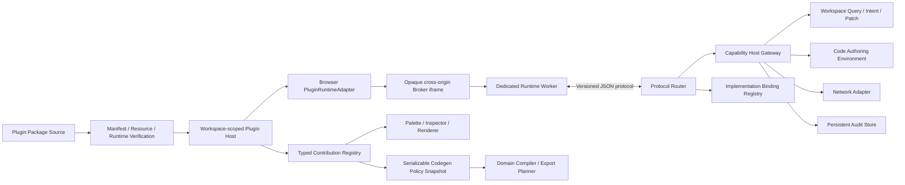

# Plugin Browser Sandbox 与 Official Plugin Phase 4 实现计划

## 状态

- Phase 4.0-4.9 implemented
- 日期：2026-07-11
- 前置阶段：
  - Phase 1：Plugin Manifest v1、strict JSON、semantic validator 与 PLG diagnostics 已完成
  - Phase 2：`@prodivix/plugin-host` transport-neutral Host Core 已完成
  - Phase 3：Palette v1、host-side resolver 与 Blueprint surface 单一读取路径已完成
- 对应 ADR：
  - `specs/decisions/14.plugin-sandbox-and-capability.md`
  - `specs/decisions/17.external-library-runtime-and-adapter.md`
  - `specs/decisions/29.plugin-extension-points.md`
- 前置实现：
  - `specs/implementation/plugin-host-core-phase2.md`
  - `specs/implementation/plugin-host-palette-phase3.md`
- Phase 4.6-4.8 详细实现：
  - `specs/implementation/official-component-plugins-phase46-48.md`

## 1. 目标

Phase 4 把已经完成的 Host Core 和 Palette contract 接到真实 Browser 安全边界，并用 official component plugin 验证静态 contribution、runtime、renderer 与 compiler 的完整闭环。

完成后，宿主必须能够：

1. 从受验证的 package source 读取 runtime artifact，校验大小、路径、digest 与 attestation 后再执行。
2. 在 opaque/cross-origin sandbox broker 内创建 Dedicated Worker 执行插件 runtime；普通 same-origin Worker 不得被当作安全边界。
3. 通过版本化、限额、可取消的 JSON message protocol 完成 handshake、activation、Gateway 调用、implementation binding、deactivation 与 crash 通知。
4. 让所有敏感操作经过 capability-scoped Host Gateway，并在执行时读取 live permission revision。
5. 对 timeout、消息洪泛、协议违规、runtime hang、crash、撤权和 generation replacement 执行确定性终止与 owner cleanup。
6. 用一个 workspace-scoped Web Plugin Platform 承载 Palette、External Library、Blueprint Template、Render Policy、Codegen Policy 与 Icon Provider，不再保留 Blueprint Palette 私有 Host。
7. 先将 Ant Design 迁移为 bundled official plugin 并删除 core 专属实现，再迁移 MUI；Radix 只有在 compound template 与 portal policy 契约稳定后才进入真实 Blueprint 闭环。
8. 保持 Manifest、contribution descriptor、protocol payload 与 compiler policy snapshot 为 JSON-only；React object、callback、DOM、Workspace store、PIR graph 和 compiler 内部对象不跨 sandbox。

Phase 4 不是“让 Worker 能跑起来”。其完成标志是安全边界、生命周期、Gateway、官方插件迁移和 core 删除门禁同时成立。

## 2. 当前事实与前置缺口

### 2.1 已完成事实

- `@prodivix/plugin-contracts` 已提供 Manifest v1、Palette v1、生成类型、strict JSON parser、结构/语义校验和 `PLG-xxxx` diagnostics。
- `@prodivix/plugin-host` 已提供 permission snapshot、owner/generation、typed registry、atomic transaction、双轴 lifecycle、撤权、runtime adapter port、cleanup 与 audit port。
- Native 与三个 bundled official component plugin 均进入同一个 resolved Palette registry；Radix 不再使用 hard-coded headless group。
- Sidebar、建节点与 Inspector 使用同一个 revisioned Palette snapshot；旧 `apps/web/src/editor/features/blueprint/registry.ts` 已删除。
- Ant Design、MUI、Radix 均已拥有真实 package artifact、support matrix、Host Module 和 exact Codegen Policy；默认 workspace 不启用任何外部库。

### 2.2 Phase 4 开始前的 Host port 缺口（Phase 4.0 已修正）

Phase 4.0 前，`PluginRuntimeAdapter.activate` 只收到 Manifest、owner、permission、transaction 与 session token，没有经过 Host 校验的 runtime artifact。`PluginPackageReader.readResource` 虽然存在，但 Host 只读取 contribution resource，尚未读取 `entrypoints.runtime`。Browser adapter 不能通过 composition-root side channel 猜测 package bytes。

Phase 4.0 已补成显式、可测试的端口：

```ts
type VerifiedPluginRuntimeArtifact = Readonly<{
  path: string;
  bytes: Uint8Array;
  digest: string;
  packageDigest: string;
}>;

type PluginRuntimeActivationInput<TMap> = Readonly<{
  owner: PluginOwnerRef;
  manifest: PluginManifestV1;
  runtimeArtifact: VerifiedPluginRuntimeArtifact;
  event: ActivationEvent;
  operationId: string;
  sessionToken: string;
  permission: LivePermissionGuard;
  contributions: ScopedContributionTransaction<TMap>;
}>;
```

规则：

1. Host 在创建 sandbox 前读取 artifact，并应用独立 runtime byte limit。
2. Manifest 声明 integrity 时必须校验；official/community policy 可以进一步要求 integrity 或已验证 package digest。
3. runtime bytes 只读一次；验证、audit 和执行消费同一份 bytes。
4. 读取失败、digest 不匹配、超限或 operation supersede 时不得创建 sandbox。
5. runtime artifact 不是 Gateway capability，也不暴露 package reader 给插件。
6. Phase 4 runtime entrypoint 是 self-contained ESM bundle；relative chunk、bare import 和 remote import 不进入隐式 module graph，后续 SDK 负责构建单 entry artifact。

另一个前置缺口是 Host 没有公开 `shutdown`。Phase 4.0 已实现幂等关闭：终止全部 runtime、abort operation、清理 registry lease 和释放 subscriber，不依赖页面刷新回收资源。

### 2.3 Manifest Schema 曾耦合扩展点枚举（Phase 4.0 已修正）

`plugin-manifest-v1.schema.json` 此前把 `contributionPoint` 写成封闭 enum。这样每新增一个 point 都必须修改 Manifest Schema，与“Manifest 和扩展点 contract 独立版本化”的长期决策冲突。

Phase 4.0 已在 alpha 阶段直接修正：

1. Manifest 只校验 contribution point 是规范、受长度限制的稳定 id。
2. `@prodivix/plugin-contracts` 可以导出当前 built-in point catalog 供 authoring/completion 使用，但该 catalog 不再决定 Manifest 是否可解析。
3. semantic validator 继续检查 `extension.register` scope 与 contribution point 一致。
4. Host 通过 exact `point + contractVersion` registry 判断是否受支持；未知 point 返回现有 `PLG-1013`，不在 Manifest Schema 阶段误报。
5. `HostContributionPointMap` 仍由 composition root 的 TypeScript map 提供闭合类型，不退化为 `Map<string, unknown>`。

这样新增 `iconProvider`、`blueprintTemplate` 或未来 point 不要求提升 Manifest Schema 版本，也不会让旧 Host 静默接受无法执行的 contract。

### 2.4 Phase 3 Web composition root 已在 Phase 4.4 收敛

Phase 3 的 module-scope Palette Host 已删除。当前 `apps/web/src/plugins/platform/` 提供：

- 由 editor shell 按 workspace 创建的单一 Web Plugin Platform；
- 同一 Host session 下的 typed contribution map、Browser runtime adapter、Gateway、policy、audit、clock 与 ID factory；
- 只读 query service 与独立 runtime mutation service；
- `@prodivix/core` trusted package 安装、Palette resolver 与 revisioned query snapshot；
- workspace switch、unmount/HMR、StrictMode/test teardown 共用的串行 shutdown 链路。

External Library、Render Policy、Codegen Policy 与 Icon Provider 在 Phase 4.5 进入同一 TypeScript map；Blueprint Template 在 Phase 4.6.0 加入同一 map。六个 point 均具备 production JSON Schema、生成类型、validator、resolver、跨点批次校验与 revisioned projection snapshot。Renderer、Compiler、Icon 和 Blueprint creation surface 消费同一 Host registry 的投影，没有创建平行 contribution Host。当前产品 Gateway 只注入稳定的 Workspace summary 与 Document read ports，intent/patch write port 在精确业务 contract 冻结前保持 unavailable。

### 2.5 库专属 core 分支已删除

Phase 4.6-4.8 已删除以下迁移前实现：

- `apps/web/src/editor/features/blueprint/external/libraries/antdProfile.tsx`
- `apps/web/src/editor/features/blueprint/external/libraries/antdManifest.ts`
- `apps/web/src/editor/features/blueprint/external/libraries/muiProfile.tsx`
- `apps/web/src/editor/features/blueprint/external/libraries/muiManifest.ts`
- `apps/web/src/editor/features/blueprint/external/index.ts` 中的库专属注册和名称分支
- `apps/web/src/pir/renderer/registry.ts` 中的 runtime component Map 与 Radix placeholder
- `apps/web/src/pir/renderer/iconRegistry.ts` 中的库专属 provider 加载分支
- `packages/prodivix-compiler/src/react/adapter.ts` 中的 Ant Design、MUI、Radix 与 icon provider 分支
- `packages/prodivix-compiler/src/react/antdAdapter.ts`

`scripts/plugin-artifacts/check-official-plugin-cutover.mjs` 持续扫描 production source，阻止这些路径、库 id/runtime prefix branch、official CDN URL、preview selector 和 HTML placeholder fallback 回流。

### 2.6 路线图编号漂移

ADR 29 将 Browser Sandbox 与 official plugin migration 都定义为 Phase 4；`plugin-host-foundation.md` 此前却把 official plugin 另列为 Phase 5。路线图现以 ADR 29 为事实源重新统一：

- Phase 4：Browser Sandbox、Host Gateway、official component plugin migration。
- Phase 5：SDK、模板、签名/市场、开发者生态与更多插件族。

## 3. 非目标

Phase 4 不实现：

1. 插件市场、搜索、评分、发布 UI 或完整签名 PKI。
2. 面向社区作者的完整 SDK 与脚手架；Phase 4 只提供协议 conformance client 和 official plugin 所需的最小 runtime API。
3. 所有 ADR 29 contribution point；只实现安全底座和 official component plugin 闭环必需的 point。
4. GSAP、react-spring、Three.js、React Flow、CodeMirror 或 Monaco 迁移；它们进入 Phase 5 的生态与插件族计划。
5. 任意 community package 在 Host main realm 执行 JavaScript、React renderer 或 compiler callback。
6. 插件直接读取 Workspace store、PIR graph、DOM、Code Authoring 内部 registry 或 compiler 内部对象。
7. 浏览器无法可靠提供的硬性 per-plugin heap 上限。Phase 4 实现 artifact/message/pending-request 限额、heartbeat、wall-time timeout 和 worker termination，并明确记录该平台限制。
8. 旧 external profile 与 official plugin 的生产双写、双读或 fallback shim。每个库迁移时直接替换，回滚依赖版本回退，不依赖运行时双轨。

## 4. 长期不变量

以下规则在 Phase 4 视为 Frozen：

1. **Host Core 与 transport 分层**：`plugin-contracts <- plugin-host <- browser adapter <- web surfaces`。
2. **单一 Host session**：同一 workspace session 的所有 contribution points 由一个 Host owner/generation/lifecycle 管理。
3. **静态数据先行**：无需 runtime 的 contribution 在 installation transaction 中发布；不得为了“像插件”而强制启动 runtime。
4. **runtime artifact 显式绑定**：执行 bytes 必须与 manifest path、package digest、installation id 和 generation 绑定。
5. **协议只传 JSON**：除一次性 MessagePort 与已验证 runtime `ArrayBuffer` transfer 外，所有消息均为受大小限制的严格 JSON 文本。
6. **精确版本匹配**：protocol、Gateway method 与 implementation contract 使用显式版本；不做 latest、minor fallback 或隐式转换。
7. **Manifest 不枚举全部 point**：Manifest 只声明规范 point id，是否支持由 Host exact contract registry 决定。
8. **能力由 Host 推导**：插件不能在请求中自报一个 capability 并让 Host 信任；Gateway contract 根据 method 与已验证参数推导所需 `(id, scope)`。
9. **实时撤权**：每次敏感调用在执行前读取 live permission；撤权必须 abort in-flight request，并抑制迟到结果。
10. **身份不可由消息伪造**：owner、installation、generation、operation 与 session 来自绑定 channel context，不来自插件 payload。
11. **实现不跨边界**：插件绑定的是 `implementationId + method`；Host registry 保存的是受生命周期约束的 RPC proxy，不保存插件函数。
12. **写入只走 Command/Intent/Patch**：Gateway 不提供任意 store mutation 或裸 PIR replacement。
13. **code-owned 只走 Code Authoring Environment**：插件不能把任意代码字符串塞进 Blueprint、NodeGraph 或 Animation 局部状态。
14. **compiler 输入显式**：compiler 消费带 revision/digest 的 serializable policy snapshot，不读取浏览器全局 registry。
15. **故障先隔离再诊断**：协议违规、hang、crash、quota violation 先终止 channel/runtime 并 cleanup，再发布 diagnostics/audit。
16. **迁移后删除 core 分支**：official plugin 验收通过后，同库专属 profile、manifest、renderer、icon 与 codegen 分支必须删除。
17. **Host projection 是显式高信任边界**：只有 build-attested `core/official` package 可绑定 React/DOM host projection；community runtime 不得使用该入口。

## 5. Threat Model

### 5.1 默认攻击者能力

除 `core` first-party contribution 外，Phase 4 假设插件可控制：

- Manifest 与 contribution resource 中的全部 bytes。
- runtime module 的全部 JavaScript 行为。
- 发往 Host 的消息内容、顺序、频率和时机。
- Gateway 参数、超时、取消、重复请求和异常响应。
- UI iframe 内的 DOM、CSS 和事件处理。
- runtime 在 deactivate 后继续发送迟到消息的尝试。

### 5.2 必须覆盖的威胁

1. 直接读取或修改 parent DOM、Workspace store、PIR、credentials 或 host globals。
2. 绕过 Gateway 使用 `fetch`、WebSocket、EventSource、storage、nested Worker 或 remote import 外传数据。
3. 伪造 plugin id、generation、session、capability、implementation owner 或 response identity。
4. 重放旧 generation 消息、复用已关闭 request id 或提交迟到 response。
5. 用超大/超深 payload、消息洪泛、pending request 堆积、无限循环或永不 resolve 消耗资源。
6. 在权限撤销、disable、update、workspace switch 或 host shutdown 后继续持有可用 proxy。
7. 利用 redirect、credentials、custom headers、private host 或 oversized response 绕过 network policy。
8. 用诊断或 audit 记录泄露 Secret、Token、完整文档内容或任意请求 body。
9. 通过 Portal、popup、top navigation、download、form 或 browser permission 逃离 UI sandbox。

### 5.3 明确不宣称解决的威胁

- Browser engine / site-isolation zero-day。
- 操作系统级 side channel。
- 浏览器不提供可终止隔离 heap 时的精确内存配额。
- 已进入 Prodivix 主 bundle 的恶意 `core` 代码。
- 经 build catalog attestation 进入发行包的 official host projection bundle；它与 shipped application code 同属受信任供应链，不被伪装成 sandboxed code。

这些限制必须出现在安全文档中，不能用“运行在 Worker”替代真实威胁模型。

## 6. 目标架构



### 6.1 Runtime 与 UI 使用不同 sandbox profile

Runtime entrypoint：

- 在 opaque/cross-origin broker iframe 内创建一个 Dedicated Worker。
- 插件 JavaScript 在 Worker 内执行，不在 editor main thread 或 broker DOM thread 执行。
- 一个 active plugin generation 对应一个 runtime worker 和一个私有 MessagePort。
- Worker missed heartbeat、hang 或 violation 时直接 terminate。

UI entrypoint：

- 每个 UI surface 使用独立 sandboxed iframe，不与 runtime 共用 DOM realm。
- UI 需要的 package assets 由受验证的 resource loader 转换为受限 blob URL。
- UI 与 Host 使用同一 protocol envelope、Gateway capability 和 audit 语义。
- Phase 4 只完成 isolation 与 protocol conformance，不把任意 UI panel 接入全部编辑器 surface。

### 6.2 Origin 与 iframe policy

Production 必须使用专用静态 sandbox origin，并同时保留不含 `allow-same-origin` 的 iframe sandbox attribute。专用 origin 不保存登录 cookie、业务凭据或用户数据。

Runtime broker 最低约束：

```text
sandbox="allow-scripts"
default-src 'none'
script-src <bootstrap-hash>
worker-src blob:
connect-src 'none'
img-src 'none'
style-src 'none'
font-src 'none'
media-src 'none'
object-src 'none'
frame-src 'none'
base-uri 'none'
form-action 'none'
```

受 hash 约束的 broker bootstrap 从 Host-shipped worker bootstrap bytes 创建 `blob:` Dedicated Worker，再把 verified runtime bytes、私有 port 和 session context transfer 给 Worker。Worker 继承 broker 的 opaque origin 与 CSP，只允许导入 Host 传入的 verified blob module；插件不能提供 worker bootstrap 或远程 script URL。bootstrap 还应冻结/移除 nested Worker 等不需要的平台入口作为 defense in depth，但不得用 monkey patch 冒充安全边界；origin、CSP 和 browser policy 才是安全约束。

UI iframe 使用单独 CSP profile，只按 package asset 需求开放 `blob:`/`data:` 的 image、font 或 style，并继续保持 `connect-src 'none'`、无 popup、无 top navigation、无 form、无 download 和空 Permissions Policy。

Development 可以由本地 dev server 提供同一静态 broker 资源，但 iframe 仍必须是 opaque origin、同一 CSP 和同一 conformance test；不得出现“开发环境先用普通 same-origin Worker”的第二条实现。

### 6.3 Official host projection boundary

React component、preview callback 与 `ComponentAdapter` 不能通过 JSON protocol 从 sandbox 返回。Ant Design/MUI 因此使用显式的 privileged host projection boundary，而不是把函数塞进 Manifest 或让 sandbox 逃逸：

```text
Bundled official plugin
  -> JSON Manifest / contribution resources
  -> build-attested OfficialHostModule
  -> generic OfficialHostImplementationRegistry
  -> host-side resolved React projection
```

规则：

1. `OfficialHostModule` 只能由 Web build 的静态 official package catalog 动态导入，不能从 plugin package bytes、URL 或 Gateway 请求加载。
2. catalog entry 绑定 plugin id、package digest、host implementation ids 和 build chunk；缺失或不匹配时 contribution resolution 失败。
3. 只有 `core`/`official` attestation 且 publisher/build metadata 全部匹配时允许绑定。
4. module 只实现冻结的 host projection interface，不获得 Workspace store、PIR graph、Host mutation API 或 package reader。
5. module 产生的 React object/callback 只存在于 resolved Host registry，随 owner/generation cleanup。
6. static Manifest、permission、registry、lifecycle、audit 与 surface consumption 仍走同一 Plugin Host 路径；这里优化的是 implementation transport，不是第二套 contribution system。
7. community/verified/development runtime 默认不能绑定 host projection。development 如需调试 official module，必须使用显式本地 build mode，不能进入 production policy。

Ant Design/MUI 的 npm dependency 由 official plugin workspace package 和 lockfile 固定，并以 build chunk 按需加载；Phase 4 不再依赖插件提供任意 esm.sh executable URL 来执行 official renderer。

`OfficialHostModule`、Palette preview、Render wrapper、Icon implementation 与 surface overlay context 的稳定 ABI 在 Phase 4.6.0 提取到窄包 `@prodivix/plugin-react-host`。Web 继续拥有 implementation registry、React Provider、query service 和 editor bridge；不会创建聚合式 `@prodivix/core` package。详细边界见 `specs/implementation/official-component-plugins-phase46-48.md`。

## 7. Versioned Runtime Protocol

### 7.1 契约位置

新增 JSON Schema 事实源：

```text
specs/plugins/runtime/
├── runtime-envelope-v1.schema.json
├── runtime-control-v1.schema.json
├── runtime-implementation-v1.schema.json
└── gateway-envelope-v1.schema.json
```

新增无 DOM、无 Host service 依赖的协议包：

```text
packages/plugin-protocol/
├── src/generated/
├── src/codec/
├── src/contracts/
└── src/index.ts
```

依赖方向：

```text
plugin-contracts <- plugin-protocol
plugin-contracts <- plugin-host
plugin-protocol + plugin-host <- web browser adapter
plugin-protocol <- sandbox bootstrap / conformance client
```

`@prodivix/plugin-protocol` 只提供 generated types、strict codec、exact contract registry 和公开结果类型；不依赖 DOM、Worker、React、Workspace 或 `@prodivix/plugin-host`。

### 7.2 Envelope

稳定 envelope 方向：

```ts
type RuntimeEnvelopeV1 = Readonly<{
  protocol: 'prodivix.plugin-runtime';
  protocolVersion: '1.0';
  kind: 'request' | 'response' | 'event';
  channel: 'control' | 'gateway' | 'implementation';
  method: string;
  contractVersion: string;
  messageId: string;
  replyTo?: string;
  sequence: number;
  payload: JsonValue;
}>;
```

规则：

1. MessagePort 上只接受 string；Host 先按 UTF-8 bytes 限额，再用 strict JSON parser 解析和检查重复 key。
2. envelope Schema 只验证 transport 字段；`channel + method + contractVersion` 由 exact contract registry 选择 payload validator。
3. `replyTo` 只能引用当前 session 中未完成且方向匹配的 request。
4. 每个发送方维护从 1 开始的单调 sequence；重复、回退或跳过上限的消息触发 protocol violation。
5. plugin id、owner、generation、permission revision 和 capability 不从 payload 读取，统一来自 Host channel context。
6. 未知字段、未知 method、未知 contract version、非法 result union 或超限 payload 均 fail closed。
7. diagnostics 在协议中只传稳定 code、safe message 与受限 metadata；不传 Error object、stack、function 或 class instance。

### 7.3 Handshake

Handshake 顺序固定为：

1. Host 创建 iframe、cryptographic nonce 与 MessageChannel。
2. broker 只通过 `window.postMessage` 发一次带 nonce 的 bootstrap-ready；Host 校验 `event.source`、nonce 和 frame instance。
3. Host 将私有 port 与 verified runtime `ArrayBuffer` transfer 给 broker，然后移除 window message listener。
4. broker 创建 Dedicated Worker，并把 port、runtime bytes 与 Host 支持的 protocol version list 传入。
5. Worker 选择 Host 明确支持的 exact version，导入 runtime module，校验 module export shape。
6. Worker 返回 runtime-ready；Host 才发送 activation control request。
7. activation 成功且 implementation binding 校验通过后，Host Core 才 commit activation transaction。

Opaque iframe 的初始 `targetOrigin` 可能必须使用 `*`，因此 window channel 只能做一次 bootstrap，并必须同时校验 source window、nonce 和 frame instance。所有后续 authority 都在私有 MessagePort 上；不能把 `*` 用于普通 runtime traffic。

### 7.4 Cancellation 与 timeout

- 每个 request 绑定 AbortSignal、deadline 和 pending slot。
- Host timeout、permission revoke、disable、generation replacement 与 shutdown 都发送 best-effort cancel，然后立即使本地 request 失效。
- cancel 后的迟到 response 被记录但不得恢复 state、commit transaction 或重新激活 proxy。
- protocol request timeout 与 Host lifecycle timeout 使用不同 diagnostic/action，避免把 Gateway 慢调用误判为 activation transaction 错误。

## 8. Browser Runtime Adapter

建议目录：

```text
apps/web/src/plugins/
├── platform/
│   ├── createWebPluginPlatform.ts
│   ├── WebPluginPlatform.ts
│   └── WebPluginPlatformProvider.tsx
├── browser/
│   ├── createBrowserPluginRuntimeAdapter.ts
│   ├── sandboxFactory.ts
│   ├── runtimeArtifactLoader.ts
│   ├── runtimeSession.ts
│   ├── protocolRouter.ts
│   ├── quotas.ts
│   └── uiSandboxFactory.ts
├── gateway/
│   ├── gatewayContractRegistry.ts
│   ├── gatewayDispatcher.ts
│   ├── handlers/
│   └── auditStore.ts
└── contributions/
    ├── contributionPointMap.ts
    └── contracts.ts
```

静态 broker 与受 digest 约束的 worker bootstrap bytes 由 Web build 独立输出，不能读取 editor runtime globals。Worker 由 broker 在 opaque realm 内通过 `blob:` 创建，不能直接从 editor origin 加载。

### 8.1 Session ownership

`BrowserPluginRuntimeSession` 必须绑定：

- `PluginOwnerRef`
- plugin version
- runtime path + digest
- Host session token
- private transport id
- selected protocol version
- permission guard
- activation operation id

任何字段不匹配都终止 session。Host session token 是 correlation identity；channel authority 来自私有 MessagePort 和绑定 context，不把可猜字符串当作唯一安全凭据。

### 8.2 Termination mapping

以下情况调用 `onDidTerminate`，并使用稳定 reason code：

- broker load/CSP failure
- worker startup/import failure
- protocol handshake mismatch
- malformed/unknown/replayed message
- heartbeat timeout
- message/pending-request quota exceeded
- uncaught runtime error or unhandled rejection
- broker/worker close
- explicit Host terminate

Host Core 只处理当前 owner + generation + session token 的 termination；旧 generation 事件只能清理自己的 transport，不能改变新 generation snapshot。

### 8.3 Enforceable quota

所有数值由单一 `BrowserPluginQuotaPolicy` 配置，不散落 magic number。初始默认值不属于 wire contract，可以按测量调整：

| 预算             | 初始方向                                     |
| ---------------- | -------------------------------------------- |
| runtime artifact | 单 entry 8 MiB，package policy 可进一步收紧  |
| message          | 单条 256 KiB，method contract 可设置更低上限 |
| rate             | token bucket 64 msg/s，允许有限 burst        |
| pending request  | 每 session 16                                |
| Gateway timeout  | 默认 5 s，method 可收紧                      |
| lifecycle        | activation/deactivation 默认 10 s            |
| heartbeat        | 2 s interval，连续 3 次 miss 后 terminate    |

Phase 4 不宣称浏览器提供硬性 heap cap。安全文档必须把“可终止 Worker + 有界输入/队列/输出”与“精确内存配额”区分开。

## 9. Capability-scoped Host Gateway

### 9.1 不允许 stringly-typed 万能 invoke

Gateway 使用冻结的 exact contract registry：

```ts
type GatewayContract<TRequest, TResponse> = Readonly<{
  method: string;
  contractVersion: string;
  validateRequest(value: JsonValue): ValidationResult<TRequest>;
  validateResponse(value: JsonValue): ValidationResult<TResponse>;
  requiredCapability(request: TRequest): CapabilityIdentity;
  timeoutMs: number;
  maxRequestBytes: number;
  maxResponseBytes: number;
  auditMode: 'best-effort' | 'required-before-effect';
  execute(
    context: GatewayExecutionContext,
    request: TRequest
  ): Promise<TResponse>;
}>;
```

Registry 在 Web composition 阶段注册并冻结。插件不能动态添加、替换或包装 Gateway handler。

### 9.2 Dispatch 顺序

每次 Gateway request 固定执行：

1. envelope size、strict JSON 与 protocol contract validation。
2. 从 bound session context 读取 owner/generation；忽略 payload 中任何伪造 identity。
3. exact lookup Gateway method/version。
4. 校验 method request，并由 contract 推导 capability identity。
5. 确认 Manifest 请求过该 exact capability。
6. 读取 live permission snapshot 并确认当前 grant。
7. 应用 per-method rate、concurrency、timeout 与 response limit。
8. 对有副作用或敏感读取执行 durable preflight audit；audit 不可用时 fail closed。
9. 调用注入 service port；不把 service/store handle 暴露给插件。
10. 再次确认 session/generation/permission 未失效，校验 response 后返回。
11. 写 outcome audit；所有 metadata 经过 redaction。

### 9.3 Phase 4 Gateway handler 范围

Phase 4 先实现支撑 conformance 与 official plugin 所需的最小集合：

- `runtime.health/ping@1.0`：无敏感能力，只用于 protocol/heartbeat。
- `telemetry/emit@1.0`：要求 `telemetry.emit`，payload 有字段和大小白名单。
- `workspace/read-summary@1.0`：要求 `workspace.read`，只返回稳定、最小、serializable projection。
- `workspace/dispatch-intent@1.0`：要求 `workspace.intent.dispatch`，只接收已注册 intent contract。
- `document/read@1.0`：要求 exact `document.read + scope`，返回 revisioned projection，不返回 store。
- `document/apply-patch@1.0`：要求 exact `document.write + scope`，走 Command/Intent/Patch validation 和 revision check。
- `network/request@1.0`：要求 exact `network.request + allowlist scope`，由 Host network adapter 执行。

`secrets.read` 在没有稳定 vault、redaction 和 consent UX 前保持 policy deny；不能为了补齐枚举提供不安全的临时 handler。

### 9.4 Network adapter

`network/request@1.0` 必须：

- 只允许 Host policy 中该 scope 对应的 HTTPS origin/method/path。
- 禁止 credentials、cookies、ambient auth、custom `Host`、`Cookie`、`Authorization` 和 hop-by-hop headers，除非 Host 通过独立 secret binding 注入。
- 禁止 localhost、link-local、private literal IP 和非标准 scheme。
- 禁止自动信任 redirect；每一跳重新校验 allowlist，并设置最大跳数。
- 限制 request/response bytes、content type、duration 和并发数。
- 不把 `Set-Cookie`、底层 Response、stream handle 或完整 error stack交给插件。
- audit 只记录必要的 normalized origin、method、policy scope、status 和 byte count，不记录 Secret 与完整 body。

## 10. Runtime Implementation Binding

静态 descriptor 可以声明 `implementationId`，但 runtime implementation 必须在 activation 时显式绑定：

```text
<pluginId>/<contributionId>/<implementationId>/<method>
```

绑定规则：

1. contribution contract 声明允许的 implementation method、输入/输出 Schema 和 lifetime。
2. runtime 只能绑定当前 Manifest 已声明、当前 transaction 已准备且 permission granted 的 implementation id。
3. 同一 implementation method 在同 generation 内只能绑定一次。
4. Host registry 保存带 owner/generation/session 的 RPC proxy；插件函数本身不跨 MessagePort。
5. proxy 每次调用都检查 session active、permission 与 method quota。
6. deactivate、crash、revoke、disable、generation replacement 或 shutdown 后 proxy 立即失效并 cleanup。
7. 未绑定的 required implementation 使 activation transaction rollback；optional implementation 产生明确 degraded diagnostic。

Palette v1 本身不要求 runtime implementation。Ant Design/MUI 可以优先使用声明式 External Library、Render Policy 与 Codegen Policy；不得为了测试 sandbox 人为加入无用途 runtime。真实 runtime 路径由 conformance fixture 覆盖。

## 11. Web Plugin Platform 收敛

### 11.1 单一 contribution map

Phase 4.4 已建立一个 Web Host map：

```ts
type WebContributionPointMap = Readonly<{
  paletteContribution: ResolvedPaletteContribution;
  externalLibrary: ResolvedExternalLibraryContribution;
  renderPolicy: ResolvedRenderPolicyContribution;
  codegenPolicy: ResolvedCodegenPolicyContribution;
  iconProvider: ResolvedIconProviderContribution;
}>;
```

Palette、External Library、Render Policy、Codegen Policy 与 Icon Provider 的 `1.0` production contracts 均已注册。四个 Phase 4.5 point 使用独立 closed Schema、生成类型和 point-specific semantic validator；原 branded resolved slot 已删除，没有 permissive placeholder contract。Renderer、Compiler、Icon surface 和 Inspector 继续从同一 Host revision 读取投影，不创建平行 Host。

同一 Web composition root 已注册与 Host contracts 对齐的 `OfficialHostImplementationRegistry` 和 Host-controlled `LibraryArtifactResolver`。前者是 build-time trusted implementation catalog，不是第二个 contribution registry；实现按 plugin id、package digest、package coordinate、kind 与 owner/generation exact bind，并随 owner cleanup。community/verified package 不能注册 Host main-realm implementation。

### 11.2 Lifetime

- Web Plugin Platform 由 workspace/editor shell 创建，不在 feature module import 时创建。
- Provider 使用单一 lifecycle promise 串行执行 old cleanup/shutdown 与 next Host creation；workspace switch、logout/unmount、test teardown 和 HMR replacement 都走同一路径。
- Native `@prodivix/core` contribution、bundled official plugin 与 development package 使用同一 Host session，但有不同 attestation/policy。
- surface 只注入 typed reader/query service；package install、Palette contribution mutation与 workspace cleanup 只通过独立 runtime service 提供给 composition/runtime adapter。
- registry snapshot revision 是 render、Palette、Inspector 与 compiler policy projection 的一致性边界。
- 未配置 `VITE_PLUGIN_SANDBOX_URL` 时不会创建 Browser runtime adapter，runtime activation 明确 fail closed；静态 trusted contribution 仍可工作。

### 11.3 Phase 3 adapter 迁移

Phase 3 `apps/web/src/editor/features/blueprint/palette/host.ts` 的职责已拆分到：

- `apps/web/src/plugins/platform/createWebPluginPlatform.ts`：Host、policy、trusted package source、audit、ID/clock 与 cleanup。
- `apps/web/src/plugins/platform/createWorkspaceWebPluginPlatform.ts`：Browser adapter、Gateway contract registry 与 workspace-scoped IndexedDB audit。
- `apps/web/src/plugins/platform/WebPluginPlatformProvider.tsx`：React service injection 与串行 workspace lifecycle。
- Palette contract module：Palette validator/resolver。
- `nativeCorePlugin.ts`：通过 trusted package adapter 安装 `@prodivix/core`。
- `paletteQueryService.ts`：把 Host records 投影为 Blueprint snapshot。

Palette 私有 Host、module singleton 和第二层 `runSerialized` 已删除。per-plugin serialization 仅由 Host operation coordinator 负责；runtime projection binding 使用 package `sourceId + packageDigest + pluginId + contributionId`，避免并发同插件 replacement 串用另一 package 的宿主投影。

## 12. Official Component Plugin Contracts

### 12.1 Phase 4 必需 Schema

Phase 4 独立版本化：

```text
specs/plugins/
├── external-library-contribution-v1.schema.json
├── render-policy-contribution-v1.schema.json
├── codegen-policy-contribution-v1.schema.json
├── icon-provider-contribution-v1.schema.json
└── blueprint-template-contribution-v1.schema.json
```

前四个 Schema 已在 Phase 4.5 完成；`blueprintTemplate@1.0` 在 Phase 4.6.0 落地，由 Ant Design Form.Item 首先验证，再供 MUI Accordion 与 Radix compound component 复用。所有 Schema 都保持 closed object、JSON-only、大小上限和 exact contract version。`@prodivix/plugin-contracts` 继续从 Schema 生成类型/runtime Schema，并实现 point-specific semantic validator。

### 12.2 External Library descriptor

插件声明 package coordinate、exact version、component/runtime metadata 与 dependency metadata，不声明任意 executable URL。

Host `LibraryArtifactResolver` 根据 package coordinate 和 Host policy 解析 bundled artifact；插件不能提供 `entryCandidates` 绕过 allowlist。Host main realm 的 React module loading 只允许 build-attested official catalog entry，community/verified plugin 在 Phase 4 默认 denied。任意外部库的通用用户工作流后续迁到独立 generic external-library plugin 与更严格的 renderer boundary，不通过 official plugin descriptor 偷渡 remote code。

### 12.3 Render Policy descriptor

Render Policy v1 优先是声明式规则：

- component match / runtime type mapping
- props transform 与默认值
- child/text/void semantics
- provider/context wrapper declaration
- portal mode：`inline`、`host-overlay` 或 `disabled`
- canvas-controlled open/selected state
- fallback/diagnostic behavior

Host resolver把这些 JSON 规则转成 `ComponentAdapter` 与预览 projection。ReactNode、ElementType 和 `mapProps` callback 不进入 descriptor。无法由声明式 v1 安全表达的组件保持 unsupported/degraded，不能把任意 official callback 直接塞回 core。

确实需要 React/context/preview callback 的 official contribution 通过 descriptor 中稳定 `hostImplementationId` 绑定 build-attested `OfficialHostModule`。该 id 由 Host resolver 与 official implementation catalog exact match；callback 仍不进入 wire，也不能由 community package 注册。

### 12.4 Codegen Policy descriptor

Codegen Policy v1 描述：

- target preset
- node/runtime match
- element/export mapping
- import source/kind/name
- prop/children transforms 的有限声明式操作
- dependency 与 license metadata
- unsupported behavior diagnostics

Web Host 根据 registry revision 生成 immutable serializable policy snapshot；`@prodivix/prodivix-compiler` 从 compile options 显式消费该 snapshot并构造 composite `TargetAdapter`。compiler 不依赖 `@prodivix/plugin-host`，也不访问 browser singleton。

### 12.5 Icon Provider descriptor

Ant Design/MUI core 删除门禁包含 icon provider。Icon Provider v1 至少描述：

- provider identity
- package coordinate 与 export strategy
- name normalization/variant mapping
- render component resolution policy
- React codegen import policy
- size/response/cache limit

这样 `apps/web/src/pir/renderer/iconRegistry.ts` 与 React compiler 不再按 provider id 硬编码 Ant Design/MUI 分支。

## 13. Official Plugin 迁移顺序

### 13.1 Ant Design：首个完整试点

选择 Ant Design 的原因不是它最简单，而是它已经覆盖：

- 大型 export surface 与分组。
- Input/Form/Modal 等不同 props/children/portal 行为。
- 自定义预览与 fallback。
- 独立 React codegen adapter。
- icon provider 与 external library metadata。

`packages/plugin-antd/` 已包含可发布 package 边界、Plugin Manifest、六份 contribution JSON、support matrix、generated artifact/catalog 与 React Host Module。Web 只通过 generic bundled-official package catalog 发现它，不导入 `antdProfile` 或 AntD 专属 resolver。

迁移门禁：

1. 先用公开行为测试冻结 Palette 分组、建节点默认值、Canvas render outcome 和 React import outcome。
2. 用 `externalLibrary@1.0`、`paletteContribution@1.0`、`renderPolicy@1.0`、`codegenPolicy@1.0`、`iconProvider@1.0` 表达现有行为。
3. 以 `official` attestation 经完整 discover/permission/transaction 路径注册。
4. Blueprint 真实使用 official plugin snapshot；不保留 core fallback。
5. 删除 Ant Design profile、manifest、registration branch、renderer branch、compiler adapter 和 icon branch。
6. 对剩余 `antd`/`Antd` 引用做 allowlist 审计；只允许 official plugin package、fixture、docs 和用户项目生成结果。

### 13.2 MUI：复用性验证

Ant Design 完成后迁移 MUI，已证明 contract 是库无关的：

1. 新增 `packages/plugin-mui/`，使用与 Ant Design 相同的 Schema 和 Host path。
2. 不允许为 MUI 增加 Host/Compiler `if (libraryId === 'mui')` 分支。
3. Dialog、Accordion、Emotion dependency 与 default-import codegen 必须由通用 contract 表达。
4. 删除 MUI profile、manifest、registration、renderer/codegen/icon 专属分支。
5. 若 contract 无法表达 MUI 行为，先修正通用 contract 并回归 Ant Design，不能新增 package-local Host hook。

### 13.3 Radix：compound 与 portal 契约门禁

迁移前 Radix Palette/renderer 以 placeholder 为主。Phase 4.8 没有把 `RadixAccordion` 映射成 `div`，而是实现真实 primitive、compound template 和 portal policy。

Radix 迁移已完成以下门禁：

1. `blueprintTemplate` contribution 或 Palette 新 contract version，能描述 normalized multi-node PIR fragment。
2. template 实例化通过一个 validated Command/Intent batch 生成新 node id，不直接修改 graph。
3. External Library descriptor、Blueprint Template 与 composition rule 提供 slot/cardinality/context 语义，能表达 Root/List/Trigger/Content 等 compound component。
4. Render Policy portal mode 能处理 Dialog/Popover/Tooltip 的 canvas-safe container、open state 和 cleanup。
5. Codegen Policy 能输出 namespace/named import、compound member 和结构化 children。
6. 至少用 Accordion、Tabs、Dialog 和 Tooltip 覆盖 compound、provider 与 portal 行为。

门禁通过后已新增 `packages/plugin-radix/`，并删除 hard-coded Headless group、Radix factory、Renderer placeholder 和 React compiler fallback。

## 14. 分阶段执行

### Phase 4.0：路线图与 Host port 修正

- [x] 合并 Phase 4/Phase 5 编号漂移，并链接本计划。
- [x] 将 Manifest contribution point 从封闭 enum 改为规范 id，由 Host exact contract registry 判断支持性。
- [x] 为 runtime artifact 定义独立 limit、读取、integrity 与 verified input。
- [x] 为 Plugin Host 增加 idempotent `shutdown`。
- [x] 增加 runtime artifact、deactivation reason、audit metadata 与 shutdown 所需的 transport-neutral public types；protocol/Gateway contract 留在 Phase 4.1/4.3。
- [x] 用 Host 公开行为测试覆盖 artifact failure、timeout、shutdown、supersede 与 cleanup。

Gate：已通过。Browser adapter 不需要 package side channel；Host 能在测试中完整 shutdown 且 lease 为零。

实现结果：

- `@prodivix/plugin-contracts` 使用规范 contribution point id，并独立导出 built-in authoring catalog。
- `@prodivix/plugin-host` 在 timeout 内读取 runtime artifact，二次限额、计算 SHA-256、校验 Manifest integrity，并把 package-bound artifact 传给 adapter。
- runtime deactivation reason 进入 adapter port；activation audit 记录 path、actual digest 与 package digest。
- Host-level AbortSignal 覆盖尚未获得 plugin id 的 Manifest read；`shutdown()` exactly-once 清理 active/pending runtime、owner lease 和 subscriber。
- 新增 `PLG-4010`、`PLG-4011`、`PLG-4012`，definitions、规范与 `apps/docs` 页面同步。

### Phase 4.1：Protocol contracts 与 codec

- [x] 新增 runtime/control/implementation/gateway JSON Schema。
- [x] 创建 `@prodivix/plugin-protocol` 并配置 generated/check:generated。
- [x] 实现 strict JSON text codec、byte/depth/node limits 与 exact method registry。
- [x] 实现 request correlation、sequence、cancel 与 timeout state machine。
- [x] 新增 protocol diagnostics，并同步 `specs`、definitions 与 `apps/docs/reference/diagnostics/`。

Gate：已通过。对 malformed、duplicate key、unknown method/version、dot-namespaced method、replay、late response 和 oversized message 的 21 个测试全部 fail closed。

实现结果：

- `specs/plugins/runtime/` 四份 JSON Schema 是 wire 事实源；Gateway success response 已按 method 收紧为 closed projection，不再使用任意 `JsonValue` 结果。
- `@prodivix/plugin-protocol` 生成类型、runtime Schema 与 Ajv standalone validator。Ajv 只在生成期运行，生成器拒绝含 `require(`、`new Function` 或 `eval(` 的 runtime source，CSP 下不需要 `unsafe-eval`。
- Runtime Envelope method 允许规范点分 namespace（例如 `runtime.health/ping`），仍要求至少一个 `/` action segment。
- endpoint 对 sequence、request/reply correlation、cancel、timeout、late response 与 close 做 exactly-once state transition。

### Phase 4.2：Opaque sandbox 与 Browser adapter

- [x] 输出独立 broker HTML/bootstrap 与受 digest 约束的 Dedicated Worker bootstrap bytes。
- [x] 配置 production headers、CSP、Permissions Policy 与 no-cookie sandbox origin。
- [x] 实现 cryptographic bootstrap nonce、private MessagePort 和 exact handshake。
- [x] 实现 verified runtime import、heartbeat、termination 与 runtime session。
- [x] 实现 runtime/UI 两套 sandbox policy；UI 先完成 conformance fixture。
- [x] 将 Browser adapter 接入 Host Core runtime port。

Gate：已通过。Playwright 在真实 production build 中证明插件不能访问 parent DOM、network、storage、top navigation、popup、browser permission 或 nested Worker，runtime hang/crash 不影响 editor 主循环。

实现结果：

- `@prodivix/plugin-browser` 提供 Browser `PluginRuntimeAdapter`、nonce/source/frame-bound sandbox factory、私有 `MessagePort`、heartbeat、inbound token bucket、pending limit、termination mapping 与 Gateway session port。
- `@prodivix/plugin-sandbox` 构建独立 runtime/UI HTML、hash-bound scripts、CSP、Permissions Policy、Cloudflare `_headers` 与 Nginx 配置，并执行 source policy check。
- Chromium 在无 `allow-same-origin` iframe 中拒绝 blob module Worker，且 opaque blob Worker 没有 `crypto.subtle`。因此 Host Worker bootstrap 固定构建为 self-contained IIFE classic Worker；broker 使用 Web Crypto 校验 bootstrap/runtime digest 后 transfer 同一 `ArrayBuffer`，Worker 再动态导入 verified self-contained ESM runtime。这不是 same-origin fallback，也不放宽 CSP。
- production Chromium conformance 覆盖 runtime activation、hang termination、UI isolation、安全 headers 与 Host main-loop responsiveness。

### Phase 4.3：Gateway、quota 与持久化 audit

- [x] 实现冻结的 Gateway contract registry 与 dispatcher。
- [x] 接入 live permission、Manifest request、owner/generation 和 cancellation guard。
- [x] 实现 per-session message/rate/concurrency/timeout policy。
- [x] 实现 host-side persistent bounded audit store、redaction 与 sensitive preflight fail-closed。
- [x] 实现 Phase 4 最小 handler 集合；`secrets.read` 保持 deny。
- [x] 实现 network allowlist/redirect/header/body/response policy。

Gate：已通过。27 个 Browser package tests 覆盖撤权 mid-flight、audit unavailable/reporting、wire diagnostic redaction、redirect escape、private target、forbidden header、encoded path escape、duplicate policy、quota flood、timeout 与 stale generation，均无 side effect 或残留 handle；production Playwright 另验证 IndexedDB audit 跨 reopen 持久化、双上限裁剪与脱敏。

实现结果：

- frozen registry 只接受 exact `method + contractVersion`，dispatcher 固定执行 request Schema/bytes、Manifest request、live grant、quota、durable preflight、service、live recheck、response Schema/bytes 与 outcome audit。
- `LivePermissionGuard.subscribe` 由 Host permission lifecycle 驱动，撤权无需轮询即可 abort in-flight service；caller、session dispose、generation replacement 与 timeout 进入同一个 request guard。
- 最小 contracts 为 `runtime.health/ping@1.0`、`telemetry/emit@1.0`、`workspace/read-summary@1.0`、`workspace/dispatch-intent@1.0`、`document/read@1.0`、`document/apply-patch@1.0` 与 `network/request@1.0`。真实业务通过 service ports 注入，缺 port 返回 `PLG-4034`；`secrets.read` 无 contract/handler。
- IndexedDB audit 只保存 owner/generation、operation、method/capability、byte counts、outcome、diagnostic code 与受限 flat metadata；完整 session token、body、content、patch、Secret 与 Token 不落盘。
- network adapter 拒绝 ambient credentials、private/reserved literal target、非 HTTPS、scope/origin/method/path/header 越界、不可见或越界 redirect、非白名单 content type、invalid UTF-8 与 oversized response，并逐跳重新校验。

### Phase 4.4：统一 Web Plugin Platform

- [x] 建立 workspace-scoped Web composition root 与 React provider/service injection。
- [x] 建立包含 Palette、External Library、Render Policy、Codegen Policy 与 Icon Provider slot 的单一 typed map；仅注册已冻结的 Palette contract，其他四个 exact contract 留给 Phase 4.5。
- [x] 将 `@prodivix/core` native contribution 迁入新 Host session。
- [x] 将 Palette reader/query 注入 Sidebar、建节点与 Inspector。
- [x] 删除 Blueprint Palette module singleton、私有 policy/audit 和重复 serialization queue。
- [x] workspace switch/HMR/test teardown 统一调用 Host shutdown。

Gate：已通过。Web 平台测试用注入的 strict test contract 证明同一 plugin 的多 point contribution 只产生一个 registry batch，并在任一 resolver 失败时整体回滚且释放 Palette claim；并发同插件 replacement 按 package attestation 绑定投影。Provider 测试证明下一 workspace Host 必须等待旧 cleanup/shutdown，StrictMode teardown 后无 active Host。生产只注册 Palette contract，不以测试 contract 代替 Phase 4.5 Schema。

### Phase 4.5：External/Render/Codegen/Icon contracts

- [x] 新增四个 Schema、生成类型、validator、resolver 与 diagnostics。
- [x] 将 `iconProvider` 加入 built-in point catalog。
- [x] 用 Host-controlled package coordinate resolver 替换 plugin-provided executable URL。
- [x] 从 Render Policy 生成 host-side runtime adapter/projection。
- [x] 建立 build-attested Official Host Module catalog，并按 owner/generation 绑定 host implementation id。
- [x] 从 Codegen Policy snapshot 生成 compiler composite adapter。
- [x] 将 icon renderer/codegen 迁到 Icon Provider registry。
- [x] 补跨 point identity、library ownership、runtime type 与 implementation reference semantic validation。

Gate：已通过。library-neutral official fixture 经同一五点 transaction 完成 Palette -> Canvas -> React export，并覆盖 exact package/license、Icon renderer/codegen、跨点引用拒绝、resolver 失败整体回滚、并发 generation replacement、disable 后全部 projection/implementation lease 清零。Host/Web/Compiler 没有该 fixture 的 library-id 分支。

实现结果：

- `@prodivix/plugin-contracts` 从四份 closed JSON Schema 生成类型和 runtime Schema，并校验唯一 identity、声明式 props/children/portal、依赖和 icon normalization/import 规则。
- Plugin Host 在 descriptor validation 与 prepare 之间提供 transport-neutral batch semantic validator；Web 用它验证同 owner 的 library、runtime type、export、package coordinate 和 implementation kind。
- Web composition root 使用 build-attested `OfficialHostImplementationRegistry` 与 `LibraryArtifactResolver`，只允许 `core`/`official` verified package exact bind Host main-realm component/callback。
- Render Policy 生成 canvas `ComponentAdapter` projection；Icon Provider 进入现有 renderer registry；两者随 Host revision 和 owner cleanup 更新。
- Web 生成 immutable serializable `CodegenPolicySnapshot`；compiler 从显式 compile options 构造 composite `TargetAdapter`，不依赖 `@prodivix/plugin-host` 或 browser singleton。
- Resolver 在异步 artifact 返回后重新校验 identity claim，防止并发安装覆盖 provider；`host-overlay` 只有在 attested implementation 提供 component wrapper 时才允许发布。
- Icon Provider 的 alias chain、任意 variant id、variant subpath、canvas size/color props 与 React import 使用同一 normalization；未知 variant 和不安全 JavaScript export identifier 均 fail closed。
- Compiler 对跨 policy 的同名 package exact coordinate 使用确定性 first-coordinate，并产生阻断诊断，不允许 version/license 冲突静默覆盖导出依赖。

### Phase 4.6：Ant Design official plugin

- [x] Phase 4.6.0：按 `official-component-plugins-phase46-48.md` 完成 React Host ABI、真实 artifact、bundled catalog 与 `blueprintTemplate@1.0` 基座。
- [x] 创建 `@prodivix/plugin-antd` package artifact。
- [x] 迁移 Palette、external descriptor、render/codegen policy 与 icon provider。
- [x] 通过 official package source 完成 discover、grant、register、use、disable、update 与 shutdown。
- [x] 删除全部 Ant Design core 专属实现和测试替身。
- [x] 补完整 editor smoke 与 export behavior test。

Gate：已通过。禁用/移除插件后 Palette、runtime registry、render policy、icon provider 与 compiler snapshot 中均无 Ant Design lease；重新启用只产生一个新 generation。

### Phase 4.7：MUI official plugin

- [x] 创建 `@prodivix/plugin-mui`，只使用 Phase 4.5/4.6.0 generic contract 与 ABI。
- [x] 迁移 Palette、runtime、render/codegen policy 与 icon provider。
- [x] 回归 Ant Design，证明通用 contract 未被 MUI 特例污染。
- [x] 删除全部 MUI core 专属实现。

Gate：已通过。Host/Web/Compiler 不出现 MUI library-id 分支；Ant Design 与 MUI 可独立 enable/disable 且 snapshot revision 一致。

### Phase 4.8：Radix contract 与真实编辑器闭环

- [x] 用真实 Radix 结构完成 `blueprintTemplate@1.0` compound、slot/cardinality 与 portal-safe policy conformance。
- [x] 通过 Command/Intent 实例化 normalized multi-node fragment。
- [x] 创建 `@prodivix/plugin-radix` 并覆盖基础、compound 与 portal 组件。
- [x] 删除 Radix renderer placeholder 与 compiler fallback。
- [x] 验证 Canvas interaction、Inspector、建节点、preview 和 React export。

Gate：已通过。Accordion/Tabs/Dialog/Tooltip 使用真实 Radix runtime/codegen，不是 `div` placeholder，且 portal cleanup 不残留 DOM/overlay handle。

Phase 4.6-4.8 的 package topology、Schema 字段、support matrix、删除清单、子阶段与逐库 gate 以 `specs/implementation/official-component-plugins-phase46-48.md` 为执行事实源。

### Phase 4.9：Hardening、文档与状态收口

- [x] 完成 threat-model security test、protocol fuzz/property test 与 browser matrix。
- [x] 验证 production sandbox headers 和部署配置，不只验证 Vite dev server。
- [x] 运行 package tests、web tests、typecheck、lint、build、diagnostics generation 与 VitePress build。
- [x] 运行 `pnpm run format`，接受 formatter 自然产生的格式变化，不手工逆格式化。
- [x] 同步 ADR 14/17/29、实现文档、PLG diagnostics 与 `apps/docs`。
- [x] 仅在所有 exit criteria 成立后更新 ADR 29 implementation status。

Gate：已通过。`@prodivix/plugin-protocol` 使用 fast-check 对 arbitrary JSON、duplicate key、任意 UTF-16 transport text 与非文本输入执行每项 1,000 runs 的 deterministic property/fuzz；production sandbox conformance 在 Chromium、Firefox、WebKit 上 24/24 通过，覆盖 verified runtime、hang、activation throw、unhandled rejection、Worker self-close、DOM/network/storage/navigation/popup/download/permission 隔离、安全响应头和持久审计。WebKit Worker blob URL 生命周期与 Firefox sandbox popup exception 的跨浏览器差异已收敛到同一安全语义。

`@prodivix/plugin-sandbox` 现从单一 policy source 生成 CSP、Permissions Policy、Cloudflare `_headers` 和 Nginx 配置，并通过 production artifact test 校验 script hash、exact route、无 Cookie 与 fail-closed 404。独立 `prodivix-plugin-sandbox` GHCR image、Compose service、healthcheck 和 deploy smoke 已接入；部署 smoke 对真实 Nginx 响应执行同一 header/hash/404 验证。Phase 4.9 未新增 PLG code，现有 definitions 与 307 个 generated diagnostic pages 已通过 drift check。

## 15. Diagnostics 规划

现有 `PLG-4001` 至 `PLG-4008` 继续表示 Host lifecycle/cleanup。Phase 4 在 `PLG-40xx` 内按职责分配后续码位：

- `PLG-401x`：runtime artifact、bootstrap、CSP 与 protocol handshake。
- `PLG-402x`：malformed/unknown/replay/late protocol message。
- `PLG-403x`：Gateway deny、request/response validation、timeout 与 unavailable handler。
- `PLG-404x`：quota、heartbeat、circuit breaker 与 sandbox termination。
- `PLG-405x`：implementation identity、binding、proxy invalidation 与 stale generation。
- `PLG-406x`：persistent audit、redaction 与 fail-closed policy。
- `PLG-407x`：bundled official package reconciliation、runtime availability 与历史 runtime support state。

只有实现和测试同批落地时才创建具体 code。每次新增/修改 PLG code 必须同步：

1. `specs/diagnostics/plugin-diagnostic-codes.md`
2. `PLUGIN_DIAGNOSTIC_DEFINITIONS`
3. `apps/docs/reference/diagnostics/` 生成页面
4. diagnostics contract tests

不得只改 `specs` 或只改代码。

## 16. 测试矩阵

### 16.1 Host port

- runtime artifact path/digest/limit/read failure。
- artifact 读取期间 disable/update supersede。
- shutdown active/activating/deactivating/failed runtime。
- shutdown 重复调用与 cleanup failure 汇总。

### 16.2 Protocol

- valid handshake 与 exact version negotiation。
- unknown/empty/duplicate field、duplicate JSON key、invalid UTF-8 surrogate policy。
- oversized/deep/node-heavy payload。
- duplicate/replayed/out-of-order sequence。
- unknown method/version、wrong response direction、unknown replyTo。
- cancel race、timeout、late response 与 port close。

### 16.3 Sandbox security

- parent/top/opener DOM 不可访问。
- `fetch`、WebSocket、EventSource、remote import 被 CSP 拒绝。
- IndexedDB、Cache Storage、local/session storage 不可用。
- popup、form、download、top navigation、browser permission 被拒绝。
- runtime infinite loop、throw、unhandled rejection、worker close 可终止且 editor 仍响应。
- production response headers 与 iframe sandbox attribute 同时存在。

### 16.4 Gateway

- unrequested、denied、revoked capability。
- same id/different scope 不串权。
- permission revoke during request aborts effect/result。
- malformed request/response、timeout、pending limit、rate flood。
- network origin/path/method/header/redirect/private target 逃逸。
- required audit unavailable 时 side effect 不执行。
- diagnostic/audit redaction 不包含 token、secret 或 body。

### 16.5 Lifecycle 与 implementation

- workspace switch 必须等待旧 workspace cleanup 与 Host shutdown 后再创建下一 Host。
- StrictMode/test teardown、unmount 与 HMR replacement 不残留 active Host。
- 同插件并发 replacement 不得跨 package attestation 绑定 runtime projection。
- 多 point installation 在同一 owner/generation transaction 中发布或整体回滚。
- activation implementation bind 成功后 transaction 才 commit。
- missing/duplicate/wrong-owner implementation rollback。
- crash/revoke/disable/update/shutdown 使 proxy 失效并 exactly-once cleanup。
- stale generation termination/message 不影响 current generation。

### 16.6 Official plugin behavior

- Palette group/item、默认 props、variant/status 与创建结果。
- Canvas render 成功或产生稳定 fallback diagnostic。
- Portal/context component 的用户可感知行为。
- React import/element/dependency/license output。
- 单库 disable 不影响其他库。
- core 删除后不存在 production fallback path。

测试只断言公开结果、diagnostics、state、audit 与安全行为；不绑定 DOM 层级、内部 class、private Map、`querySelector`、`closest`、`parentElement` 或 snapshot。

## 17. 交付与回滚策略

Phase 4.0-4.9 已按 gate 完成。Phase 4 的 threat model、browser matrix、production sandbox 部署检查、全仓质量门禁和状态收口均已完成，不回退或重开三库 core 双轨。

每个库的生产切换是原子的：

1. 同一 change set 中接入 official plugin path。
2. 同一 change set 中删除对应 core path。
3. 不提供 runtime dual-read、dual-write 或 silent fallback。
4. 回滚通过回退该 change set/release 完成。

Alpha 阶段允许 contract 直接演进并同步迁移 bundled official plugins；不为未发布旧插件保留 compatibility shim。

## 18. Phase 4 Exit Criteria

- [x] 普通 same-origin Worker 不被文档或代码当作安全边界。
- [x] runtime 在 opaque/cross-origin broker + Dedicated Worker 中执行，并由 production CSP/Permissions Policy 约束。
- [x] runtime artifact 与 manifest/package/owner/generation 显式绑定并在执行前验证。
- [x] protocol、Gateway 和 implementation payload 全部经过 strict JSON、Schema、size 与 exact-version validation。
- [x] 未请求、未授权或已撤销 capability 无法调用 Gateway。
- [x] plugin 不能直接访问 parent DOM、network、storage、Workspace store、PIR 或 compiler internals。
- [x] hang、crash、quota violation、disable、update 与 shutdown 均完成 owner cleanup。
- [x] lifecycle audit 与敏感 Gateway audit 有明确 best-effort/fail-closed 边界。
- [x] 同一 workspace 只有一个 Web Plugin Host session 和一个 typed contribution graph。
- [x] Ant Design 与 MUI 已作为 official plugin 运行，core 中对应 profile/render/codegen/icon 分支已删除。
- [x] `blueprintTemplate@1.0` 通过单一 Workspace Command 原子实例化 normalized fragment，Form.Item/Accordion 不再依赖库专属创建或 render callback。
- [x] Radix compound/portal contract 验收通过，并在 Blueprint 中使用真实 runtime/codegen 而非 placeholder。
- [x] compiler 只消费显式 serializable policy snapshot，不读取 browser registry singleton。
- [x] PLG definitions、generated docs、ADR、implementation docs 与真实代码同步。
- [x] format、targeted tests、full tests、typecheck、lint、production build、diagnostics check 与 docs build 全部通过。

Phase 4.9 已完成并满足最后一项全仓 hardening gate。后续 Phase 5 才负责 public SDK、模板、签名/审核、marketplace、GSAP/react-spring 等更多 official plugin family 与社区生态；这些能力尚未实现。
