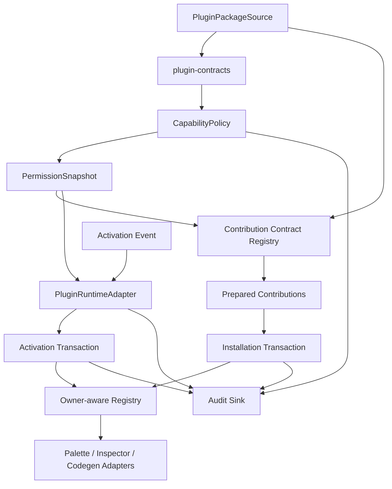

# Plugin Host Core Phase 2 详细实现计划

## 状态

- Implemented
- 日期：2026-07-10
- 前置阶段：`@prodivix/plugin-contracts`、Plugin Manifest v1 与 `PLG-10xx/20xx` diagnostics 已完成
- 对应 ADR：
  - `specs/decisions/14.plugin-sandbox-and-capability.md`
  - `specs/decisions/29.plugin-extension-points.md`
- 上位计划：`specs/implementation/plugin-host-foundation.md`
- 详细协议：
  - `specs/implementation/plugin-host-lifecycle-and-permissions.md`
  - `specs/implementation/plugin-host-contribution-registry.md`

## 1. 目标

Phase 2 建立无 UI、无 DOM、与 transport 无关的 `@prodivix/plugin-host` 内核。完成后，宿主必须能够：

1. 接收已经通过 Manifest v1 校验的插件包候选。
2. 解析 capability policy，形成不可变、可修订的授权快照。
3. 加载并准备 contribution descriptor，但不把插件代码或宿主运行时对象塞回 Manifest。
4. 以 owner-aware transaction 原子注册和清理 resolved contribution。
5. 分别管理插件可用性与 runtime 激活状态。
6. 在失败、撤权、停用、runtime crash 和并发竞态下完成确定性 rollback 与 dispose。
7. 产生统一 `PLG-xxxx` diagnostics 和结构化 audit event。
8. 为 Phase 3 Palette 闭环提供稳定宿主 API，而不耦合 Blueprint 或 React。

## 2. 当前事实与缺口

### 2.1 已完成事实

- `specs/plugins/plugin-manifest-v1.schema.json` 是 Manifest v1 唯一 Schema 源。
- `@prodivix/plugin-contracts` 已提供生成类型、严格 UTF-8 JSON parser、JSON value guard、Ajv 结构校验和 Manifest semantic validator。
- Manifest 已保证 contribution local id、capability `(id, scope)`、activation reference 和资源路径的基础一致性。
- `ComponentPreviewItem`、React component、callback 和其他宿主对象明确不属于插件 wire contract。
- `PLG-1001` 至 `PLG-2016` 已进入统一 Diagnostics 与 docs 生成链路。

### 2.2 现有 registry 不可扩展为 Host registry

仓库内 Authoring、Blueprint external profile 和其他 registry 主要是局部 `Map`：

- 部分 `register` 会静默覆盖同 id 项。
- 不记录 plugin owner、installation generation 或 contribution lifetime。
- 没有 staged transaction、原子 commit、rollback 或 revision conflict。
- 没有 capability guard、audit event 和批量变更通知。
- cleanup 依赖调用方记住逐项 unregister。

这些 registry 只作为消费需求参考。Phase 2 新建独立宿主内核；Phase 3 直接替换需要插件化的旧路径，不叠加兼容层。

### 2.3 两个前置设计修正

1. 单轴 `discovered -> ready -> active` 混淆“静态 contribution 是否可用”和“runtime 是否运行”。Phase 2 改为 availability + runtime 双轴状态。
2. 现有 `PluginDiagnostic` 固定为 `severity: 'error'`，无法表达 optional deny 和降级。Host 实现前改为逐码位 severity；现有码位语义不变。

详细状态、权限与撤权规则见 `plugin-host-lifecycle-and-permissions.md`。

## 3. 非目标

Phase 2 不实现：

1. Browser Worker / iframe transport、opaque origin、CSP 或跨 origin 部署。
2. Workspace、PIR、DOM、网络、Secret 或 Code Authoring 的具体 Host Gateway adapter。
3. 插件市场、下载、签名基础设施、评分或自动更新。
4. 持久化 UI、权限弹窗和管理员控制台。
5. Palette、Inspector、Codegen 等具体 contribution payload Schema。
6. Ant Design 或其他 core-embedded 外部库迁移。
7. 多版本 side-by-side 安装；一个 Host scope 内同一 plugin id 只允许一个有效 generation。
8. 旧 registry 与新 registry 的双写或兼容 shim。

Phase 2 只定义 Browser adapter 后续必须实现的 transport-neutral runtime port，不把普通 same-origin Worker 当作安全边界。

## 4. 长期不变量

以下规则在 Phase 2 中视为 Frozen：

1. **依赖单向**：`plugin-contracts <- plugin-host <- browser/surface adapters`。
2. **宿主不做 I/O 假设**：文件系统、HTTP、Cache Storage 和 VFS 读取都通过注入的 package reader。
3. **Manifest 不承载运行时对象**：Manifest、descriptor、permission record 和 audit event 保持 JSON 可序列化。
4. **Resolved contribution 不跨 sandbox**：函数、React 投影和 runtime proxy 只能存在于 Host 内部 registry。
5. **授权不超额**：effective grant 必须来自 Manifest 中完全相同的 capability id + scope。
6. **Deny wins**：管理员 deny、宿主安全 deny 和用户 deny 高于 allow。
7. **敏感调用检查当前 revision**：不能只在 activation 时检查一次授权。
8. **registry mutation 全部 transaction 化**：没有公开的直接 `Map.set` 或半提交入口。
9. **commit 前不可见**：staged contribution、subscription 和 runtime handle 不对读者可见。
10. **owner cleanup 是宿主责任**：Host 按 owner + generation + lifetime 清理。
11. **旧异步结果不能污染新 generation**：commit 检查 generation、permission revision 和 registry revision。
12. **dispose exactly once**：重复 cleanup 幂等，不重复释放同一资源。
13. **不在 mutation 临界区调用外部 callback**：subscriber、resolver、audit sink 和 runtime adapter 在提交后调用。
14. **顺序确定**：公开 list、batch event 和 audit 不依赖 `Map` 偶然顺序。
15. **预期失败不抛裸异常**：公开异步 API 返回 discriminated result + diagnostics。
16. **安全撤权优先**：required capability 撤销时先 abort、deactivate、cleanup，再允许显式恢复。
17. **alpha 直接演进**：发现模型错误时修改事实源与调用方，不留旧 API wrapper。

## 5. 体系结构



边界说明：

- `plugin-contracts` 负责 JSON/Schema/Manifest 语义，不负责 Host lifecycle。
- `plugin-host` 负责权限、状态、事务、ownership、runtime port 和 audit，不认识具体 surface 类型。
- Browser adapter 负责真实 sandbox 与 Host Gateway。
- surface adapter 注册 point contract，并把 descriptor 转成宿主 resolved model。

## 6. 包目录

```text
packages/plugin-host/
├── package.json
├── tsconfig.json
├── tsconfig.test.json
├── vitest.config.ts
└── src/
    ├── index.ts
    ├── result.ts
    ├── identity.ts
    ├── host.types.ts
    ├── capability/
    │   ├── capabilityIdentity.ts
    │   ├── capabilityPolicy.ts
    │   ├── permissionResolution.ts
    │   └── permissionSnapshot.ts
    ├── contribution/
    │   ├── contributionContract.ts
    │   ├── contributionContractRegistry.ts
    │   ├── contributionPreparation.ts
    │   ├── contributionRegistry.ts
    │   ├── contributionTransaction.ts
    │   ├── resourceIntegrity.ts
    │   └── contribution.types.ts
    ├── lifecycle/
    │   ├── availabilityLifecycle.ts
    │   ├── createPluginHost.ts
    │   ├── hostContributionOperations.ts
    │   ├── hostValidation.ts
    │   ├── operationCoordinator.ts
    │   ├── permissionLifecycle.ts
    │   ├── pluginHost.ts
    │   ├── pluginHostContext.ts
    │   ├── pluginHostRecord.ts
    │   └── runtimeLifecycle.ts
    ├── runtime/
    │   ├── pluginRuntimeAdapter.ts
    │   └── runtimeSession.ts
    ├── audit/
    │   ├── audit.types.ts
    │   └── auditSink.ts
    └── __tests__/
```

约束：

- runtime dependency 只允许 `@prodivix/plugin-contracts`，除非后续证明确需小型、浏览器安全且不可替代的基础库。
- 不依赖 React、React DOM、Zustand、Blueprint、具体编辑器、Node.js 文件系统或具体外部库。
- 同包导入采用 package `imports` + package-unique `#host/*`，避免 Vitest/源码依赖解析时与其他包的私有 `#src/*` 冲突。
- 公开 factory + interface，不暴露可继承 class。

## 7. 公开 Host API 方向

```ts
type PluginHost<TMap extends HostContributionPointMap> = {
  discover(
    source: PluginPackageSource
  ): Promise<PluginHostResult<PluginHostSnapshot>>;
  enable(pluginId: string): Promise<PluginHostResult<PluginHostSnapshot>>;
  disable(pluginId: string): Promise<PluginHostResult<PluginHostSnapshot>>;
  activate(
    pluginId: string,
    event: ActivationEvent
  ): Promise<PluginHostResult<PluginHostSnapshot>>;
  deactivate(
    pluginId: string,
    reason: RuntimeDeactivationReason
  ): Promise<PluginHostResult<PluginHostSnapshot>>;
  reconcilePermissions(
    pluginId: string
  ): Promise<PluginHostResult<PluginHostSnapshot>>;
  retry(pluginId: string): Promise<PluginHostResult<PluginHostSnapshot>>;
  getSnapshot(pluginId: string): PluginHostSnapshot | undefined;
  listSnapshots(): readonly PluginHostSnapshot[];
  subscribe(listener: PluginHostListener): Disposable;
  contributions: ContributionRegistryReader<TMap>;
};
```

Phase 2 不公开 `uninstall` 的持久化语义。composition root 先调用 `disable` 并确认 owner lease 清零，再由安装层删除 package record。

## 8. Diagnostics 扩展

实现代码前先更新 `specs/diagnostics/plugin-diagnostic-codes.md` 和 docs 生成器。

### `PLG-10xx` Contribution 输入与 contract

- `PLG-1010`：contribution resource 读取失败。
- `PLG-1011`：contribution resource 不是严格 JSON。
- `PLG-1012`：resource integrity 不匹配。
- `PLG-1013`：宿主不支持 point + contractVersion。
- `PLG-1014`：contribution descriptor Schema 失败。
- `PLG-1015`：contribution descriptor 资源上限失败。

### `PLG-30xx` Permission 与 registry

- `PLG-3001`：required capability 被拒绝，插件 blocked。
- `PLG-3002`：capability policy resolution 失败。
- `PLG-3010`：stable contribution identity 冲突。
- `PLG-3011`：transaction revision conflict。
- `PLG-3012`：host-side contribution resolver 失败。
- `PLG-3013`：owner generation 已过期。
- `PLG-3014`：Host contribution contract 重复配置。

### `PLG-40xx` Lifecycle 与 runtime

- `PLG-4001`：非法 Host 状态转换。
- `PLG-4002`：runtime activation 失败。
- `PLG-4003`：runtime activation / deactivation 超时。
- `PLG-4004`：deactivation 或 owner cleanup 不完整。
- `PLG-4005`：runtime transport 意外终止。
- `PLG-4006`：operation 被新 revision 或安全操作 supersede。
- `PLG-4007`：best-effort audit sink 不可用。
- `PLG-4008`：Host/registry subscriber 回调失败。

码位名称与 severity 在实现前一次冻结；不复用 Manifest-specific code 表达 descriptor 或 runtime 的近义错误。

## 9. 实现阶段与门禁

### Phase 2.0：契约前置收敛

- [x] 从 `parsePluginManifest` 抽出通用 strict JSON parser，保持 Manifest 行为不变。
- [x] 让 PLG diagnostic definition 支持逐码位 severity。
- [x] 新增并生成 Host Core 所需 `PLG-10xx/30xx/40xx` 文档。
- [x] 同步 foundation 的双轴状态与 lifetime 说明。

门禁：`plugin-contracts` 原有 23 项测试继续通过；新增 generic parser 测试覆盖 bytes 与 duplicate key。

### Phase 2.1：package 与稳定类型

- [x] 创建 `@prodivix/plugin-host` ESM package。
- [x] 定义 identity、result、snapshot、state、audit 与 package reader port。
- [x] 建立公开 export 和 package README。
- [x] 在 coordinator 前冻结类型依赖方向。

门禁：package build、类型导出 smoke test、无 React/DOM/app dependency。

### Phase 2.2：Capability policy

- [x] 实现 capability identity canonicalization。
- [x] 实现 policy resolution 与 immutable PermissionSnapshot。
- [x] 实现 required/optional、deny-wins、no-overgrant。
- [x] 实现 permission revision 与 live guard。

门禁：required deny、optional deny、scope 区分、旧 grant 不越权继承、撤权 revision 测试。

### Phase 2.3：Contract registry 与 descriptor preparation

- [x] 实现 typed contribution contract registry。
- [x] 实现 exact point + version lookup。
- [x] 接入 package reader、resource limit、integrity 与 strict JSON。
- [x] 实现 PreparedContribution + lifetime + capability dependency。
- [x] 使用测试 contract 验证 Host Core，不提前定义 Palette payload。

门禁：unsupported contract、resource parse/integrity、resolver failure、optional point deny 测试。

### Phase 2.4：Owner-aware registry 与 transaction

- [x] 实现 immutable registry snapshot 与 deterministic list。
- [x] 实现 staged transaction、atomic commit、rollback。
- [x] 实现 owner/generation/lifetime cleanup。
- [x] 实现 revision conflict 与 batch subscription。
- [x] 实现 disposable exactly-once。

门禁：无半提交、重复 identity、rollback 逆序清理、stale generation、subscriber isolation 测试。

### Phase 2.5：Host coordinator 与双轴 lifecycle

- [x] 实现 discover/validate/blocked/ready/disabled availability。
- [x] 实现 not-applicable/inactive/activating/active/deactivating runtime。
- [x] 接入 fake runtime adapter。
- [x] 实现 static installation transaction 与 activation transaction。
- [x] 实现 disable、runtime crash 和 explicit retry。

门禁：纯声明插件、lazy runtime、activation failure、deactivation cleanup、crash 后 lifetime 行为测试。

### Phase 2.6：并发、撤权与审计

- [x] 实现 per-plugin operation serialization。
- [x] 实现 in-flight activate dedupe、abort 与 supersede token。
- [x] 实现 required/optional revoke reconciliation。
- [x] 实现 audit sink、clock/id injection 与 redaction。
- [x] 所有公开 API 捕获 adapter throw 并返回 diagnostics。

门禁：activate x2、activate 中 disable、activation 中 revoke、旧 generation late resolve、audit sink throw 测试。

### Phase 2.7：文档与集成验收

- [x] 更新 ADR 14/29 当前实现状态。
- [x] 更新 `plugin-host-foundation.md` Phase 2 checklist。
- [x] 生成并检查 PLG docs。
- [x] 运行 format、package test/build、docs build、相关 web typecheck/lint。
- [x] 确认 Phase 3 只需注册 Palette contract + adapter，不修改 Host Core。

## 10. 测试矩阵

测试只断言公开行为、结果、诊断码、状态快照和 cleanup effect，不断言内部 Map、private field 或调用栈。

### Permission

- 完全相同 id/scope 才能 grant。
- 管理员 deny 覆盖用户 allow。
- required deny -> blocked。
- optional register deny -> 对应 point 不可见，插件仍可 ready。
- permission revision 变化使旧 transaction 失效。
- 未请求 capability 永远 denied。

### Registry / transaction

- staged record 在 commit 前不可见。
- commit 后 subscriber 只收到一个 batch。
- 任一失败不留下部分 contribution。
- rollback 逆序且 exactly-once dispose。
- 不同 plugin 相同 local id 可共存。
- stable identity conflict 不静默覆盖。
- dispose by owner generation 不影响新 generation。
- installation 与 activation lifetime 可独立清理。

### Lifecycle / concurrency

- 纯声明插件是 `ready + not-applicable`。
- runtime plugin 是 `ready + inactive`，activation 后 `ready + active`。
- 普通 deactivate 不移除 installation lifetime。
- activation failure 不残留 session、listener 或 activation contribution。
- required revoke 先 cleanup 再 blocked。
- 双 activate 只调用 adapter 一次。
- activating 时 disable 能 abort 并等待 rollback。
- stale async completion 不修改快照。

### Diagnostics / audit

- 断言 code、severity、meta key，不断言完整自然语言 message。
- audit 不含 Manifest 全文、descriptor、Secret、Token 或源码。
- sink/listener throw 不传播到宿主主循环。
- operation id 与 generation 能串联 validation、permission、registry 和 runtime event。

## 11. Phase 2 验收标准

- [x] `@prodivix/plugin-host` 只依赖 `plugin-contracts`，不依赖 React、DOM、apps/web 或具体外部库。
- [x] Manifest、descriptor、permission 与 audit 保持 JSON-only；resolved runtime object 不越过 sandbox boundary。
- [x] required capability 被拒绝时插件进入 blocked，无法 activation 或注册贡献。
- [x] optional capability deny 可以按规则降级，不误判为 Host failure。
- [x] registry mutation 全部 transaction 化，失败不留下半提交。
- [x] contribution record 带稳定 identity、owner generation、point、version 和 lifetime。
- [x] disable、required revoke、activation failure 和 runtime crash 都能确定性 cleanup。
- [x] static contribution 与 runtime activation lifecycle 不再混淆。
- [x] 同 plugin 并发 operation 可序列化，旧 generation 结果不能污染新状态。
- [x] diagnostics 与 audit 可定位 plugin、operation、capability、contribution、revision 和 lifecycle axis。
- [x] Host Core 不选择文件系统、网络、持久化或 sandbox transport。
- [x] Phase 3 Palette 只新增 contract/schema/resolver 与 surface adapter，不修改 Host transaction/lifecycle 内核。

## 12. 实现结果

- `@prodivix/plugin-contracts` 当前保持 52 项测试通过，Manifest wrapper、generic strict JSON parser 与 six-point official contribution validation 共用同一解析事实源。
- `@prodivix/plugin-host` 当前覆盖 36 项公开行为，并在 Vitest 前运行独立 TypeScript test typecheck。
- Host package build 生成 ESM 与 declaration；runtime dependency 仅有 `@prodivix/plugin-contracts`。
- 66 个 PLG code 已在 TypeScript definition、诊断规范与 docs 页面之间建立生成时一致性检查。
- 具体 Palette payload、Browser sandbox、Host Gateway 与 official plugin 迁移保持在 Phase 3 以后，没有进入 Host Core。

## 13. Phase 2 完成后的下一步

Phase 3 Palette 验证已由 `specs/implementation/plugin-host-palette-phase3.md` 完成：Schema、生成类型、`paletteContribution@1.0` contract、host-side resolver、`@prodivix/core` owner、core-embedded external owner、typed reader 与旧 Blueprint registry 删除均已落地。

Phase 4.0-4.9 已按 `specs/implementation/plugin-browser-sandbox-phase4.md` 和 `specs/implementation/official-component-plugins-phase46-48.md` 完成 Host port、protocol contracts、Browser Sandbox、Gateway、quota、persistent audit、workspace-scoped Web Plugin Platform、exact official contracts、Ant Design/MUI/Radix bundled official plugin 直接迁移，以及 security/browser/production hardening。旧 profile、Renderer/Compiler 特判和 placeholder 已删除；不得恢复旧 registry 或增加双写。
