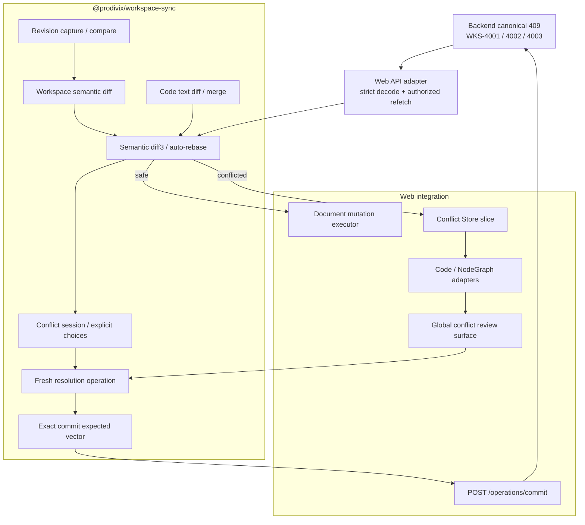

# Workspace Revision Conflict Recovery Implementation

## 状态

- In Progress
- 日期：2026-07-12
- 当前里程碑：Semantic recovery + Atomic WorkspaceOperation Commit
- 适用范围：
  - `packages/workspace-sync`
  - `packages/workspace`
  - `apps/backend/internal/modules/workspace`
  - `apps/web/src/editor/workspaceSync`
  - `apps/web/src/editor/features/revisionConflict`
  - `apps/web/src/editor/store`
- 关联：
  - `specs/decisions/06.command-history.md`
  - `specs/decisions/07.workspace-sync.md`
  - `specs/decisions/11.revision-partitioning.md`
  - `specs/decisions/35.canonical-workspace-hard-cut.md`
  - `specs/decisions/36.atomic-workspace-operation-commit.md`
  - `specs/api/workspace-sync.openapi.yaml`

## 1. 本里程碑目标

本实现把 Workspace revision 过期从“提示用户刷新”提升为可验证的恢复链路：

1. 后端以唯一 canonical 409 描述发生冲突的 revision 分区。
2. Core 在不知道 HTTP、Zustand 或 React 的情况下比较 base/local/remote。
3. 不重叠修改自动 rebase，重叠修改形成显式 conflict session。
4. 用户选择的结果从最新 remote snapshot 生成新的可逆 Operation。
5. CodeDocument 与 NodeGraph 提供领域化 diff 展示。
6. Document transport 可以对 canonical 409 做有界 automatic rebase/retry；这不包含不确定网络失败的通用同 ID 重试。resolved Operation 由 exact commit planner 统一提交 `/operations/commit`，覆盖 tree/route/document/mixed scopes。

本里程碑不把“有一个冲突弹窗”或“后端已完成 Atomic Commit”等同于离线同步完成。ADR 36 的单数据库事务与强幂等已经落地；durable outbox 仍是后续 Gate。

## 2. 当前分层



依赖方向必须保持：

```txt
@prodivix/workspace
  <- @prodivix/workspace-sync
  <- Web transport adapters / Store / presentation
```

`@prodivix/workspace-sync` 不得依赖 `apps/web`、fetch、React、Zustand 或后端 DTO 之外的传输细节。

## 3. 已完成能力

### 3.1 Backend 与 wire contract

已完成：

1. `WKS-4001 / WORKSPACE_CONFLICT`。
2. `WKS-4002 / ROUTE_CONFLICT`。
3. `WKS-4003 / DOCUMENT_CONFLICT`。
4. 唯一 details 外形：`{ conflictType, workspaceId, expected, current }`。
5. `HYBRID_CONFLICT` Hard Cut；旧 flat revision fields 不再接受。
6. Document current 是 id/type/path/contentRev/metaRev/updatedAt 安全 metadata 或表示远端已删除的 `null`，从不包含 content。
7. Workspace owner authorization 在 snapshot、capabilities 与 mutation 的 revision 检查之前执行；不存在与非 owner 都返回不泄露细节的 404。
8. OpenAPI 与后端 API 文档定义 bearer authentication、401/404 与三个 409 schema。

409 的职责只是说明“哪个 revision baseline 已过期”。完整 remote 内容必须通过随后已授权的 snapshot read 获得。

### 3.2 Transport-neutral Sync Core

`packages/workspace-sync` 已提供：

| 模块                              | 当前职责                                                                     |
| --------------------------------- | ---------------------------------------------------------------------------- |
| `workspaceRevisions.ts`           | 捕获、比较 Workspace/Route/Document/opSeq revisions                          |
| `workspaceRevisionConflict.ts`    | 严格解码 canonical ErrorEnvelope，拒绝 revision details 未知字段和分区不一致 |
| `workspaceSemanticDiff.ts`        | Workspace tree、Route、document metadata/content 的稳定语义 change set       |
| `workspaceTextDiff.ts`            | Code source 行级 hunks 与三方文本合并                                        |
| `workspaceThreeWay.ts`            | base/local/remote diff3、自动合并、冲突分类与 validator-safe candidate       |
| `workspaceConflictSession.ts`     | 显式 local/remote choices、未解决集合与 resolved snapshot                    |
| `workspaceResolutionOperation.ts` | 从 remote 到 resolved 生成并验证新的 Command/Transaction                     |
| `workspaceOperationCommit.ts`     | 从 Operation 写集推导 exact workspace/route/content/meta CAS vector          |

语义 Diff 已覆盖：

1. Workspace tree 与 RouteManifest。
2. Document add/delete、metadata 与 content。
3. PIR UI graph 的 node 与 structure。
4. NodeGraph 的 graph/node/edge/structure。
5. Animation 的 timeline/track/keyframe/binding/filter entities。
6. Code source text hunks。
7. Stable-id entity collection 的顺序无关比较。

三方合并识别：

- `value`：同一值路径上的竞争修改；
- `concurrent-add`：同一 stable identity 的不同新增；
- `delete-modify`：一侧删除而另一侧继续修改；
- `structural`：节点删除与其结构/连线/后代变化互相冲突；
- `text`：重叠 code text hunks。

### 3.3 Conflict session

Conflict session 保存：

```ts
type WorkspaceConflictSession = {
  id: string;
  workspaceId: string;
  status: 'open' | 'resolved';
  baseSnapshot: WorkspaceSnapshot;
  localSnapshot: WorkspaceSnapshot;
  remoteSnapshot: WorkspaceSnapshot;
  sourceOperation?: WorkspaceOperation;
  serverConflict?: WorkspaceRevisionConflictResponse;
  analysis: WorkspaceThreeWayAnalysis;
  resolutions: Record<string, 'local' | 'remote'>;
  unresolvedConflictIds: string[];
  resolvedSnapshot?: WorkspaceSnapshot;
};
```

当前 session model 可序列化，但 Web 只将它保存在编辑会话 Store 中。“稍后查看”表示当前应用会话内恢复 review，不表示已经具有跨刷新或崩溃恢复的 durable persistence。

Session 规则：

1. 每个冲突必须显式选择 local 或 remote。
2. 未选择的冲突在 candidate 中保留 remote，不能默认取 local。
3. 未知 conflict id、Workspace 不一致或最终 validation 失败都会拒绝 resolution。
4. 用户在 review 期间继续编辑时，Apply 前再以原 local、当前 authoring、已选择结果做一次 diff3；新重叠会打开新 session。

### 3.4 Fresh resolution operation

Resolution 不重放过期 source Operation。它执行：

```txt
latest remote snapshot
  + resolved snapshot
  -> semantic diff
  -> command-safe forwardOps / reverseOps
  -> new WorkspaceOperation
  -> apply verification
```

当前 command-safe 内容路径包括：

1. PIR：`/ui/graph`、`/logic`、`/animation`、`/metadata`。
2. NodeGraph：nodes/edges/groups/metadata 根域。
3. Animation：timelines/tracks/keyframes/bindings/metadata 根域。
4. Code：language/source/metadata。
5. Workspace tree/document metadata 与 RouteManifest 都可以生成 Operation，并由同一个 Commit planner/transport 处理；整份 `/docsById` 替换已禁止。

Asset、project-config 或其他未声明 command-safe path 的 resolution 必须失败为 unsupported，不能用整文档覆盖绕过 path policy。

### 3.5 Document recovery 与 Atomic Commit transport

Web 当前 document recovery 流程：

```txt
optimistic WorkspaceOperation
  -> PATCH document with expectedContentRev
  -> 409
  -> strict decode + authorized latest snapshot read
  -> semantic diff3
     -> already applied: adopt server snapshot
     -> safe rebase: build fresh document command and retry
     -> overlap: open conflict session
```

自动 rebase 有明确次数上限，当前最多重建并重试两次。反复出现新 revision 时停止自动写入并要求重新 review。

已接入 document recovery 的作者入口包括 Blueprint autosave 与 Code Resources。NodeGraph/Animation 的领域 diff 能力存在，但不能据此推断它们已具备完整远端 autosave/outbox 链路。

Conflict resolution executor 不再按 Operation kind 分流到 document batch 或 route intent。它统一执行：

```txt
fresh WorkspaceOperation
  -> planWorkspaceOperationCommit(remoteSnapshot, operation)
  -> exact expected vector
  -> POST /workspaces/:id/operations/commit
  -> canonical mutation ACK or canonical 409
```

Planner、Web transport 与后端已覆盖单文档、Workspace tree、RouteManifest 和 mixed Transaction；旧 `/batch` 依赖已删除。单事务 rollback、单次 revision/opSeq/log 推进、强幂等 replay 与聚合 delta 共同构成已实现的远端原子边界。

当前 conflict executor 不持久保存不确定网络失败的原 Commit request，也不实现通用同 ID retry queue。用户手动重试会生成 fresh Operation，并通过 canonical 409 或 semantic `already-applied` 收敛；稳定消费服务端 strong idempotent replay 的责任归 Durable Outbox。

### 3.6 Revision conflict 产品面

Global Revision Conflict Surface 已接入 Editor：

1. 展示 conflict count 与 generic target/value summary。
2. 支持逐项 local/remote、全部 local、全部 remote 与稍后 review。
3. 全部显式解决后才能 Apply。
4. CodeDocument 展示 base/local/remote 行级 hunks。
5. NodeGraph 使用只读 React Flow 画布展示 node、port、edge 与字段详情。
6. Core-to-UI adapter 只转换 presentation，不在 React 组件中重新计算 diff。

NodeGraph 视觉语义固定为：

| 语义            | 颜色 | 冗余编码                         |
| --------------- | ---- | -------------------------------- |
| Delete          | 红色 | `DELETE`、减号、虚线             |
| Add             | 绿色 | `ADD`、加号、实线                |
| Local conflict  | 黄色 | `LOCAL`、L/Laptop、独立本地实体  |
| Remote conflict | 紫色 | `REMOTE`、R/Cloud、双线/不同线型 |
| Modify          | 中性 | `MODIFIED`、波浪号               |

本地与远端冲突必须渲染为两个独立 presentation entity，禁止颜色混合。颜色也不是唯一信号，必须同时保留文字、图标、边框或线型。

## 4. 端到端状态矩阵

| 能力                                      | 状态        | 说明                                                      |
| ----------------------------------------- | ----------- | --------------------------------------------------------- |
| Canonical 409 三分区                      | Completed   | Workspace / Route / Document；无 Hybrid                   |
| 409 安全 metadata 与 owner non-disclosure | Completed   | 不返回 document content                                   |
| Strict conflict decoder                   | Completed   | Core 校验 code/type/schema；Web 校验 active workspace     |
| Semantic Workspace diff                   | Completed   | stable-id collection、code text 与领域 semantic refs      |
| Semantic diff3 / automatic merge          | Completed   | 最终 snapshot 经过 Workspace validator                    |
| Explicit conflict session                 | Completed   | 当前 Store 内；未 durable persistence                     |
| Fresh reversible resolution operation     | Completed   | 相对 remote 重建并 Apply 验证                             |
| Exact Atomic Commit planner               | Completed   | 自动推导 workspace/route/content/meta/absence CAS vector  |
| Document mutation automatic rebase        | Completed   | bounded retry；Blueprint 与 Code Resources 已接入         |
| Global conflict review UI                 | Completed   | generic + Code + NodeGraph                                |
| Tree/Route/Document/Mixed Web commit      | Completed   | 统一 `POST /operations/commit`；无 `/batch` dependency    |
| Backend Atomic Operation Commit           | Completed   | 单事务、强幂等、聚合 mutation 与 metaRev/absence conflict |
| Durable offline outbox                    | Not started | 无跨刷新 pending queue、崩溃恢复与 ACK causality          |
| Git revision -> semantic review           | Not started | Core diff 可复用；Git ref adapter/product surface 未接入  |
| Real-time collaboration / CRDT            | Not planned | 不属于当前 Gate                                           |

## 5. 不变量

任何后续实现都必须保持：

1. Canonical WorkspaceSnapshot 是 base/local/remote 的唯一模型，不引入 Web 侧第二套 Workspace DTO。
2. 409 只描述 revision conflict，不承载 remote document content。
3. Diff Core 不依赖 transport 和 UI。
4. Revision metadata 不等于 authoring diff。
5. Stable-id collection 的纯排序变化不制造冲突。
6. 未解决 conflict 不默认取 local。
7. Resolution Operation 必须相对最新 remote 重建 forward/reverse ops，并经过 Apply 验证。
8. Review 期间的新编辑不得被旧 resolution 覆盖。
9. 不支持的 path/asset 写回必须显式失败；tree/route/document/mixed resolution 统一走 Atomic Commit，禁止退回 legacy Project PIR、root document overwrite 或旧 `/batch`。
10. Remote ACK 只推进 confirmed revisions；不能凭空加入新的用户 History。
11. `expected` 必须由 Operation write set 推导；Web 不手工拼 revision vector，后端也必须独立推导并校验同一 requirements。

## 6. 未完成工作与顺序

### Gate R1：Backend Atomic WorkspaceOperation Commit（Completed）

已完成：

1. Strict decode `command | transaction` WorkspaceOperation，并验证所有 workspace identities。
2. 从 Operation 独立推导 exact workspace/route/document content/meta requirements。
3. 在一个数据库事务中锁定、校验、Apply、reverse/final validate、推进 revisions 与写 operation log。
4. Operation id 强幂等：同 request 重放首次 mutation，不同 request 422。
5. 成功响应聚合整笔 Operation delta，`acceptedMutationId` 等于 Operation id。
6. 任一后续 Command 失败时无 partial document/tree/route/revision/opSeq。
7. 删除旧 `/batch` route、schema 与“顺序执行后整体回滚”的错误文案。
8. Canonical IDs、RFC3339 timestamps 与 source ID trim/stable-dedupe 在 Core/Server 一致。
9. 全 domain `move/copy`、settings、asset/project-config document commands 与纯 ephemeral selection Operation 以 422 Hard Cut。

### Gate R2：Durable outbox

需要：

1. 持久化 pending WorkspaceOperation/Transaction、base revisions、attempt 与因果来源。
2. 明确 `pending -> sending -> acked | conflicted | failed` 状态机。
3. 同 Workspace 因果排序、同文档顺序与跨文档 Transaction 不拆分。
4. 浏览器刷新、崩溃、离线恢复和幂等重发。
5. ACK adoption 与 History/editSeq 的正式 causality bridge。
6. Session 的 durable persistence 与 resume policy。

### Gate R3：更多领域与历史入口

需要：

1. NodeGraph/Animation remote mutation transport 与 autosave。
2. Workspace/Route/Animation 专用 diff presentation。
3. Git ref snapshot adapter 与 revision review。
4. Intent-only Resource CRUD 迁入本地 WorkspaceOperation planner。

## 7. 完成定义

Revision Conflict 全链路只有在以下条件全部满足后才能从 In Progress 升为 Implemented：

1. Tree、Route、Document 与 mixed resolution 都通过 Atomic WorkspaceOperation Commit 写回。
2. 跨文档 Transaction 具有可验证的服务端单事务原子性与强幂等恢复。
3. Durable outbox 能跨刷新恢复并保持 Operation causality。
4. 冲突 session 可持久恢复，且不会丢失 review 期间的新编辑。
5. 三编辑器和 Code Authoring 的远端写入统一消费同一 recovery core。
6. 不存在 Project PIR fallback、旧 `/batch`、旧 conflict envelope 或 `HYBRID_CONFLICT` 兼容层。
