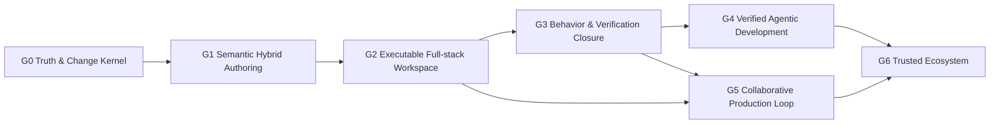

# Prodivix Global Phases

## 状态

- Accepted
- 日期：2026-07-13
- 当前产品门槛：G0 Passed / G1 Foundation
- 关联：
  - `specs/decisions/37.verified-semantic-authoring-architecture.md`
  - `specs/decisions/34.core-package-boundaries.md`
  - `specs/decisions/35.canonical-workspace-hard-cut.md`
  - `specs/decisions/36.atomic-workspace-operation-commit.md`
  - `specs/decisions/28.code-authoring-environment.md`
  - `specs/decisions/31.production-export-planner.md`
  - `specs/roadmap/g0-closure-evidence.md`

## 文档目的

本文档是 Prodivix 唯一的全局产品阶段定义。各领域文档中的 Phase 1、Phase 4.8 或 Phase E 只描述该领域内部的实施顺序，不代表整个项目已经进入同名全局阶段。

全局阶段回答三个问题：

1. 当前产品能够向用户承诺什么闭环。
2. 下一阶段依赖哪些不可绕过的产品 Gate。
3. 哪些局部能力即使已经有 ADR、类型、UI 或编译器，也仍只能标记为部分实现。

全局阶段不绑定工期。阶段完成由可重复验证的产品证据决定，不由提交数量、文件数量或局部模块编号决定。

## 北极星

Prodivix 的长期定位是：

> 面向人类与 Agent 的、浏览器原生、代码可持有、语义化、可执行、可验证、可长期维护的 Web 应用工程环境。

产品必须支持视觉作者态、代码作者态、数据与行为、测试、构建、部署和生产反馈形成同一条可信链路，而不是在多个互不相认的编辑器和生成器之间复制状态。

## 阶段状态的三条独立轴

所有路线图、ADR 和实施记录必须区分以下状态：

| 状态轴                 | 回答的问题                   | 示例                                          |
| ---------------------- | ---------------------------- | --------------------------------------------- |
| `DecisionStatus`       | 方向是否已经冻结             | Draft、Accepted、Superseded                   |
| `ImplementationStatus` | 代码实现到了哪里             | Not Started、Foundation、Partial、Implemented |
| `ProductGateStatus`    | 用户闭环是否达到阶段退出门槛 | Blocked、In Progress、Passed                  |

`Accepted` ADR 不等于产品完成；已有 UI、Schema、Planner 或测试也不等于对应 Global Phase 已通过。

## 完整能力的统一验收链

任何产品能力都按以下链路验收：

```text
Contract
  -> Command / ChangeSet
  -> Persistence / Sync
  -> Preview Runtime
  -> Export Runtime
  -> Diagnostics / SourceTrace
  -> Behavior Verification
```

缺少任意一环时，该能力最多标记为 `Partial`。纯展示、纯编译、纯后端或纯类型实现不能单独通过产品 Gate。

## 全局依赖关系



允许提前设计后续阶段的契约、评测和扩展点，但不得提前对外宣称对应产品能力完成：

1. 具备写权限的 AI 不得绕过 G0、G1 和 G3 的写入与验证 Gate。
2. 多框架 Target 不得绕过 React/Vite Golden Gate。
3. Marketplace 不得早于插件权限、签名、升级、迁移与 conformance。
4. 实时协作不得用通用 JSON CRDT 取代 PIR、NodeGraph 和 Animation 的类型化事务语义。

## 当前全局判断

截至 2026-07-13，Prodivix 位于：

> G0 已通过 / G1 基础阶段。Truth & Change Kernel 已形成可重复验证的闭环，语义化混合作者环境仍在建设。

| Global Phase | 当前 Product Gate          | 说明                                                                                                                                                                                                                                                                      |
| ------------ | -------------------------- | ------------------------------------------------------------------------------------------------------------------------------------------------------------------------------------------------------------------------------------------------------------------------- |
| G0           | Passed                     | Canonical Workspace、History、Atomic Commit、Revision Conflict、生产写入 Hard Cut、双 Durable Outbox、正式 local replica、revision-aware Issues 与 Golden Conformance 已落地；`pnpm run verify:g0` 的 8 个阶段与六项退出 Gate 已完整通过，证据见 `g0-closure-evidence.md` |
| G1           | Foundation                 | CodeArtifact、CodeReference、CodeSlot、Authoring Registry 和完整 Workspace React/Vite Export 已有基础；真实 Language Service、visual/code round-trip 以及导出项目 install/typecheck/test/browser smoke 尚未闭环                                                           |
| G2           | Early                      | 预览和导出存在，但 ExecutionProvider、Data/API IR、SecretRef、runtime zones 和项目级浏览器运行环境未形成                                                                                                                                                                  |
| G3           | Early                      | NodeGraph 已完成无 DOM 领域包与执行内核 Hard Cut；Animation 已完成 contract、normalizer、基础 evaluator 和 Browser preview projection Hard Cut，但 command、lifecycle、composition、conflict 与完整行为验证尚未闭环                                                       |
| G4           | Foundation Only            | AI gateway、streaming、tool 和 trace 有基础；真实 Workspace 写入仍未达到产品 Gate                                                                                                                                                                                         |
| G5           | Not Started Systematically | 单设备 local replica 已形成基础；multi-device sync、presence、Review、Production Feedback 与完整 Local-first 团队闭环尚未形成                                                                                                                                             |
| G6           | Infrastructure Preview     | Plugin Host 和三类官方插件较成熟，但 SDK、conformance、签名、Marketplace 和多 Target Gate 尚未完成                                                                                                                                                                        |

## G0：Truth & Change Kernel

### 目标

建立唯一可信的 Workspace、唯一写入协议和唯一恢复基线。无论修改来自人类、AI、插件、导入器还是同步恢复，都必须进入同一条可验证的 Change 路径。

### 必须具备

1. Canonical Workspace VFS，统一持有 Workspace、Route、PIR、Code Documents、Assets 和 Config。
2. Blueprint、NodeGraph、Animation、Route、Code 和 Resources 的领域写入全部进入 Command / Transaction。
3. Operation History、undo/redo、merge、barrier、因果关系和稳定快捷键。
4. Atomic Commit、revision partition、强幂等、409 conflict、显式 resolution 和安全 replay。
5. Durable outbox、跨刷新恢复、离线队列、ACK causality 和失败重试策略。
6. 前后端共享或 conformance-equivalent 的 Schema、Codec 与语义 Validator。
7. 统一 Issues 聚合、诊断去重、Quick Fix、SourceTrace 和编辑器回跳。
8. Golden Conformance Suite，覆盖多路由、复用组件、表单、代码、资源、插件、导出和冲突恢复。
9. 文档统一记录 `DecisionStatus / ImplementationStatus / ProductGateStatus`。
10. 领域数据退出裸 `localStorage`；浏览器存储只承载 UI 偏好或正式 local replica。

### 已有关键基础

- Canonical Workspace Hard Cut 已完成。
- 本地 Command / Transaction History 与编辑器快捷键已完成主要链路。
- Atomic WorkspaceOperation Commit、revision conflict recovery 和语义 Diff 已完成。
- Operation/Settings 双 Durable Outbox、IndexedDB exact-request persistence、lease/retry、ACK identity、跨刷新恢复与 conflict session persistence 已完成；生产写入与旧 transport Hard Cut 已完成。
- 正式 local replica 已完成 confirmed canonical cache、独立 watermark、pending Outbox materialization、ACK crash bridge 与仅网络失败时的离线打开。
- Diagnostics、Authoring、PIR、Router、Workspace、Workspace Sync 已形成第一批核心 package。
- Runtime Core 与 NodeGraph 已从 `apps/web/src/core` Hard Cut 为独立 package；旧 Window/CustomEvent bridge 已删除。
- PIR React Renderer 已从 Web 目录 Hard Cut 为独立 React projection package。
- 前后端 Workspace、Route 和 VFS 校验已显著收敛。
- revision-aware Issues 已完成 provider snapshot、去重、active/stale/resolved 生命周期、Web 全局入口、Workspace/Route/PIR/NodeGraph/Animation/Code/Outbox/Conflict provider、Quick Fix 安全写入边界、稳定跨文档 target、Code SourceSpan 精确聚焦和现有目标回跳。
- `@prodivix/golden-conformance` 已建立 Living Golden App 基线，可重复验证 create、edit、History undo/redo、Atomic Commit save planning、Durable Outbox/local replica recovery、显式 conflict resolution、受支持的完整 Workspace React/Vite export 与进程内 Vite build；同一个 `pir-component` 由两个 route 消费且只生成一个共享模块。Workspace compiler 不再只导出当前选中的单个 PIR 文档，尚未支持的合法独立领域文档、layout 或 route outlet 组合则以 blocking diagnostic 拒绝静默丢弃。
- 当前 Golden build 会逐个 syntax-transform 所有生成的 JS/TS 模块，再以无服务器、外部化 bare package imports 的进程内 Vite/Rolldown 构建验证可达模块图；它不包含独立项目的 install、typecheck、test、runtime behavior、browser smoke 或 visual regression。这些扩展验证仍属于后续 Gate，不影响 G0 的非浏览器 Truth & Change Kernel 已通过。

### 退出 Gate

G0 通过必须同时满足：

1. 刷新、崩溃、断网、重试和冲突不会静默丢失已确认或待同步操作。
2. 任意领域写入都能被撤销、重做、重放、审计和诊断。
3. 不存在绕过 Command / Transaction 的第二套生产写入协议。
4. 不存在以 `localStorage`、React state 或编辑器私有镜像充当领域真相源的生产路径。
5. Golden Conformance Suite 能自动复现并验证创建、编辑、保存、恢复、冲突、导出与构建。
6. Issues 能从错误回到对应 Workspace、Route、PIR node、CodeArtifact 或操作记录。

2026-07-13，以上六项退出 Gate 已由 `pnpm run verify:g0` 的核心边界、Hard Cut、诊断目录、13 个核心 package 与 Golden、Web typecheck、Web Issues/恢复 adapter 和后端全量测试共同验证，完整记录见 `specs/roadmap/g0-closure-evidence.md`。G0 因此标记为 `Passed`；浏览器、视觉、独立导出项目验证与正式 `VerificationEvidence` 继续属于 G1-G3。

## G1：Semantic Hybrid Authoring

### 目标

让视觉编辑与代码编辑长期共存。Prodivix 不以一次性代码生成为终点，也不对无法理解的代码进行猜测性回写。

### 必须具备

1. 真实 Code Workspace 与 TypeScript、JavaScript、CSS、GLSL/WGSL Language Service。
2. Symbol、Scope、definition、reference、rename、completion 和增量 diagnostics。
3. 明确 `PIR-owned / code-owned / adapted` 所有权边界。
4. CodeSlot 统一承载 handler、executor、adapter、mounted CSS、easing、shader 和 timeline script。
5. Prodivix 可控 React/JSX/CSS 子集的 canonical round-trip。
6. 不受控源码保留为 code-owned boundary，仍支持编辑、定位、诊断、预览与 AI patch。
7. Component Contract Registry，连接设计组件、代码组件、Props、Events、Slots、Tokens、可访问性、测试和 AI 使用说明。
8. SourceTrace 升级为 PIR、Code、Export 和 Diagnostics 的双向定位协议。
9. Git projection round-trip。
10. DTCG Token 文档与标准化主题、变体和设计系统映射。

### 退出 Gate

1. 用户可以在视觉编辑器和代码编辑器之间往返修改一个 Golden App，受控内容不漂移，未知代码不丢失。
2. 从 Issues、Inspector、画布、节点图和动画轨道可以跳转到真实代码定义与引用。
3. React/Vite 导出项目可自动 install、typecheck、test、build 和 smoke test。
4. 设计组件、代码组件和导出组件之间存在稳定、可验证的 Component Contract。

## G2：Executable Full-stack Workspace

### 目标

把 Prodivix 从设计与代码生成环境升级为可以运行真实数据应用的工程环境。

### 必须具备

1. `ExecutionProvider / ExecutionJob` 抽象。
2. Browser Runner 与 Remote Isolated Runner；实现可替换，不锁定单一供应商。
3. 项目文件、依赖安装、Vite 构建、HMR、Terminal、Console、Network 和 Test 运行入口。
4. Data/API IR：query、mutation、schema、pagination、cache、retry、optimistic update、loading/empty/error。
5. OpenAPI、GraphQL 和 AsyncAPI adapter。
6. `client / worker / server / edge / build / test` runtime zones。
7. `SecretRef`、环境绑定、权限和 mock/live adapter；Secret 不进入 PIR 和客户端产物。
8. 二进制 Asset 管线：hash、去重、元数据、转换和交付策略。
9. Auth、session、permission 和 server function 的稳定 runtime contract。

### 退出 Gate

一个标准 CRUD 应用能够连接声明式 API，完整处理鉴权、loading、empty、error、mutation、retry 和 optimistic update，并在 Preview 与 Export 中通过同一组行为场景。

## G3：Behavior & Verification Closure

### 目标

让 Blueprint、NodeGraph、Animation 和 Code 共同表达、执行和验证同一个应用行为。

### 必须具备

1. 共享 Trigger、Action、DataReference、StateReference、CodeReference、ExecutionContext 和 Trace 语义。
2. NodeGraph 类型化控制流和数据流、分支、异步、错误、取消、状态、事务、子图、断点与 trace。
3. Custom executor 全部进入 CodeSlot，不保存裸代码字符串。
4. Animation timeline、trigger、lifecycle、route transition、composition、reduced-motion、custom easing 和 shader。
5. 稳定 Target Reference；节点重命名、移动和复用不会静默断开动画或行为。
6. 打通 `Blueprint event -> NodeGraph -> Data/State -> Animation -> Code`。
7. `BehaviorScenario`、`VerificationPlan` 和 `VerificationEvidence`。
8. Preview Runtime 与 Export Runtime 使用相同语义实现或同一 conformance suite。
9. 单元、集成、行为、视觉、无障碍、性能和安全检查能绑定到 ChangeSet。

### 退出 Gate

关键用户旅程可以断点、单步、观察变量和 Trace、定位到作者态，并在 Preview、Test 和导出应用中产生相同行为。每个发布候选 revision 都能附带可复现的 Verification Evidence。

## G4：Verified Agentic Development

### 目标

让 AI 从聊天、建议和计划生成升级为受权限控制、可验证、可审阅的真实开发协作者。

### 必须具备

1. `Intent -> Plan -> WorkspaceActionProposal -> Dry-run -> Verification -> Review -> Apply -> Undo`。
2. 所有 AI 写入复用人类编辑器的 Command、Code Authoring 和 Atomic Commit 路径。
3. Object-scoped capability、step-up approval、预算、取消、超时和审计。
4. Prompt、上下文、模型、工具调用、输出、ChangeSet 和验证证据的 provenance。
5. Context Pack Builder，按任务从 Workspace Intelligence Index 生成最小上下文。
6. 固定评测集、failure classification、repair loop 和失败停止机制。
7. 多模态输入：截图、DOM/AX Tree、PIR、视觉回归、设计连接器和生产 Trace。
8. MCP、A2A、WebMCP 等只作为外部协议 Adapter，不成为内部 Workspace 真相源。
9. Prompt injection、不可信内容、secret exfiltration 和 excessive agency 防御。

### 退出 Gate

AI 不能越过 action scope；每次写入都有语义 Diff、影响分析、验证证据、来源和 undo。验证失败时不得静默 Apply，高风险操作必须停在明确审批点。

## G5：Collaborative Production Loop

### 目标

让团队可以离线工作、协作评审、发布、观测、回滚，并把生产反馈重新连接到作者环境。

### 必须具备

1. Local replica、offline outbox、multi-device sync、presence、comments 和 review。
2. 文本可使用 CRDT；PIR、NodeGraph 和 Animation 使用类型化事务与语义冲突 UI。
3. Git import、branch、commit、push、PR、Checks 和语义 Diff。
4. Preview environment、promotion、approval、deployment、rollback 和 environment binding。
5. Feature flag、实验和配置版本。
6. WCAG、Baseline、Core Web Vitals、视觉回归、SEO、i18n 和 bundle budget 质量策略。
7. Production Error、Metric 和 Trace 回映射到 Workspace revision、Route、PIR node、BehaviorScenario 和 CodeArtifact。
8. SBOM、License、SLSA provenance、签名和可信构建链。
9. RBAC、SSO、SCIM、审计、备份、数据保留和自托管基础。

G0 已完成的单设备 local replica 是这里的恢复基线，不等于 G5 Local-first 已完成。G5 还要求多设备收敛、成员协作、review、权限与副本生命周期形成团队级闭环。

### 退出 Gate

团队能够从本地修改到 PR Review、Preview、Production、监控和回滚完成闭环；生产问题可以生成可复现场景并回到对应作者态，而不是只停留在外部日志平台。

## G6：Trusted Ecosystem

### 目标

在核心、运行、验证和信任边界稳定后扩展平台生态。

### 必须具备

1. Public Plugin SDK、Connector SDK、conformance kit 和兼容矩阵。
2. 插件签名、权限审查、升级、迁移、撤权和供应链策略。
3. Inspector、NodeGraph、Animation、Data/API、Compiler、AI Context 和 Deployment 等稳定 extension points。
4. 第二框架 Target 通过与 React/Vite 相同的 Golden Conformance Suite。
5. 企业私有 Runner、自托管和 server/edge adapter。
6. 模板、Design System、Component、Behavior、Connector 和 Plugin Marketplace。
7. 社区作品、Fork/Remix、教育内容和创作者机制。

### 退出 Gate

第三方可以不修改 Prodivix Core 而实现、测试、发布、升级和撤销一个扩展；扩展产物可验证来源、权限和兼容性，并通过公开 conformance suite。

## 横向产品 Gate

以下能力不能统一推迟到 G5，每个 Global Phase 都要声明并验收：

| Gate                       | 核心要求                                                       |
| -------------------------- | -------------------------------------------------------------- |
| Security & Privacy         | 最小权限、Secret 隔离、不可信输入边界、依赖和供应链检查        |
| Accessibility              | 编辑器本身和导出应用均有可执行的无障碍要求                     |
| Performance                | 编辑器大项目性能、运行时预算、构建产物预算和回归基线           |
| Compatibility              | Schema version、Browser Baseline、Target capability 和迁移策略 |
| Observability & Provenance | Change、Build、Deploy、Runtime 和 AI 行为可追踪                |

## 产品能力归属

| 能力域                                        | 主阶段 | 说明                            |
| --------------------------------------------- | ------ | ------------------------------- |
| Workspace / Command / Revision / Conflict     | G0     | 所有后续能力的真相与修改底座    |
| Issues / Diagnostics / SourceTrace            | G0-G1  | 必须贯穿后续所有领域            |
| Blueprint / Route / Component                 | G0-G1  | 最先形成稳定作者闭环            |
| Code Authoring / Component Contract / Tokens  | G1     | 视觉与代码长期共存的核心        |
| Data / API / Secret / Runtime Zones           | G2     | 真实应用执行基础                |
| Browser / Remote ExecutionProvider            | G2     | Preview、Test、Build 的统一宿主 |
| NodeGraph / Animation / Behavior Scenario     | G3     | 共享交互语义与验证闭环          |
| AI Action / Agent Control / Eval              | G4     | 不拥有独立写入协议              |
| Local-first / Git Review / Deploy / Telemetry | G5     | 团队与生产闭环                  |
| SDK / Marketplace / Multi-target              | G6     | 依赖前述稳定 Gate               |

## G0-G2 通过前暂停扩张的范围

1. 新增更多官方组件库；Ant Design、MUI 和 Radix 足以验证平台。
2. 扩张 NodeGraph 节点目录或 Animation track 数量，而不先重建语义内核。
3. React/Vite 之外的新框架 Target。
4. Marketplace、社区和大量新 extension points。
5. 全项目自治 AI 或无验证的 AI 写入。
6. 全域 CRDT 实时协作。
7. CLI、VS Code 的独立产品扩张。
8. 自建数据库或完整 Serverless 平台。
9. 不影响 Golden Conformance Suite 的 UI polish 和诊断编号扩张。

## 历史愿景文档的处理

Git 历史中的 `apps/docs/reference/old-readme.md` 是功能创意来源，不是当前路线图。它包含大量仍有价值的长期能力，也包含旧架构、过时完成标记、供应商枚举和未经验证的远期想法。

其中的能力只有在被重新归入本 Global Phase、明确 owner、依赖、Gate 和验证证据后，才能进入正式 Backlog。不得原样恢复旧路线图的 Phase 1-4 作为当前进度。

## 变更规则

1. 修改 Global Phase 名称、顺序或退出 Gate 必须同时更新关联架构 ADR。
2. 局部实施计划可以增加子阶段，但必须注明所属 Global Phase。
3. 阶段通过必须引用自动化验证、Golden App、运行证据或可复现的发布记录。
4. 没有证据的完成标记必须回退为 `Foundation` 或 `Partial`。
5. 每次大规模能力审计后更新“当前全局判断”，但不得为追求进度而降低退出 Gate。
