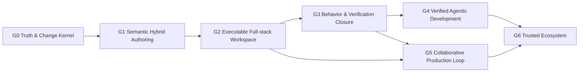

# Prodivix Global Phases

## 文档状态

- DecisionStatus: Accepted
- 本文件只定义 Global Phase、依赖关系与退出 Gate。
- 当前 `ProductGateStatus` 与实现成熟度只见 [`current-status.md`](./current-status.md)。
- G0/G1 可重复证据分别见 [`g0-closure-evidence.md`](./g0-closure-evidence.md) 与 [`g1-closure-evidence.md`](./g1-closure-evidence.md)。

## 文档目的

Global Phase 描述 Prodivix 能向用户承诺的完整闭环。领域文档中的 Phase、A/B milestone 或内部编号只表示该领域实施顺序，不代表全局阶段变化。

阶段不绑定工期，也不由提交数、文件数、ADR 数或单个 UI/Schema/Compiler 模块决定。阶段完成必须由可重复产品证据证明。

## 北极星

> 面向人类与 Agent 的、浏览器原生、代码可持有、语义化、可执行、可验证、可长期维护的 Web 应用工程环境。

视觉作者态、代码作者态、数据与行为、测试、构建、部署和生产反馈必须形成同一条可信链，而不是在多个编辑器和生成器之间复制状态。

## 三条状态轴

| 状态轴                 | 回答的问题                | 允许值示例                                    |
| ---------------------- | ------------------------- | --------------------------------------------- |
| `DecisionStatus`       | 方向是否冻结              | Draft、Accepted                               |
| `ImplementationStatus` | 代码实现到哪里            | Not Started、Foundation、Partial、Implemented |
| `ProductGateStatus`    | 用户闭环是否达到阶段 Gate | Blocked、In Progress、Passed                  |

Accepted ADR 不等于实现完成；已有实现不等于 Product Gate 通过。

## 统一验收链

```text
Contract
  -> Command / ChangeSet
  -> Persistence / Sync
  -> Preview Runtime
  -> Export Runtime
  -> Diagnostics / SourceTrace
  -> Behavior Verification
```

能力缺少任意必要环节时，最多标记为 Partial。纯展示、纯类型、纯编译或纯后端实现不能单独通过产品 Gate。

## 全局依赖关系



允许提前设计后续阶段 contract 和 extension point，但不得提前宣称对应能力完成：AI 写入不能绕过 G0/G1/G3；第二 target 不能绕过 React/Vite Golden；协作不能用通用 JSON CRDT 取代类型化事务；Marketplace 不能早于权限、签名、版本与 conformance。

## G0: Truth & Change Kernel

### 目标

建立唯一可信 Workspace、唯一写入协议和唯一恢复基线。人类、AI、plugin、importer 与 sync recovery 都进入同一可验证 Change 链。

### 必须具备

1. Canonical Workspace VFS 与领域 typed documents。
2. 所有生产作者态写入进入可逆 Command 或原子 Transaction。
3. History、undo/redo、merge/barrier 与 causal identity。
4. Atomic Commit、partition revision、strong idempotency、conflict 与 safe replay。
5. Durable Outbox、local replica、refresh/crash/offline recovery 与 ACK causality。
6. 前后端 conformance-equivalent Schema/Codec/Validator。
7. Issues、diagnostic、Quick Fix、SourceTrace 与 editor navigation。

### 退出 Gate

1. 刷新、崩溃、断网、重试和冲突不会静默丢失 confirmed/pending operation。
2. 任意领域写入可撤销、重做、重放、审计和诊断。
3. 不存在绕过 Command/Transaction 的第二生产写入协议或领域镜像。
4. Golden Gate 可重复创建、编辑、保存、恢复、冲突、导出与构建。
5. Issues 可定位到 Workspace、Route、PIR、CodeArtifact 或 operation。

## G1: Semantic Hybrid Authoring

### 目标

让视觉编辑与代码编辑长期共存；不以一次性代码生成为终点，也不对无法理解的源码猜测性回写。

### 必须具备

1. revision-bound Workspace Semantic Index，统一 Symbol/Scope/Reference/Dependency，但保留领域 visibility/type/capability。
2. Code Authoring Environment、language/compile capability、CodeArtifact/Reference/Slot 与跨领域 impact/refactor planning。
3. 明确 `PIR-owned / code-owned / adapted` 边界和 controlled React/JSX/CSS round-trip；未知源码逐字节保留。
4. Component Definition/Public Contract/Instance、原子 subtree extraction 与一等 Collection。
5. Renderer/Compiler/Preview/Export/SourceTrace/Diagnostics 语义 parity。
6. DTCG Token/Resolver、Asset semantic provider 与 Git projection。
7. 无版本 PIR-current 领域模型；数字版本只存在于 wire/codec/migration/persistence。

### 退出 Gate

1. Golden App 可在视觉/代码间往返，受控内容不漂移，未知源码不丢失。
2. definition/reference/impact 与 SourceTrace 可跨编辑器定位。
3. React/Vite 独立项目完成 install/typecheck/test/build/browser smoke。
4. Component/Collection extraction、复用、Definition 联动、undo/redo、save/reload、Preview/Export 通过同一 conformance。
5. cycle、scope、contract、reference 与 ownership drift 有稳定诊断并 fail closed。

## G2: Executable Full-stack Workspace

### 目标

让 Prodivix 能在 exact Workspace revision 上运行真实全栈数据应用，并使 Preview、Test、Build 与 Export 使用同一行为 contract。

### 必须具备

1. transport-neutral ExecutionProvider/Job/Session 与 provider-neutral Executable Snapshot。
2. Browser 与 Remote isolated Preview/Test/Build/production provider，具有 cancellation、timeout、artifact、Console、Terminal、Network、filesystem 与 SourceTrace。
3. Data query/mutation schema、cache/retry/pagination/idempotency/optimistic lifecycle，以及 mock/live parity。
4. client/worker/server/edge/build/test zones、environment binding、permission 与 Secret resolution。
5. Auth/session/permission/Server Function stable contract 与安全 target matrix。
6. Binary Asset exact-byte store、transform/scanner/delivery 与跨 target materialization。
7. OpenAPI/GraphQL/受限 AsyncAPI adapter。
8. React/Vite 与一个受控第二 framework target 证明 runtime/ExportProgram 可移植。

### 退出 Gate

1. 标准 CRUD App 在 Preview/Test/Export 中一致处理 auth、loading、empty、error、mutation、retry、pagination 与 optimistic update。
2. Browser/Remote 消费同一 exact revision/snapshot；Console、Terminal、Network、Test 与 Files 可定位 SourceTrace。
3. mock/live、zone、permission、Secret 与 mutation replay fail closed，credential 不进入 durable/client surfaces。
4. Binary Asset 与 Auth/Server 具有稳定 contract、产品旅程与可重复安全证据。
5. React/Vite 和选定第二 target 通过同一 CRUD conformance，并独立完成 install/typecheck/test/build/browser smoke。
6. runtime state 保持可丢弃；采纳 runtime change 仍走唯一 Workspace 写入链。

## G3: Behavior & Verification Closure

Canonical contract：[`../implementation/g3-behavior-verification-closure.md`](../implementation/g3-behavior-verification-closure.md)；
milestone 状态：[`g3-behavior-verification-milestones.md`](g3-behavior-verification-milestones.md)。

### 目标

把行为语义、场景、断言与证据提升为一等模型，形成可重复 Verification closure。

### 必须具备

- NodeGraph/Animation/Route/Data/Test 的组合行为语义。
- BehaviorScenario、VerificationPlan、VerificationEvidence 与 evidence retention。
- visual/accessibility/unit/integration/E2E 的统一触发、结果与 SourceTrace。
- deterministic replay、conflict/reduced-motion/time/network controls。

### 退出 Gate

关键用户旅程能由同一 scenario 在 Preview、Export 与 CI 重复执行；结果可审计、可定位、可比较且不依赖编辑器私有状态。

## G4: Verified Agentic Development

### 目标

让 Agent 在受控权限、可逆 change、验证计划和证据约束下修改真实 Workspace。

### 必须具备

- intent/proposal/approval/transaction/evidence contract。
- scoped tool permission、budget、dry run、rollback 与 human review。
- code/visual/data/behavior cross-domain planning，不绕过 owner。
- eval、counterexample、regression 与 provenance。
- revision-bound AgentTask/Run lifecycle、tool call trace、cancel/timeout/retry/recovery 与强幂等。
- Context Pack、Semantic/SourceTrace grounding 与可重建 Intelligence projection，不扫描编辑器私有状态。
- model/provider/tool/version、输入摘要、cost、privacy 与 data-residency policy 的完整身份和审计。
- prompt injection、untrusted content、Secret、network 与 permission escalation fail closed；Agent 不得自我审批或扩大授权。

### 退出 Gate

Agent 的每次生产写入都可解释、可预览、可撤销、可验证并携带足够 evidence；失败不会静默扩大权限或改写 truth。

## G5: Collaborative Production Loop

### 目标

形成多人、多设备、review、deploy 与 production feedback 的可信闭环。

### 必须具备

- multi-device local-first sync、presence、review 与 typed conflict resolution。
- branch/change proposal、environment/deploy approval 与 rollback。
- production telemetry/issue 到 SourceTrace/Workspace change 的闭环。
- organization/role/audit/retention policy。
- ChangeSet、comment、review decision、commit/PR/check 与 VerificationEvidence 的稳定映射。
- preview/staging/production environment binding、release manifest、artifact provenance 与逐级 promotion。
- offline/reconnect、乱序/重复事件、部分部署失败、worker/provider outage 与幂等 reconciliation。
- canary、traffic shift、rollback、incident 与 post-deploy verification 的可审计状态机。
- production log/metric/trace 的采集、脱敏、采样、保留和租户隔离；外部事实不得直接改写 Workspace。

### 退出 Gate

团队可在断网、并发、review、部署失败和生产回归下保持作者态、权限、证据与发布状态一致。

## G6: Trusted Ecosystem

### 目标

开放可治理的 Plugin/Target/Template/Marketplace 生态而不牺牲 canonical contract 与安全边界。

### 必须具备

- Public SDK、capability manifest、sandbox、signature 与 version governance。
- plugin/target conformance、compatibility matrix 与 deprecation policy。
- Marketplace review、provenance、license、security response 与 revocation。
- 多 target 行为/资产/数据/验证 parity。
- publisher identity、trust tier、content-addressed package、SBOM、dependency provenance 与 reproducible artifact。
- install/resolve/activate/update/migrate/rollback/uninstall 生命周期，以及 engine/dependency conflict 处理。
- object-scoped permission prompt、network/Secret 单独授权、resource budget、isolation 与 residual cleanup。
- local development、bundled official、signed third-party 与 untrusted/imported 扩展的明确运行和证据边界。
- vulnerability disclosure、emergency quarantine/kill switch、key compromise、离线吊销缓存与用户迁移路径。

### 退出 Gate

第三方扩展可安装、升级、回滚和吊销；不能绕过 Workspace 写入、permission、Secret、execution 或 evidence Gate。

## 横向产品 Gate

每个阶段均适用：

1. Canonical truth 与 owner 唯一。
2. 写入可逆、原子、durable、可审计。
3. Runtime 与 persistence 隔离，Secret/credential fail closed。
4. Diagnostics/SourceTrace 可定位。
5. local、Browser、Remote 与 CI 证据边界明确。
6. accessibility、performance、security、migration 与 recovery 不以“后续再补”绕过阶段退出 Gate。

## 变更规则

1. 当前状态只更新 `current-status.md`；子系统阶段只更新对应 milestone。
2. Phase 的目标、依赖或退出 Gate 变化才修改本文件，并记录 DecisionStatus。
3. implementation 文档保存实现 contract；evidence 文档保存运行记录。不要通过追加“最新状态覆盖上文”维护历史。
4. 状态变更必须基于可重复证据，并同时删除已经失效的判断。
