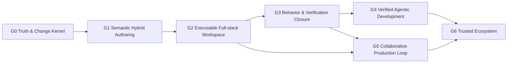

# Prodivix Global Phases

## 状态

- DecisionStatus：Accepted
- 日期：2026-07-16
- 当前产品位置：G1 Passed / G2 Foundation
- 关联：
  - `specs/decisions/37.verified-semantic-authoring-architecture.md`
  - `specs/decisions/34.core-package-boundaries.md`
  - `specs/decisions/35.canonical-workspace-hard-cut.md`
  - `specs/decisions/36.atomic-workspace-operation-commit.md`
  - `specs/decisions/25.authoring-symbol-environment.md`
  - `specs/decisions/28.code-authoring-environment.md`
  - `specs/decisions/38.blueprint-component-instance-and-collection.md`
  - `specs/decisions/31.production-export-planner.md`
  - `specs/decisions/45.data-operation-and-environment-reference-foundation.md`
  - `specs/implementation/g2-executable-full-stack-workspace.md`
  - `specs/roadmap/g0-closure-evidence.md`

## 文档目的

本文档是 Prodivix 唯一的全局产品阶段定义。各领域文档中的 Phase 1、Phase 4.8 或 Phase E 只描述该领域内部的实施顺序，不代表整个项目已经进入同名全局阶段。

全局阶段回答三个问题：

1. 当前产品能够向用户承诺什么闭环。
2. 下一阶段依赖哪些不可绕过的产品 Gate。
3. 哪些局部能力即使已经有 ADR、类型、UI 或编译器，也仍只能标记为部分实现。

全局阶段不绑定工期。阶段完成由可重复验证的产品证据决定，不由提交数量、文件数量或局部模块编号决定。

## 北极星

Prodivix 的长期定位是：

> 面向人类与 Agent 的、浏览器原生、代码可持有、语义化、可执行、可验证、可长期维护的 Web 应用工程环境。

产品必须支持视觉作者态、代码作者态、数据与行为、测试、构建、部署和生产反馈形成同一条可信链路，而不是在多个互不相认的编辑器和生成器之间复制状态。

## 阶段状态的三条独立轴

所有路线图、ADR 和实施记录必须区分以下状态：

| 状态轴                 | 回答的问题                   | 示例                                          |
| ---------------------- | ---------------------------- | --------------------------------------------- |
| `DecisionStatus`       | 方向是否已经冻结             | Draft、Accepted                               |
| `ImplementationStatus` | 代码实现到了哪里             | Not Started、Foundation、Partial、Implemented |
| `ProductGateStatus`    | 用户闭环是否达到阶段退出门槛 | Blocked、In Progress、Passed                  |

`Accepted` ADR 不等于产品完成；已有 UI、Schema、Planner 或测试也不等于对应 Global Phase 已通过。

## 完整能力的统一验收链

任何产品能力都按以下链路验收：

```text
Contract
  -> Command / ChangeSet
  -> Persistence / Sync
  -> Preview Runtime
  -> Export Runtime
  -> Diagnostics / SourceTrace
  -> Behavior Verification
```

缺少任意一环时，该能力最多标记为 `Partial`。纯展示、纯编译、纯后端或纯类型实现不能单独通过产品 Gate。

## 全局依赖关系



允许提前设计后续阶段的契约、评测和扩展点，但不得提前对外宣称对应产品能力完成：

1. 具备写权限的 AI 不得绕过 G0、G1 和 G3 的写入与验证 Gate。
2. 多框架 Target 不得绕过 React/Vite Golden Gate。
3. Marketplace 不得早于插件权限、签名、版本治理与 conformance。
4. 实时协作不得用通用 JSON CRDT 取代 PIR、NodeGraph 和 Animation 的类型化事务语义。

## 当前全局判断

截至 2026-07-16，Prodivix 位于：

> G1 已通过 / G2 基础阶段。语义化视觉/代码混合作者闭环已形成可重复验证证据，当前进入可执行全栈 Workspace 的建设阶段。

| Global Phase | ProductGateStatus | 当前实现成熟度                            | 说明                                                                                                                                                                                                                                                                                                                                                                                                                                                                                                                                                                                                                                                                                                                                                                                                             |
| ------------ | ----------------- | ----------------------------------------- | ---------------------------------------------------------------------------------------------------------------------------------------------------------------------------------------------------------------------------------------------------------------------------------------------------------------------------------------------------------------------------------------------------------------------------------------------------------------------------------------------------------------------------------------------------------------------------------------------------------------------------------------------------------------------------------------------------------------------------------------------------------------------------------------------------------------- |
| G0           | Passed            | Implemented                               | Canonical Workspace、History、Atomic Commit、Revision Conflict、唯一生产写入链路、双 Durable Outbox、正式 local replica、revision-aware Issues 与 Golden Conformance 已落地；`pnpm run verify:g0` 的 8 个阶段与六项退出 Gate 已完整通过，证据见 `g0-closure-evidence.md`                                                                                                                                                                                                                                                                                                                                                                                                                                                                                                                                         |
| G1           | Passed            | Implemented / PIR-current / Semantic Code | Workspace Semantic Index、无版本 PIR-current、Component/Collection、Renderer-Compiler parity、原子 extraction、TS/JS/CSS/SCSS/GLSL/WGSL、独立 Shader Compile、跨编辑器 CodeSlot、controlled round-trip、Token/Resolver/Asset provider、完整 S5 产品表面、唯一 durable 生产写入链，以及独立 React/Vite build/browser Gate 已形成闭环                                                                                                                                                                                                                                                                                                                                                                                                                                                                              |
| G2           | In Progress       | Execution + Data Authoring Foundation     | ExecutionProvider/Job、neutral snapshot、Browser Providers、Remote codec/client/provider projection/Preview Bundle/Build Bundle/Test Report result、授权 artifact resolver、有界 HTTP transport、Backend auth gateway/durable execution grant、Control Plane/PostgreSQL/HTTP、Worker Agent、rootless Podman sandbox/GitHub Gate、短期 capability Preview Host、Blueprint Browser/Remote selection、Golden contract matrix、真实 Golden rootless Preview/Test/Build、install/runtime 隔离、install allowlist proxy、Browser fetch/Data HTTP adapter、operation correlation 与 sanitized Network 产品视图已建立；Data 作者态、invocation/registry/lifecycle execute kernel 与引用式 environment/Secret contract 已落地；Data schema/policy/mock/Remote runtime、Secret resolution、Terminal 与第二 target 继续建设 |
| G3           | Blocked           | Early                                     | NodeGraph 已形成无 DOM 执行内核；Animation 已形成完整单 timeline lifecycle、Runtime Port 与 Browser effect projection；G3 统一完成 composition、route/reduced-motion/CodeSlot 行为、conflict 与 VerificationEvidence                                                                                                                                                                                                                                                                                                                                                                                                                                                                                                                                                                                             |
| G4           | Blocked           | Foundation Only                           | AI gateway、streaming、tool 和 trace 有基础；真实 Workspace 写入仍未达到产品 Gate                                                                                                                                                                                                                                                                                                                                                                                                                                                                                                                                                                                                                                                                                                                                |
| G5           | Blocked           | Not Started Systematically                | 单设备 local replica 已形成基础；multi-device sync、presence、Review、Production Feedback 与完整 Local-first 团队闭环尚未形成                                                                                                                                                                                                                                                                                                                                                                                                                                                                                                                                                                                                                                                                                    |
| G6           | Blocked           | Infrastructure Preview                    | Plugin Host 和三类官方插件较成熟，但 SDK、conformance、签名、Marketplace 和多 Target Gate 尚未完成                                                                                                                                                                                                                                                                                                                                                                                                                                                                                                                                                                                                                                                                                                               |

## G0：Truth & Change Kernel

### 目标

建立唯一可信的 Workspace、唯一写入协议和唯一恢复基线。无论修改来自人类、AI、插件、导入器还是同步恢复，都必须进入同一条可验证的 Change 路径。

### 必须具备

1. Canonical Workspace VFS，统一持有 Workspace、Route、PIR、Code Documents、Assets 和 Config。
2. Blueprint、NodeGraph、Animation、Route、Code 和 Resources 的领域写入全部进入 Command / Transaction。
3. Operation History、undo/redo、merge、barrier、因果关系和稳定快捷键。
4. Atomic Commit、revision partition、强幂等、409 conflict、显式 resolution 和安全 replay。
5. Durable outbox、跨刷新恢复、离线队列、ACK causality 和失败重试策略。
6. 前后端共享或 conformance-equivalent 的 Schema、Codec 与语义 Validator。
7. 统一 Issues 聚合、诊断去重、Quick Fix、SourceTrace 和编辑器回跳。
8. Golden Conformance Suite，覆盖多路由、route-level PIR artifact 复用、表单、代码、资源、插件、导出和冲突恢复；Blueprint Component Instance 与 Collection 复用属于 G1。
9. 文档统一记录 `DecisionStatus / ImplementationStatus / ProductGateStatus`。
10. 领域数据退出裸 `localStorage`；浏览器存储只承载 UI 偏好或正式 local replica。

### 已有关键基础

- Canonical Workspace 已成为唯一作者态真相源。
- 本地 Command / Transaction History 与编辑器快捷键已完成主要链路。
- Atomic WorkspaceOperation Commit、revision conflict recovery 和语义 Diff 已完成。
- Operation/Settings 双 Durable Outbox、IndexedDB exact-request persistence、lease/retry、ACK identity、跨刷新恢复与 conflict session persistence 已完成；生产写入统一经过 Atomic Commit。
- 正式 local replica 已完成 confirmed canonical cache、独立 watermark、pending Outbox materialization、ACK crash bridge 与仅网络失败时的离线打开。
- Diagnostics、Authoring、PIR、Router、Workspace、Workspace Sync 已形成第一批核心 package。
- Runtime Core 与 NodeGraph 由独立 package 持有，Web 通过稳定 adapter 组合运行时能力。
- PIR React Renderer 由独立 React projection package 持有。
- 前后端 Workspace、Route 和 VFS 校验已显著收敛。
- `@prodivix/authoring` 已完成 Workspace Semantic Index kernel：SemanticSnapshotIdentity、provider-set digest、完整 contribution validation、确定性 composition、lexical visibility、discriminated resolution、definition/references/impact/completion query 与 semantic diagnostic contribution 均有属性测试证据。
- revision-aware Issues 已完成 provider snapshot、去重、active/stale/resolved 生命周期、Web 全局入口、Workspace/Route/PIR/NodeGraph/Animation/Code/Outbox/Conflict provider、Quick Fix 安全写入边界、稳定跨文档 target、Code SourceSpan 精确聚焦和现有目标回跳。
- `@prodivix/golden-conformance` 已建立 Living Golden App 基线，可重复验证 create、edit、History undo/redo、Atomic Commit save planning、Durable Outbox/local replica recovery、显式 conflict resolution、完整 Workspace React/Vite export 与进程内 Vite build；同一个 `pir-component` 作为 route-level PIR artifact 由两个 route 消费且只生成一个共享模块。Workspace compiler 对完整 Workspace 建立导出计划，并为未进入生产输出的合法文档组合提供 blocking diagnostic。Golden G1 旅程已验证原子 subtree extraction、3 个 Component Instance、props/events/slots/variants Public Contract、Slot Outlet 与 slot-prop、双层 nested Collection、PIR ↔ canonical JSX/CSS 往返、未知源码保留、Definition 联动、原子 undo/redo、codec reload、WorkspaceOperation replay、Preview projection、ExportProgram 与 SourceTrace 稳定性。
- 默认 Golden build 会逐个 syntax-transform 所有生成的 JS/TS 模块，再以无服务器、外部化 bare package imports 的进程内 Vite/Rolldown 构建验证可达模块图。`pnpm run verify:g1:standalone` 另外构建当前 compiler 产物，从生成项目的 `packageManager` 契约选择 Corepack pnpm，并在独立临时目录实际完成 install、typecheck、test 与 production build。`pnpm run verify:g1:browser` 在相同独立生产构建上验证真实 Chrome runtime、WebGL2 与 WebGPU。visual regression 与正式 `VerificationEvidence` 继续由后续 Gate 承担。

### 退出 Gate

G0 通过必须同时满足：

1. 刷新、崩溃、断网、重试和冲突不会静默丢失已确认或待同步操作。
2. 任意领域写入都能被撤销、重做、重放、审计和诊断。
3. 不存在绕过 Command / Transaction 的第二套生产写入协议。
4. 不存在以 `localStorage`、React state 或编辑器私有镜像充当领域真相源的生产路径。
5. Golden Conformance Suite 能自动复现并验证创建、编辑、保存、恢复、冲突、导出与构建。
6. Issues 能从错误回到对应 Workspace、Route、PIR node、CodeArtifact 或操作记录。

2026-07-13，以上六项退出 Gate 已由 `pnpm run verify:g0` 的核心边界、生产写入边界、诊断目录、13 个核心 package 与 Golden、Web typecheck、Web Issues/恢复 adapter 和后端全量测试共同验证，完整记录见 `specs/roadmap/g0-closure-evidence.md`。G0 因此标记为 `Passed`；该 G0 入口不包含后续 G1-G3 的独立导出、浏览器、视觉与正式 `VerificationEvidence`。独立导出项目的 install/typecheck/test/build 已由 G1 专用 Gate 单独建立。

## G1：Semantic Hybrid Authoring

### 目标

让视觉编辑与代码编辑长期共存。Prodivix 不以一次性代码生成为终点，也不对无法理解的代码进行猜测性回写。

### 必须具备

1. Workspace Semantic Index：绑定 Canonical Workspace partitioned revisions、semantic schema 与 provider set、可重建，统一索引 Workspace、Route、PIR、Component、Collection、NodeGraph、Animation、Code、Token、Asset 和 Contract 的 Symbol、Scope、Reference 与 Dependency。
2. 各领域 durable identity 与语言推导的 revision-scoped address 通过同一 Index 查询；Scope、类型和 capability 继续约束解析、补全与绑定可见性，并明确区分 missing、not-visible、ambiguous、type-incompatible 与 stale。
3. 真实 Code Workspace 与 TypeScript、JavaScript、CSS、GLSL/WGSL Language Service；Language Service 通过 Code Semantic Contribution / Language Capability Provider 接入，不拥有跨领域索引协议；GPU/目标编译通过独立 compile capability 接入。
4. definition、reference、rename、completion、impact analysis 和增量 diagnostics 贯通视觉与代码对象。
5. 明确 `PIR-owned / code-owned / adapted` 所有权边界。
6. CodeSlot 统一承载 handler、executor、adapter、mounted CSS、easing、shader 和 timeline script。
7. Prodivix 可控 React/JSX/CSS 子集的 canonical round-trip。
8. 不受控源码保留为 code-owned boundary，仍支持编辑、定位、诊断、预览与 AI patch。
9. Component Definition、Public Contract 与稳定 Component Instance；Contract 连接 Props、Events、Slots、Variants、Tokens、可访问性、测试、代码映射和 AI 使用说明。
10. 原子 Blueprint subtree extraction：分析跨边界依赖，创建 `pir-component`、派生 Contract、移动子图、插入 Instance、重写类型化引用，并作为一个可逆 Workspace Transaction 保存。
11. Component dependency graph、cycle/missing/member mismatch 诊断，以及 contract-limited binding；G1 不允许任意内部 node override。
12. 一等 Collection：显式 source、key、item/index semantic scope 与 item/empty/loading/error regions；支持嵌套 Collection 和以 Component Instance 作为 item template。G1 完成 region 作者态、手动状态预览和 literal/local source parity，G2 再由真实 Data/API lifecycle 驱动 loading/error。
13. Component Instance 与 Collection 在 save/reload、History、Atomic Commit、Preview、Export、SourceTrace 和 Diagnostics 中使用同一语义。
14. SourceTrace 升级为 PIR、Component、Collection、Code、Export 和 Diagnostics 的双向定位协议。
15. Git projection round-trip。
16. DTCG Token 文档与标准化主题、变体和设计系统映射。
17. 整个 G1 只消费无版本 PIR-current 领域模型；数字版本只存在于不可变 wire schema、generated wire contracts、codec、migration 与 persistence 边界。

2026-07-14，G1 可重复实现已扩展：`@prodivix/authoring` 提供 revision-bound Workspace Semantic Index、`SEM-xxxx` resolution diagnostics 与 semantic schema v2，后者已建立 Component/Contract/slot/variant 与 Collection item/index/error 的 canonical identities。`@prodivix/workspace` 从同一 WorkspaceSnapshot 组合 Workspace、Route、PIR-current、standalone NodeGraph 与 standalone Animation provider，并提供 current read/final-state apply、Component document-role/target/Contract/DAG/SCC validator、delete/rename impact、跨领域 reference provider/plan，以及原子 extraction Transaction 与 History undo/redo/replay。Renderer/Compiler 共用 immutable、revision-bound current projection plan，以 stable document identity 固定可达 documents、partition revisions、dependency-first order 与 validation 结果。`@prodivix/pir` 的无版本领域 API 统一承载 factory、deterministic normalizer、单文档 validator、immutable Component/Collection mutation、subtree extraction、projection 与 semantic contribution；strict wire codec、generated wire types 与 migration 只存在于显式 wire boundary。

同日，Code Language 主线形成真实 TS/JS、CSS/SCSS 与 GLSL/WGSL 纵切。`@prodivix/authoring` 定义 immutable、revision-bound Code Language Capability session 和统一 result/workspace-edit contract；`@prodivix/code-language` 通过 TypeScript、CSS 与 browser-safe shader parser adapter 提供 definition、references、completion、diagnostics、hover、rename proposal 和 semantic contribution。TS/JS 发布 module/export/function/type/import/reference facts；CSS/SCSS 发布 module、selector、keyframes、variable、mixin 与语言原生 reference facts；GLSL/WGSL 经 parser-neutral shader model 发布 module、entry、function、type、resource 与 reference facts，其中 WGSL entry 保留 vertex/fragment/compute stage，GLSL `main` 在缺少 compile profile 时保持 unknown。Workspace Semantic Index、Code Editor 与 Issues 消费同一 snapshot identity；rename edits 经 artifact revision、`SourceSpan`、重叠和 no-op 校验后，可按 artifact 合并为一个可逆 Workspace Transaction。GPU/目标后端 shader compile validation 保持为独立 capability，不进入作者态 parser session。

2026-07-15，项目 Token 纵切进入 current Semantic Index composition。`@prodivix/tokens` 在 DTCG 2025.10 Format profile/codec 边界识别外部格式，向内部发布无版本 Token current model，并校验 group、`$root`、curly alias、JSON Pointer、`$extends`、reference cycle、type inheritance 与 `$extensions` preservation。Canonical Workspace 新增 `design-tokens` 文档、codec/validator、可逆 Token Command 与 typed read model；`core.design-tokens` provider 从同一 partition revision 发布 Token/Group symbol、scope、reference 与 dependency facts。DTCG 版本没有进入 Workspace、Semantic Index 或 Web current API。

同日，G1 item 16 的主题、变体与设计系统映射按 DTCG Resolver Module 2025.10 收敛。`design-token-resolver` 是独立 canonical Workspace 文档：Token 文件只拥有值，Resolver 只拥有 sets、modifiers、contexts、defaults 与 resolution order。`@prodivix/tokens` 将 Resolver wire 解码为无版本 current model，校验 source/reference/set cycle/input，并生成保持 precedence、延后 alias resolution 的 resolution plan；`core.design-token-resolvers` provider 发布 DesignSystem/Set/Modifier/Context 与跨文档 source/resolution facts。Workspace History、sync conflict recovery、Durable Outbox/Atomic Commit 与 backend document contract 已支持 Token/Resolver 领域；Resources 提供同一 JSON 校验/保存入口，并可用一个原子 Transaction 创建 foundation/light/dark/Resolver 四文档起步设计系统。`@prodivix/themes` 继续只拥有 Prodivix 产品 UI 主题，不与项目 Token owner 混合。

CodeSlot 主线已形成跨领域 current-model 纵切。Route loader/action/guard、PIR event/mounted CSS、NodeGraph custom executor，以及 Animation custom easing/shader/timeline script 均由领域文档保存 `CodeSlotBinding`，由 Workspace composition 聚合为只读 binding projection，并复用同一 Semantic Index 完成 definition、references 与 impact 查询。Blueprint Inspector、NodeGraph 原有代码节点、Animation Inspector 与 Code Resources 已接入绑定、源码定位或反向 usage 表面；NodeGraph 代码节点不再持久化裸源码，源码只由 canonical Workspace code document 保存。External Library 也已通过 canonical config-owned `external-adapter` binding 进入同一 registry，slot-managed metadata、orphan 诊断、重新绑定、module conversion 与 active-binding 删除保护已形成闭环。Code Resources 的 F2 rename 会预览跨 artifact edit 和命名 CodeReference owner impact，对缺少 owner-specific rewrite 的情况 fail closed；CodeArtifact path move 由可逆 Workspace Operation 保持 stable identity、binding 与 semantic references。

S3 Component Renderer 与 Compiler parity 的领域语义已完成。Renderer 覆盖多实例、nested instance、instance state isolation，以及 props/events/slots/variants 的 consumer/Definition/slot scope；Compiler 覆盖 dependency-first shared module、多个 Instance 的 import reuse，以及 Definition、Instance、Contract member、slot region 与 generated module SourceTrace。missing Definition、cycle 与 Contract mismatch 都在共享 current 投影边界 fail closed，Compiler 不输出部分 PIR module。

S4 Collection parity 的领域语义已完成。共享 current plan/evaluator 统一 source、typed key、item/index/error lexical scope、`auto/item/empty/loading/error`、nested parent scope 与 canonical projection path；Renderer 支持 Collection 内 Component Instance、稳定 key 重排状态和 per-instance preview，Compiler 生成由 shared oracle conformance 约束的 standalone runtime、Collection SourceTrace、warning fact 与动态 issue replace/clear。非法 source/key 与重复 key fail closed，不产生部分 item projection，也不隐式回退为 index。

整个 G1 现在只面向无版本号的 PIR-current 稳定领域模型。数字版本只存在于不可变 wire schema、generated wire contracts、codec、migration 与 persistence 边界。普通升级只新增下一份 snapshot、更新 activation manifest、同步 generated contracts 并增加确定性 migration；Workspace、Renderer、Compiler、Semantic Index 与 Web 保持稳定。NodeGraph 与 Animation 分别使用独立 `pir-graph` 与 `pir-animation` Workspace document，并以 document-qualified reference 与 PIR 组合。

S5 Blueprint 已新增 canonical Component Instance Public Contract Inspector 和一等 Collection
Inspector。Collection 产品表面提供 source、key、item/index/error symbols、四状态
regions、scope-aware binding candidates 与 manual preview；Component binding 与 Collection
领域写入均通过 canonical Workspace Transaction 进入 History 与 WorkspaceOperation。

S6 Golden G1 已完成。旅程覆盖原子抽取、3 个 instances、props/events/slots/variants Public Contract 全量绑定、Definition Slot Outlet、consumer slot-prop、双层 nested Collection、canonical JSX/CSS 双投影、Code -> PIR、PIR -> Code、区域外未知源码保留、Definition 联动、原子 undo/redo、codec reload、operation replay，并约束 Preview、ExportProgram 与 Contract member/slot region SourceTrace 稳定性。独立 React/Vite 项目自动完成 install/typecheck/test/build；browser Gate 进一步验证生产 bundle 页面加载、客户端路由、表单交互、WebGL2 program link，以及 WebGPU adapter/device 与 WGSL compile。CodeSlot external adapter、orphan lifecycle 与跨领域 refactor planning surface 也已完成产品纵切。

2026-07-15，controlled visual/code round-trip 已扩展为 capability-partitioned 产品纵切。`@prodivix/authoring` 定义 ownership manifest、版本化 region marker、capability 与 `code-owned/adapted` CodeArtifact 投影；`@prodivix/prodivix-compiler` 以 `react-jsx` 管理普通 Element structure、literal props/text 以及带 fallback subtree 的 Contract Slot Outlet，以 `css` 管理 stable node-id selector 下的 standalone literal style。PIR 文档是唯一 canonical owner；writable projection 按 `(PIR document, capability)` 保持唯一，不限制同一 PIR 接入的 adapter 数量。Code -> PIR、PIR -> Code 与多文件同步均形成原子 Workspace Operation；两类区域外未知源码逐字节保留，unsupported shape、可执行表达式、marker/manifest 分叉和 ownership drift 均 fail closed。Blueprint Code 页原子创建并分别打开 JSX/CSS，Code Resources 通过正式 Authoring Dispatcher、Durable Outbox 与 Atomic Commit 保存反向编辑。Golden G1 已把该纵切纳入完整 History/reload/replay/Compiler 旅程，并以独立临时项目验证生成 package-manager、pnpm build policy、TSX/JSX 输出方言、测试脚手架与 production build。

同日，Shader target validation 形成独立于 Language Service 的 G1 纵切。Workspace code document 的 `prodivix.shaderCompile` metadata 是 target/stage/entry profile 的 canonical contract；`@prodivix/authoring` 定义 revision-bound compile session、result、backend port 与唯一 provider registry，`@prodivix/code-language` 负责 profile/entry 校验、compiler message 脱敏裁剪、SourceSpan 和 `COD-5002` 归一化，Web composition 提供 WebGL2 与 WebGPU backend。Code Editor inline diagnostic 与异步 Issues provider 复用同一 canonical compile snapshot，新建 GLSL/WGSL 自动配置目标，已有 shader 可从 Code Resources 显式启用或切换 stage，配置写入继续经过 Command、Durable Outbox 与 Atomic Commit。S6 browser Gate 已提供真实 WebGL2/WebGPU availability 与 shader compile 证据。

同日，External adapter 与 orphan artifact lifecycle 形成 G1 产品纵切。External library project config 是 adapter `CodeSlotBinding` 的唯一保存态；Workspace composition 为每个 active library 发布稳定 `external-adapter` slot。Code document 的 `prodivix.codeArtifactLifecycle` 只记录 slot-managed 来源，不复制 binding；创建与绑定作为单个 Workspace Transaction 进入 History、Outbox 与 Atomic Commit。删除 library 或 binding 后 artifact 保留在 Canonical Workspace VFS 并派生为 orphan，Issues 发布 `COD-3017`，Code Resources 提供重新绑定和 workspace module conversion；active binding 同时阻止文件或目录被直接删除。属性测试覆盖 bind -> orphan -> module 的可逆转换。

同日，跨领域 code refactor planning surface 形成 G1 产品纵切。Code Resources 使用 F2 从 immutable Language Session 取得 rename proposal，经 artifact revision/SourceSpan planner 形成原子 Transaction，再由同一 Semantic Index 识别被改名导出对应的持久化 CodeSlot owner；缺少 owner-specific rewrite 时在 apply 前阻断并提供 owner 回跳，不留下静默断链。CodeArtifact path move 使用 current-model Workspace relocation planner，仅修改 document path 与 VFS tree projection，artifact id、source、binding 和 semantic reference 保持稳定并支持 History undo。属性测试约束 provider-order invariance、stale fail-closed、named/default owner 区分与 relocation round-trip。

同日，Asset semantic facts 从 generic `core.workspace` provider 硬切到专用 `core.assets` provider。每个 canonical asset document 按同一 partition revision 发布 stable Asset identity、MIME/category/family capability 与 document dependency；`AssetReference` 使用 durable asset document id 和可选 MIME constraint 生成 `asset-reference` semantic fact。Public Resources 与 active document 联动，展示 reference/impact，并在仍有 resolved semantic reference 时阻止直接删除。属性测试覆盖 provider-order invariance、capability projection 与类型化 reference resolution。

### 退出 Gate

1. 用户可以在视觉编辑器和代码编辑器之间往返修改一个 Golden App，受控内容不漂移，未知代码不丢失。
2. 从 Issues、Inspector、画布、节点图和动画轨道可以跳转到真实代码定义与引用。
3. React/Vite 导出项目可自动 install、typecheck、test、build 和 smoke test。
4. 设计组件、代码组件和导出组件之间存在稳定、可验证的 Component Contract。
5. PIR、Route、Component、Collection、NodeGraph、Animation 与 Code 的 stable identities 可由同一 Index 完成 definition/reference/impact 查询；resolved、missing、not-visible、ambiguous、type-incompatible 与 stale 解析通过 conformance。
6. Golden App 完成“抽取子图 -> 多实例复用 -> Collection 中复用 -> 修改 Definition 全部同步 -> undo/redo -> save/reload -> Preview/Export 一致”的完整旅程。
7. Component cycle、contract mismatch、Collection scope/key/region 错误具有稳定诊断和编辑器回跳，不会被 Renderer 或 Compiler 静默忽略。
8. PIR wire migration conformance 证明新增数字版本无需修改或复制 Workspace、Renderer、Compiler、Semantic Index 与 Web 生产实现。

2026-07-15，S5 产品旅程与生产写入总清单完成收敛。独立 Component 作者页、Resources/palette、Canvas extraction preview、Public Contract Inspector、Collection Inspector 与跨编辑器 semantic navigation 形成同一产品闭环。所有 Web 领域写入、Issues Quick Fix 与 History undo/redo 统一形成 Command/Transaction/causal Operation 并先进入 Durable Outbox；本地项目使用同一 exact-operation Outbox，按 causal order 投影到 canonical local repository，并支持从任意已持久化前缀恢复。仓库 Hard Cut 禁止 Store-only apply、raw commit transport 与私有领域镜像。结合 S0-S6、独立导出与真实浏览器 Gate，G1 `ProductGateStatus` 标记为 `Passed`；重复证据见 `specs/roadmap/g1-closure-evidence.md`。

## G2：Executable Full-stack Workspace

### 目标

把 Prodivix 从设计与代码生成环境升级为可以运行真实数据应用的工程环境。

### 必须具备

1. `ExecutionProvider / ExecutionJob` 抽象。
2. Browser Runner 与 Remote Isolated Runner；实现可替换，不锁定单一供应商。
3. 项目文件、依赖安装、Vite 构建、HMR、Terminal、Console、Network 和 Test 运行入口。
4. Data/API IR：query、mutation、schema、pagination、cache、retry、optimistic update、loading/empty/error。
5. OpenAPI、GraphQL 和明确 capability 范围的 AsyncAPI adapter；long-lived subscription 必须先有 stream lifecycle ADR。
6. `client / worker / server / edge / build / test` runtime zones。
7. `SecretRef`、环境绑定、权限和 mock/live adapter；Secret 不进入 PIR 和客户端产物。
8. 二进制 Asset 管线：hash、去重、元数据、转换和交付策略。
9. Auth、session、permission 和 server function 的稳定 runtime contract。
10. 一个受控的第二 framework target，用于证明 ExportProgram、Data runtime 与执行契约可移植；Public Target SDK 和广泛 target 目录仍属于 G6。

### 当前基础

- `@prodivix/runtime-core` 已完成 revision-bound `ExecutionRequest`、静态 provider descriptor/capability matching、instance-owned registry、canonical `ExecutionJob` 状态机，以及 transport-neutral `ExecutionTestReport` / `test.report` contract。
- Job 已统一 state、log、diagnostic、artifact、trace、SourceTrace、cursor replay、cancel、timeout 与 terminal result，并由属性测试和 provider conformance test 验证。
- instance-owned `ExecutionSessionCoordinator` 以稳定 session identity 组合 revision-bound Jobs，提供有界事件保留、订阅、清理与取消入口；它不持久化 Workspace，也不拥有 provider process。
- `@prodivix/runtime-browser` 以 composition-root-owned `BrowserProjectRuntimeHost` 统一管理惰性 browser Node runtime、filesystem snapshot、dependency fingerprint/install、owner-scoped process 与 dispose。Preview 与 Test 各自使用独立 provider descriptor、Job、Session 和 owner，只共享 Host 资源与匹配的依赖安装结果。
- Browser Preview provider 从 Compiler 生成的 revision-bound React/Vite bundle 构造隔离工程 snapshot，完成 Vite server、source-only HMR、console forwarding 与 preview artifact。
- Browser Test provider 运行同一 exact Workspace revision 导出的独立工程 test plan，通过 `@prodivix/runtime-vitest` 在 adapter 边界把 Vitest 私有 JSON 转换为 canonical `ExecutionTestReport`，并通过 `test.report` trace、report artifact 与 Test 页面呈现 file/case status、duration 和 failure message。
- 蓝图画布已形成 Design / Interactive / Run 三模式；Run 通过 sandboxed iframe 原位显示真实项目 server，共享 Execution Center 提供日志过滤、停止、重启、刷新和独立预览，并在模式切换后保留当前会话事件。
- `@prodivix/nodegraph` 已提供 same-context ExecutionProvider，将确定性 trace 实时映射为 Job trace/log/diagnostic 与 node-qualified SourceTrace；NodeGraph 编辑器 Run/Stop、Blueprint trigger、跨 revision session、取消、timeout 和 state patch result 已接入共享 Execution Center。旧 `runtime-browser` action 直调协议已删除。
- `@prodivix/animation` 已提供无 DOM scheduler/effect lease port 与 same-context ExecutionProvider，正式执行 delay、iterations、direction、fillMode、timeline/keyframe easing、取消、timeout、diagnostic 和 SourceTrace。`@prodivix/runtime-browser` 提供 one-shot RAF、target capability 与 generation-fenced effect store；Animation 编辑器 Play/Stop/Restart 已硬切到 revision-bound Session 与共享 Execution Center，旧私有 RAF lifecycle 和 browser preview helper 已删除。
- Workspace Test 纵切是 G2 的导出工程测试宿主；其报告与 Session event 不持久化为 Workspace 作者态，也不提前宣称 G3 `BehaviorScenario`、`VerificationPlan` 或 `VerificationEvidence` 已完成。
- `@prodivix/data` 已建立无版本号 current DataSourceDocument、DataOperationReference、JSON Schema 2020-12 shape、query/mutation、pagination/cache/retry/optimistic policy、lifecycle contract、strict normalization 与 `wireVersion: 1` codec，并新增 transport-safe invocation、mock/live-aware adapter registry、loading/success/empty/error execute kernel 与 Network correlation；独立 `@prodivix/data-http` 通过 Browser client-safe fetch 完成 live HTTP 第一纵切，`@prodivix/data-mock` 已提供 session-scoped deterministic fixture、exact/fallback matching、delay/error/page、stateful CRUD namespace、reset/dispose fencing 与 Browser Test mock-default/live-opt-in composition。Executable Project Snapshot v4 已纳入有界、content-addressed `dataMockProvision` 与 immutable initial collections，Compiler、Remote strict codec 与 Browser Test 使用同一 exact provision；Browser Host/Remote Worker 投影只读 runtime asset，Build profile 排除 mock fixture。React/Vite standalone 已生成 PIR Data query lifecycle runtime、订阅刷新并通过强制 install/typecheck/test/build Gate。Schema/policy、standalone mutation/live runtime 与第二 target 仍未完成。
- Canonical Workspace 已注册一等 `data-source` typed document；TypeScript Workspace codec/validator 复用 Data strict codec，后端验证对应 wire envelope 与基础 shape，默认 Workspace Semantic Index composition 接入 revision-bound Data source/schema/operation contribution。Data 作者态继续进入 Command/Transaction、Outbox 与 Atomic Commit，不建立私有镜像。
- `@prodivix/runtime-core` 已提供 reference-only ExecutionEnvironmentSnapshotRef、EnvironmentBindingReference 与 SecretRef，并允许 ExecutionRequest 绑定 immutable environment snapshot identity。Environment value map 不进入 request；Secret material 不进入 Workspace、request、log、artifact 或客户端产物。
- PIR 现有 `dataId` 继续表示 PIR 文档内局部数据作用域，不是全局 operation identity。`logic.dataById` 已保存 durable DataOperationReference binding，Collection Inspector 通过 Semantic Index 选择 query，并以原子 Transaction 同时写入 local binding、source 与显式 lifecycle mapping。Renderer/Compiler 按 document instance 消费匹配 snapshot；success 不从返回数组形状猜 empty，无 runtime snapshot 时 fail closed。
- Data operation trigger/input、runtime/adapter registry、Secret resolver/runtime-zone permission、OpenAPI/GraphQL/AsyncAPI adapter，以及 Preview/Export CRUD parity 尚未完成。
- provider-neutral snapshot、Remote codec/client/provider projection/Preview Bundle/Build Bundle/Test Report result、授权 artifact resolver、有界 HTTP transport、Backend auth gateway/durable execution grant、Control Plane/PostgreSQL/HTTP、Worker Agent，以及 D2 lease-fenced durable event/log、content-addressed artifact blob、总预算与 retention sweep 已完成；生产默认 rootless Podman sandbox adapter 和 remote-only GitHub Isolation Gate 已实现。Remote Preview 已通过 hash-only 短期 capability 子域、严格 CSP/Permissions Policy 与多文件 SPA fallback 接入独立 Host，Blueprint Run Mode 可显式选择 Browser/Remote；同一 living Golden Workspace 生成的 neutral snapshot 已覆盖 Browser Preview/Test 与 Remote Preview/Test/Build contract matrix，并经 strict Remote wire 进入真实 rootless install/Preview/Test/Build。dependency install 仅接入 internal network 的 hostname/443 allowlist proxy；Worker 启动前校验 exact policy，安装后断网并 inspect 确认为空才放行项目命令。Browser fetch/Data HTTP 运行请求和 install proxy 共同投影为 metadata-only `network.request`；Data correlation 固定 document/operation/invocation/sequence/attempt/source trace，Execution Center 只显示 strict decoded origin/timing/outcome/size。首次阶段性推送后的远端通过证据、generated/Remote Data runtime、Secret policy 与 canary 继续建设。
- 真实 rootless Remote Golden parity、Terminal/Network 与单一第二 target 可移植性证明继续作为 G2 后续交付；广泛 Multi-target/Target SDK 生态属于 G6。
- 二进制 Asset pipeline，以及 Auth/session/permission/server function 尚无覆盖完整运行边界的 Accepted ADR；它们必须先完成决策与 implementation，再进入 G2 closure。

### 退出 Gate

1. 一个标准 CRUD 应用能够连接声明式 API，完整处理鉴权、loading、empty、error、mutation、retry、pagination 和 optimistic update。
2. Browser 与 Remote Preview/Test/Build 消费同一 exact Workspace revision 和 Executable Project Snapshot，并通过相同 execution conformance；Console、Terminal、Network 与 Test 能定位回作者态 SourceTrace。
3. mock/live、runtime zone、permission 与 Secret resolution fail closed；Secret 不进入 Workspace、request、snapshot、log、diagnostic、artifact、test report、生成源码或客户端产物。
4. 二进制 Asset，以及 Auth/session/permission/server function 具有稳定 contract、运行实现和可重复安全证据。
5. React/Vite 与 G2 选定的单一第二 target 在 Preview、Test 和 standalone Export 中通过同一 CRUD runtime conformance journey，并独立完成 install、typecheck、test、build 与 browser smoke。
6. 所有 runtime lifecycle、cache、report、Terminal/Network 和 execution filesystem 保持可丢弃；采纳变化仍通过唯一 Workspace Command/Transaction/Outbox/Atomic Commit 链路。

## G3：Behavior & Verification Closure

### 目标

让 Blueprint、NodeGraph、Animation 和 Code 共同表达、执行和验证同一个应用行为。

### 必须具备

1. 共享 Trigger、Action、DataReference、StateReference、CodeReference、ExecutionContext 和 Trace 语义。
2. NodeGraph 类型化控制流和数据流、分支、异步、错误、取消、状态、事务、子图、断点与 trace。
3. Custom executor 全部进入 CodeSlot，不保存裸代码字符串。
4. Animation timeline、trigger、lifecycle、route transition、composition、reduced-motion、custom easing 和 shader。
5. 稳定 Target Reference；节点重命名、移动和复用不会静默断开动画或行为。
6. 打通 `Blueprint event -> NodeGraph -> Data/State -> Animation -> Code`。
7. `BehaviorScenario`、`VerificationPlan` 和 `VerificationEvidence`。
8. Preview Runtime 与 Export Runtime 使用相同语义实现或同一 conformance suite。
9. 单元、集成、行为、视觉、无障碍、性能和安全检查能绑定到 ChangeSet。

### 退出 Gate

关键用户旅程可以断点、单步、观察变量和 Trace、定位到作者态，并在 Preview、Test 和导出应用中产生相同行为。每个发布候选 revision 都能附带可复现的 Verification Evidence。

## G4：Verified Agentic Development

### 目标

让 AI 从聊天、建议和计划生成升级为受权限控制、可验证、可审阅的真实开发协作者。

### 必须具备

1. `Intent -> Plan -> WorkspaceActionProposal -> Dry-run -> Verification -> Review -> Apply -> Undo`。
2. 所有 AI 写入复用人类编辑器的 Command、Code Authoring 和 Atomic Commit 路径。
3. Object-scoped capability、step-up approval、预算、取消、超时和审计。
4. Prompt、上下文、模型、工具调用、输出、ChangeSet 和验证证据的 provenance。
5. Context Pack Builder，按任务消费 G1 Workspace Semantic Index，并结合可重建的 Context/Embedding Intelligence projection 生成最小上下文。
6. 固定评测集、failure classification、repair loop 和失败停止机制。
7. 多模态输入：截图、DOM/AX Tree、PIR、视觉回归、设计连接器和生产 Trace。
8. MCP、A2A、WebMCP 等只作为外部协议 Adapter，不成为内部 Workspace 真相源。
9. Prompt injection、不可信内容、secret exfiltration 和 excessive agency 防御。

### 退出 Gate

AI 不能越过 action scope；每次写入都有语义 Diff、影响分析、验证证据、来源和 undo。验证失败时不得静默 Apply，高风险操作必须停在明确审批点。

## G5：Collaborative Production Loop

### 目标

让团队可以离线工作、协作评审、发布、观测、回滚，并把生产反馈重新连接到作者环境。

### 必须具备

1. Local replica、offline outbox、multi-device sync、presence、comments 和 review。
2. 文本可使用 CRDT；PIR、NodeGraph 和 Animation 使用类型化事务与语义冲突 UI。
3. Git import、branch、commit、push、PR、Checks 和语义 Diff。
4. Preview environment、promotion、approval、deployment、rollback 和 environment binding。
5. Feature flag、实验和配置版本。
6. WCAG、Baseline、Core Web Vitals、视觉回归、SEO、i18n 和 bundle budget 质量策略。
7. Production Error、Metric 和 Trace 回映射到 Workspace revision、Route、PIR node、BehaviorScenario 和 CodeArtifact。
8. SBOM、License、SLSA provenance、签名和可信构建链。
9. RBAC、SSO、SCIM、审计、备份、数据保留和自托管基础。

G0 已完成的单设备 local replica 是这里的恢复基线，不等于 G5 Local-first 已完成。G5 还要求多设备收敛、成员协作、review、权限与副本生命周期形成团队级闭环。

### 退出 Gate

团队能够从本地修改到 PR Review、Preview、Production、监控和回滚完成闭环；生产问题可以生成可复现场景并回到对应作者态，而不是只停留在外部日志平台。

## G6：Trusted Ecosystem

### 目标

在核心、运行、验证和信任边界稳定后扩展平台生态。

### 必须具备

1. Public Plugin SDK、Connector SDK、conformance kit 和 capability matrix。
2. 插件签名、权限审查、版本生命周期、撤权和供应链策略。
3. Inspector、NodeGraph、Animation、Data/API、Compiler、AI Context 和 Deployment 等稳定 extension points。
4. Public Target SDK、capability matrix 与 conformance kit 能让更多 framework/第三方 Target 复用 G2 已验证的 ExportProgram 和 runtime semantics。
5. 企业私有 Runner、自托管和 server/edge adapter。
6. 模板、Design System、Component、Behavior、Connector 和 Plugin Marketplace。
7. 社区作品、Fork/Remix、教育内容和创作者机制。

### 退出 Gate

第三方可以不修改 Prodivix Core 而实现、测试、发布、升级和撤销一个扩展；扩展产物可验证来源、权限与支持的 capability range，并通过公开 conformance suite。

## 横向产品 Gate

以下能力不能统一推迟到 G5，每个 Global Phase 都要声明并验收：

| Gate                       | 核心要求                                                           |
| -------------------------- | ------------------------------------------------------------------ |
| Security & Privacy         | 最小权限、Secret 隔离、不可信输入边界、依赖和供应链检查            |
| Accessibility              | 编辑器本身和导出应用均有可执行的无障碍要求                         |
| Performance                | 编辑器大项目性能、运行时预算、构建产物预算和回归基线               |
| Version Governance         | Schema version、Browser Baseline、Target capability 和版本生命周期 |
| Observability & Provenance | Change、Build、Deploy、Runtime 和 AI 行为可追踪                    |

## 产品能力归属

| 能力域                                              | 主阶段 | 说明                                                 |
| --------------------------------------------------- | ------ | ---------------------------------------------------- |
| Workspace / Command / Revision / Conflict           | G0     | 所有后续能力的真相与修改底座                         |
| Issues / Diagnostics / SourceTrace                  | G0-G1  | 必须贯穿后续所有领域                                 |
| Blueprint / Route / Component / Collection          | G0-G1  | G0 有文档与投影基础，G1 完成实例、抽取与列表作者闭环 |
| Workspace Semantic Index / Code / Contract / Tokens | G1     | 视觉、代码与跨领域引用长期共存的核心                 |
| Data / API / Secret / Runtime Zones                 | G2     | 真实应用执行基础                                     |
| Browser / Remote ExecutionProvider                  | G2     | Preview、Test、Build 的统一宿主                      |
| 单一第二 framework target 可移植性证明              | G2     | 验证 ExportProgram 与 Data runtime 不绑定 React      |
| NodeGraph / Animation / Behavior Scenario           | G3     | 共享交互语义与验证闭环                               |
| AI Action / Agent Control / Eval                    | G4     | 不拥有独立写入协议                                   |
| Local-first / Git Review / Deploy / Telemetry       | G5     | 团队与生产闭环                                       |
| SDK / Marketplace / Target ecosystem                | G6     | 依赖前述稳定 Gate                                    |

## G0-G2 通过前暂停扩张的范围

1. 新增更多官方组件库；Ant Design、MUI 和 Radix 足以验证平台。
2. 扩张 NodeGraph 节点目录或 Animation track 数量，而不先重建语义内核。
3. 超出 G2 明确选择的单一可移植性证明之外，继续扩张 React/Vite 外的新框架 Target。
4. Marketplace、社区和大量新 extension points。
5. 全项目自治 AI 或无验证的 AI 写入。
6. 全域 CRDT 实时协作。
7. CLI、VS Code 的独立产品扩张。
8. 自建数据库或完整 Serverless 平台。
9. 不影响 Golden Conformance Suite 的 UI polish 和诊断编号扩张。

## 变更规则

1. 修改 Global Phase 名称、顺序或退出 Gate 必须同时更新关联架构 ADR。
2. 局部实施计划可以增加子阶段，但必须注明所属 Global Phase。
3. 阶段通过必须引用自动化验证、Golden App、运行证据或可复现的发布记录。
4. 没有证据的完成标记必须回退为 `Foundation` 或 `Partial`。
5. 每次大规模能力审计后更新“当前全局判断”，但不得为追求进度而降低退出 Gate。
